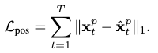

[C. He, J. Saito, J. Zachary, H. Rushmeier, and Y. Zhou, “NeMF: Neural Motion Fields for Kinematic Animation.” arXiv, Oct. 09, 2022. doi: 10.48550/arXiv.2206.03287.](https://arxiv.org/abs/2206.03287)

## Problem
---
Given a set of **time** stamps and their **style** descriptions (any motion control signals), how to generate a motion sequence?

## Observations
---
1. The temporally asymmetric design of **autoregressive** motion generation processes makes it hard to incorporate motion synthesis tasks involving controlling/editing **future frames**.
2. Motion modeling can be categorized into two types:
	1. **time series models**, where future factors are **unknown** and an **autoregressive** prediction of motions needs to be made considering previous predictions.
	2. **space-time models**, where future factors are **known within a given time range**, and the spatio-temporal motion states can be modeled **directly**.
3. It has been shown by previous works that **global** translation of a character is **primarily** conditioned by its **local** poses.

## Assumptions
---
1. A motion sequence can be **implicitly represented** as a **continuous** function $$f :t \rightarrow f(t)$$ which parameterizes the whole sequence by the temporal coordinate $$t$$. We call this the neural motion field (NeMF).
2. **The conditioning** of a motion can be generalized as a **motion prior** variable $$z$$ to be added to the implicit function describing NeMF as $$f(t;z)$$.
3. The probabilistic modeling of $$z$$, approximated by a multivariate normal distribution, makes NeMF **appropriately generative** w.r.t. the actual space-time characteristics of human motions.
4. Most motion synthesis tasks can be framed as a **space-time search process** for appropriate $$t$$ and $$z$$ in a NeMF.
5. A necessary **explicit decomposition** of local and global motions is required in NeMF for predicting **diverse local motions** to avoid **static local poses** generation.

## Contributions
---
1. NeMF, a continuous implicit function describing a **generative** space-time model of human motions.
2. Various motion synthetic tasks empowered by NeMF, such as motion style interpolation, motion in-betweening and motion re-navigating.

## Pipeline
---

### Neural Motion Field
The major objective of NeMF is to represent motion as a **continuous vector field of kinematic poses in the temporal domain**. This representation can be formulated as a function:

which maps a time coordinate $$t$$ to the respective joint rotations $$\mathbf{x}^r_t$$ and root orientations $$\mathbf{r}^o_t$$.

While $$f$$ is **implicit** in nature, we can approximate it by optimizing a neural network. Specifically, the computational architecture is chosen to be an **MLP** that takes in the **positional encoding** of $$t$$ and outputs the pose parameters.

#### Training
According to the definition of NeMF, a **reconstruction loss** between the approximated pose parameters and ground-truth should be minimized to optimize our approximator.

Specifically, we consider the following **geodesic distances** to express the **rotational reconstruction loss** of all joints:

where $$\mathbf{R}_t$$ are the rotation matrices of children joints, and $$\mathbf{R}^o_t$$ is the rotation matrix from the root orientation.

Next, we define the **positional reconstruction loss** by the $$L_1$$ distance:

where each joint's position is obtained from forward kinematics.

Together, their weighted sum formulate our final reconstruction loss:

where $$\lambda$$ denote the blending weight hyperparameters for each loss.

### Generative Neural Motion Field (Decomposing the Motion Prior)
From assumption 2, we would like to **condition the mapping of $$f$$** with a conditioning variable $$z$$. This conditioning variable could also be understood as a **motion prior**, which encodes the **generalized conditioning information** of our temporal motion mapping process.

The function $$f$$ then becomes:

where $$z$$ can be regarded as residing **spatially** on a motion manifold (i.e. the motion prior).

Essentially, we are trying to **decompose** an additional motion prior representation as the manifold of $$z$$ from $$f$$. By this explicit decomposition, we are able to **select** arbitrary motion priors to **generate** different motion sequences from the original NeMF, hence the term generative.

Moreover, $$z$$ could be modeled by the reparameterization trick as a Gaussian distribution according to assumption 3. This **regularizes** our motion prior manifold to be smooth and simply structured, with the (arguable) benefit of approximation robustness.

**Note that this assumption is the core difference between NeMF and [MotionINR](/surveys/2023-8-31-MotionINR.html)**. The latter keeps smoothness, but **adds much more structural assumptions** by modeling a Gaussian for each sample on the manifold.

Back to NeMF. We model $$z$$ as a joint distribution of **two latent variables**, a $$z_l$$ for conditioning local joint motion, and a $$z_g$$ for conditioning the global orientation motion. Each of these variables is assumed to come from a Gaussian.

A **VAE with two separate convolutional encoders** is then employed to approximate these two Gaussians as:

where $$\mathbf{X}$$ and $$\mathbf{r}^o$$ are concatenations of all local and global pose parameters along time in the original motion sequence.

#### Training
The following variational lower bound is considered as the training loss:

where the first term expresses the reconstruction loss, and the last two terms measure the KL-divergence between the learned Gaussians and $$\mathcal{N}(0, \mathbf{I})$$ to regularize semantics of the latent variables.

## Extensions
---

#### Global Motion Predictor
So far we are **only predicting local motions** for a character as root joint orientation and joint rotations. To retrieve the full motion, we need an additional **standalone global motion predictor** that predicts the **root translation**. We apply this decomposition w.r.t. assumption 5.

Based on observation 3, the global motion predictor is a fully **convolutional neural network** to predict global translation of the root joint given **local** joint positions, velocities, rotations and angular velocities as inputs.

The root joint translation is an **ambiguous** global motion descriptor because it's relative to the origin of the arbitrary world coordinate. Instead of predicting the translation directly, it predicts the **translation velocity** $$\dot{\mathbf{r}}$$ instead, which is then **integrated by the forward Euler method** to produce $$\mathbf{r}$$:

Although we are no longer ambiguous in describing global motions, the extra integration **accumulates previous prediction errors**. This introduces the extra problem of the predicted character **moving into the ground or air**.

As a remedy, an additional **height** $$\mathbf{r}^h$$ of the root joint is **explicitly** predicted. By manually **bounding** its value to be **within the height of the character**, we are able to eliminate the problem above. You can view this extra trick as **predicting the $$(x, y)$$ velocity without any constraints, but applying one on the $$z$$ velocity**.

I'd like to remind the reader here that this assumption is **only for motions on a relatively flat, soild surface**! For motions that move in a "very 3D" space, such as falling, violent jumping or diving, your root joint translation on the $$z$$ axis can go out of this bound.

Nevertheless, we can argue that the current bound is reasonable for most **self-driven** motions: you simply don't have enough energy to translate yourself against gravity for that much distance without relying on extra energy sources such as potential, mechanical or chemical. For instance, you are not able to jump pass your own head without at least relying on a pole's elastic potential energy (i.e. pole vaulting) .

However, this bound is **unreasonable** for motions on **fluid** surfaces such as water. You can have a negative root joint translation for these with self-driven motions! Extra preprocessing is needed for these motions, such as clipping or translating the entire sequence up to avoid ground penetration.

The following velocity and positional reconstruction losses are formulated to optimize the model parameters:

Note that the velocity is no longer differentiated in these expressions.

### Applications of NeMF
We discuss various **applications** of NeMF in different motion synthesis tasks.

Following assumption 4, they could all be accomplished by modeling the **search** process for $$z$$ and $$t$$ as **minimization of a crafted energy function**. Since the designation of $$t$$ is very straightforward in these tasks, we only need to consider $$z$$ in these functions.

#### Motion In-betweening
Given a sparse set of arbitrary observations on a motion, our objective is to search the appropriate $$z$$ in an NeMF to approximate the entire motion sequence.

For all the **given frames** $$\mathcal{T}$$, the following energy function is proposed based on reconstruction loss:

where the differences of joint rotations, root orientation, joint positions and root translations are expressed.

As a good initial guess for convergence, we apply **SLERP** to interpolate the given frames first. We pass this preliminary in-betweened motion through the encoder and obtain our initialization for $$z_l$$ and $$z_g$$.

#### Motion Re-navigating
Given a reference motion, we want to redirect it to a new trajectory while preserving the motion **style**, i.e. the generated motion looks similar to the original one but with a different trajectory.

To formulate the energy function, we apply the **soft dynamic time warping metric $$\mathcal{L}_\text{sDTW}$$** to describe the similarity between joint positions. Additionally, we measure the **2D** $$L_1$$ distance between the predicted and target trajectories by **projecting them to the ground surface**.

Finally, we add a regularization term to ensure a **similar motion angle** is respected by the predicted motion's trajectory. This angle is formulated to be between the **forward** direction of each frame and the **tangent** direction of the target trajectory.

Together, the energy function is defined as:

where $$z_l$$ is initialized from the encoder's output and $$z_g$$ is optimized from scratch.

#### Latent Space Sampling (Motion Interpolation)
A navigation in the latent space of NeMF can be used to control motion styles and synthesize novel motions.

To demonstrate smoothness of the learned latent space, a linear interpolation of $$z$$ between two motions is conducted, and has shown qualitatively satisfying results. The figure above shows two novel motions generated from interpolation:

Since $$z_l$$ and $$z_g$$ are explicitly decomposed, we can also control latent space sampling **separately** from the local and global motion editing perspectives. The motion above is obtained by assigning different $$z_g$$ to the same $$z_l$$ to **cancel the spinning motion of a pirouette jump**:

### Ablation Studies
NeMF is trained on the AMASS dataset. Additionally, some motion reconstruction experiments are performed on a quadruped motion dataset that contains dog motion captures.

#### On Positional Encoding
We show that **positional encoding** yields better reconstruction performance than directly using the timestamp as input.

Another critical reconstruction hyperparameter is the **maximum frequency of Fourier features $$L$$** from the positional encoding. Experiments sample $$L$$ from 1 to 21 and shows that a large $$L$$ doesn't harm reconstruction accuracy, but **struggles to generalize to different frame rates**, i.e. the motions sampled from NeMF can no longer stay **smooth**. Thus, $$L=7$$ is chosen in all experiments to **ensure generalizability, albeit compromising some capability for high-frame-rate motion sampling**.

#### On Integrated Motion Prediction

The integrated motion prediction abandons assumption 5 to predict local and global motions in an **all-in-one** manner, i.e. without the standalone global motion predictor. This approach is shown to have mostly **worse** performance on both reconstruction and synthesis tasks.

However, it achieves a lower root orientation error in motion reconstruction, and a higher diversity score compared to the full model in motion synthesis.

