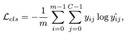

[K. Gong et al., “TM2D: Bimodality Driven 3D Dance Generation via Music-Text Integration.” arXiv, Oct. 01, 2023. doi: 10.48550/arXiv.2304.02419.](https://arxiv.org/abs/2304.02419)

## Problem
---
Given a text description and a piece of music, how to generate a motion sequence respecting **both** of these conditions simultaneously?

## Observations
---
1. Motion capture dataset with **both** music and text annotations is **non-existent**, while its construction is intractably **resource-consuming**.
2. Current **music2dance** motion generators face two major challenges:
	1. they often produce the motion artifact of **freezing frames**.
	2. they often fail to **generalize to in-the-wild music**.
3. There are no existing metrics for measuring **motion coherence**, such as the avoidance of freezing-frames or large between-pose deviations.

## Assumptions
---
1. We can have a **generalized representation** of motions from the **separate-domain** datasets of music2dance and text2motion by mapping them to a **joint-latent space** with a **VQ-VAE**.
2. We can frame the bimodality driven motion generation task as a **neural machine translation (NMT)** task from a **fused music-text sequence** towards a **motion sequence**.
3. The fusion process of separate music and text features towards their music-text representation can be modeled by a **late fusion strategy** to **blend the separately translated motion codes** from music-NMT-motion and text-NMT-motion.
4. Motion coherence can be measured with a threshold-constrained **freezing-frame ratio** of the target motion.
5. The future frame can be well predicted by a motion forecasting model. Motion coherence can then be measured with this future frame's deviation from the target motion.

## Contributions
---
1. A preprocessing solution of gathering motion data from music2dance and text2motion data without extra manual efforts.
2. A bimodality driven motion generator, TM2D, that achieves comparable performance in single music2dance task while enabling bimodality motion generation.
3. Two new metrics to measure motion coherence:
	1. Motion Prediction Distance (MPD), which describes motion coherence plausibility in **multi-modality driven** motion generation.
	2. Freezing Score (FS), which describes the presence of freezing frames in a motion.

## Pipeline
---

There are three stages involved in TM2D: preprocessing, training and inference.

In the preprocessing stage, motion data from both music2dance dataset (AIST++) and text2motion dataset (HumanML3D) is gathered to generate a **VQ-VAE motion codebook**, which represents an arbitrary motion as a sequence of discrete motion codes.

In the training stage, a **cross-modal transformer** is employed to model the motion generation as an NMT process. This NMT uses **two streams with shared decoder weights** to translate music feature sequence and text feature sequence.**separately** into a sequence of motion codes, which is then passed into the VQ-VAE decoder in the preprocessing stage to reconstruct the generated motion.

In the inference stage, a **fused** music-text feature sequence is obtained by a **late fusion** strategy, which blends text features into music features **dynamically** w.r.t. an effect range in time. This fused sequence is then passed to the NMT decoder to generate the motion code sequence. Finally, the motion codes are passed through the VQ-VAE decoder to reconstruct the generated motion.

### Preprocessing Stage
The motion codebook is generated by a VQ-VAE, which is similar to the one used in [TM2T](/surveys/2023-9-21-TM2T.html) and [T2M-GPT](/surveys/2023-9-2-T2M-GPT.html). Therefore, we will spare you the details in this section. Please reference these two models to learn more.

### Training Stage
The NMT task takes **two separate streams** to produce a motion code sequence:
1. translate from a text-encoder-generated **text feature sequence** towards motion codes.
2. translate from a music-encoder-generated **music feature sequence** towards motion codes.

The input music is represented as mel frequency cepstral coefficients (MFCC), MFCC delta, constant-Q chromagram, tempogram and onset strength.

The input text is represented as text tokens processed from GloVe.

The NMT task is framed as a **next-token prediction** task. This means we predict motion codes autoregressively with an attention mask in the decoder.

#### Architecture
The NMT task is performed in a **cross-modal** decoder, which takes in the encoder-processed music or text features as its key and query matrices to condition its motion code sequence prediction. In implementation, two separate decoder instances are equipped with **shared weights** to **simultaneously** obtain optimization from the stream of music2dance and the steam of text2motion. This setup improves training efficiency by juxtaposing the two streams.

#### Training
The cross-entropy loss is adopted for both streams:

where $$\hat{y}$$ is the predicted motion token, $$m$$ the length of motion tokens and $$C$$ the codebook volume.

### Inference Stage

In the inference stage, we pass both music and text through the **entire** NMT model to their respective motion codes.

We then apply a **late fusion** of the two motion code sequences to produce the final motion code sequence. This fusion is done by a **dynamic weighted sum of motion codes** along an **arbitrary time window**, termed **effect range**, from the two motion code sequences.

The late fusion strategy is represented as **weight curve** along time, which is arbitrarily chosen to be a cosine curve with peak value of 0.8. To keep the motion codes within scale, we keep $$W_\text{audio}=1-W_\text{text}$$.

## Extensions
---
### Novel Metrics for Evaluating Motion Coherence
According to assumptions 4 and 5, we define two novel metrics to evaluate motion coherence.

#### Motion Prediction Distance (MPD)
This metric reflects the coherence of motions in multi-modality driven motion generation. Specifically, a motion predictor (DLow) is employed to predict the next frame **at time of modality blending**. If this next-frame prediction doesn't deviate far from the generated next frame, we need the generation as **plausible** and exhibit motion coherence.

The MPD can be formulated as:

where $$M_{t_0 \rightarrow t_1}$$ are the given frames, $$M_{t_2}$$ is the generated future frame and $$f_i(M_{t_0 \rightarrow t_1})$$ is the $$i$$-th predicted future frame among a set of $$f$$ predicted future frames.

#### Freezing Score
There are two variants of the Freezing Score, Percentage of Freezing Frame (PFF) and area under curve of PFF ($$\text{AUC}_f$$).

PFF is defined by measuring the percentage of frozen frames, which are identified with two criteria:
1. the **maximum joint velocity** is below a certain threshold (.015m/s in the experiments).
2. **duration** of this frame-frame phenomenon **exceeds** a certain period (3s in our case).

$$\text{AUC}_f$$ is defined by **area under curve** of the PFF within a threshold range of $$[0, f]$$. In the experiments, $$f$$ is chosen to be .03.

### Ablation Studies
It is shown in experiments that TM2D performs better than many previous models:

The most noteworthy performance gain is the **absence of freezing frames** and the **robustness facing wild audios**, which the authors accredited to their **mix-training** strategy, as validated by the ablation of only dance data.

Another interesting, and very important study of this research is the t-SNE visualization of the effectiveness of the preprocessing strategy employed by TM2D. It can be seen that the joint latent space **redistributes** the motion representation to be much more uniform across the two domains than the direct motion representation from raw motion sequences.

It's therefore very reasonable to infer the reason why VQ-VAE preprocessing also proves crucial for **single-domain** motion generation tasks. A similar redistribution of motion representations in the latent space makes it easier for the downstream NMT task to constrain the motion distribution with different conditions, thus clearing more approximating power for proper cross-modal feature extraction.

