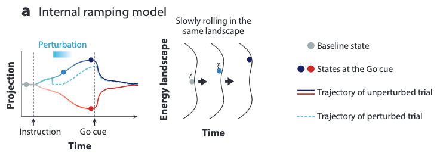

[H. K. Inagaki et al., “Neural Algorithms and Circuits for Motor Planning,” Annu. Rev. Neurosci., vol. 45, no. 1, pp. 249–271, Jul. 2022, doi: 10.1146/annurev-neuro-092021-121730.](https://www.annualreviews.org/doi/10.1146/annurev-neuro-092021-121730)

## Problem
---
How do networks of neurons produce:
1. the **slow** dynamics that **prepare** specific movements?
2. the **fast** dynamics that **initiate** these movements?

In other words, how does the computation from brain **commit** to specific actions over time, and rapidly **execute** these actions?

As an additional question, how are these computational routines **implemented** physically as neural architectures?

## Observations
---
1. Instructed movements are executed after a **delay** from receiving sensory stimuli.
2. **Preparatory Activity**: During the delay, neurons in various frontal cortex areas show **slowly varying neural activity** that **predicts** specific future movements.
3. **Uninstructed** movements also correlate with preparatory activity. However, the **causal** relationship between the two phenomenon is **unknown**.
4. Movements are more **rapid and accurate** when subjects have time to **plan**.
5. The neural activity of preparatory activity resembles that of a **short-term memory (STM)**, which is a data buffer critical to **maintain and process** information over times of seconds.
6. STM often correlates with **persistent changes** in **spike rates**, or **slow fluctuation patterns** in spike rates, that are maintained in the absence of sensory input.

## Preliminary Assumptions
---
1. Preparatory activity can be treated as a **neural dynamic process**, i.e. modeled as a dynamical system (see the formulation of the neural dynamic theory in the attractor hypothesis section).
2. The neural mechanisms of motor planning for humans are similar to those in rodents (as they are the experiment participants).
3. Preparatory activity sets the **state** of neural activity to **initial conditions** that **favor** accurate and rapid movements.
4. Different initial conditions **correspond** to different movements.
5. Motor planning is a form of **STM**, linking decision-making and execution.
6. Motor planning is a three-stage modular process:
	1. **decision-making**: deliberation of multiple actions.
	2. **commitment**: choosing a particular action.
	3. **execution**: initiate realization of movement.

## Problem Reduction
---
Given the observations and assumptions, we can now reduce our two initial problems to simpler forms:
1. How do network of neurons **produce** preparatory activity?
2. How do neural dynamics **switch** from decision-making to movement execution?

We want to describe these computations in the form of algorithms, and explore the potential physical neural architectures that implement them.

## Theories
---
We illustrate two recent theories regarding the problems above:
1. The **attractor hypothesis** theory attempts to answer problems 1 and 2 by **modeling specific neural algorithms**.
2. The **multiregional neural circuits** theory attempts to provide the physical computational architectures to theory 1 by **modeling cross-regional cortical connections**.

### The Attractor Hypothesis
We introduce the attractor hypothesis as our main model to describe the likely algorithms used in motor planning.

#### Preliminary: the Neural Dynamics Theory (NDT)
The attractor hypothesis is a further set of assumptions based on the **neural dynamic theory (NDT)**. Therefore, it's necessary to **formally formulate** this parent theory before we discuss the attractor hypothesis.

The neural dynamics theory models neuronal interactions in a frame work of **dynamical systems**. Depending on the problem, different state variables from different granularities can be used to describe the information of such a system.

In our case, we define the state variable of our dynamical system to encode **the seconds-scale activity of populations of individual neurons**, i.e. the **spike rate** of each individual neuron. Concatenated, they give us a state variable in a high-dimensional space. This yields our so-called **activity space**.

We define the evolution of the **trajectory** of this state variable, $$r(t)$$, as the following differential equation:

where
1. $$f$$ is a cellular biophysics function.
2. $$W$$ is a structural descriptor of the network, which is expressed as a **connectivity matrix**.
3. $$I$$ is a function generating external inputs, i.e. a temporal mapping of the external input signal sequence.

We can immediately see that the set of $$r(t)$$ can only span an **activity subspace** as a result of the connectivity constraint posed by $$W$$.

As a side note, we have ignored many other biological processes in the NDT for the process of **signal propagation**, such as millisecond-scale synchrony across neurons, or cell type-specific biophysics.

#### The Attractor Hypothesis (AH)
The attractor hypothesis assumes there exist **attractors** in the activity space where nearby states **relax into**. In view of state trajectories $$r(t)$$, these attractors can make them **linger around**. This lingering behavior can then be used to model the **seconds-scale stable** neuronal activity seen in observation 6, which are **not probable to be achieved solely by the much shorter neuronal membrane time constants**.

As a result, these attractors are hypothesized as a **mechanism of memory**. The stable activity is considered to encode information that can travel forward in time.

There exist different types of attractors according to their topology in the activity space:
1. **the point attractor**: a **fixed** point in the activity space, which can **store discrete variables**.
2. **the continuous attractor**: a set of **contiguous** states in the activity space forming a **line or ring**, which can **integrate or store continuous variables**.

To test the validity of AH, one can conduct **perturbation experiments** in which inputs are applied to perturb the current neuronal activity with different intensities. A manifestation of **resistance or accommodation** towards these perturbations in $$r(t)$$ can then inform us whether the AH models are appropriate. If they are, further analysis can be drawn to distinguish the exact model (point or continuous) that describes this particular activity.

##### A Useful Analogy
To describe the AH system vividly, one can imagine the **landscape** of activity space as **hilly**. $$r(t)$$ can then describe **a ball rolling in this landscape**, often trapped in the different **valleys** corresponding to different memory.

As an activity perturbation, a small kick would perturb the ball's trajectory, but eventually it would stay in the original valley.

A large kick would send the ball rolling across the ridge to another valley, representing another memory.

As this analogy is very straightforward, we will reference it from time to time in the following text.

##### AH in Context of Motor Planning
Attempts to explain motor planning with AH have been made by several works. In this context, a **point attractor** is identified to correspond to a specific state of preparatory activity that leads to a specific future movement, whereby different such attractors map to different movements.

#### Searching for Attractors with Dimensionality Reduction
The population activity trajectories $$r(t)$$ are assumed to only be able to navigate on **low-dimensional manifolds** in the entire activity space, which can also be fathomed by the constraint of neuronal connectivity $$W$$. As such is the case, **dimensionality reduction** is employed in an attempt to **restore this manifold**, i.e. the actual activity landscape.

A particularly popular approach is **projection to modes (PTM)**. The modes account for the directions that **distinguish the most variations** in the activity space data. In implementation, this can often be achieved with a principal component analysis (PCA), although many new methods come with varied advantages.

The above figure shows the dimensionally reduced result of projecting different population trajectories along the mode vector, which is obtained from the directional-licking experiment in the extensions.

#### Testing the Attractor Hypothesis on Motor Planning (Perturbation Experiments)
There are two questions to consider in the experiments testing AH for a particular neuronal activity:
1. Is AH the **most appropriate** model to describe this activity? There could be other models with equivalent descriptive power.
2. What is the appropriate attractor type that **implements** AH for this activity, point or continuous?

We are gonna consider these two questions, choosing our target neuronal activity as motor planning.

This survey doesn't provide a strong answer for question 1. Instead, it points us in the directions of **additional mechanisms** the AH model doesn't consider, but are highly likely in existence. These mechanisms include **hidden feed-forward connectivity** and **short-term synaptic plasticity**.

**Our answer for question 2 is that motor planning is implemented by point attractors.** We will go ahead and show you the supporting experiments now.

##### Perturbation Experiments
To answer question 2, we need to **move beyond** from a simple observation of the population activity (i.e. the dimensionality reduction conducted earlier). The reason is that **multiple dynamical systems can produce identical low-dimensional neural dynamics**. For instance, continuous attractors driven by discrete inputs would manifest the same preparatory activity produced by point attractors.

A better approach is to conduct **perturbation experiments** to clearly distinguish the appropriate attractor model.

In implementation, we can cross-validate the **behavioral effects** resulted from perturbations against the ones **predicted** by different attractor models.

For example, silencing the frontal orienting field (FOF) in a perceptual decision-making task biases the resultant binary decision. This result is consistent with the one predicted by the point attractors but **not** with continuous attractors.

##### Spatio-temporally Precise Perturbation Experiments

We could push the observation even further by directly monitoring neural dynamics and behaviors after a **spatio-temporally precise perturbation** is conducted. Thanks to the **optogenetics** technique, this precise perturbation is made available in the directional licking experiment in the extension.

This experiment follows these steps:
1. Dimensionality reduction is first applied to identify a mode projection of population activity that **best separates direction-selective activity**, which involves two assumed valleys (left and right licking) and a ridge separating them.
2. During the memory epoch, transient perturbations are made by **deactivating the ALM region** at designated timestamps, employing optogenetics.
3. Throughout the experiment, population activity is observed. It's then analyzed from the mode projection.
4. Behavior results (licking right or left) are observed subsequently.

In the right figure above, we can see the results:
1. Some perturbed activity trajectories (solid blue line) **bounces back** to the activity trajectory without perturbation (dotted blue line).
2. Other perturbed trajectories (light blue line) converges to the unperturbed trajectories in **the other valley** (dotted red line).

The results support the predictions made by the point attractors model, which states that the trajectory can only slide down one of the two valleys. They contradict the predictions of continuous attractors models, which states that the ball will stay in a new trajectory away from the two unperturbed ones because of the flat landscape.

#### Dynamic Attractor Landscapes Conditioned by Sequential Control Signals
Now that we know how the point attractors can form an activity landscape to plan bistable motor behaviors with a single external input carrying a selective signal, we ask the next question: **how can sequential activities be performed with a sequential external input, i.e. a control signal sequence?**

Essentially, we are asking how the AH can model an algorithm that not only performs a **single computation step** required in motor planning, but the **multiple sequential computation steps** that finally complete the entire motor planning process.

Note that we don't consider to model any parallel computation mechanisms here.

To extend the AH model in describing this process, we add the following assumption:

Both **nonselective** and **selective** control signals can **change** the **number and locations of attractors** in activity space.

With this assumption, the algorithm can be modeled as a sequence of attractor landscape changes triggered by a temporally-matching sequence of control signals, which accomplish the multiple sequential computations needed in the entire motor planning process.

The control signals can then change **gradually or abruptly** to cause rich changes in the population activity, and **the same network** can then be accounted to provide the multiple sequential computations needed.

Going back to the directional licking experiment again, we have projected population activity of both trials (red and blue) to four **near orthogonal** mode directions in the above figure, revealing different population activity patterns for each control signal (selective instructions to trigger planning, nonselective Go cue to trigger execution).

It is shown clearly in this analysis that different control signals indeed change the attractor landscapes formed by the same neuron population. Moreover, we confirm that **ALM is involved in all these computations**, which include the following sequential steps:
1. **decision making** in the sample epoch from a selective sensory cue.
2. **memory retaining** in the delay epoch.
3. **movement execution** in the response epoch after a Go cue.

Next, we discuss exactly **how the attractor landscapes are reshaped** by control signals with examples.

##### Ramping Activity and Ramping Models
We first look at the ramping activity associated with memory-guided movements and examine how it can **support** the reshaping hypothesis of attractor landscapes.

Memory-related neural activity is **dynamic, but in a predictable pattern over time**. The **ramping activity trajectories** best exemplifies this phenomena by exhibiting the following behaviors:
1. Ramping happens in tasks **without** an explicit need to estimate time, these tasks use a Go cue to externalize timing.
2. When the delay epoch is short/long, the ramp is steep/shallow, which is the so-called **temporal scaling**.
3. When the delay duration is **unpredictable**, ramping is rapid to be able to meet the earliest possible Go cue.

There are two possible AH models to describe the ramping activity, the **internal** and the **external** models, depending on the ascribed **source** of the ramping signal.

For the internal ramping model, the ramping signal is assumed to come from the **relaxation of the activity trajectory towards a shallow point attractor**. In other words, the ramping signals simply comes from the **internal dynamics** already provided by an attractor landscape.

**No reshaping of the landscape is needed for this model**.

To model the **long** delay ramping process, the attractors must be **shallow** to allow **slow dynamics** of the relaxation process. This indicates that if we apply perturbations to a long ramping process, then the activity trajectory must **recover slowly** to the unperturbed state at any timestamp.

The external ramping model assumes the ramping signal to come from an **external reconfiguration of the attractor landscape** over time by an external ramping input.

**This model needs to reshape the attractor landscape** over time by the external ramping input.

To model the long ramping, the attractor valleys are assumed to be **deepened** gradually by the ramping input over time. This indicates that if we apply perturbations at the middle or late stages of the ramping activity, then the activity trajectory would **recover rapidly** to the unperturbed state because of the already deepened valleys.

##### Domination of the External Ramping Model and Its Implications
Subsequent optogenetic perturbation experiments in ALM **supports the rapid recovery behavior predicted by the external ramping model**. Evidence are not only observed from the late-stage perturbation's rapid recovery, but also from the early-stage slow recovery, which further substantiate the **gradual** landscape reshaping predicted by the external model.

Moreover, two evidences suggest that the ramping signal not only originates outside of the internal attractor landscape dynamics, but also **originates outside of the physical ALM region**:
1. **Nonselective** ramping (i.e. ramping without external timing as a Go cue) recovers after perturbation, but selective ramping doesn't. A guess is that ALM is required to **maintain** motor planning, but an external source is responsible to provide **execution timing**.
2. Training an RNN to **approximate** ALM activity patterns and their response to perturbation requires an external ramping input.

The implications can then be summarized from the dominance of external ramping model in describing motor planning:
1. Ramping appears to generate **increasing commitment** to the selected action.
2. The gradual shift of commitment allows **flexible** decision making at early-stage motor planning (easy to kick the ball into other valleys if you have new control signals flushing in), which may prove **beneficial for survival in uncertain environments**.

Aside from the directional-licking experiment, implication 1 is also supported by silencing the FOF regions in mice, which affects decision in early stages of motor planning, but not late stages.

#### Activity Bridging Planning to Execution
ALM is responsible for both movement **planning** and **initiation (execution)**. Given these roles assumed, we ask the following important questions:
1. How is motor planning maintained **without** triggering execution?
2. What mechanisms cause the transition from planning to execution?

##### Planning without Execution
Let's try to answer question 1.

Early hypothesis states that the population activity of motor planning doesn't trigger execution because it's a **subthreshold version of the execution activity**. However, the sheer difference of population activity and individual neuronal spikes between the planning and execution epochs denies this hypothesis.

In other words, **motor planning and execution are completed with different computations.**

For the figure in the dynamic attractor models section, we have successfully differentiated four distinct population activity processes by projecting them to four different mode directions. Among them we can easily distinguish a mode direction for planning and a mode direction for execution. The near **orthogonality** of these two modes suggest that motor planning and execution **happen in cleanly decomposed population activity subspaces**. As a result, they won't interfere with each other.

**What causes this subspace separation?** A mechanical explanation might be found by analyzing **neuron types**. Distinct neuron types might contribute separately to planning and execution activities (see the cell types section later).

##### Transition from Planning to Execution

Now you might wonder: if the subspaces are separated cleanly, how would the planned movements be executed eventually?

Our answer is that there exists **information transfer** between the two subspaces, s.t. the activity trajectory residing in each subspace can be **correlated**. The above figure show this correlation as the simplified polynomials for red and blue trials. In the planning phase, no correlation is observed. However, after the Go cue, the trajectories become correlated in that it creates excitement along the execution mode while also relaxing the state to baseline along the planning mode.

Further evidence comes from the observation that **strong** preparatory activity triggers **strong** execution activity, for the same licking direction.

**How can this information transfer be implemented?** One might resolve to assume **networks with a hidden feedforward structure** exist in ALM.

We also observe an additional **nonselective** Go cue mode, which is the **most prominent** activity mode during many memory-guided movement trials. This Go cue activity is assumed to be an **initiation signal** of the transition from planning to motion. It is observed to **come from thalamus** upon the trigger of an external Go cue signals.

##### Implication of Subspace Orthogonality
The orthogonality of activity subspaces for motor planning and execution implies that **these two computations can happen concurrently without mutual interference**.

This is a powerful suggestion in that it allows for **multiplexed processing of multiple movement primitives during natural behaviors**: an animal could already start to plan the next action without finishing the execution of the current action; it could also adjust its planned action according to the new control signals gained from the current execution.

In other words, the **perception-action cycle might run continuously without needing an extra stage for planning-execution synchronization.**

### Multiregional Neural Circuits
We now turn to discuss the observation of multiregional neural circuits and how they may implement the AH model.

| Abbreviations                       | Full Region Name                                       |
| ----------------------------------- | ------------------------------------------------------ |
| **isocortex region** (green)        |                                                        |
| ALM                                 | anterior lateral motor cortex                          |
| ALMc                                | contralateral anterior lateral motor cortex            |
| Ctx                                 | somatosensory and motor cortex interconnected with ALM |
| **thelamus region** (red)           |                                                        |
| Thal                                | ALM-projecting thalamus                                |
| **striatum region** (blue)          |                                                        |
| Str                                 | striatum                                               |
| **midbrain nuclei region** (purple) |                                                        |
| SCm                                 | motor-related superior colliculus                      |
| PPN                                 | pedunculopontine nucleus                               |
| MRN                                 | midbrain reticular nucleus                             |
| SNr                                 | substantia nigra reticulata                            |
| **cerebellum region** (yellow)      |                                                        |
| Cb                                  | cerebellum                                             |
| **pontine nuclei region** (orange)  |                                                        |
| PN                                  | pontine nuclei                                         |
| **medulla region** (magenta)        |                                                        |
| Med                                 | medulla                                                |

Preparatory activity is generated and maintained in multiregional neural circuits, as opposed to only the frontal cortex. There are two basic structures assumed to implement the AH model:
1. **Positive feedback loops** keep the attractors **maintained** against consistent neuronal activity dissipation. They can be local to a region, or long-range covering multiple regions. They **slow** neural dynamics beyond the short time constant of individual neurons.
2. **External input signals reshaping the attractor landscapes** ascends from **subcortical structures** via the thalamus, such as ramping and Go cue.

In other words, you can view the structures in 1 as implementation of the **input** preprocessing and **internal** AH computations that ALM requires. When these internal computations are "up and running" during the delay epoch, the structures in 2 provide the **external** signal processing to enforce external **constraints** (e.g. commitment time constraint) onto the running internal computations.

So far the AH model doesn't describe **how the processing in 2 is initiated**.

This question may require us to ask a prerequisite question: **how does the input preprocessing determine when an input signal should trigger process 2?**

To start with, if the AH theory has all the right assumptions, then **this prequisite question is only needed for process 2 but not process 1**! The attractors in process 1, when deepened by process 2, naturally become resistant to external sensory signals. Thus, the "raw" sensory input can be passed in without the need to answer question 2, at least for process 1. In fact, we actually want this property for flexible decision making before commitment.

For process 2, it's reasonable to assume that in the preprocessing stage of motor planning, there **exists a mechanism that reinterpret the continuous raw input sequence into a discrete sequence instead, because at least we need to discretize out a trigger token to be able to trigger the subsequent motor planning process 2, which would otherwise stay dormant.**

This trigger token could be extracted as simply as a expecting a continued period of "low information entropy" from the sensory stream, or expecting learned features from a certain local pattern in this sequence. I suspect the latter to be more probable. Also, if the latter is true, we end up with a neater concept of the role of learning in motor planning, where we can cleanly separate "timing learning" from "experience learning". **The former becomes purely temporal, and the latter becomes purely spatial.**

It's also interesting to draw a connection of question 2 to the **temporal action composition** problem in artificial motion synthesis. Both of these problems require us to find an appropriate mapping between temporally-local features in the control signal sequence and temporally-local features in the motion sequence. Question 2 is slightly more complicated in that the control signal sequence can extend infinitely into the past, which makes feature learning quite challenging.

The above figure shows structure 1 observed from the rodent brain. The circles are inhibitory connections while the arrow heads are excitatory connections.

To summarize, we have the following discoveries in observing the multiregional neural circuits involved in motor planning:
1. Preparatory activity needs the participation of **multiple obligatory** partner regions.
2. Different regions assume different roles in generating preparatory activity.
3. Functional coupling between brain regions are gated in a **time-dependent** manner. This gating mechanism can be implemented with dynamic attractors.

We will generalize the region-region feedback loops in structure 1 into **three major categories** focusing on the distinctive implementations they provide to the AH model：
1. **Cortico-cortical loops**, which link any cortical area to other cortical areas.
2. **Cortico-thalamocortical loops**, which link the frontal cortical areas bidirectionally to nonsensory thalamus.
3. **Cortico-basal ganglia-thalamocortical loops**, which first travel from frontal cortex to the lateral striatum , then from striatum to thalamus, and finally from thalamus back to frontal cortex.

Additionally, we will discuss the **ascending** multiregional circuits in structure 2 in one go.

Finally, we will take a look at the different cell types of neurons and discuss their roles in implementing the AH model.

#### Cortico-Cortical Loops
ALM connects with many other cortical areas, mostly with a bidirectional manner. These connections form loops of various lengths to support preparatory activity.

##### Temporal Gating between Ctx and ALM
We observe the following phenomenon between the connection from sensory cortex (Ctx) to ALM:
1. During sample epoch, activity from Ctx **initiates** preparatory activity in ALM.
2. During memory epoch, the same input from Ctx **loses influence** to ALM, which is the so-called **temporal gating** of information flow from Ctx to ALM.

This process can be described with the **dynamic attractors** model: as the attractor landscape deepens its valleys, ALM shows more commitment to its activity state and resists perturbations from external sensory inputs.

##### Robustness of Preparatory Activity in ALM
First, bilateral silencing of large regions of cortex posterior to ALM has little effect on preparatory activity. This indicates that the ALM **decouples from other cortical areas** in performing a preparatory activity.

Secondly, silencing only one side of the ALM hemispheres has little effect on preparatory activity. This implies that each of the ALM hemisphere can **maintain preparatory activity independently**. Moreover, we observe that an information flow from the unperturbed hemisphere to the perturbed via corpus callosum helps it to **recover selectivity** after the perturbation.

##### Intracortical Connectivity in ALM
Optogenetic experiments show that the intracortical connectivity in ALM is **modular**: **sparse subnetworks** of ALM neurons can maintain preparatory activity **independently**. These parallel modules might provide **higher memory capacity** and **higher robustness** in additional to intercortical structures.

Moreover, these parallel modules could lead to **planning diversity** and **concurrent planning**, especially in difficult decision making scenarios (the ball is hanging on the ridge or multiple valleys are close to each other), if their attractor dynamics are **not exact copies** of each other.

It is unknown how such architectures are **shaped during learning/development**, and how they map onto **specific cell types**.

#### Cortico-Thalamocortical Loops
Thalamus is a **hub of multiregional connectivity** since subcortical inputs feed to the frontal cortex through it, and its connection to the frontal cortex regions are bidirectional.

ALM projects information to various non-cortical regions, such as striatum, midbrain regions and cerebellum. These regions **feed information back** to ALM indirectly through the thalamus.

Aside from the preparatory activity, similar multiregional loops via the thalamus have been observed in reaching and eye movement activities.

The cortico-thalamocortical loop is **obligatory** for implementing preparatory activity. The connections from ALM to thalamus and backward are both **driving**, and suppression of one direction will **break the maintenance** of the preparatory activity.

All these observations suggest that thalamus can be viewed as another **extension of ALM** aside Ctx, responsible for **fusion** of inputs from multiple subcortical structures. However, the following two questions remain unanswered:
1. What kind of information do these diverse subcortical inputs convey to thalamus?
2. How are these different inputs fused together by thalamus to be transmitted to ALM?

Answering these questions would reveal important insights to motor planning process, such as **how internal signals such as ramping are generated to condition attractor dynamics**.

#### Cortico-Basal Ganglia-Thalamocortical Loops
These loops extend the cortico-thalamocortical loops by adding a "midway station" at basal ganglia (SNr). Unlike previous loops, they apply **inhibition** instead of excitation to part of the thalamus, which then affects the signal it transmits back to ALM.

Basal ganglia have been shown to assume roles in adjusting **action selection/initiation** and **movement vigor** in previous studies. Now we also observe it affects **motor planning** and **action timing**, which we will illustrate with the recorded phenomenon below.

SNr neurons are observed to be an **obligatory** partner for completing the preparatory activity with **selectivity**. First of all, similar **ramping** activity is observed in SNr. Secondly, optogenetic modulation of SNr's connection to thalamus **significantly reduces selectivity** (i.e. planning **mode collapse**).

Therefore, it is assumed that SNr is the **source of external ramping** that's crucial for both **selectivity planning** and **action timing**. Without its participation, the attractor landscape might not be dynamically reshaped to flatten/deepen its valleys, thereby causing a **loss of commitment**.

**Additional timing signals might come from cerebellum** to supplement the timing function of SNr. However, more experiments are needed to examine all these hypotheses.

#### Other ALM-Subcortical Loops
The motor segment of SCm is another region ALM projects to. During the memory epoch, the projected information contains preparatory activity, which are also captured and manifested by SCm neurons downstream.

Silencing of SCm unilaterally during the memory epoch causes a **response bias** towards the silenced side. However, SCm's outward projections include multiple targets other than ALM, such as premotor areas in the medulla. Therefore, it's unknown which target causes this bias effect by feeding on the deactivated SCm.

Nevertheless, strong couplings are needed between frontal cortex and SC for many similar activities, such as **eye movements** in primates and **orienting** in rats.

ALM also connects to the cerebellum via the pontine nuclei. The deep cerebellar nuclei (DCN) projects back to ALM via thalamus to close the loop. Optogenetic manipulation of DCN **rotates the mode direction that corresponds to direction-selective activity** in the ALM activity space. Thus, DCN is responsible for **affecting the attractor landscape** in the cortico-thalamocortical loop.

#### Ascending Multiregional Circuits
Ascending signals from **midbrain structures** are shown to be responsible for **terminating a preparatory activity and triggering movement execution**.

PPN/MRN neurons show **low-latency** and **transient** response to the **Go cue** coming from midbrain auditory centers. Moreover, optogenetic stimulus can also trigger a **precisely choreographed** sequence of neural dynamics causing movement initiation:
1. collapse of planning mode.
2. initiation of Go cue mode.
3. execution mode.

Therefore, we can fathom that PPN/MRN is mainly responsible to sending the Go cue information to ALM and trigger mode switching from movement planning to execution.

However, DCN activity is also necessary in a cued reaching task, and proves to be **sufficient by itself**. PPN/MRN and DCN also project to an **overlapping area** in thalamus. Therefore, it remains a question whether these two regions are **redundant** in providing Go cue, or are recruited differently for different tasks.

#### Cell Types
So far we are only discussing neural dynamics by assuming an anonymous population. The fact is that ALM alone contains up to 100 different types of neuron cells, and they exhibit very different connection behaviors which are crucial in modeling neural circuits with high granularity.

Let's first draw a big picture of how cell types affect multiregional neural circuits. **Inputs** to brain regions connect to **distinct** cell types, each with its own local circuits. Computation is then **localized and transformed** by several population subsets with different cell types. Later, this computation will also propagate to other brain regions via **diverse** projection neurons, each responsible for a specific regional projection.

We will focus on projection neurons, which can be grouped as:
1. intratelencephalic (IT) neurons, which project to other **cortical** areas, and also the **striatum**.
2. pyramidal tract (PT) neurons, which project to the **midbrain** and **brainstem**.
3. corticothalamic neurons, which project to the **thalamus**.

**Intracortical** circuits can be **modularly** constructed from these cell types' connection rules:
1. IT neurons in the motor cortex construct a receiver listening to the sensory cortical areas.
2. IT neurons connect to PT neurons.
3. PT neurons do not connect to IT neurons.

As a result, **specific neuron types carry distinctive information**.

##### ALM PT Neurons
For motor planning, ALM PT neurons develop preparatory activity with a **contraversive bias** late in the memory epoch. They can be **further divided** into two classes according to their projection rules:

| exclusive projection | information                                      |
| -------------------- | ------------------------------------------------ |
| **thalamus**         | planning-related activity during memory epoch    |
| **medulla**          | late selectivity and execution mode after Go cue | 

The **bifurcation** of this projection information due to cell types can **explain why movements may not be triggered during planning**. More directly, it explains the orthogonality observed between the planning and execution mode directions from the anonymous population activity.

Therefore, we can concretely differentiate both multiregional and (most importantly) intracortical information pathways by conducting extensive experiments on neural circuits constructed from unique neuron types. However, few experiments have yet been performed.

## Extensions
---
### Experiment: Directional Licking with Mice
We further illustrate observations 1, 2, 3, 4 with a brief illustration of the findings from the directional licking experiment conducted on mice [^1]:

The directional licking of mice (left or right) is instructed by an external signal stimuli in the sample stage. The mice experience a delay stage, where they are expected to develop a motor plan, before a Go cue is presented. After receiving this cue, movement is executed by the mice.

The detection of neural activity is focused on the **anterior lateral motor cortex (ALM)**. The following results are obtained during the left and right trials for three example neurons:

where the dashed lines separate the three stages in the experiment.

The preparatory activity is manifested via the left and middle neurons. It can be observed that this activity is **selective**, whereby different licking directions trigger different neuron activation states, represented as spike rasters on top and mean spike rate on bottom.

The transient response to the Go cue is graphed via the right neuron. The spike rasters exhibit neutral activations for left and right trials upon the Go cue trigger.

### Limitation of Optogenetic Perturbation Experiments
Although optogenetic perturbations can control the state of different cortical regions in a precise spatio-temporal manner, it doesn't promise an exclusion of the following **confounders** in experiments, mostly resulting from the complex cross-regional neural circuits:
1. The **feedback loops** of a region can be **nonlinear**, therefore the optogenetic perturbations might be admitted by the region **as the rule rather than the exception**, e.g. **excitation could still be triggered** from the feedback loops as a response to the optogenetic triggered inhibition.
2. **Cross-regional circuits** can **transmit the manipulation** from one region to others, making it hard to ascribe the resultant behavioral effects to only the manipulated region.
3. An optogenetic inhibition can function **not as an instruction but as a permission**: the baseline activity of the manipulated region might simply be required to **fuel a connected area for computation**.
4. The brain can **adapt** to optogenetic perturbations by plasticity and learning. Over time the resultant behavioral effects can **attenuate** over trials. It will then be hard to distinguish any attractor models from this corrupted observation.
5. Optogenetic perturbations can bring the population activity to an **unnatural state to begin with**, obfuscating observation of the original activity patterns.

These caveats need to be leveraged carefully during experiment design, and **are not avoided explicitly** in the experiments mentioned in this review.

### Extended Questions from the Attractor Hypothesis
Now that we have answered question 2 of adopting the AH theory for motor planning, some extended questions can be drawn and discussed on top of its findings. These questions would then introduce more assumptions to the AH theory.

First, we ask: the current experiments all adopt binary behavior choices; **what happens in tasks with multiple choices?**

The AH model allow for **a large number of point attractors**. Moreover, continuous variables can be stored with continuous attractors or closely positioned point attractors. Thus, this theory stays promising in describing more complex behaviors in motor planning.

Secondly, we ask: **can a single network multiplex multiple attractor landscapes to perform multiple motor planning tasks?**

This question is yet to be explored by current works.

Other unanswered questions persist:
1. How is the attractor landscape shaped by **learning**?
2. How does the **sensory information** feed into the landscape?

These questions need to be answered by a close observation of the attractor landscapes **during training** for motor planning tasks with **multiple movements**.

[^1]: Guo ZV, Li N, Huber D, Ophir E, Gutnisky D, et al. 2014. Flow of cortical activity underlying a tactile decision in mice. Neuron 81:179–94

