[J. Lin et al., “Being Comes from Not-being: Open-vocabulary Text-to-Motion Generation with Wordless Training.” arXiv, Mar. 24, 2023. doi: 10.48550/arXiv.2210.15929.](https://arxiv.org/abs/2210.15929)

## Problem
---
Given a text description, how to generate a motion sequence w.r.t. it?

## Observations
---
1. Most text2motion models are optimized on text-motion data with limited annotations, and can't generalize well to **unseen open-vocabulary texts**.
2. Recent text2motion models leverage **alignment** to **multi-modality** pretrained models, e.g. CLIP, to expand to open-vocabulary motion generation. They can be categorized as:
	1. **Online** model, which generates motions from text with **online matching and optimization**, e.g. [AvatarCLIP](https://hongfz16.github.io/projects/AvatarCLIP.html). However, online optimization **cannot generate new poses** for diverse texts, and is **time-consuming** and **unstable**.
	2. **Offline** model, but the existent ones still need to be trained on **collected paired data**, e.g. [MotionCLIP](/surveys/2023-9-28-MotionCLIP.html)

## Assumptions
---
1. Similar to **prompt engineering**, the text2motion task can be reduced by first **preprocessing** the text prompts into an **intermediate prompt as pose descriptions** (i.e. text2pose), which can be represented as a masked motion sequence. A motion generator can then conduct **motion inpainting** to accomplish motion generation (i.e. pose2text).
2. The text prompt can be mapped well to pose prompt by maximizing **alignment** between CLIP text features and CLIP image features of the **rendered pose**.
3. **Wordless training** can be utilized to generalize the text2pose process to robust open-vocabulary performance.
4. To prevent generating the **averaged motions** for pose2motion, we can optimize the generation model by supplying it with **additional latent motion features** aside from the provided poses.
5. We only need to engineer a **single** pose to guide the pose2motion task, i.e. the pose prompt only needs a single frame filled by text2pose while leaving the other masked.
6. The most appropriate pose to guide the pose2motion task is **at the middle** of a prompt sequence.

## Contributions
---
1. An offline open-vocabulary text2motion framework, OOHMG, which
	1. achieves significantly higher generation **accuracy** in motion generation than existing models.
	2. achieves significantly higher generation **robustness** and computational **efficiency**.
	3. doesn't depend on **paired text-motion data** for training, as required by existent offline open-vocabulary models.
2. A novel **wordless training** scheme to train the text2pose module TPA.
3. TPA is the **first** text-pose alignment model.

## Pipeline
---
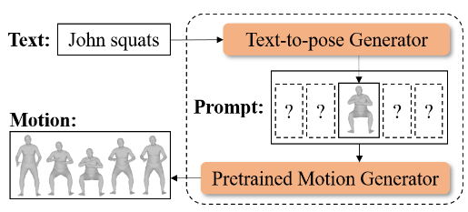

The pipeline is named offline open-vocabulary human motion generation (OOHMG). It consists of two stages:
1. A **text2pose stage**, which maps the text prompt to a pose prompt by text-pose latent space alignment leveraging the CLIP model.
2. A **pose2motion stage**, which maps the pose prompt to a motion sequence through motion inpainting.

In principle, these two stages are all modeled with **autoencoders**, as a latent space representation of pose is needed for both text-pose alignment and pose2motion. An additional VAE is also employed to represent motion with appropriate diversity.

In the descriptions below, we will no longer mention the overall autoencoders as the picture then becomes too fuzzy for each stage. Instead we will directly refer to different encoder and decoder modules.

### Text2Pose Stage
The text2pose stage can be further divided into two sequential substages:
1. In the first substage, a TPA pose encoder is optimized to learn a latent **pose feature** representation that's aligned to the latent **image feature space** in CLIP.
2. In the second substage, a text-to-pose generator is optimized to map CLIP text features into poses. This mapping is supervised by the previous TPA pose encoder to ensure a text--image-pose alignment is maintained w.r.t. CLIP.

In other words, you can think of substage 1 as an initial **latent** alignment between the latent spaces of pose features and CLIP. Substage 2 then maps this latent alignment into the **explicit** alignment performed by the text-to-pose generator.

Therefore, the text-to-pose generator learns not a one-to-many mapping but a **one-to-one** mapping between text and pose. As such is the case, I think it's better to name it as an **alignment** instead of a **generation**, as the latter is **at least one-to-many**.

#### Substage 1: Latent Text-Pose Alignment with TPA Pose Encoder
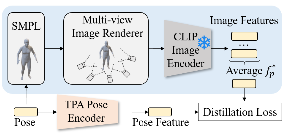

The pipeline of latent text-pose alignment follows a similar approach employed by AvatarCLIP.

First, an **average image feature** $$f_p^\ast$$ describing the pose is obtained by encoding multi-view images rendered from a pose with the CLIP image encoder and then taking the mean of the embeddings.

Secondly, the latent pose features are obtained from the TPA pose encoder.

Finally, a **distillation loss** is minimized to optimize the TPA pose encoder s.t. the latent space of pose features is aligned with CLIP's image latent space.

Why can't we **directly use the rendered CLIP image loss** to optimize for a pose and directly go to substage 2 without substage 1, i.e. avoid the midway latent representation of pose? It is found that this direct approach creates severe artifacts which satisfy the CLIP loss but creates **unrealistic geometry** similar to Deep Dream artifacts.

A tentative reasoning is that **diverse images can be solutions to the same text to CLIP**, i.e. there is a one-to-many text-image relationship, which makes the one-to-one text-pose mapping optimization **divergent**. In other words, the text-image is one-to-many, and our pose-image is one-to-one, which makes the desired text-pose one-to-many, while we want the text-pose to be one-to-one.

Thus, to compensate for this artifact, we **limit the solution space to 3D poses** by applying an additional **end-to-end** TPA pose encoder that constrains the pose representation by only considering 3D pose information instead of the 2D renderings. This process is thus termed **distillation** in that we try to distill only 3D pose features out of the CLIP image space.

We use the following distillation loss to optimize the pose encoder:
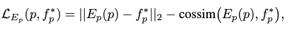

where the first term reduces the per-dimensional difference and the second term reduces the angular difference between pose and image features.

#### Substage 2: Explicit Text-Pose Alignment with Text-to-pose Generator
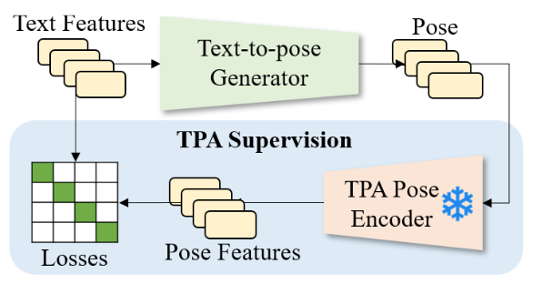

We can now model the text2pose prompt engineering process with the supervision of our TPA pose encoder.

Specifically, the text-to-pose generator predicts the latent pose code $$\mathbf{p}^l$$, which can be decoded into a pose $$\mathbf{p}$$ by a **pretrained VPoser pose decoder**. The predicted pose $$\mathbf{p}$$ is then mapped to the pose feature $$E_p(\mathbf{p})$$ by the TPA pose encoder from substage 1. This feature is then compared with the input text feature for a latent CLIP loss that guides the explicit text-pose alignment.

However, there is one more problem to consider: **we would like the text2pose mapping to be valid in an open-vocabulary setting**, where unseen text can be mapped to the correct pose.

##### Wordless Training
To answer the additional problem, we need to train the text-to-pose generator with **as many diverse texts as possible**. Towards this goal we derive a wordless training scheme.

This maximization is **intractable** in the raw text space, since a text is combinatorial w.r.t. words and such a space grows exponentially with text length. However, it is **tractable in its normalized latent representation space**, where individual dimensions are orthogonal to each other.

Thus, the enumeration over all the possible text inputs can be approximated by a **monte carlo sampling of text features** $$f_d$$ from a uniform or normal distribution in the text latent space:
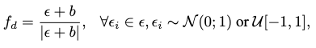

where $$b \sim \mathcal{U}[-1,1]$$ is a random bias to discourage the sampling of near-zero features.

##### Optimization Loss
Now that wordless training is implemented, we can train the text-to-pose generator by minimizing the following loss:
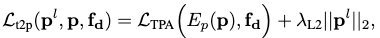

where the first term is the CLIP loss, and the second term is added to regularize $$\mathbf{p}^l$$ to be **in-distribution w.r.t. VPoser** by pulling it closer to VPoser's prior distribution, i.e. a standard normal.

### Pose2Motion Stage
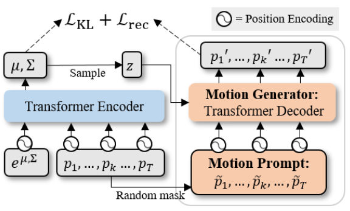

The pose2motion task is framed as a **motion inpainting** task for OOHMG, where the input is a masked motion sequence with arbitrary unknown frames, while the output is an inpainted motion sequence.

We will discuss the modeling process of pose2motion in two stages: training and inference.

##### Training Stage
During training, the input motion sequence is produced by the random binary masking of a ground-truth sequence.

According to assumption 4, an additional motion encoder is adopted from ACTOR to condition the motion generator with extra motion features.

The pose2motion generator is optimized with the following loss:
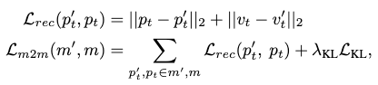

where the $$v=\mathcal{M}_\text{SMPL}(p)$$ maps the skeleton pose to SMPL surface geometries. The first term in $$\mathcal{L}_\text{m2m}$$ is the reconstruction loss, and the second term is the KL divergence to regularize the extracted latent features to follow a normal distribution.

##### Inference Stage
During inference, the input motion sequence is produced by placing the predicted pose from text2pose stage **in the middle** of a fully masked sequence, according to assumptions 5 and 6.

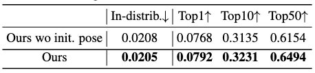

This placement is arbitrarily chosen, which can **often make the generator produce a motion filled with similar poses**. To compensate for this artifact, the authors have to supply **additional fore-pose and post-pose** from **extra** descriptions. Also, they discover that adding an **initial pose** to the prompt helps with generation diversity (see the ablation table above). The initial pose is provided as a pose whose latent code in VPoser is a zero vector.

According to the information above, this artifact can be attributed to a lack of prior pose information in the pose2motion task.

It's a intuitive question to ask if we can **supply more prior poses** from the text2pose model in an appropriate manner. For instance, if we can predict the temporal position of a generated pose, or condition the text2pose with a temporal position, then the text2pose model can be applied iteratively to produce a much richer pose prompt. However, when this is the case, do we really need an additional pose2motion process since we can fill the entire motion sequence with predicted poses?

Thus, if we still want to pose the text2pose process as a prompt engineering process, then we can supply "fuzzy timing" instead of precise temporal location to condition it. For example, we can divide the entire motion sequence into three consecutive stages: initiation, commitment and wrap-up. We simply supply a discrete stage condition to the text2pose generator, which will then give us three poses for the fore-pose, mid-pose and pose-pose, making the prompt guidance much richer.

Also, an appropriate learning of the initial pose could also be modeled as a sub task of the text2pose model.

The motion encoder is **discarded** in the inference stage. Instead, the latent motion feature is directly sampled from $$\mathcal{N}(0, \mathbf{I})$$ to model diversity in the generated motion.

## Extensions
---

### Performance on Open-vocabulary Text2motion
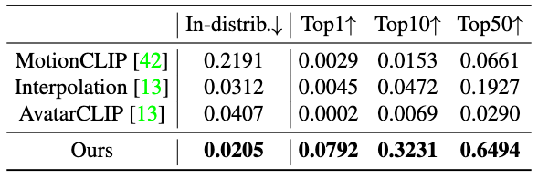

Performance is conducted against open-vocabulary text2motion models and has shown **significant superiority** of the OOHMG model.

### Performance on Text2pose
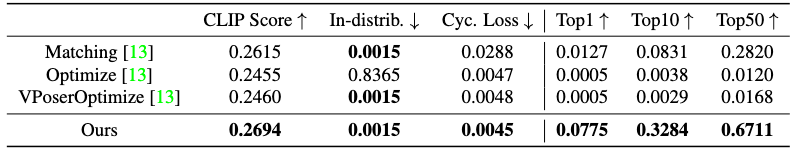

OOHMG also performs significantly better than baseline models in the text2pose subtask. Notably, the baselines are all online methods from AvatarCLIP since no offline text2pose models exist yet.

### Performance on Pose2motion
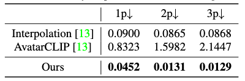

A **controllability score** is measured for the pose2motion task. A cluster of poses is randomly sampled to produce the $$K \in \{1,2,3\}$$ unmasked poses of a motion prompt. Controllability is then measured as the distance between the $$K$$ poses and the closest poses of the generated motion.

It's worth noticing that Interpolation, while being the most accurate, directly takes the conditioning poses to be put into its generated motion, while AvatarCLIP and OOHMG generates the entire motion from scratch. The reason why Interpolation still produces an error is because the interpolation is done in latent space and the conditioning poses also have to be reconstructed.

### Efficiency
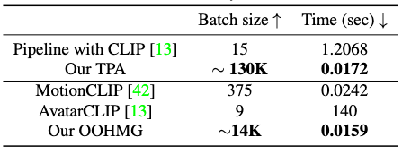

OOHMG shows superior efficiency in inference, allowing **real-time** zero-shot text-to-motion generation.

### Ablations
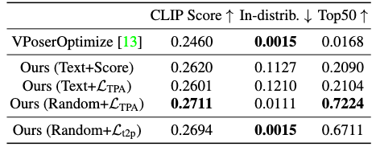

Ablation studies have been conducted to confirm most assumptions in this research. We point out one noteworthy ablation by the table above, which shows that **wordless training** can lead to superior performance than text supervision.

With a limited amount of training data, it's easy for the text-to-pose generator to "encode the difference" between the TPA and the original pipeline instead of learning the actual latent pose features, causing an overfitting.

