[W. Mao, M. Liu, R. Hartley, and M. Salzmann, “Contact-aware Human Motion Forecasting.” arXiv, Oct. 08, 2022. doi: 10.48550/arXiv.2210.03954.](https://arxiv.org/abs/2210.03954)

## Problem
---
Given a past human motion sequence and a 3D point cloud of the **scene** it happens in, how to predict the future motion?

## Observations
---
1. Humans evolve in 3D environments, which makes **3D scene context** a vital condition for human motion forecasting.
2. Recent works on motion forecasting model scene context **implicitly** by considering **features** of a 2D scene image, 3D scene or specific 3D object to condition the forecasting process.
3. Scene-aware **static human body** synthesis is another direction which is relevant to scene-aware human motion forecasting. It employs **explicit** scene context such as distance between scene points and body vertices. However, the **lack of spatio-temporal constraints** manifested in a motion sequence causes these models produce **"ghost motion"** artifacts.

## Assumptions
---
1. Motion forecasting can benefit from being conditioned on an **explicit** modeling of 3D scene context as a temporal sequence of **joint-scene contact points**, which can in turn be represented as **contact maps**.
2. Contact maps can constrain both **global** motion and **local** human pose, thus avoiding the forecast of "ghost motions".
3. The contact map exhibits **spatial smoothness** and can be appropriately represented as a set of **Gaussian RBFs**, formulating each joint as the centroid with known weights and the 3D scene points with unknown weights.
4. The contact map sequence exhibits **temporal smoothness**, which means it can be compactly represented as a function in the **low-frequency subspace**.
5. The prediction of future motions can be decomposed into two separate tasks of predicting global root translation and local joint translation to achieve **global-local motion consistency**.

## Contributions
---
1. A novel representation of fine-grained human-scene interactions as contact maps.
2. A contact-aware human motion forecasting pipeline exhibiting good performance.

## Pipeline
---
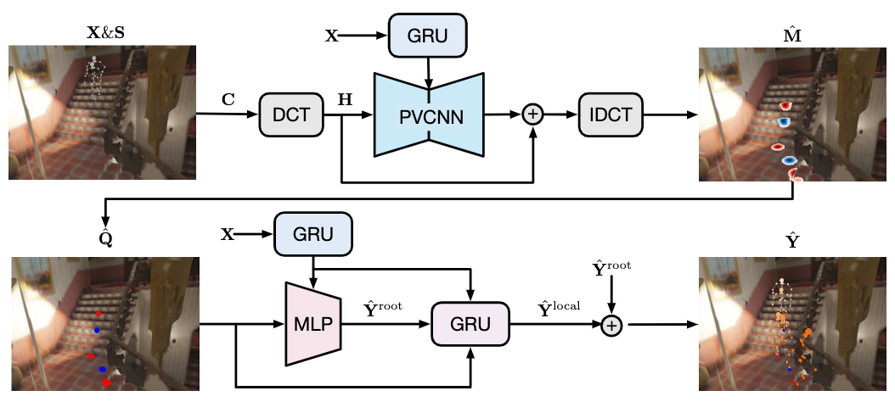

The motion prediction pipeline consists of three stages:
1. a **preprocessing stage**  which extracts the past contact map sequence $$\mathbf{C}$$ from past motions $$\mathbf{X} \in \mathbb{R}^{P \times J \times 3}$$ and 3D scene points $$\mathbf{S} \in \mathbb{R}^{N \times 3}$$, and compactly encodes $$\mathbf{C}$$ as its truncated DCT transform $$\mathbf{H}$$.
2. a **contact prediction** stage which takes past contact maps $$\mathbf{H}$$, past motions $$\mathbf{X}$$ and map them to the future contact map sequence $$\hat{\mathbf{M}}$$.
3. a **motion prediction** stage which takes the extracted contact points $$\hat{\mathbf{Q}}$$ from $$\hat{\mathbf{M}}$$, past motions $$\mathbf{X}$$ and map them to the future motion sequence $$\hat{\mathbf{Y}} \in \mathbb{R}^{T \times J \times 3}$$.

We will elaborate on these stages in sequence.

### Preprocessing Stage
According to assumptions 1 and 2, we want to get the **past sequence of human-scene contacts** as our past scene context in the preprocessing stage, which can then be passed to the downstream tasks of future scene context prediction and finally future motion prediction.

#### Per-joint Scene Contact Map
To accomplish this, we first need to formulate an adequate **representation** of the contacts. According to assumptions 3, this representation can be a matrix of per-joint **contact map**.

To start with, consider the per-joint **distance map** matrix $$\mathbf{d} \in \mathbb{R}^{J \times N}$$, where $$J$$ is the number of joints and $$N$$ the number of scene points. $$\mathbf{d}$$ encodes the distances from each point in the 3D scene point cloud $$\mathbf{S} \sim \mathbb{R}^{N \times 3}$$ to each joint location $$\mathbf{x}_j$$ as:

$$\mathbf{d}_{jn} =||\mathbf{x}_{j} -\mathbf{S}_{n} ||_{2}.$$

We define the per-joint **contact map** $$\mathbf{c} \in \mathbb{R}^{J \times N}$$ by assigning a **weight** to each joint-scene point pair. As the definition of a contact is only correlated with the distance between such a pair, we can assume a Gaussian RBF originating from each join to **interpolate** weights to the scene points:

$$\mathbf{c}_{jn} =e^{-\frac{1}{2} \frac{\mathbf{d}^{2}_{jn} }{\sigma^{2} } },$$

where $$\sigma$$ is a constant normalizer.

This formulation represents a **continuous** contact map where scene points closer to a joint have higher contact weights, and the weights decay to zero for further points.

Currently, the contact map is formulated as an **independent** variable for each joint. While this is sufficient for per-joint contact representation, in real scenarios human-scene contacts are often correlated with **multiple** joints at the same time, e.g. contact with an arm depends on both the wrist joint and the elbow joint locations **simultaneously**. Therefore, modeling the per-joint contact maps as independent of each other **ignores many contact cases**.

This leads to a subsequent question: how can we model contact map dependency?

I think a good direction to explore is to:
1. extend the RBF interpolation of each joint from influencing its local weights to influencing a shared set of global weights.
2. extend the RBF kernels from joints to SMPL surface points.

In other words, we formulate the entire contact map as an RBF interpolation problem with weights of SMPL vertices  as known (identity) and weights of scene points as unknown.

What's interesting is that once we have obtained this RBF interpolation function, we can treat it similarly with DCT and encode it smoothly in the low-frequency subspace. Afterwards, the same extraction of future contact points can be performed through closest point discretization. As a compensation for the selection ambiguity introduced by closely placed surface points, an **iterative closest-point** optimization might be needed to refine the closest points, from which a future motion prior can also be retrieved as a "free lunch"!

#### Compact Temporal Encoding of the Contact Map Sequence
Once the per-frame per-joint contact map $$\mathbf{c}$$ is extracted, we can represent the **sequence** of past contact maps as $$\mathbf{C} \in \mathbb{R}^{P \times J \times N}$$, where $$P$$ is the number of past frames.

According to assumption 4, such a sequence can be represented compactly in the **low-frequency** subspace. As such is the case, we consider encoding the sequence as its discrete cosine transform (DCT) coefficients:
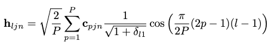

where $$l \in \{ 1, 2, \cdots, P \}$$ is the order of this particular DFT, $$P$$ is full frequency resolution needed, and $$\delta_{i,j}$$ is Kronecker delta function s.t.
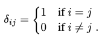

At any point, to **reconstruct** the explicit contact map sequence, we can apply the inverse discrete cosine transform (IDCT):
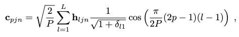

where $$L < P$$ is the frequency resolution used. This truncation by $$L$$ can maintain reconstruction accuracy because of assumption 4, with the side benefit of eliminating high-frequency noise outliers if any.

This gives us the final representation of the contact map sequence in the low-frequency subspace.

Towards this point, our formulation of the contact map representation is complete. We now turn our attention to the two sequential prediction tasks.

### Contact Prediction Stage
Given the past contact map sequence as $$\mathbf{C}$$ and past motion sequence as $$\mathbf{X}$$, we want to predict the future contact map sequence $$\hat{\mathbf{M}} \in \mathbb{R}^{T \times J \times N}$$. A neural network is formulated to approximate this mapping.

Specifically, we predict the **residuals** of a **contact map sequence prior** $$\mathbf{C}^\prime$$ to produce a **full** contact map sequence $$\hat{\mathbf{C}}=[\hat{\mathbf{c}}_1, \hat{\mathbf{c}}_2, \cdots, \hat{\mathbf{c}}_{P+T}]$$ including both past and future contact maps, $$\hat{\mathbf{M}}$$ is then taken to be the future part of $$\hat{\mathbf{C}}$$.

To construct the contact map prior, we apply a **padding strategy** in which the last contact map $$\mathbf{c}_P$$ is repeated $$T$$ times to fill the future contact maps of $$\mathbf{C}^\prime$$.

#### Compact Mapping in Low-frequency Space
Instead of mapping from $$\mathbf{C}^\prime$$ directly to $$\hat{\mathbf{C}}$$, we convert $$\mathbf{C}^\prime$$ to its compact low-frequency DCT form $$\mathbf{H}$$ first. The mapping could then be formulated as a **point-cloud encoding task** in the low-frequency space, where we need to encode the 3D scene points with the predicted DCT coefficients by leveraging $$\mathbf{H}$$ and the GRU-extracted features of $$\mathbf{X}$$.

Thus, the entire process can be expressed as the function below:
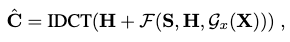

where $$\mathcal{F}$$ is the point-cloud encoding function, and $$\mathcal{G}_x$$ is the GRU feature extraction function.

#### Architecture
A GRU is employed to extract features of the past motion sequence, which are used to condition the prediction.

We employ a Point-Voxel CNN (PVCNN) architecture to approximate $$\mathcal{F}$$.

#### Training
We use an average $$l_2$$ loss to optimize both our model:
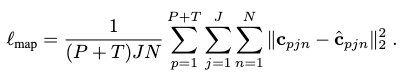

### Motion Prediction Stage
Given the predicted future contact maps $$\hat{\mathbf{M}}$$ and past motions sequence $$\mathbf{X}$$, the task of this stage is to predict the future motion sequence $$\mathbf{Y}$$.

#### Contact Information Refinement
To start with, we **refine** the information in $$\hat{\mathbf{M}}$$ by **only retaining the most relevant contact points** in each frame, i.e. the point that is:
1. above a certain contact weight threshold to be actually in contact with a joint.
2. closest to this corresponding human joint.

This information can be expressed as a 4D vector for each frame-joint pair:
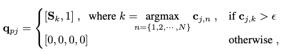

where $$\mathbf{S}_k$$ is the 3D location of scene point $$k$$, and $$\epsilon$$ is the weight threshold. Together, these vectors give us a **future contact point sequence** $$\mathbf{Q}=[\mathbf{q}_{P+1}, \mathbf{q}_{P+2}, \cdots, \mathbf{q}_{P+T}] \in \mathbb{R}^{T \times J \times 4}$$.

#### Motion Forecasting
According to assumption 5, the motion forecasting tasks is posed as two sequential subtasks:
1. predict the **global** root translation $$\hat{\mathbf{Y}}^\text{root}$$.
2. predict the **local** joint translations (i.e. poses) $$\hat{\mathbf{Y}}^\text{local}$$, conditioned by $$\hat{\mathbf{Y}}^\text{root}$$.

The final future motion $$\hat{\mathbf{Y}}$$ is formed by compositing these two translations.

#### Architecture
To approximate a similar feature extraction of past motions $$\mathbf{X}$$ to condition the two subtasks, we again employ a GRU.

To approximate subtask 1, we employ an MLP.

To approximate subtask 2, we employ a GRU.

#### Training
We train the models of subtask 1 and subtask 2 jointly by optimizing them on three losses.

The first loss accounts for the global root translation prediction:
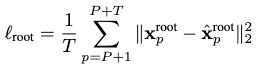

The second loss accounts for the local pose prediction:
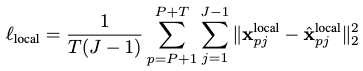

The third loss accounts for the predicted final motion's contact points against the ground-truth:
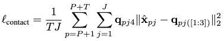

Together, they form the overall loss with a weighted sum:
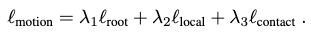

## Extensions
---

### Performance
The performance of this method is evaluated on two datasets:
1. GTA-IM is a large-scale **synthetic** dataset containing 50 different characters performing various activities in 7 different scenes.
2. PROX is a **real** dataset with motion captures of 20 subjects performing tasks in 12 different scenes. However, since the frame-wise motion parameters are jittery, the authors perform a **temporal smoothing refinement** to the data.

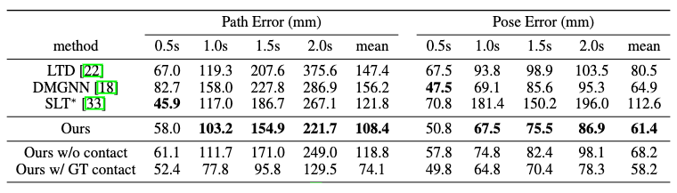

In GTA-IM, this method achieves superior performance than baseline models in **larger time steps** for 60 future frames, but not in the short .5s step. Although SLT excels in the **short-term prediction**, it **lacks consistency** between global path prediction and local pose prediction performances, which is a caveat absent in our method.

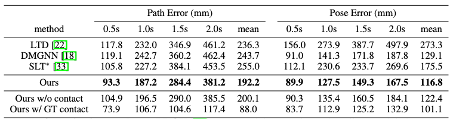

In PROX, this method achieves superior performance with a large margin across all time steps.

It should be noted that **SLT is scene-aware, while LTD and DMGNN are not**.

The ablation study of prediction without contact maps and with ground-truth contact maps could also confirm the importance of leveraging human-scene interactions in motion forecasting.

