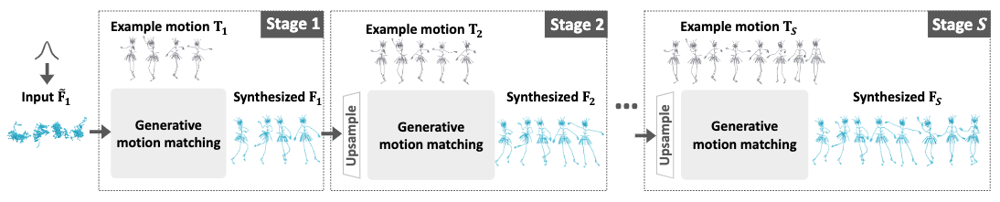
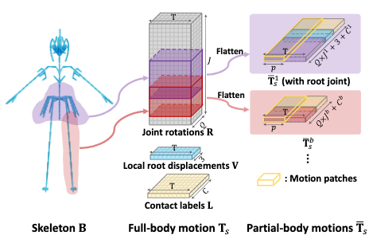
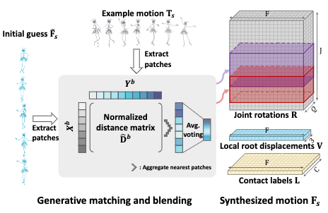
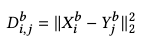
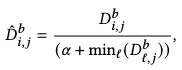
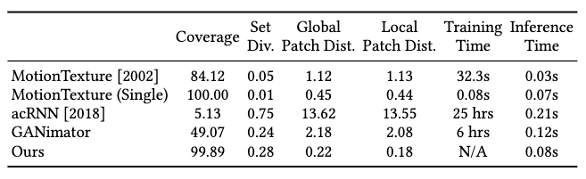
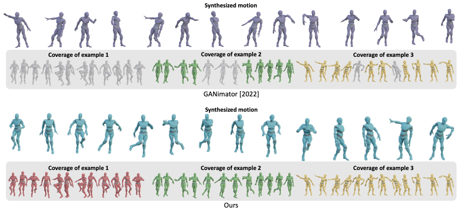
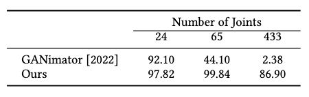
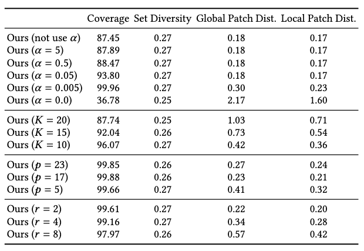
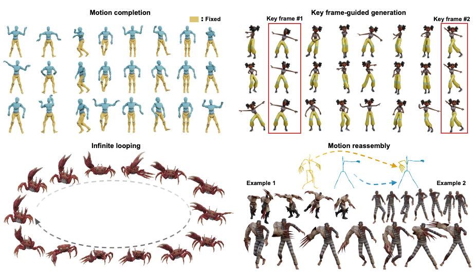

[W. Li, X. Chen, P. Li, O. Sorkine-Hornung, and B. Chen, “Example-based Motion Synthesis via Generative Motion Matching.” arXiv, Jun. 01, 2023. doi: 10.48550/arXiv.2306.00378.](https://arxiv.org/abs/2306.00378)

## Problem
---
Given a single **example** motion sequence or a **limited number** of them, how to generate new motion sequences?

## Observations
---
1. There are three major challenges in similar **deep learning** methods that solve the posed problem with few-shot training:
	1. they require **long training time**.
	2. they are prone to temporal artifacts such as **jittering** or **over-smoothing**.
	3. they do not scale well to **large and complex skeletons**.
	4. they cannot be extended straightforwardly to synthesis that requires a **full coverage of multiple provided examples**.
2. Previous **motion matching** methods have yielded good motion synthesis performance based on a **nearest-neighbor search** for motion patches that best fits the required local synthesis contexts, but are **non-generative**.
3. Generative image matching, similar to motion matching, has been attempted with success in **image synthesis**.

## Assumptions
---
1. **Example-driven** motion generation can be framed as an **autoregressive motion patch matching** problem, where a motion sequence is gradually **upsampled** from a coarse, **noisy** sequence by blending its own motion patches with their **nearest** example motion patches.
	1. A motion patch can be well represented as a **fixed-length, consecutive** subsequence in a motion sequence.
	2. **Skeleton-aware** motion patches can increase **diversity** of synthesized motion.
	3. A good **distance definition** between two motion patches should satisfy the following constraints besides geometric similarity:
		1. encouragement of all patches' appearance, i.e. **maximizes selection coverage** of the set of example patches.
		2. discourages deviation from whole example, i.e. **maximizes coherence** between the synthesized and example motions.
	4. An **agreement** of motion patch updates can be achieved via an **average voting** of selected motion patches.
2. This method can be generalized to motion generation with **arbitrary skeleton contexts**, such as
	1. **large and complex** skeletons.
	2. **non-human** skeletons.
	3. **mixture** of heterogenous skeletons.
3. **Full coverage of multiple examples' data** is a crucial requirement for example-driven motion synthesis. This method can be generalized to **fully cover multiple examples** easily by an extension of the set of motion patches considered.

For assumption 3, it's unsubstantiated whether a full coverage is desired in example-driven motion synthesis. Most of the time, the user can actually **prefer novelty and diversity over coverage or coherence**. Therefore, this metric is rather dubious for judging the performance of a motion synethsis method.

Moreover, we observe that GenMM **doesn't offer a control of the diversity-coherence tradeoff**, which can be achieved by most deep learning methods based on diffusion, VAE or GAN.

**Whether this model is actually producing novel motions is also questionable**, since it doesn't model any motion distributions and depend solely on sample-wise interpolation.

**We should take care NOT to call this model "generative" if it doesn't offer any true generations.**

A significant comparison can be made between GenMM and [MotionINR](/surveys/2023-8-31-MotionINR.html), where both employ sample-wise interpolations. However, the latter is tested against **MMS score** to exhibit a **true generation capability instead of reproduction**.

Therefore, I tentatively label this work as reproductive instead of generative, for now.

## Contributions
---
1. A highly **efficient** example-driven motion synthesis framework offering the following features:
	1. high quality motion production, with certain diversity modeled.
	2. easy scaling to complex skeletons.
	3. easy scaling to multiple examples with full coverage of their motion information.

## Pipeline
---

Any matching synthesis problem can be divided into three sequential stages:
1. a **patch extraction stage**, where motion patches are extracted from both the synthetic sequence and the example sequence.
2. a **patch matching stage**, where a distance matrix is computed between synthesis-example patch pairs and nearest neighbors are retrieved.
3. a **path blending stage**, where the nearest motion patches are blended into the synthetic patches to update the synthetic sequence.

Additionally, GenMM models the **generative** behavior of its motion matching by:
1. starting from a bottom downsampled synthetic sequence filled by **pure noise** from a normal distribution.
2. framing the generation process as an **autoregressive upsampling cycle** accomplished via classic motion matching.
3. iterate the upsampling cycle until we reach a desired synthesis length.

Specifically, we initialize the synthetic sequence $$\mathbf{F}_1$$ as $$K$$ times of the **fixed** patch size $$p$$.

Each upsampling is framed as mapping the previous sequence $$\mathbf{F}_s$$ to $$\mathbf{F}_{s+1}$$ w.r.t. a **downsampling rate** $$r > 1$$, s.t. $$\mathbf{F}_s=F \cdot r^{s-S}$$ where $$F$$ is the desired synthesis length. This upsampling is performed by motion matching with a correspondingly downsampled example sequence $$\mathbf{T}_i$$.

Finally, we iterate the upsampling cycle for $$S$$ steps until $$\mathbf{F}_S$$ is synthesized. Note that since we are only comparing equal-length motion patches, the length $$F$$ of the synthetic sequence can be **different** from the length of the example sequence as long as the patches can be sampled. We simplify the notations here by assuming them to have the same length.

The entire upsampling pipeline should be pretty clear by now. We will focus on describing the three stages in one upsampling iteration from now on.

### Patch Extraction Stage

Before patch extraction, we need to define our motion representation.

To start with, we represent a motion sequence $$\mathbf{T}_T$$ with a given length $$T$$ as a concatenation of the following data:
1. **local** root displacements $$\mathbf{V} \in \mathbb{R}^{T \times 3}$$, where each displacement is the frame-to-frame translation instead of global translation.
2. joint rotations $$\mathbf{R} \in \mathbb{R}^{T \times JQ}$$, where $$J$$ is the number of joints and $$Q=6$$ is the dimension of the rotation vector.
3. foot contact labels $$\mathbf{L} \in \mathbb{R}^{T \times C}$$, where $$C$$ is the number of foot joints and each column is a binary vector.

Next, We will take a patch on the example sequence $$\mathbf{T}_s$$ to illustrate how motion patches are represented and extracted.

According to assumption 1.1 and 1.2, we can formulate a series of **skeleton-aware motion patches** $$[\bar{\mathbf{T}}_s^1, \cdots, \bar{\mathbf{T}}_s^b]$$, where each motion patch $$\bar{\mathbf{T}}_s^i$$ is of size $$p$$ and generated from a **sliding window** on the $$i$$-th body-part subsequence of $$\mathbf{T}_s$$ with a **stride size** of 1.

Note that the **receptive field** (i.e. how much local motion a patch sees) of a motion patch, while related to $$p$$, is also determined by the ratio $$K$$, which is derived from $$p$$ against the length of input example motions at the **coarsest stage**:
1. receptive field grows as $$p$$ grows.
2. receptive field shrinks as $$K$$ grows.

The receptive field's effect on synthesis performance will be described in ablation studies later.

To make the motion patches skeleton-aware, we **manually** divide the skeleton tree into subtrees representing different body parts with overlapping connecting joints. A total of $$b$$ parts is assumed to be divided, and hence the superscript in the motion patch notation above. The figure above should illustrate this division more clearly.

The same extraction procedure is performed on the according synthetic sequence $$\mathbf{F}_s$$.

Towards this end, we should have two sets of motion patches:
1. the example patches $$[\bar{\mathbf{T}}_s^1, \cdots, \bar{\mathbf{T}}_s^b]$$.
2. the synthetic patches $$[\bar{\mathbf{F}}_s^1, \cdots, \bar{\mathbf{F}}_s^b]$$.

Note that **only one patch is presented** of each body part for notation simplicity. In reality $$\bar{\mathbf{T}}_s^i$$ should be viewed as **a set of patches** resulted from sliding a window on this body-part subsequence.

Note also that the **extraction of synthetic patches is done on the upsampled initial guess** $$\tilde{\mathbf{F}}_s$$ from the previously refined $$\mathbf{F}_{s-1}$$. **This upsampling is done via linear interpolation**, judging from the authors' code. I think this part is very fuzzy in the paper, and creates unnecessary confusion for readers.

With the side-to-side patches in hand, our next task is to match them for nearest neighbors.

### Patch Matching Stage

In patch matching, our objective is to select a set of synthesis-example patch pairs for each synthesis patch. To accomplish this, we first compute a distance matrix of all such possible pairs and then select the pair with shortest distance in each synthesis column.

Assuming that the set of synthetic patches is $$X$$, and the set of example patches as $$Y$$, we compute the distance matrix $$\mathbf{D^b}$$ **for each body part** $$b$$ as their $$l_2$$ distance:

According to assumption 1.3, we further constrain the $$l_2$$ distance matrix by **normalizing it with a per-example-patch factor**:

where $$\alpha$$ controls the **degree of completeness (coverage)**, where a smaller value encourages more **sporadic sampling** of the example content by the nearest-neighbor algorithm.

You should refer to the ablation studies for more information on the effectiveness of $$\alpha$$.

Once $$\hat{\mathbf{D}}^b$$ is computed, we can select the nearest-neighbor pair for each synthetic patch.

### Patch Blending Stage
Finally, we get to blend the nearest neighbor pairs to update our synthesis with matching example patches.

An **average voting** of the nearest example patches is conducted on every frame to update the body-part-specific motion subsequence, **discarding** the content from previous synthetic patches. These subsequences are then assembled to the synthesized motion sequence $$\mathbf{F}_s$$ by **averaging the values over overlapping joints across different body parts**. Finally, we can leave this upsampling iteration with $$\mathbf{F}_s$$.

## Extensions
---
In practice, the following parameters are fixed empirically for best performance of GenMM:

$$p=11,\  K=4,\  \alpha =.01,\  E=5,$$

where $$E$$ is the number of iterations of all three stages in one upsampling round.

### Performance

#### Single-example Syntheis

Against the baseline methods for **single-example novel motion synthesis**, GenMM has shown superior **coverage and accuracy** than both classical statistical model (MotionTexture) and neural models (acRNN and GANimator).

GenMM shows a slightly lower efficiency than the statistical model, almost equal coverage, but a significantly higher diversity and accuracy.

GenMM shows superior performance in almost all metrics over neural models, although **much poorer in diversity** than acRNN. However, we notice the other metrics of acRNN are the lowest among the baselines, and doubt the significance of this high diversity can lead to dominate its performance judgement.

#### Multi-example Synthesis

In a **multi-example** synthesis illustrated in the above figure, GenMM also exhibits full coverage while GANimator struggles. However, we would like to remind the reader again that high coverage doesn't necessarily imply good synthesis.

#### Skeleton Complexity and Coverage

As the skeleton becomes more complex, we can observe the consistent coverage offered by GenMM, while GANimator decays quickly in this metric.

### Ablations

Ablation studies are conducted w.r.t. four hyperparameters. Their effects on method performance can be observed as:

| hyperparameter               | symbol   | effects                                                                                                                                                                                                    |
| ---------------------------- | -------- | ---------------------------------------------------------------------------------------------------------------------------------------------------------------------------------------------------------- |
| synthesis completeness       | $$\alpha$$ | **Smaller** value leads to  1. higher coverage.  2. lower accuracy (unstable generation) when $$\alpha \rightarrow 0$$.                                                                  |
| initial patch-sequence ratio | $$K$$      | **Larger** value leads to  1. smaller receptive field.  2. more diversity.  3. unnatural transitions by capturing only fine-level movements.  **Smaller** value leads to overfitting. |
| patch-size                   | $$p$$      | **Smaller** value leads to  1. small receptive field.  2. less coherent results (low accuracy).                                                                                          |
| downsampling rate            | $$r$$      | **Larger** value leads to big gaps and unstable generation. **Smaller** value leads to long and unnecessary running time.                                                                                  | 

### Applications

GenMM can be extended to the following synthesis tasks with some extra constraints:
1. motion completion with fixed body-part motions.
2. key frame-guided motion inpainting.
3. synthesize infinite looping animations from examples.
4. body-part motion reassembly.

Most of these constraints are applied by controlling the update logic of particular body-part-specific motion patches.

