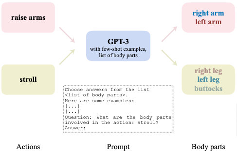
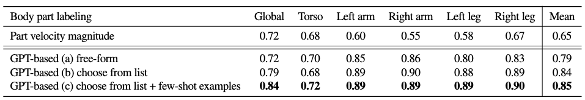
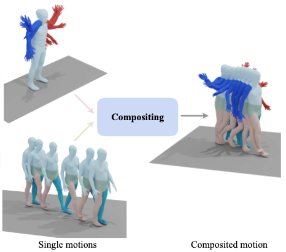
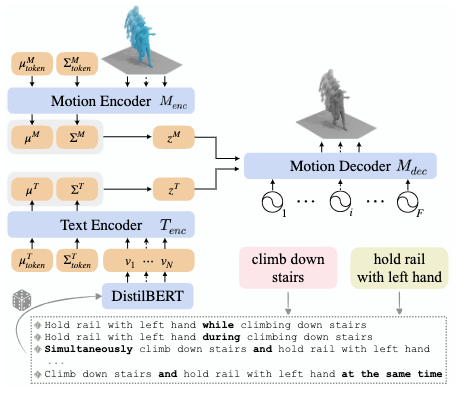
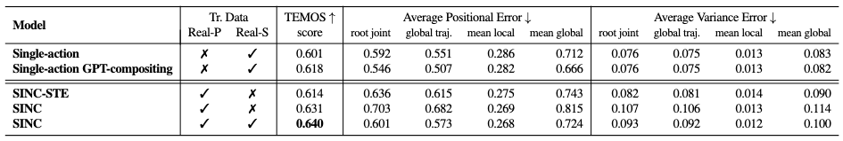
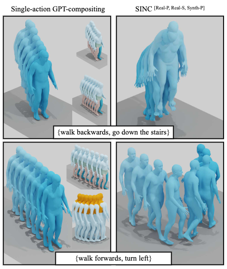

[N. Athanasiou, M. Petrovich, M. J. Black, and G. Varol, “SINC: Spatial Composition of 3D Human Motions for Simultaneous Action Generation.” arXiv, Aug. 19, 2023. doi: 10.48550/arXiv.2304.10417.](https://arxiv.org/abs/2304.10417)

## Problem
---
Given a set of **textual** descriptions describing simultaneous **actions of different body parts**, how to generate a motion sequence?

## Observations
---
1. Current text2motion methods have trouble mapping **fine-grained** textual descriptions to motion. One aspect of these descriptions needs to condition **multiple simultaneous actions** on a generated motion, which can be viewed as **spatial composition**.
2. Independently generating **single-action** motions and combining them heuristically is sub-optimal for spatial composition since the final motion **lacks realism**.
3. In current motion datasets (BABEL), a single motion segment is rarely annotated with **multiple texts** which can denote multiple actions.
4. With existing datasets, data-driven methods are prone to learning **spurious correlations** between body-part-specific actions and their irrelevant body parts, since it's **intractable** to collect data for **all possible combinations** of body-part-specific actions.

In other words for observation 4, the space of **open-body-part** actions are combinatorial, just like **open-vocabulary** words forming sentences, and it's intractable/hard to gather all the information in this space to train an appropriate model that understands open-body-part motion composition.

As we shall see in the assumptions, SINC adopts an **explicit alignment** approach to provide the open-body-part annotations by querying GPT-3 with prompt engineering and synthesizing motions. However, there exists a more elegant **implicit alignment** solution offered by [OOHMG](/surveys/2023-10-16-OOHMG.html), although it's aimed for open-vocabulary learning. Nevertheless, I see no reason why it cannot be adopted to provide a more robust spatial composition method.

## Assumptions
---
1. **Action-specific body parts** must be known **explicitly** to conduct **spatial composition** of two motions.
2. **Correspondence** between actions and body parts is encoded in existent language models (GPT-3), and can be extracted as a **many-to-many** relationship.
3. A **multi-action** motion can be **spatially decomposed** into a set of explicit body-part-specific motions which are
	1. **independently** conditioned by only one action described, i.e.
		1. different actions in the description don't **overlap** in their described body parts.
		2. the simultaneous performances of two different actions in two different body parts are **completely uncorrelated**, e.g. in terms of frequency, style, timing etc.
	2. the **granularity** of body parts can be appropriately set as `[global orientation, torso, left arm, right arm, left leg, right leg]` to satisfy assumption 2.1, with some extra assumptions of **local correlation**:
		1. if an action describes any `leg` or `global orientation`, all `[global orientation, left leg, right leg]` are described by it.
		2. if a body part is not explicitly described by any action, it must be described by the action describing most body-parts.
4. A body-part-specific motion can be **reduced from a single-action motion**.
5. **Open-vocabulary** motion conjunction descriptions can be appropriately approximated as a closed-vocabulary sampling of motion annotations augmented by conjunction keywords.
6. The **joint text-motion latent space** can capture multi-action motion mappings well.

Note that in assumption 3, motions annotated with a single action's textural description are refered to as "single-action" motions, and those with multiple simultaneous action descriptions are refered as "multi-action".

We will continue to use this naming convention for simplicity in the discussion below. However, please keep in mind that a "single-action" only describes the number of **available** annotations, but not necessarily indicates that the motion itself can only be described with one action, nor does it imply that every action can be treated as body-part-specific.

## Contributions
---
1. A new benchmark on spatial composition of body-part-specific motions, with several baseline methods and a new metric based on a motion encoder.
2. A GPT-guided data augmentation scheme by identifying and combining action-body-part-specific motions to synthesize new motions with conjuncted textual annotations.
3. A text2motion model, simultaneous action compositions for 3D human motions (SINC), that extends [TEMOS](/surveys/2023-10-23-TEMOS.html) to accept textural descriptions of multiple simultaneous, body-part-specific actions, that performs better in generation realism compared to baselines.

## Pipeline
---
According to major mappings conducted between different motion representations, three stages can be identified in SINC:
1. a **correspondence extraction stage**, where body-part-specific action-motion correspondence is extracted in the natural language domain by prompting GPT-3.
2. a **motion synthesis stage**, where synthetic multi-action motions are generated by cropping and stitching existent single-action motions w.r.t. their extracted correspondence.
3. a **multi-action learning stage**, where a generative model is optimized by both real and synthetic data to approximate the mapping from a multi-action textual description to a multi-action motion.

We will discuss these stages separately.

### Correspondence Extraction Stage

According to assumptions 1 and 2, OpenAI's GPT-3 model is used to extract an explicit body-part-specific action-motion correspondence for each available single-action motion data.

Specifically, GPT-3 is prompted to answer a matching question:

> **"what body parts are involved in the the action: `<action>`?"**,

where `<action>` is the target single-action annotation of a motion sequence.

The response is then mapped to an arbitrary list of **textual** body part labels predefined as a binary vector:

`[left arm, right arm, left leg, right leg, torso, neck, buttocks, waist]`.

We then extract the final correspondence by mapping this vector to a binary vector of the **actual** skeletal body parts involved:

`global orientation, torso, left arm, right arm, left leg, right leg`,

where `neck` is mapped to `torso` and `[wasit, buttocks]` to `global orientation`.

Each correspondence indicates whether this specific action can influence the motion of a specific subset of joints on the skeleton model.

#### Prompt Engineering
Essentially, this stage implements the simple question we want GPT-3 to answer above. However, some prompt engineering tricks can be applied to **improve response quality**.

To start with, asking for a **free-form answer** from GPT-3 creates suboptimal responses, as **body part vocabulary cannot be contained** to respect those defined by our label list:
1. **Overdetailed** symbols, such as "triceps" or "deltoids", come up frequently.
2. **Alternative** symbols emerge in describing specified body parts, but cannot be easily mapped to corresponding labels.

To mediate this problem, we supply GPT-3 directly with the label list defined and instruct it to choose from this list instead.

Secondly, we provide **few-shot examples** as question-answer pairs to guide accurate response from GPT-3.

Finally, we ask our desired question and retrieve the response body-part list from GPT-3. We then apply simple postprocessing, such as lower case and punctuation removal to clean up the response and map it to the actual body parts.

The effectiveness of engineering steps 1 and 2 can be substantiate with the ablations above, where we manually correspond 100 actions to their body parts. Alternatively, we may replace GPT-3 prompting with **a simple thresholding filter based on part velocities**, i.e. if a part moves fast under an action, then it's likely to be described by that action. However, the ablations show inferiority of this alternative.

### Motion Synthesis Stage

According to assumptions 3 and 4, with the derived correspondence, we can synthesize novel multi-action motions from multiple single-action motions in a **"crop and stitch"** manner. To limit our scope of investigation, we only consider synthesizing **double-action** motions from two single-action ones.

First, we obtain two motions A and B from a ground-truth dataset, along with their body-part-specific action-motion correspondences.

Then we implement the synthesis pipeline with the following sequential logics:
1. If A and B have **overlapping** body parts, we deem them as incompatible and **abort** the synthesis.
2. We **trim** the longer motion to the length of the shorter motion.
3. We **order** A and B s.t. B always has fewer body parts involved.
4. If B involves any `leg` or `global orientation`, we select `[left leg, right leg, global orientation]` and **global translation** for all joints from B. Otherwise, we obtain them from A.
5. Any **unselected** body-part motions from B are selected from A.
6. We **combine** the selected body-part motions from A and B, along with the global translation from 4, to obtain the final motion C.

According to assumption 5, a set of annotations for C can be synthesized from the single-action annotations of A and B by concatenating them with **conjunction words**. This set is implemented implicitly as an additional augmentation process during data retrieval, which randomly selects a conjunction paradigm from a **fixed vocabulary**.

### Multi-action Learning Stage

According to assumption 6, the [TEMOS](/surveys/2023-10-23-TEMOS.html) model is adopted for the approximating the mapping function from multi-action textual description to multi-action motion. As we are gonna discuss TEMOS in another survey, we skip the details here and ask you to refer to that text instead.

## Extensions
---

### Performance

There are two type of multi-action motions available from the BABEL dataset:
1. **Real-Pairs**, which are obtained directly from the motion segments with multiple textual descriptions.
2. **Real-Singles**, which are obtained by the motion synthesis stage from real single-action motions.

Two baseline models are proposed:
1. **single-action** composition, where a single-action generator takes the multi-action text and directly attempts to generate the corresponding multi-action motion.
2. **single-action GPT** composition, where a single-action generator generates **separate** single-action motions from two single-action descriptions, and then composite them together via prompting GPT for correspondence.

Additionally, we add a TEMOS score as metric, where the motion encoder of TEMOS is used to compare ground-truth and generated motions in its latent space.

SINC has shown superior performance on TEMOS score, but less so in average positional errors and variance errors when compared with baselines. However, since the latter two metrics lean more towards a deterministic mapping than generative one, we argue that SINC obtains better generative realism without sacrificing too much accuracy.

This claim could also be supported via qualitative inspection, where we observe the single-action GPT-compositing fail to product correct motions when stitching up the motions, while SINC avoids these mistakes.

