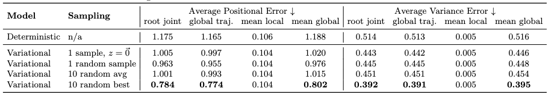

[M. Petrovich, M. J. Black, and G. Varol, “TEMOS: Generating diverse human motions from textual descriptions.” arXiv, Jul. 22, 2022. doi: 10.48550/arXiv.2204.14109.](https://arxiv.org/abs/2204.14109)

## Problem
---
Given a text description, how to generate a motion sequence?

## Observations
---
1. One textual description can often map to **multiple** ways of performing the actions involved.
2. While there exists an **accuracy-diversity** tradeoff in text2motion, it's desirable for the natural language **interface** to **disambiguate** the input linguistic expressions itself rather than leaving the matter to users. In other words, text inputs are desired to be **ambiguous**, and the motion generation model should leverage the extent of this ambiguity to correspond with the **appropriate generation diversity**.
3. **Autoregressive** modeling of the temporal nature for motion synthesis tends to **drift** over time and eventually **produce static poses**, while **sequence-level** generative models can capture **long-range context**.
4. Directly **comparing generated motion with ground-truth** is problematic, since it's intended for **one-to-one mapping** from text to motion instead of one-to-many mapping.
5. Extending motion generation to synthesize SMPL body model sequence support future research on motions that involve **interactions or scene**.

Observation 4 is very acute in pointing out that the one-to-one mapping assumption is extremely problematic for motion generation tasks. However, the VAE model proposed by the authors succumbs to this assumption implicitly by:

1. Choosing a sequence-level latent space representation for each motion.
2. Optimize this representation with a **one-to-one** reconstruction loss.
 
At first glance it may seem this issue is nitpicking: **how would you learn a motion representation otherwise?**
 
However, we argue that it's exactly the assumption behind this question that leads to the caveat. So far, we are only considering the advantages of assuming a sequence-level motion representation, but ignoring the disadvantages, to name a few:

1. the sequence-level motions are now assumed to consist of a **single action description**, i.e. **one-to-one** from motion to text, while the relationship is in fact **many-to-many** since you can describe this motion from many description aspects, by focusing on **spatial and temporal subspaces** of the motion features.
2. the sequence-level motions have **fixed-lengths**, while actual motions of the same action type are usually variable-length and behaves drastically different (e.g. short running burst and long jogging are all "running"), and learning only from fixed-length motions may capture **spurious long-range temporal correlations**.

To mediate these disadvantages, the most straightforward thing to do is to **break the sequence-level representations up into more atomic representations**, i.e. we no longer assume the sequence-level motions provided can offer a good representation of the motion space.

This granularization can happen **both spatially and temporally**, exploring **orthogonal** subspaces of a motion sequence. Moreover, the subspace themselves can be expressed either implicitly or explicitly.

You will see this line of thinking pop up in most subsequent methods, but it hasn't been properly investigated so far since the ablation studies are really, really hard to conduct because each assumption made leads to **drastically distinct computational architectures** in implementation.

## Assumptions
---
1. **Generative** text2motion mapping can be captured with a **variational joint text-motion latent space**.
2. The text-motion latent space can be appropriated represented by compositing two aligned subspaces of **sequence-level** text and motion features.

## Contributions
---
1. A text2motion generative model, TEMOS, that's among one of the firsts to map a text description to diverse motions.

## Pipeline
---

TEMOS formulates motion generation as a **one-stage** process, where the text description is first mapped to the generated motion sequence by a midway stop in a joint text-motion latent space. This mapping is approximated a **variational autoencoder (VAE)** with two encoders to draw the joint latent space by compositing text and motion feature distributions, and a unified motion decoder to reconstruct the motion from this latent space.

### Motion and Text Encoders
The two encoders are set as **symmetric** as possible to ensure uniformity across the joint latent space. Each of them maps the input to a unified latent representation $$\mathbf{z} \in \mathbb{R}^d, d=256$$, sampled from a reparameterized normal distribution $$\mathcal{N}(\mathbf{\mu^M}, \mathbf{\Sigma^M})$$ or $$\mathcal{N}(\mathbf{\mu^T}, \mathbf{\Sigma^T})$$ depending on the branch.

Together, these two distributions represent the joint latent space distribution, and are kept as identical as possible to **fuse the two modalities in latent space** through the unified motion decoder and KL losses.

Next, we are gonna describe the details of each encoder's architecture.

#### Motion Encoder Architecture
A Transformer is employed for the encoding of a motion sequence into its sequence-level latent representation. Since we would like a **non-autoregressive** mapping process, the motion sequence is **not masked** during the attention mechanisms.

Two learnable placeholder tokens, $$\mathbf{\mu}^M_\text{token}$$ and $$\mathbf{\Sigma}^M_\text{token}$$, are passed along with the motion sequence $$\mathbf{H}$$ into the encoder. We obtain the distribution parameters $$\mathcal{N}(\mathbf{\mu^M}, \mathbf{\Sigma^M})$$ to sample our latent representation generatively.

#### Text Encoder Architecture
The text encoder is also a Transformer. However, instead of directly passing the text tokens as input we first pass them through a pretrained language model, DistilBERT, to obtain good word embeddings and save computation.

### Motion Decoder
The motion decoder is also an **unmasked** Transformer. We take in a sampled latent code from either branch, as well as a positional encoding vector of length $$F$$, which is the motion length we would like to generate.

Note that this design also allows us to generate **variable-length** motions in an arbitrary manner, as another source of **diversity**, although this length **must be manually set**.

The inputs are mapped by the decoder non-autoregressively to the final generated motion $$\hat{\mathbf{H}}$$.

### Training
Three kinds of losses are applied in training. We train all the modules concurrently.

#### Reconstruction Loss $$\mathcal{L}_R$$
This is the major loss to formulate the joint latent space. We consider the reconstructions from both encoder branches during training:

where $$\mathcal{L}_1$$ is the smooth $$l_1$$ loss.

#### KL Loss $$\mathcal{L}_\text{KL}$$
This loss is added to regularize the latent distributions of the two encoders s.t. a motion-text pair has similar representations in both modalities, i.e. **distribution to distribution similarity**.

Moreover, we also regularize the joint latent distribution to be close to a standard normal s.t. each orthogonal direction of our latent vector has expressiveness.

The KL loss is then

where $$\psi$$ is the standard normal parameters, $$\phi^T$$ contains the parameters of the latent text distribution, and $$\phi^M$$ the latent motion distribution.

#### Cross-modal Embedding Similarity Loss $$\mathcal{L}_E$$
The sampled latent codes from both branches are also kept close to each other to further align the modalities **dimension-to-dimension**:

by the $$l_1$$ loss between them.

#### Total Loss
Together, the total loss is simply a composition of the three losses:

as a weighted sum, where $$\lambda_\text{KL}=\lambda_E=10^{-5}$$, found through ablations.

### Inference
During inference, only the text encoder is used to complete the text2motion mapping.

## Extensions
---
TEMOS is trained for 1000 epochs with AdamW optimizer and a learning rate of $$10^{-4}$$. All modules are set to be  6-layer Transformers.

Full motion sequences with variable lengths from KIT-ML are used as inputs during training.

### Performance

TEMOS achieves significant improvement over previous methods, except on the **APE for the local joints**, compared with JL2P. It should also be noted that the two quantitative metrics assume **one-to-one** mapping between text and motion, as described in the assumptions.

### Why FID is not relevant for KIT-ML?
In the KIT Motion-Language dataset, there are 3911 motions and a total of 6352 text sequences (in which 900 motions are not annotated). We group sequences that correspond to the same action phrase and detect 4153 such action clusters out of 6352 sequences.

The distribution of these clusters is very **unbalanced**: “walk forward” appears 596 times while there are 4030 actions that appear less than 10 times (3226 of them appear only once). On average, an action phrase appears 2.25 times. This information shows that the calculation of **distribution-based metrics**, such as FID, is not relevant for this dataset.

### Ablations

It is observed that by accounting the variational approach, TEMOS can perform better even on the one-to-one metrics, and is better than deterministic models even if only one random sample is allowed.

#### Architectural and Loss Ablations

It's shown that **GRU performs much worse than Transformers** for TEMOS.

It's also shown that the inclusion of motion encoder is more critical for loss mitigation than the inclusion of minor loss terms such as KL losses. Moreover, the performance deterioration is **more correlated with global motion generation than local** for all these ablations.

### Limitations
Some announced limitations are:
1. Vocabulary of KIT-ML is small (1263 words) and dominated by locomotive motions, thus TEMOS cannot scale well to **out-of-distribution texts**.
2. We don't have a principled way of measuring diversity of generated motions.
3. TEMOS cannot scale up to **long-term motion generation**, while [TEACH](/surveys/2023-9-4-TEACH.html) mitigates this issue to some extent.

