[K. Zhao, Y. Zhang, S. Wang, T. Beeler, and S. Tang, “Synthesizing Diverse Human Motions in 3D Indoor Scenes.” arXiv, Aug. 21, 2023. doi: 10.48550/arXiv.2305.12411.](https://arxiv.org/abs/2305.12411)

## Problem
---
Given a **closed** (indoor) 3D scene and a sequence of **semantic action-object interaction instructions or poses**, how to generate a sequence of human motions w.r.t. them?

## Observations
---
1. Humans motions naturally **interact** with surrounding scenes in **diverse** plausible ways, but methods for synthesizing these motions are rarely explored.
2. Existent learning-based interactive motion synthesis require capturing human motion and scenes **simultaneously**, but these data are **costly to obtain**. Moreover, a limited collections leads to inferior synthesis quality for these methods.
3. There are different challenges for existent interactive motion generators:
	1. **GAMMA** learns generative motion models and RL-based policies without **goal-motion data**, but is limited to
		1. producing **only locomotions** in a scene.
		2. the motions often **collide with scene objects**.
	2. **SAMP** learns conditional VAEs to produce **sitting and lying actions** in a scene with **object-motion data**, but produces visual artifacts such as
		1. foot sliding and other physically implausible artifacts.
		2. low diversity.

## Assumptions
---
1. Scene-interactive motion synthesis can be formulated as a **reinforcement-learning (RL)** task:
	1. meeting the motion goals (satisfying guidance) can be set as **reward**.
	2. scene perception can be set as **states**.
	3. conditioned sampling of latent space from a generative motion model can be set as **actions**.
2. A scene-interactive motion sequence can be **decomposed** into two independent generation **subtasks**:
	1. generate **locomotions** when the digital human is moving between scene objects.
	2. generate **interaction** when the digital human needs to perform interaction with a scene object.
3. By representing the scene perception with **scene-aware** perception features, we can avoid multiple known caveats in existent methods:
	1. **body markers** can be used to inform the **fine-grained interaction** generation of its **action-goal discrepancy**, where the goal guidance can be provided by the **static interactive poses** from **COINS**, conditioned on **semantic action-object instructions**. This addresses observation 3.1.1.
	2. Additionally, a **signed distance field (SDF) defined by scene objects** can be evaluated on **body markers** to inform **human-scene penetration information** to interaction generation. Specifically, we feed the downstream generation with:
		1. signed distances on body markers (proximity information).
		2. gradient of these signed distances (relative movement information).
	3. a **flat, 2D walkability map** can be used to inform **locomotion** generation with the **walkability information** in a scene, thus mitigating observation 3.1.2.
4. By formulating the **reward** with additional check for **foot contact**, we can mitigate observation 3.2.1.
5. By producing the **action** with a generative motion model trained on **richer datasets** (combining SAMP and AMASS), we can mitigate observation 3.2.2.
6. Additionally, we assume some **additional scene features** to simplify assumption 3:
	1. the scene only contains **static scene objects**.
	2. the scene has a **flat floor**.
	3. the scene only allows for **sitting and lying** interactive motions.
	4. the scene is **closed**, i.e. "indoor" with 2D locomotion boundaries.

## Contributions
---
1. An RL-based motion generation framework, DIMOS, capable of generating **continuous, realistic, diverse and interactive** human motions in complex indoor scenes given a sequence of semantic action-object instructions or body poses.
2. Various novel scene-aware features to serve as states and guidance for the RL task, which address multiple existing caveats of interactive motion generation.

## Pipeline
---
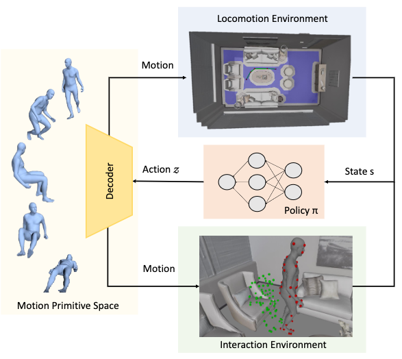

The basis of DIMOS is an RL pipeline. According to assumption 1 and the figure above, the following cycle runs for one iteration at **each time step $$t$$**:
1. A new **state** $$\mathbf{s}_t$$ is sampled from either locomotion or interaction environment.
2. An actor policy model $$\pi(\mathbf{a}_t\vert\mathbf{s}_t)$$ samples an **action** $$\mathbf{a}_t$$ from the latent space of the cVAE-based motion generation model.
3. A short motion clip is decoded by the motion model's decoder from $$\mathbf{s}_t$$ to form the actual motion performed at $$t$$.
4. The next state $$\mathbf{s}_{t+1}$$ is obtained from the new motion's environment.
5. A **reward** $$r_t=r(\mathbf{s}_t, \mathbf{a}_t, \mathbf{s}_{t+1})$$ is computed tailored to different tasks, and used to optimize the actor and critic models jointly.

First, we are gonna discuss our detailed formulation of the state, action and reward in this cycle, from a **generalized** perspective covering both locomotion and interaction subtasks, i.e. the generalized RL framework.

Then, we will introduce you to each of the subtask and its particular state and reward elements formulation, which is different from each other. You can read them in the locomotion variant and interaction variant section.

### Generalized RL Framework

#### State
The state $$\mathbf{s}_t$$ is formulated as:
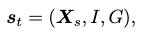

where
1. $$\mathbf{X}_s \in \mathbb{R}^{M\times67\times3}$$ is the sequence of body marker motion in the past $$M$$ frames.
2. $$I$$ is the **person-scene interaction feature**, which imbues the policy model with **scene-aware** perception information.
3. $$G$$ is the **goal-reaching feature**, which informs the policy model about the instructed goal to complete.

**$$I$$ and $$G$$ vary in the locomotion and interaction variants of the RL framework.**

#### Action
An action $$\mathbf{a}_t$$ is proposed as a sampled latent variable $$z$$ from a cVAE motion generator.

The cVAE is trained on the SAMP and AMASS datasets to encode **motion primitives** in its latent space. The model is conditioned on 1 or 2 past frames, and each variable $$z$$ in its latent space can be decoded into a short clip of motion.

The policy model learns to directly produce $$\mathbf{a}_t$$, conditioned on the state $$\mathbf{s}_t$$.

#### Reward
The total reward is formulated from three rewards:
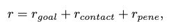

The **goal-reaching reward** $$r_\text{goal}$$ encourages the policy model to meet the motion goal, and is designed differently for locomotion and interaction.

The **foot-ground contact reward** $$r_\text{contact}$$ discourages the policy model to produce foot-floating and foot-skating artifacts, and is defined as:
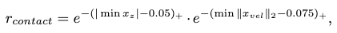

where $$F$$ is the subset of foot markers from the body markers, $$x_z$$ is the height of the markers, $$x_{vel}$$ is the velocity of the markers, and $$(\cdot)_+$$ is the clipping of negative values.

The **penetration avoidance reward** discourages the policy model to produce motions that penetrate scene objects, and is designed differently for locomotion and interaction.

#### Policy Learning Model
The **actor-critic** algorithm is employed to learn the policy, and this process is approximated with a neural network for each subtask.

The policy actor produces a diagonal normal distribution $$\pi(z_t \vert \mathbf{s}_t)$$ representing the action distribution given $$\mathbf{s}_t$$.

The policy critic produces a value estimation $$V(\mathbf{s}_t)$$ given $$\mathbf{s}_t$$.

The actor and critic models are jointly optimized by minimizing the following loss:
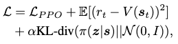

where
1. the first term, $$\mathcal{L}_\text{PPO}$$, is the proximal policy optimization loss to **discourage large policy updates**.
2. the second term updates the value estimation of the critic.
3. the third term regularizes the action distribution to behave within the latent space of the motion generator.

#### Tree Sampling for Motion Sampling Optimization (Inference Postprocessing)
To produce a motion, we need to sample the action distribution provided by the policy model. However, this stochastic sampling yields motions of different qualities w.r.t. following goal-reaching and scene interaction objectives.

Thus, during an inference we apply a tree sampling strategy to **discard sampled motion clips with inferior qualities**. We sample multiple motions at each time step and only keep the top-$$K$$ best behaving clips, where the criteria is the same reward used to train the policy model.

### Locomotion Variant
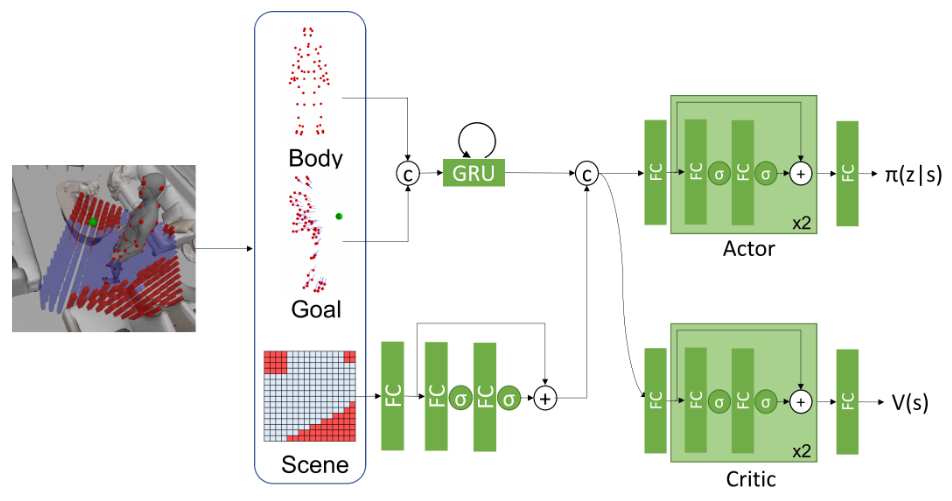

Our objectives in locomotion synthesis are:
1. generate a locomotion sequence moving along an appropriate trajectory implied from the locomotion instruction, i.e. goto scene object A.
2. avoid collision with scene objects as much as possible.

#### Reward to Guide Objective 1
Objective 1 can be guided with a 2D pelvis trajectory, which is provided manually or through pathfinding algorithms such as $$A^\ast$$. For each time step, we would then have the action guidance as a pelvis goal $$\mathbf{g}_p$$.

The reward for this goal can then be designed to fill the goal-reaching reward in the general framework as:
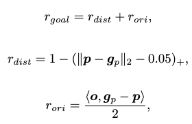

where $$\mathbf{p}$$ is the action-produced pelvis state.

$$r_\text{dist}$$ encourages the pelvis location to match with the guidance location.

$$r_\text{ori}$$ encourages the pelvis orientation to match with the guidance orientation.

#### Reward to Guide Objective 2 with Walkability Map
According to assumption 3.3, goal 2 can be guided by consulting the action's locomotion result with a **walkability map**.

A walkability map $$\mathcal{M} \in \{0,1\}^{16 \times 16}$$ is a 2D binary map representing the walkability of the environment surrounding the human agent, in the human's local coordinates and covering an area of $$1.6m \times 1.6m$$. The map is aligned with the body facing orientation.

We can then encourage collision avoidance of the produced locomotion by filling in the penetration-avoidance award in the general framework as:
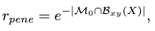

where $$\mathcal{M}_0$$ is the set of non-walkable cells and $$\mathcal{B}_{xy}$$ is the 2D bounding box computed from the body markers $$\mathbf{X}$$.

Other than the limitations introduced by assumption 6 on the current walkability map design, several other issues can be raised:

1. even when defined as a 2D manifold to generalize to uneven terrains, the walkability map still lacks definition for penetration avoidance of vertically uneven scene objects, e.g. a short stool can be crossed over, but not a tall sofa.

2. when the human locomotion style is different, such as crawling or running, the fixed-size map might no longer be ideal as the human bounding box can easily cover most of the walkability map, leaving little space for collision avoidance.

To address concern 1, a vertical stack of layered walkability maps can be proposed.

To address concern 2, the walkability map can be made adaptive to the 2D human bounding box shape and area. To make it even more adaptive, we can compute the walkability map as a mixture of RBFs from the 2D human contour.

#### State Features
To reliably meet the two rewards, we need to supply our policy model with reasonable information about the pelvis goal and walkability perception.

The walkability perception is supplied as the person-scene interaction feature in the general framework:
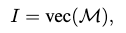

where $$\text{vec}(\mathcal{M})$$ is vectorization.

The pelvis goal is supplied as the goal-reaching feature:
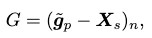

where $$\tilde{\mathbf{g}}_p \in \mathbb{R}^{M \times 67 \times 3}$$ is the target pelvis location relative to the body-centered coordinate in the past $$M$$ frames. $$G$$ computes the normalized vectors pointing from each marker to the pelvis goal in the past $$M$$ frames.

### Interaction Variant
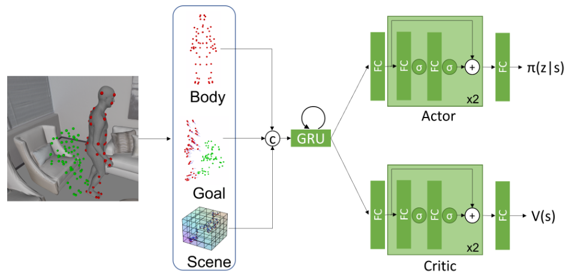

Our objectives in interaction synthesis are:
1. generate an interaction motion sequence fitting to an appropriate interaction guidance.
2. avoid scene-object penetration as much as possible during interaction.

According to assumption 6.3, we only focus on synthesizing `sit` and `lie down` interactions. However, to enable natural transition between locomotion and interaction, we additionally assign the `stand up` task to the learning objective of the interaction policy.

#### Reward to Guide Objective 1
**What's a good guidance goal for interaction synthesis?** DIMOS answers with assumption 3.1 and **preprocesses** the semantic action-object instructions into the **static pose instructions** via COINS.

This process can be viewed as a homologous **prompt learning** problem solved by [OOHMG](/surveys/2023-10-16-OOHMG.html), where the textual description is mapped to a pose first to facilitate motion synthesis, albeit with the additional scene perception as condition, and closed-vocabulary.

The pose guidance is then used to fill the goal-reaching reward:
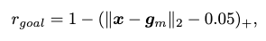

where $$\mathbf{x}$$ is the set of final-frame body markers from the generated motion, and $$\mathbf{g}_m$$ is the set of goal body markers extracted from the generation of COINS.

#### Reward to Guide Objective 2
According to assumption 3.2, an SDF can be drawn on the scene-object surfaces to indicate penetration of scene-objects by the agent. By evaluating the SDF at each human body vertex and discouraging negative values, we can discourage penetration.

We can then fill the penetration-avoidance reward as:
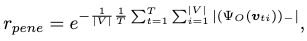

with an exponential falloff, where
1. $$\Psi_O(\mathbf{\upsilon}_{ti})$$ is the SDF evaluation at human body vertex $$\upsilon_{ti}$$ at frame $$t$$ and index $$i$$.
2. $$\vert V \vert$$ is the total number of body vertices.
3. $$T=10$$ is the total number of frames for the generated motion clip.

#### State Features
To supply reasonable scene perception information to the policy model, the person-scene interaction feature is formulated as:
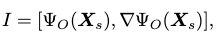

where $$\Psi_O \in \mathbb{R}^{M \times 67}$$ are the SDF values evaluated on body markers in the past $$M$$ frames, and $$\nabla\Psi_O \in \mathbb{R}^{M \times 201}$$ are the gradients of these values.

To supply reasonable goal information to the policy model, the goal-reaching feature is formulated as:
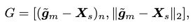

where $$\tilde{\mathbf{g}}_m \in \mathbb{R}^{M \times 67 \times 3}$$ are the broadcasted goal body markers to the past $$M$$ frames' synthetic markers.

## Extensions
---

### Training
We train the motion generative model with motion capture clips from both SAMP and AMASS datasets. Each motion sequence is first subsampled to 40 FPS and then split into 10-frame and 100-frame clips. Specifically, we select AMASS motions with `sit` or `lie` annotations from BABEL, and all data in SAMP.

**We observe that the incorporation of AMASS data is the key to learn good interaction policies.**

### Performance

#### Locomotion Synthesis
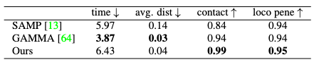

Compared to SAMP and GAMMA, DIMOS achieves superior performance in foot contact scores and penetration avoidance. It's comparable to GAMMA in average distance travelled, but much poorer than GAMMA and SAMP in time consumption.

This indicates that DIMOS learns **more conservative** locomotions than both baselines, mostly attributed to the effort of the policies to avoid scene-object collision.

This "tiptoeing" behavior of DIMOS stands in contrast with the "rushing" behavior of GAMMA. However, we should ask the additional question: **is it best to have a fixed conservation score?**

In real life, a human can either decide to rush over scene objects or tiptoe around them. Moreover, this decision is largely correlated with the different properties of the scene objects:

1. You would "penetrate" low-weight objects that are not fixed to the ground, e.g. cardboxes, if you are in a hurry. The same behavior is impossible to be performed on a sofa.

2. You would take care to tiptoe near breakable objects, such as vases, but not near a sofa.

3. You would always penetrate a door (its very definition is penetrable), and whenever that happens an interaction of opening door should also be synthesized.

It's an interesting direction to explore regarding how to make the policies consider conservativeness, conditioned on the scene object features.

#### Interaction Synthesis
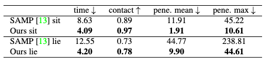

Two types of interactions, `sit` and `lie`, are compared against SAMP for interaction synthesis performance. DIMOS shows a superior performance with large margins compared to SAMP.

It should also be noted that DIMOS can complete the interactions much faster than SAMP, mainly due to its interaction policies' capability to **generalize to random body initialization (locations and orientations) and novel objects of various shapes**.

#### Synthesizing Interaction Sequences in 3D Scene
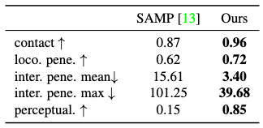

DIMOS can be used to synthesize combined sequence of alternating locomotions and interactions of a human agent in a virtual environment. It's observed that DIMOS achieves superior performance with large margins over SAMP in these tasks.

It is especially worth noticing that the user preference (perceptual score) tends to lean heavily towards DIMOS, suggesting that it has made significant advances in qualitative performance.

### Ablations
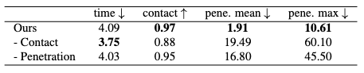

The removal of penetration-avoidance reward has resulted in a significant degradation in penetration performance, as expected from our assumption.

The removal of foot contact reward has degraded penetration and contact performance and produced visual artifacts. However, interaction time has been reduced due to the loosen requirement for conservation.

