[X. Cao et al., “A Survey of Learning on Small Data: Generalization, Optimization, and Challenge.” arXiv, Jun. 06, 2023. doi: 10.48550/arXiv.2207.14443.](https://arxiv.org/abs/2207.14443)

## Outline
---
<a href="attachment/734f54cba7f04bc26dcdb6f5916f0fa1.png">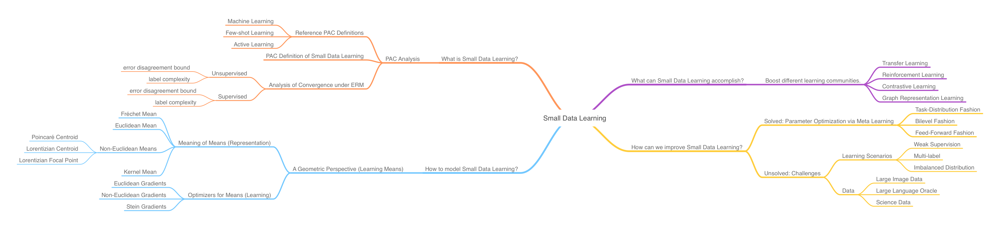</a>

Current machine learning models have thrived on big data, but humans learn just as efficiently with small data. Investigating machine's capability of learning on small data, therefore, becomes a crucial task in advancing towards artificial intelligence.

### Top-down Perspectives
There are two interesting questions for small data learning from a top-down view:
1. What is small data learning?
2. How to conduct small data learning?

To answer question 1, this survey attempts to provide a formal definition of learning on small data within an **active sampling learning scenario** under a **probably approximately correct (PAC) framework**. We then provide an analysis of the defined small data learning in terms of its **generalization error bound** and **label complexity bound** within PAC.

We approach question 2 from a novel **geometric perspective**. Specifically, we frame the small data learning process as optimizing appropriate **means** in an appropriate geometric space for a task. Naturally, we need to ask the following subproblems:
1. given a particular geometric space, what can be a good definition of the mean of its data, i.e. **what's the meaning of mean**?
2. given a set of data in this space, **how to find its mean**?

It should be noted that the "appropriateness" assumed for choosing the geometric model depends on the different structures of the data involved in a specific task. We stress on the many-to-one relationship here because cross-domain tasks frequently need to travel between these geometries.

### Bottom-up Perspectives
We also ask two questions from a bottom-up view:
1. What can small data learning accomplish for current learning researches?
2. How can current small data learning methods be improved?

We provide a kickstart for question 1 by considering four current learning communities:
1. transfer learning.
2. reinforcement learning.
3. contrastive learning.
4. graph representation learning.

We enumerate the various boosts small data learning can contribute to these communities' current models.

Next, we answer question 2 by first looking at meta learning, which offers an optimization of the parameter update policies existent for small data learning. Essentially, small data learning can combine its "data-efficiency" with the "task-efficiency" from meta learning, trying to obtain the best from both worlds. After all, human learning can achieve both features.

Finally, we pose several unresolved subproblems for question 2 in terms of challenging learning scenarios and data. Solving any of these subproblems can help us answer question 2 with more confidence.

With the outline drawn, we can describe our investigations for the four questions in details below.

## What is small data learning?
---
We provide a definition of small data learning in view of a PAC framework. Specifically, we focus on small data learning in an active sampling scenario, and provide an analysis of the error bound and label complexity of both the supervised and unsupervised variants of this process.

### Preliminaries
We need to provide some preliminary discussions before deriving our definition, from related learning concepts.

First, we need to declare the PAC framework we are using throughout the analysis of machine learning concepts.

Next, we warm up with the definitions of machine learning, few-shot learning and active learning and gradually lead you towards the actual definition of small data learning, as it's foreshadowed by these warm-up definitions.

#### PAC Framework
The mathematical analysis of machine learning can be conducted in a probably approximately correct manner. The idea is that any learning process can be viewed as **converging to an optimal generalization hypothesis from a candidate hypothesis class** by observing the received data and annotations. As a simplifying term, we call this **hypothesis pruning**.

The optimality of the generalization hypothesis is defined s.t. the hypothesis **approximately properly describes the probability distribution of unseen samples**.

The analysis of any machine learning process can then be framed as an analysis of its convergence behavior, usually in terms of deriving the following mathematical statements:
1. the **computational complexity** of converging to an optimal hypothesis.
2. the **generalization error** of the obtained hypothesis.
3. the **Vapnik-Chervonenki (VC) dimension** of the obtained hypothesis.

These statements are usually given in terms of inequality bounds with reasonable assumptions of the learning process.

In the following sections we have included active learning under analysis in the PAC framework. However, it should be noted that active learning is actually **different from PAC learning processes** by definition: it controls its own hypothesis pruning process to receive **fewer observations**, whereby PAC learners passively assume a constant set of observations.

Nevertheless, we can assume a constant observation set for active learners under the context that these observations always lead to non-null hypothesis updates. This way, we can talk about active learning in terms of PCA. We will not repeat ourselves on this assumption in the rest of this discussion.

#### Training (Hypothesis Pruning)
A training set $$\mathcal{X}$$ is given **in full** by $$n$$ samples associated with $$k$$ classes.

We denote the **model-agnostic** convergence (training) process as a function $$N(\mathcal{H}, m, k, \mathcal{A})$$, where $$\mathcal{H}$$ is the candidate hypothesis class, and $$\mathcal{A}$$ is the learning algorithm.

#### PAC Analysis on Few-shot and Active Learners
We can obtain the following definitions for different learners:

| Learner            | Hypothesis Space VC Bound | Safety Uniform Bound                                                 | Non-null Hypothesis Subspace VC Bound   | Comment                                        |
| ------------------ | ------------------------- | -------------------------------------------------------------------- | --------------------------------------- | ---------------------------------------------- |
| Machine Learning   | $$\mathcal{O}(2^n)$$        | $$N(\mathcal{H}, m, k, \mathcal{A}) \geq \mathcal{O}(\frac{k-1}{k}n)$$ | $$\mathcal{O}(2^n - 2^{\frac{k-1}{k}n})$$ | $$\eta \approx \frac{n}{k}$$                     |
| Few-shot Learning  | $$\mathcal{O}(2^n)$$        | $$N(\mathcal{H}, m, k, \mathcal{A}) \geq \mathcal{O}(n - \eta)$$       | $$\mathcal{O}(2^n - 2^{\eta})$$           | $$\eta \ll \frac{n}{k}$$                         |
| One-shot Learning  | $$\mathcal{O}(2^n)$$        | $$N(\mathcal{H}, m, k, \mathcal{A}) \geq \mathcal{O}(n)$$              | $$\mathcal{O}(2^n)$$                      | $$\eta = 1$$                                     |
| Zero-shot Learning | $$\mathcal{O}(2^n)$$        | N.A.                                                                 | N.A.                                    | $$\eta=0$$, pruning cannot converge.             |
| Active Learning    | $$\mathcal{O}(2^n)$$        | $$\mathcal{O}(1)$$                                                     | $$\mathcal{O}(2^\mathcal{Q})$$            | $$\mathcal{Q}$$ is the querying budget (rounds). | 

A **VC dimension bound** of $$\mathcal{H}$$ describes the volume of the hypothesis space, which in turn describes the **computational complexity** of hypothesis pruning.

A **VC dimension bound of the non-null hypothesis subspace** of $$\mathcal{H}$$ describes the volume of the non-null hypothesis subspace, which in turn describes the **computational complexity** of non-null hypothesis pruning.

A **safety uniform bound** of $$N$$ describes **the expected complexity costed by the hypothesis-pruning to converge into a non-null hypothesis**. It's formulated by the following considerations:
1. A non-null hypothesis requires the the training samples to **cover all label categories**.
2. Any class has at least $$\eta$$ data, this gives us the possibilities of choosing $$\eta=1, 2, \cdots, \frac{n}{k}$$ for different learning scenarios.

For active learning, the safety uniform bound is $$\mathcal{O}(1)$$ because the hypothesis pruning is controlled by humans, and **always updates towards a non-null hypothesis**. However, the querying budget for humans is limited in that we can only conduct $$\mathcal{Q}$$ rounds of querying from $$\mathcal{X}$$.

#### Total Loss in Active Learning
An error disagreement coefficient is used to guide the hypothesis pruning process for active learning.

Suppose the loss of mapping $$\mathcal{X}$$ to $$\mathcal{Y}$$ in a multi-class context is $$\ell(\cdot, \cdot)$$. An active learner querying humans for $$\mathcal{Q}$$ rounds generates a **total loss (learning risk)** of

$$R\left( h_{\mathcal{Q} }\right)  =\sum^{\mathcal{Q} }_{i=1} \frac{q_{t}}{p_{i}} \ell \left( h\left( x_{t}\right)  ,y_{t}\right)  ,$$

where
1. $$h_\mathcal{Q} \in \mathcal{H}$$ is the current hypothesis at time $$t$$ (spanning the rounds).
2. $$y_t$$ is the label of $$x_t$$.
3. $$q_t$$ follows a Bernoulli distribution and indicates the consideration of $$x_t$$.
4. $$\frac{1}{p_i}$$ is the weight of sampling $$x_t$$ in this round.

#### Error Disagreement in Active Learning
If the optimal hypothesis is $$h^\ast$$, then the **error disagreement**. which is a constant coefficient, can be formulated as:
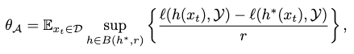

where
1. $$\mathcal{D}$$ is the marginal distribution over $$\mathcal{X}$$, from which we draw $$x_t$$ and, consequently, our candidate hypotheses.
2. $$B\left( h^{\ast },r\right)  =\left\{ h^{\ast }\in \mathcal{H} :\Pr_{x\sim \mathcal{D} } \left[ h\left( x\right)  \neq h^{\ast }\left( x\right)  \right]  \leq r\right\}$$ is the **hypothesis ball** centered around $$h^\ast$$ with radius $$r$$, s.t. $$r \geq \text{err}_\mathcal{D}(h^\ast)+\epsilon$$ is the tolerable error made by $$h^\ast$$.

As a result, many active learning schemes aim to shrink $$\mathcal{D}$$ s.t. the complexity of hypothesis-pruning can be reduced.

#### Hypothesis Disagreement and Sample Selection
To compare two hypotheses, one could draw a pseudo distance between them as the **best-in-class error** on $$\mathcal{Y}$$:
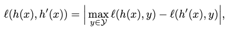

or alternatively, as all-in-class error, error entropy and so on.

The point is, we can now judge **whether a hypothesis update by considering whether $$x_t$$ is significant**, by comparing $$\ell(h, h^\prime)$$ with $$\theta_\mathcal{A}$$. Once the former is greater, we should solicit $$x_t$$ into our learning as a significant update.

### Small Data Learning
We put small data learning in an **active sampling context** similar to active learning.

#### Definition from a PAC Perspective
Suppose the generalization error of any hypothesis is $$err(h)$$. If after $$\mathcal{Q}$$ rounds of sampling, $$err(h)$$ converges into its **optimal error** with a probability of $$1-\delta$$, then there exists an upper bound of

$$err\left( h\right)  +c\left( \frac{1}{\mathcal{Q} } \left( d\log \mathcal{Q} +\log \frac{1}{\delta } \right)  +\sqrt{\frac{err\left( h\right)  }{\mathcal{Q} } \mathcal{Q} \left( d\log \mathcal{Q} +\log \frac{1}{\delta } \right)  } \right)  ,$$

for the optimal error, where $$d$$ is the VC dimension of $$\mathcal{H}$$.

We can then define small data learning as the process of approximating the optimal hypothesis $$h^\ast$$ by learning small data from $$\mathcal{D}$$ over $$\mathcal{Q}$$ rounds of sampling s.t. its generalization error is updated as:
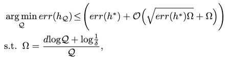

where $$h_\mathcal{Q}$$ is our updated hypothesis pruned from small data learning. You can also think of $$h^\ast$$ as the optimal hypothesis pruned from big data learning.

##### Label Complexity
If we relax the constant $$c$$ and $$err(h)$$ from the error upper bound above, the label complexity of any learner after $$\mathcal{Q}$$ rounds has an upper bound as
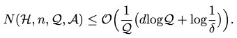

Specifically, if we employ the same error disagreement coefficient $$\theta_\mathcal{A}$$ to update the pruning process, then a **tighter** upper bound follows:
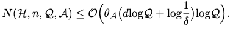

#### Learning Small Data with ERM
If we imbue small data learning with the objective of **empirical risk minimization (ERM)**, then our general definition of small data learning can be solidified to consider all sorts of loss functions in real models.

With the loss function, we obtain a **bound of the label complexity** for both **supervised and unsupervised** small data learning, assuming that we control the hypothesis pruning with error disagreement coefficient.

#### Lemma from Importance Weighted Active Learning (IWAL)
To investigate the bound of label complexity of a small data learner's update hypothesis $$h_\mathcal{Q}$$ w.r.t. the optimal hypothesis $$h^\ast$$, we need to derive bound of their error disagreement first. To derive the error disagreement bound, we need to relate it with **hypothesis disagreement bound** between these two hypotheses, which lets us incorporate real-world loss functions.

This relationship can be formulated **assuming an importance-weighted active sampling context**, as a lemma from IWAL.

Let $$R(h)$$ be the expected loss (learning risk) of $$h$$ s.t. $$R(h)=\mathbb{E}_{x \sim \mathcal{D}}[\ell(h(x), y)]$$, then $$R(h^\ast)$$ is the minimum of this loss.

We can then bound the hypothesis disagreement as

$$\ell \left( h_{\mathcal{Q} },h^{\ast }\right)  \leq R\left( h_{\mathcal{Q} }\right)  -R\left( h^{\ast }\right),$$

where we bound the hypothesis subspace $$\mathcal{H}_{\mathcal{Q}}$$ updated from the previous subspace $$\mathcal{H}_{\mathcal{Q}-1}$$ by stipulating $$R(h_\mathcal{Q})$$ as

$$\mathcal{H}_{\mathcal{Q} } :=\left\{ h\in \mathcal{H}_{\mathcal{Q} -1} :R\left( h_{\mathcal{Q} }\right)  \leq R\left( h^{\ast }\right)  +2\Delta_{\mathcal{Q} -1} \right\}  ,$$

where the importance weights are incorporated as

$$\Delta_{\mathcal{Q} -1} =\frac{1}{\mathcal{Q} -1} \left[ \sqrt{\left[ \sum^{\mathcal{Q} -1}_{s=1} p_{s}\right]  \log \left[ \frac{\left( \mathcal{Q} -1\right)  \left\vert \mathcal{H} \right\vert  }{\delta } \right]  } +\log \left[ \frac{\left( \mathcal{Q} -1\right)  \left\vert \mathcal{H} \right\vert  }{\delta } \right]  \right]  ,$$

where $$\left\vert \mathcal{H} \right\vert$$ is the total number of hypotheses in $$\mathcal{H}$$ and $$\delta > 0$$ is the probability threshold of non-convergence.

Now, since $$\sum^{\mathcal{Q} -1}_{s=1} p_{s} \leq \mathcal{Q}-1$$, we can relax the bound into a cruder form as

$$\Delta_{\mathcal{Q} -1} =\sqrt{\frac{2}{\mathcal{Q} -1} \log \left( 2\mathcal{Q} \left( \mathcal{Q} -1\right)  \frac{\left| \mathcal{H} \right|^{2}  }{\delta } \right)  } ,$$

and finally there is the full relationship:

$$\ell \left( h_{\mathcal{Q} },h^{\ast }\right)  \leq R\left( h_{\mathcal{Q} }\right)  -R\left( h^{\ast }\right)  \leq 2\Delta_{\mathcal{Q} -1} .$$

#### Supervised Small Data Learning

##### Error Disagreement Bound
With the lemma above to set our updated hypothesis $$h_\mathcal{Q}$$, and a probability of at least $$1-\delta$$, we can bound our error disagreement as
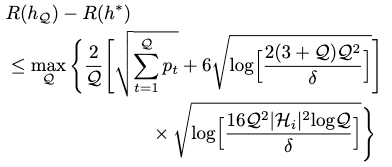

##### Label Complexity
With a probability of $$1-2\delta$$, the label complexity can be bound by
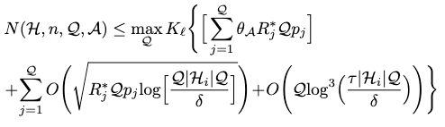

where $$K_\ell$$ is the **slope asymmetry** w.r.t. the loss $$\ell$$:

$$K_{\ell }=\sup_{x^{\prime }_{t},\  x_{t}\in \mathcal{D} } \left| \frac{\max \ell \left( h\left( x_{t}\right)  ,\mathcal{Y} \right)  -\ell \left( h\left( x^{\prime }_{t}\right)  ,\mathcal{Y} \right)  }{\min \ell \left( h\left( x_{t}\right)  ,\mathcal{Y} \right)  -\ell \left( h\left( x^{\prime }_{t}\right)  ,\mathcal{Y} \right)  } \right|  ,$$

and $$R_j^\ast$$ is the best-in-class risk at $$j$$ round of querying.

#### Unsupervised Small Data Learning
In unsupervised small data learning, the task is to cluster the input dataset $$\mathcal{X}$$ into $$k$$ clusters $$\{ \mathcal{B}_1, \cdots, \mathcal{B}_k \}$$. As such, our learning task becomes performing IWAL on any cluster $$\mathcal{B}_i$$.

##### Error Disagreement Bound
The error disagreement coefficient then switches from sampling $$\mathcal{D}$$ to $$\mathcal{B}_i$$:
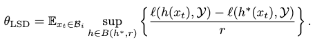

Assuming that each cluster $$\mathcal{B}_i$$ is given $$\tau=T/k$$ rounds of sampling, with a probability of $$1-\delta$$, we can bound the error disagreement as
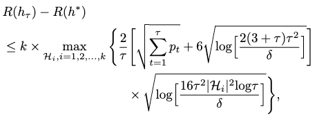

where $$h_\tau$$ is our updated hypothesis from IWAL after $$\tau$$ rounds of querying.

##### Label Complexity
With a probability of $$1-2\delta$$, the label complexity can be bounded as
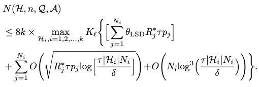

### Conclusion
We have formulated the definition of small data learning under a PAC framework with the content above, as a hypothesis pruning process controlled by an active sampling scheme associated with an error disagreement coefficient.

By relating our definition to learning under an ERM setting, we have analyzed small data learning with a scheme similar to IWAL, and derived its label complexity in the supervised and unsupervised contexts. Under this setting, small data learning can be implemented with typical real-world models and their losses, such as those from **active learning, few-shot learning and deep clustering**.

## How to conduct small data learning?
---
There are many perspectives one can take in describing a learning process. In our case, a novel **geometric perspective** is adopted to describe the small data learning process.

Specifically, a small data efficiently summarizing a "big data" can be represented as taking the **mean** of the underlying big data distribution. The learning of small data can then be modeled as an optimization process to search for this mean.

Now our question transforms to: **what does mean mean?**

For data with different structures (defined by statistical goals) and distributions, thereby described in different geometric spaces, the definitions of mean are very different. We introduce you to several means commonly encountered in small data learning. Then we provide you with several gradient-based optimization solvers to compute these means.

Coupling the mean definitions and their optimization solvers, the small data learning process is fully described under this geometric perspective.

### Means in Different Geometric Spaces

#### Fréchet Mean
When the data exists in a **set without a vector structure**, e.g. on a manifold or a metric space, the Fréchet mean emerges as its concept of mean.

By its definition, a Fréchet mean has some advantages:
1. it provides a **summarizing construction** for many well-known notions of mean, and thus describes interesting properties of data.
2. it provides the notion of mean in spaces with less structures than Euclidean space, thus allowing the adoption of many machine learning methods that depend on a notion of mean to function in these spaces.

##### Fréchet Mean On Probability Measures
In a distance space $$(\mathcal{X}, d_\mathcal{X})$$, if $$\mathbb{P}(x)$$ is a probability measure on $$\mathcal{X}$$ with finite integration over all possible distances, then the Fréchet mean for this space is defined as

$$\mu_{\mathcal{X} } =\arg \min_{\mu \in \mathcal{X} } \int d^{2}_{\mathcal{X} }\left( x,\mu \right)  \ d\mathbb{P} \left( x\right)  .$$

Essentially, the mean is a "centroid" minimizing the sum of distances towards its neighbors.

##### Fréchet Mean On Riemannian Manifold
Consider a Riemannian manifold $$\mathcal{M}$$ with a metric $$g_x(\cdot, \cdot)$$ that respects the following mapping rules:

$$\mathcal{T}_{x} \mathcal{M} \times \mathcal{T}_{x} \mathcal{M} \rightarrow \mathbb{R}^{n} ,\left| \left| v\right|  \right|_{g}  =\sqrt{g_{x}\left( v,v\right)  } ,$$

where $$\mathcal{T}_{x}\mathcal{M}$$ is the tangent space of this manifold.

Now, the notion of distance on a Riemannian manifold is defined as

$$d_{\mathcal{M} }\left( x,y\right)  =\inf \int^{b}_{a} \left| \left| \gamma^{\prime } \left( t\right)  \right|  \right|_{g}  dt,$$

where $$\gamma(t)$$ is any geodesic that connects $$x$$ and $$y$$ s.t. $$\gamma(a)=x$$, $$\gamma(b)=y$$.

Now, if you have your data as a set of $$m$$ points as $$x_i \in \mathcal{X}$$ with a probability measure of each as $$\frac{1}{m}$$, then the **weighted** Fréchet mean on this manifold can be found as

$$\mu_{\mathcal{M} } =\arg \min_{\mu \in \mathcal{M} } \sum^{m}_{i=1} w_{i}d^{2}_{\mathcal{M} }\left( x_{i},\mu \right)  ,$$

where $$w_i$$ is the weight of each point.

Immediately, if you fix $$d_{\mathcal{M} }\left( a,b\right)  =\left\vert \left\vert a-b\right\vert  \right\vert_{2}$$ (as the euclidean distance) and $$w_i=\frac{1}{m}$$ for all $$i$$, you would simplify the weighted Fréchet mean into the Euclidean mean.

#### Euclidean Mean
The Euclidean mean is the most common mean machine learning uses. It's also heavily involved in **aggregation operations** such as attention and batch normalization.

The Euclidean distance is defined on a zero-curvature Euclidean (Riemannian) manifold $$\mathcal{R}^n$$ as

$$d_{\mathcal{R} }\left( x,y\right)  =\left| \left| x-y\right|  \right|_{2}  .$$

Since the distance space $$(\mathcal{R}^n, d_\mathcal{R})$$ is **complete**, its weighted Fréchet mean has a **closed form solution**:

$$\mu_{\mathcal{R} } =\min_{\mu \in \mathcal{R}^{n} } \sum^{m}_{i=1} w_{i}d^{2}_{\mathcal{R} }\left( x_{i},\mu \right)  =\frac{1}{m} \sum^{m}_{i=1} x_{i},$$

with $$w_i=\frac{1}{m}$$ assumed for all $$i$$.

#### Non-Euclidean Mean
It is demonstrated that **hyperbolic geometry** has stronger expressive capacity than Euclidean in **modeling hierarchical features**. We discuss the notions of mean for two hyperbolic geometric models, the Poincaré and Lorentzian models, by solidifying the weighted Fréchet mean on Riemannian manifold towards them.

##### Poincaré Centroid
The Poincaré ball model with constant negative curvature can be expressed in Riemannian manifold as $$(\mathcal{P}^n, g_x^\mathcal{P})$$, where $$\mathcal{P}^n$$ is an **open unit ball** in the euclidean sense.

The Poincaré metric is defined as $$g_x^\mathcal{P} = \lambda_x^2 g^E$$, where $$\lambda_x=\frac{2}{1-\left\vert \left\vert x \right\vert \right\vert^2}$$ is the conformal factor and $$g^E$$ is the euclidean metric.

The Poincaré distance is given as the hyperbolic distance of the unique curve that connects $$\mathbf{x}, \mathbf{y}$$:
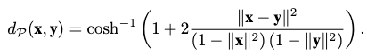

With $$(\mathcal{P}^n, d_\mathcal{P})$$ as a distance space, we can now derive the notion of mean in a Poincaré ball as a **Poincaré centroid** following the weighted Fréchet mean:
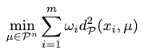

It turns out we don't have a closed-form solution for obtaining the Poincaré centroid, and must adopt iterative optimizers such as gradient descent.

To model hierarchical relationships between embedding vectors, we need to express the following distance features in their geometric space:

1. the child vector should have a close distance to its parent vector.
2. vectors of different parents should have a far distance from each other.

If you implement these distance features in a euclidean space by spreading the branches out like a snowflake, you will soon find that you are running out of space **exponentially** fast. This is because at each level you are creating space with a rate of $$L^N$$, where $$L$$ is the number of hierarchical levels and $$N$$ is the dimensionality, but you are using space with a rate of $$b^L$$, where $$b$$ is the branching factor. Obviously we don't want this: you need very high-dimensional embeddings to avoid the space choke and express complex hierarchical information with a lot of levels and branching.

If you implement them in Poincaré space, however, you have an exponential growth of hyperbolic distance between two points with equal euclidean distance when you get away from the hyperbolic center. Therefore, if you put the roots near the hyperbolic center and expand the children towards the circumference of the Poincaré ball, you would experience an exponential increase of space advancing through the levels. This means you can express the hierarchical embeddings with much fewer dimensions than in Euclidean space.

Such hierarchical embeddings are the so-called Poincaré embeddings. You can learn them via gradient descent (unfortunately no closed-form formula is around to arrange them like you would arrange euclidean embeddings). See [this paper](https://arxiv.org/pdf/1705.08039.pdf) for details. Spoiler: it produces very powerful performance boosts on link reconstruction and prediction tasks!

##### Lorentzian Centroid
The Lorentz model $$\mathcal{L}^n$$ with constant curvature $$-1/K$$ **avoids the numerical instabilities introduced by the fraction from Poincaré metric**.

In terms of Riemannian manifold, a Lorentz model can be expressed as $$(\mathcal{L}, g_x^\mathcal{L})$$, where

$$\mathcal{L} =\left\{ x\in \mathbb{R}^{n+1} :\left< \mathbf{x} ,\mathbf{y} \right>_{\mathcal{L} }  =-K,x_{0}>0\right\},$$

which is the upper sheet of a two-sheeted $$n$$-dimensional hyperboloid, and the Lorentzian scalar product $$\left< \mathbf{x} ,\mathbf{y} \right>_\mathcal{L}$$ is defined as
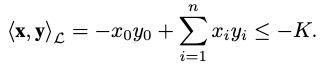

The Lorentz metric is defined as $$g^{\mathcal{L} }_{x}=\text{diag} \left( \left[ -1,1,\cdots ,1\right]  \right)$$.

The squared Lorentz distance is defined as
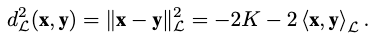

Notice that this distance **doesn't satisfy triangle inequality**.

Therefore, the notion of mean can be solidified as
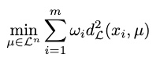

We can also derive a **closed-form solution** of the Lorentz mean as
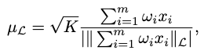

where $$\left\vert \left\vert \left\vert \mathbf{a} \right\vert  \right\vert_{\mathcal{L} }  \right\vert  =\sqrt{\left\vert \left\vert \left\vert \mathbf{a} \right\vert  \right\vert^{2}_{\mathcal{L} }  \right\vert  }$$ is the modulus of the imaginary Lorentzian norm of the positive timelike vector $$\mathbf{a}$$.

##### Lorentzian Focal Point
A Lorentzian focal point extends Lorentzian centroid to better approximate **aspherical distributions**. It minimizes the Lorentzian scalar product instead of the squared Lorentz distance:
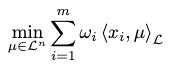

Notably, for a full approximation of the underlying data distributions the Lorentz model is modeling, the weight $$w_i$$ must be controlled besides the curvature $$K$$:
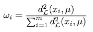

Together, we can approximate a Lorentzian focal point as
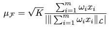

#### Kernel Mean
The **reproducing kernel Hilbert space (RKHS)** has uniqueness in describing the evaluation functional for each $$x \in \mathcal{X}$$ as our data. This uniqueness allows us to express many inter-data-point relationships by **implicitly** modeling the evaluation of each data point with a certain function, which may be expensive or even intractable. Essentially, it offers a generalization of the euclidean space and hyperbolic spaces we have seen.

In other words, you can decompose the "external relationships" from the "internal properties" of your data points and express the former comfortably in an RKHS. For instance, the **kernel trick** is one of such applications where you compute inner product of points in their feature spaces without actually evaluating the feature map function.

Formally, if we represent an RKHS as $$\mathcal{H}$$, then for any $$x \in \mathcal{X}$$, there exists a **unique vector** $$k_x \in \mathcal{H}$$ s.t.

$$f(x) = \left< f, k_x\right> \ \forall f \in \mathcal{H},$$

where $$f$$ is evaluated by a bounded linear functional, $$\left< \cdot, \cdot\right>$$ is the inner product, and $$k_x\equiv K(x, \cdot)$$ is the so-called **reproducing kernel** for point $$x$$, and is proven that $$K(x_1, x_2): \mathcal{X} \times \mathcal{X} \rightarrow \mathbb{R}$$ is positive definite.

The Hilbert distance between any reproducing kernels in $$\mathcal{H}$$ is defined as
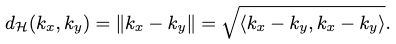

Thus, we can define the notion of mean for an RKHS with the Hilbert distance, from the Fréchet mean by assuming a probability measure $$\mathbb{P}(x)$$ on $$\mathcal{X}$$:
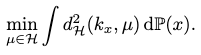

And conveniently, it comes with a **closed-form solution**:
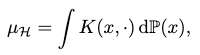

where the second argument of the kernel is free.

### Optimization Solvers for the Mentioned Means

#### Euclidean Gradients (Stochastic Gradient Descent)
In a euclidean space, stochastic gradient descent (SGD) frames the $$\arg \min$$ problem of a euclidean mean as **finding the local minima of a cost function**.

Suppose the cost function is given as $$J(x)$$, then at each learning time (step) $$t$$ the minimizing parameters $$x_t$$ is updated as

$$x_{t+1}=x_{t}-\eta \cdot \nabla_{x} J(x),$$

where $$\eta$$ is the learning rate.

#### Non-Euclidean Gradients (Riemannian Gradient Descent)
To solve the $$\arg \min$$ problems in non-euclidean spaces, we resolve to manifold optimization, where **constrained** optimization problems in euclidean space are transformed into **unconstrained** optimization problems on Riemannian manifolds.

On a Riemannian manifold, Riemannian gradient descent (RGD) is widely adopted for such optimization problems. Given a cost function $$J(x)$$ defined on a Riemannian manifold $$\mathcal{M}$$, $$x_t$$ is updated at learning time $$t$$ to minimize $$J(x)$$ as:

$$x_{t+1}=\exp_{x_{t}} \left( -\eta J^{\prime }\left( x_{t}\right)  \right)  ,$$

where $$\exp_x$$ is the **exponential map**, $$\eta$$ is the learning rate and $$J^\prime(x)$$ is the Riemannian gradient in the tangent space $$\mathcal{T}_x\mathcal{M}$$.

##### Exponential Map
With any Riemannian metric $$g_x(\cdot, \cdot)$$, the inner product of two vectors on the tangent space $$\mathcal{T}_x\mathcal{M}$$ is computed as $$\left< u, v \right> = g_x(u, v)$$.

Suppose there is a unique geodesic $$\gamma$$ for each point $$x \in \mathcal{M}$$ s.t.

$$\gamma :\left[ 0,1\right]  \rightarrow \mathcal{M} ,\  \gamma (0)=x,\  \gamma^{\prime } =u.$$

Then the exponential map $$\exp_x$$ of $$x$$ is defined as:

$$\exp_{x} :\mathcal{T}_{x} \mathcal{M} \rightarrow \mathcal{M} ,\  \exp_{x} \left( u\right)  =\gamma \left( 1\right)  .$$

Essentially, it serves to map any tangent vector in a point's tangent space back to the underlying Riemannian manifold. In our case, this mapping helps us to descent $$x$$ on the manifold in the tangent gradient vector's direction, respecting its underlying Riemannian geometry.

##### Exponential Map in Poincaré Space
This can be computed as
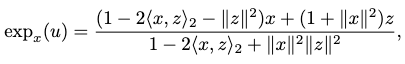

where $$z=\tanh \left( \frac{\left\vert \left\vert u\right\vert  \right\vert^{2}  }{1+\left\vert \left\vert x\right\vert  \right\vert^{2}  } \right)  \frac{u}{\left\vert \left\vert u\right\vert  \right\vert  }$$.

##### Exponential Map in Lorentz Space
This can be computed as
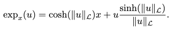

#### Stein Gradients
The Stein variational gradient descent (SVGD) is a **variational inference** routine that minimizes the KL divergence of two probability distributions. We discuss it as a general approach to solve for the means defined in both the euclidean and hyperbolic spaces. Alternatively, you can view it as a gradient solver for the kernel mean.

The rationale is that in variational inference, the target distribution is approximated by optimizing a parameterized distribution, via sampling the intractable variables in the target distribution. In our geometric perspective, the samples are data points, and the parameters of the our approximant distribution can be viewed as kernel means where the kernel function is arbitrarily decided by the PDF of our approximant.

##### Motivation
Formally, the minimization objective of a variational inference is given as
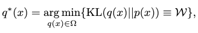

where $$q^\ast(x)$$ is our desired approximant distribution towards $$p(x)$$.

The KL divergence $$\mathcal{W}$$ is computed as

$$\mathbb{E}_{q} \left[ \log q(x)\right]  -\mathbb{E} \left[ \log \bar{p} \left( x\right)  \right]  +\log Z,$$

where if we assume the inference is conducted in a **Markov chain Monte Carlo (MCMC)** manner, with $$\{D_i\}$$ as a set of i.i.d. observations, and $$p_0(x)$$ as the prior distribution, then

$$\bar{p} \left( x\right)  =p_{0}(x)\prod^{N}_{i=1} p\left( D_{i}\vert x\right)  ,\  Z=\int \bar{p} \left( x\right)  dx.$$

It can immediately be seen that computation of the normalization constant $$Z$$ is complex, and under some circumstances intractable.

Thus, to circumvent computing any $$Z$$, the SVGD is proposed.

##### SVGD
SVGD is based on Stein's method. The rough idea is that the discrepancy of two distributions can be measured by the extent of their violation of the Stein identity. This discrepancy is the so-called Stein discrepancy (SD). Since the vanilla SD is intractable to compute, we compute a kernelized Stein discrepancy (KSD) instead. The minimization of KL divergence by changing $$q(x)$$ is then proposed as finding an proper variable transform function $$T$$ from $$q\left( T^{-1}(r) \right), T(x)=r$$ that offers the steepest descent direction pointed out by KSD during each learning step.

We explain this process in details next.

###### Stein Identity
Given the following ingredients:
1. a smooth density $$p(x)$$ with a continuous $$x$$ **sampled** from $$\mathcal{X} \subseteq \mathbb{R}^n$$,
2. a smooth vector function $$\varphi \left( x\right)  =\left[ \varphi_{1} \left( x\right)  ,\cdots ,\varphi_{n} \left( x\right)  \right]^{\top }$$,

the Stein identity is defined as
$$\mathbb{E}_{x \sim p} \left[ A_{p}\varphi \left( x\right)  \right]  =0,$$

where $$A_q$$ is the Stein operator s.t.
$$A_{p}\varphi \left( x\right)  = \nabla_{x} \log p\left( x\right) \ \varphi \left( x\right) ^\top  +\nabla_{x} \varphi \left( x\right)  ,$$

where $$\nabla_{x} \log p\left( x\right)$$ is the Stein score function of $$p(x)$$.

This indicates when our approximation distribution $$q$$ is identical to $$p$$, we should always reach Stein's identity as $$\mathbb{E}_{x \sim p} \left[ A_{q}\varphi \left( x\right)  \right] =0$$ (notice it's $$A_q$$ now!).

###### Classic Stein Discrepancy
The discrepancy between $$p$$ and $$q$$ can be described as the maximization of the violation of Stein's identity, following the deduction above.

First, **we want this discrepancy as a scalar**. This can be achieved by taking the trace of the Stein operation w.r.t. $$\varphi(x)$$:

$$\mathbb{E}_{p} \left[ \text{trace} \left( A_{q}\varphi \left( x\right)  \right)  \right]  =\mathbb{E}_{p} \left[ \left( \nabla_{x} \log q\left( x\right)  -\nabla_{x} \log p\left( x\right)  \right)^{\top }  \varphi \left( x\right)  \right]  .$$

Then the maximization is conducted by considered all possible $$\varphi \in \mathcal{F}$$:

$$\text{SD} \left( q,p\right)  =\max_{\varphi \in \mathcal{F} } \left\{ \left[ \mathbb{E}_{p} \left[ \text{trace} \left( A_{q}\varphi \right)  \right]  \right]^{2}  \right\} ,$$

where $$\mathcal{F}$$ is a set of smooth functions with bounded Lipschitz norms.

However, the functional optimization problem, when posed in $$\mathcal{F}$$, is **computationally intractable**. Thus, the Stein discrepancy (before KSD) was rarely employed in machine learning, unless you are willing to enforce this smoothness constraint of $$\varphi$$ on only a finite number of points in $$\mathcal{X}$$, reducing $$\mathcal{F}$$ to some tractable local space that could be searched via linear programming.

###### Kernelized Stein Discrepancy
Instead of searching $$\mathcal{F}$$ for the optimized functional, we maximize $$\varphi$$ in a **unit ball of a RKHS** $$\mathcal{H}$$ as

$$\text{KSD} \left( q,p\right)  =\max_{\varphi \in \mathcal{H} } \left\{ \left[ \mathbb{E}_{x\sim q} \left( \text{trace} \left( A_{q}\varphi \right)  \right)  \right]^{2}  \right\}  ,\  \left| \left| \varphi \right|  \right|_{\mathcal{H} }  \leq 1.$$

This gives us a tractable optimal solution $$\varphi(x)$$ as

$$\varphi \left( x\right)  =\frac{\varphi^{\ast }_{q,p} \left( x\right)  }{\left| \left| \varphi^{\ast }_{q,p} \left( x\right)  \right|  \right|_{\mathcal{H} }  } .$$

Note that in this RKHS an **arbitrary** kernel function is used to express the **optimal gradient descent direction** as $$\varphi^{\ast }_{q,p} \left( x\right)  =\mathbb{E}_{x\sim q} \left[ A_{p}k\left( x,\cdot \right)  \right]$$.

###### Minimizing Gradient Direction in Variational Inference
From a perspective of transform of variables, the goal of variational inference is to approximate the distribution $$q_{[T]}(r)$$ to $$p(x)$$ from a reference distribution $$q_0(x)$$, by applying an inverse smooth transform $$T: \mathcal{X} \rightarrow \mathcal{X}$$ mapping  $$x$$ to $$r$$:

$$q_{\left[ T\right]  }\left( r\right)  =q_{0}\left( \mathcal{R} \right)  \cdot \left| \det \left( \nabla_{r} \mathcal{R} \right)  \right|  ,$$

where $$\mathcal{R}=T^{-1}(r)$$ and $$\nabla_r \mathcal{R}$$ is the Jacobian matrix of $$\mathcal{R}$$.

Then the problem is transformed to finding a proper $$T$$. Normally **many extra restrictions** must be applied on $$T$$ to make the optimization feasible, to name a few:
1. $$T$$ must be a **one-to-one** transform.
2. the corresponding Jacobian matrix of $$T$$ should not be computationally intractable.

These restrictions compromise our solution space for variational inference. Moreover, with some methods such as normalizing flow, it's hard to pick the optimal parameters for $$T$$ with sound reasoning.

In SVGD, the incremental perturbations (gradient descents) guided by KSD are proposed to modify $$T$$ gradually, thus bypassing the above caveats. Each perturbation is proposed as

$$T(x) = x + \epsilon \varphi (x),$$

where $$\varphi$$ is the optimal gradient direction defined by KSD above that minimizes the KL divergence, and $$\epsilon$$ is the descent magnitude.

Let's show why this is indeed the steepest direction that could descend KL divergence. To start with, since $$\text{KL} \left( q_{\left[ T\right]  }\vert \vert p\right)  =\text{KL} \left( q_{0}\vert \vert p_{\left[ T^{-1}\right]  }\right)$$, we have

$$\begin{gathered}\nabla_{\epsilon } \text{KL} \left( q_{0}\vert \vert p_{\left[ T^{-1}\right]  }\right)  =\nabla_{\epsilon } \left[ \int q_{0}\left( x\right)  \log \frac{q_{0}\left( x\right)  }{p_{\left[ T^{-1}\right]  }\left( x\right)  } dx\right]  \\ =-\mathbb{E}_{x\sim q_{0}} \left[ \nabla_{\epsilon } \log \left( p\left( T\left( x\right)  \right)  \cdot \left| \det \left( \nabla_{x} T\left( x\right)  \right)  \right|  \right)  \right]  \\ =-\mathbb{E}_{x\sim q_{0}} \left[ \mathcal{C} +\mathcal{D} \right]  \end{gathered} \ ,$$

where
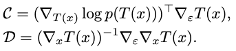

Now, setting $$\epsilon=0$$, you would eventually get

$$\nabla_{\epsilon } \text{KL} \left( q_{\left[ T\right]  }\vert \vert p\right)  \vert_{\epsilon =0} =-\mathbb{E}_{x\sim q_{0}} \left[ \text{trace} \left( A_{q_{0}}\varphi \right)  \right] .$$

Thus, the steepest KL divergence descent direction is found by maximizing the negated RHS, which is exactly the Stein discrepancy. A tractable form of SD as KSD then yields the optimal negative gradient as
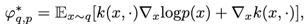

For the case when $$\epsilon=0$$, this simply denotes $$\nabla_{\epsilon } \text{KL} \left( q_{\left[ T\right]  }\vert \vert p\right)  \vert_{\epsilon =0} =-\text{KSD} \left( q,p\right)$$.

##### A Geometric Perspective of SVGD
Consider the following geometric interpretations of SVGD at each iteration $$t$$:
1. initial data particles as $$\left\{ x_i^0 \right\}_{i=1}^m$$.
2. $$p(x)$$ the target distribution.
3. a term $$\vartheta =\nabla_{x^{t}_{j}} \log p\left( x^{t}_{j}\right)$$ denoting the **gradient direction** to descend each point towards the probability density of $$p(x)$$.
4. a term $$\mu \left( x^{t}_{j},x\right)  =\nabla_{x^{t}_{j}} k\left( x^{t}_{j},x\right)$$ denoting the **pushing-way direction** of $$x^t_j$$ from the mass of $$x$$, s.t. the points won't all be attracted into **local modes** (figuratively, centers of blackholes) of $$p(x)$$.

The SVGD process can then be interpreted as kicking each particle with the **empirical mean** of these two directions acting on all available particles as 

$$x_i^t + \epsilon_t \hat{\varphi}^\ast (x) \rightarrow x_i^{t+1},$$

where the empirical mean direction $$\hat{\varphi}^\ast (x)$$ is formulated as
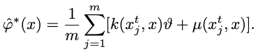

s.t. the descending direction $$\vartheta$$ is also weighted by the kernel function $$k(x^t_j, x)$$, to differentiate the influences from $$x_i^t$$ from different particles (imagine an RBF kernel, where the closer particles' descent directions have more says in this point's direction).

Thus, in the end, you could view our small data learning process in variational learning as representing the target distribution by descending these particles towards it, which serve as our means to describe the underlying data distribution.

## What can small data learning accomplish?
We investigate how small data learning can benefit the current learning communities. To spare you from the details of these communities themselves, which are widely available elsewhere, we only focus on describing the potential benefits introduced by small data learning towards them.

### Transfer Learning
One of the core questions transfer learning asks is: **what cross-domain knowledge can be migrated to improve the performance of models in target domains?**

Several solutions offer this knowledge migration in specific scenarios, but **we are still lacking a general, data-driven modeling of the migration process**. Small data learning could contribute to this process by representing the cross-domain knowledge in a manner that offers
1. **data-efficient** knowledge exploitation.
2. **strong generalization capability** of knowledge to boost target domain models.
3. **pruning of noisy or perturbed data** from the source domains.

We will illustrate each of these points with an example usage of small data learning on specific transfer learning methods. To start with, there exist some popular strategies for transfer learning. They can be categorized as following:
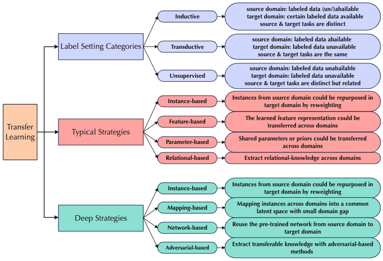

#### Transfer by Instance Re-weighting (Knowledge Exploitation)
Instance re-weighting performs cross-domain knowledge transfer by sampling more frequently on informative instances from the source domain to train the model in the target domain.

In typical instance-based transfer, this re-weighting can be accomplished by consulting significant and informative small data optimized from the source domain. In other words, small data offers an efficient judgement of **which instance is more informative**, i.e. knowledge exploitation, among the knowledge data.

In deep instance-based transfer, we can conduct a similar re-weighting by consulting a deep neural network that learns an efficient representation of this small data.

#### Transfer by Learning Domain-invariant Features (Enhancing Generalization Capability)
Domain-invariant features can also be extracted by small data learning methods. The extra small data representation constraint can **enhance the generalization ability** of both single-domain and cross-domain models dependent on these features.

In deep transfer learning, these enhanced domain-invariant features are applicable to:
1. extracting reusable **partial instances** from the source domain.
2. reusing **pretrained partial networks** from the source-domain model.
3. extracting **transferable representations** applicable to both source and target domain models.

#### Avoiding Negative Transfer (Pruning of Harmful Data)
Not all knowledge transferred from the source domain can be beneficial to the target domain model. By efficiently recognizing harmful knowledge with small data learning, we can efficiently (tractably) reject them during transfer without "creating a big fuss" over the detection process.

### Reinforcement Learning
Reinforcement learning (RL) rewards and punishes actions generated by an agent perceiving an interactive environment to make it "behave well". While the assumptions of many RL works fare well in a controlled environment, they collapse in the real-world setting.

Among these assumptions exists one important challenge: **conduct RL from limited samples in the real world**. Existing RL strategies hold **low sample efficiency**, which means they need large amounts of interactions with the environment to perform properly. Such a sampling policy is rarely allowed in reality.

Small data learning emerges as a novel data-driven solution to a more efficient sampling strategy needed by RL. We consider its potential benefits in the following directions:
1. **valuable prior knowledge** can be extracted from previous interaction data with small data learning, which means we can **pretrain agents** to make them learn more efficiently.
2. the model can obtain **more robustness and generalizability** with the extraction of small data in learning.

We investigate the existing small data learning methods involved in three popular RL strategies: value-based, policy-based and actor-critic.

#### Value-based Strategies
A value-based strategy selects the optimal policy corresponding to a given state by formulating a state-value function as
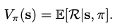

where $$\pi$$ is the policy, $$s$$ the state and $$\mathcal{R}$$ the return.

The optimal policy $$\pi^\ast$$ is selected by maximizing the value function:
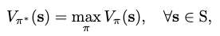

where a greedy search can be conducted on all available actions $$\mathbf{a}$$ at $$\mathbf{s}_t$$ to maximize the objective:
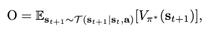

where $$\mathcal{T}$$ is the transition dynamics. However, since $$\mathcal{T}$$ is seldom available in RL, the $$\mathcal{Q}$$-function is introduced to replace it:
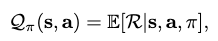

and thus the greedy search objective becomes
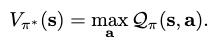

The $$\mathcal{Q}$$-function can be recursively formulated as
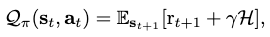

where $$r_{t+1}$$ is the immediate reward gained at $$t+1$$, and $$\mathcal{H}$$ is the long-term reward gained across time steps. Thus, by adjusting the discount $$\gamma$$ one can leverage the stressing of short v.s. long term rewards in influencing an agent's action.

One way we can adopt small data learning in value-based strategies is to constrain the $$\mathcal{Q}$$-function by an extra function $$f_\theta$$ that maps $$s$$ to $$a$$, which is approximated by a model optimized from meta learning. $$f_\theta$$ is essentially conducting small data learning by influencing $$\mathcal{Q}$$ with meta-learning optimized parameters.

#### Policy-based Strategies
Rather depending on a value function, a policy-based strategy greedily search for optimal policy $$\pi^\ast$$ in a policy space.

A policy space is represented with a set of policy parameters $$\eta_i$$. The optimization of $$\eta_{i+1}$$ is performed by ascending in the gradient direction of the expected return $$\nabla_\eta E$$ as
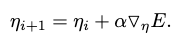

Then the problem becomes estimating $$\nabla_\eta E$$. For the method of **finite difference gradients**, we can conduct the estimation by observing the return of $$g \in G$$ perturbed policies against a reference policy's return.

Suppose
1. $$\Delta\Upsilon$$ is a matrix containing all perturbation samples $$\Delta \eta_g$$,
2. $$L=\Delta\Upsilon^\top \Delta\Upsilon$$,
3. $$\Delta \tilde{E}$$ is a matrix containing all expected returns of the perturbations $$\Delta E_g \approx E(\eta_i  + \Delta \eta_g) - E_\text{ref}$$.

Then the estimation is given as
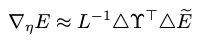

Small data learning could act as an advisor to sift informative directions of the policy perturbation gradient, yielding a more efficient search dependent on fewer perturbations, and make the sampling tractable in real world.

#### Actor-critic Strategies
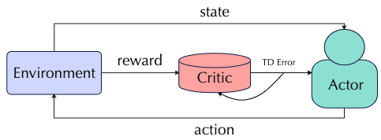

An actor-critic strategy aims to combine the advantages of both value-based and policy-based strategies. An actor model is proposed to conduct policy search, and a critic model is used to approximate the value function.

Small data learning is shown to benefit the scoring by critic by weighting the "advantages" of different rewards. Much ground remains to be explored for efficient small data usage in this strategy.

### Contrastive Learning
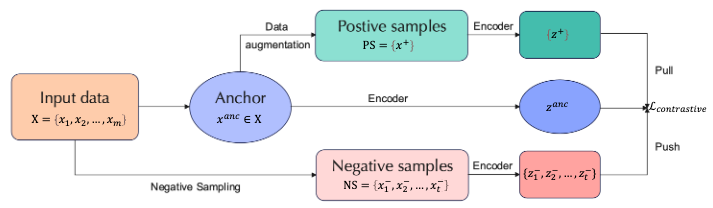

Contrastive learning has become a mainstream method for unsupervised learning. Its rough pipeline can be illustrated as the "push-pull" workflow in the figure above.

Form the perspective of mutual information (MI), the goal of contrastive learning is to minimize the MI between similar views and maximize the MI between different views.

Small data learning can boost contrastive learning from the following perspectives:
1. Contrastive learning benefits from **hard** negative samples. **What negative samples are truly hard in a dataset?** Small data learning, with its efficient data representation, offers a solution to this question and thus improves the performance of contrastive learners.
2. Appropriate data augmentation to create positive samples should **avoid capturing shortcut features** so as to actually expand the current dataset. Small data could guide the augmentation strategies to produce better samples.
3. The contrastive loss could also be made more reasonable from the constraint of small data representation to improve model **robustness and generalizability**.

### Graph Representation Learning
Graph representation learning (GRL) aims to model non-euclidean graph-structured data in an efficient manner. In recent years graph neural networks (GNN) have been extensively used as these learners' computational architecture.

The following perspectives of GRL can benefit from small data learning:
1. graph mining tasks often suffers from **label sparsity**, which can be ameliorated by the data efficiency of small data.
2. **label noise propagation** degrades the performance of GRL, which can be pruned with a small data representation.
3. **neighbor explosion** forces us to do subgraph-wise sampling to make the computation in the neighborhood context tractable, and an efficient sampling strategy offered by small data learning can empower the sampling of a better neighborhood by weighting the message importance of each neighbor to a node.
4. **graph contrastive learning**, with the same spirit as in contrastive learning, can seek truly negative samples with the help of small data learning.
5. **novel node centrality metrics** can be proposed from small data learning to report significant graph statistics.

## How can small data learning be improved?

### Meta Learning
It is shown in recent works that parameters of a learner can be optimized by extracting and utilizing the well-generalized **meta-knowledge** $$\phi$$ across different learning tasks. In other words, we optimize the current parameter update policy of the learner and **teach a learner to learn**, s.t. this policy can be generalized into unseen tasks.

In small data learning, meta-knowledge could also be utilized to optimize the parameter update policy of small data learning s.t. the small data representation can be obtained with good efficiency, which can be crucial if the non-meta update policy becomes computationally intractable in certain scenarios (e.g. tasks on large images, many AI for science tasks).

We give you a brief tour of three popular meta-learning strategies.

#### Bilevel Strategies
A bilevel strategy extract the meta-knowledge $$\phi$$ by wrapping the inner task-specific objective $$\mathcal{L}^\text{task}$$ with an outer cross-task meta objective $$\mathcal{L}^\text{meta}$$:
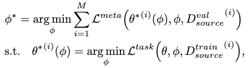

where $$\phi$$ is only updated w.r.t. $$\mathcal{L}^\text{meta}$$.

#### Task-distribution Strategies
Instead of focusing on meta-knowledge's application in only the target task, a task-distribution strategy treats all participant tasks as equals and ensure the meta-knowledge achieves learning optimization for all of them. It optimizes on participant tasks sampled from a task distribution $$q(\mathcal{T})$$ as
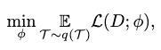

where $$\mathcal{L}$$ is the task-specific objective of each sample.

Notice that this strategy is split into two stages:
1. a meta-learning stage, where the "seen" tasks are sampled and used to optimize $$\phi$$.
2. a meta-testing stage, where the efficacy of $$\phi$$ is tested on "unseen" tasks and optimized again.

#### Feed-forward Strategies
Consider $$\gamma=\mathbf{x}^\top \mathbf{e}_\phi(\mathcal{D}^\text{train})$$, where $$\mathbf{e}_\phi$$ defines the linear regression weights used to combine our samples, and is an embedding from the training set $$\mathcal{D}^\text{train}$$.

If the parameters of this embedding process serves as our meta-knowledge $$\phi$$, then a feed-forward strategy aims to optimize $$\phi$$ as
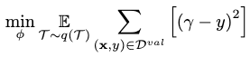

where the new $$\mathbf{x}$$ is drawn from the validations set $$\mathcal{D}^\text{val}$$ instead.

Essentially, we do not explicitly model any meta-knowledge in a feed-forward strategy, but instead approximate it with a feed-forward process.

### Challenges
Learning on small data meet several challenges in terms of learning scenarios and data. We discuss some of them here.

#### Challenging Learning Scenarios
**Weak supervision** can produce a looser approximation for the intended small data representation.

**Multi-label learning, when coupled with missing labels**, can damage label correlation learned in a small data representation with missing/spurious correlations.

**Imbalanced distribution**, such as long-tailed distributions commonly found in real-world data, incur the **label bias** issue that suppresses the expression of minority classes. Since small data learning mostly depends on i.i.d. sampling from each class, they may lose the original class relationship.

#### Challenging Learning Data
**Large-scale image data** are widely available but commonly unlabeled. Since labeling of these data usually require certain expertise and professional facilities, the cost is intractable in many situations. Small learning can help resolve this issue in these directions:
1. build effective, data-efficient queries with active learning.
2. transfer knowledge from related domains.
3. exploit unlabeled data directly.

Small data could also **speed up the sampling process of generative models**, such as diffusion models, by efficient extraction of the original data representation.

**Large language oracles** have proven to be successful in many NLP tasks recently, but their resource consumption grows with their size. It's important we improve the data efficiency of these models to make this consumption tractable in the near future. Recent lines of advancements include:
1. improve data quality by removing duplicates.
2. adversarial filtering during pre-training and finetuning.
3. active learning for high quality language instance selection.
4. sparse modeling for language data.
5. improve attention mechanisms.
6. interact with retrieval mechanisms for text generation and generalize language data across domains.

Small data can help with all these efforts with its data-efficient representation.

**Science data** usually has complex structures in their representations, such as biomedical data. Small data learning could improve these representations to be more efficient for downstream tasks.

