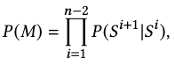

[X. Tang et al., “Real-time Controllable Motion Transition for Characters,” ACM Trans. Graph., vol. 41, no. 4, pp. 1–10, Jul. 2022, doi: 10.1145/3528223.3530090.](https://arxiv.org/abs/2205.02540)

## Problem
---
Given sparse target frames and a transition duration as constraints, how to generate **diverse and high-quality** in-between motion sequences in **real-time**?

## Observations
---
There are three major challenges in real-time motion in-betweening:

1. **Generation quality** needs to be maintained despite of speed requirement.
	1. Post-processing needs to be minimized.
	2. Offline computation and human intervention are prohibited during generation.
2. **Generation controllability** needs to be maintained under **control sparsity**, i.e. only sparse target frames are provided instead of continuous control signals.
3. Generated transition motions need to be **disambiguated** w.r.t. sparse control signals. Failure in transition disambiguation produces **averaged motions**.

## Assumptions
---
1. **Natural motion transition** is conditioned only by internal motion dynamics without any external control signals.
2. Natural motion transition can be well modeled by a **frame-frame Markov chain**, conditioned by a **motion manifold of co-embedded consecutive frames (i.e. motion manifold of dynamics)**, with several additional assumptions of the manifold structure:
	1. **upper-body joint motions** are always a weak condition and can be **ignored throughout the manifold modeling**.
	2. the distribution of this motion manifold follows a standard normal.
	3. the **ambiguity** of motion transition on the manifold can be explicitly modeled by a **multi-modal mapping** from discriminative conditions in 3 to a single indiscriminative motion transition. This many-to-one mapping can be approximated by a **mixture of experts (MoEs)**.
3. Additionally, the following conditions should be considered for natural motion transition:
	1. previous-frame **hip velocity**.
	2. previous-frame **lower-body joint motions**.
	3. **next-frame** hip velocity, which is assumed to be given.
4. **Controllable motion transition** can be well modeled by **sampling** motion transitions **autoregressively** from the natural motion transition manifold, conditioned by two sparse control signals:
	1. start frame and target frame.
	2. transition duration.
5. To reduce the dimensionality of previous state for autoregression and improve computational efficiency, we can only consider **partial** previous-frame states.
6. A **time-varying noise** could be added to the target condition that decays towards the end of the autoregressive generation, modeling **increment of the sampler's attention towards the target**, and **improve robustness to new conditioning information**.
7. The sampler, while sampling hip and lower-body motions from the natural manifold, can also predict upper-body motions directly from previous-frame state and target information.

Assumption 6 is very similar to the observation of "ramping activity" in the [attractor hypothesis](/surveys/2023-10-13-Attractor-Hypothesis.html). Essentially, they both represent a **commitment** of the motion generation towards a target motion.

However, assumption 6 commits the motion towards a target frame. Meanwhile, the ramping signal commits the entire motion sequence to a fixed planed sequence. Thus, the specific differences become

1. assumption 6 doesn't have a planning phase, which means the executed motion is affected by the commitment process.
2. assumption 6 commits towards a specific frame, while ramping commits towards a sequence of fixed frames.
3. assumption 6's commitment is perturbed only by sparse control signals (timing and target frame), while ramping is perturbed by dense control signals (past stimuli and executed motions).

In essence, assumption 6 serves as a toy problem for the commitment behavior exhibited by ramping. It's worth investigating how we can achieve commitment on a sequence-level in motion synthesis.

## Contributions
---
1. A novel framework for high-quality real-time generative motion in-betweening without post-processing.
2. A natural motion transition manifold model which can be conditioned to achieve:
	1. transition controllability.
	2. transition disambiguation.

In 2, we also retain transition quality with the efficient data representation of the manifold.

## Pipeline
---

The pipeline of RCMTC is composed of two sequential stages: learning of a natural motion manifold, and sampling from the manifold.

In the manifold learning stage, a conditional variational autoencoder (cVAE) is proposed to encode **hip and lower body** frame-frame motion transitions into a latent space, using an extra MoEs module in the decoder to decompose modeling of the ambiguous multi-modal mapping process from different natural conditions to the transition.

In the manifold sampling stage, the motion transition sequence is autoregressively generated framewisely by a sampler function. This sampler function takes as inputs the selected previous-frame states and the noised target states, then performs the following tasks to estimate the next-frame states:
1. map the inputs to a latent code $$z$$ to query the natural motion manifold for hip and lower body predictions.
2. map the inputs directly to upper body predictions.

The sampler function is approximated by a recurrent neural network.

We introduce you to the specifics of these two stages below.

### Learning of Natural Motion Manifold
Suppose each frame has the states as

$$S_{i}=\left\{ \mathbf{p}^{i}_{L} ,\mathbf{p}^{i}_{h} ,\mathbf{p}^{i}_{U} ,\mathbf{r}^{i}_{L} ,\mathbf{r}^{i}_{h} ,\mathbf{r}^{i}_{U} ,\mathbf{v}^{i}_{L} ,\mathbf{v}^{i}_{h} ,\mathbf{v}^{i}_{U} \right\},$$

where
1. $$\mathbf{p},\mathbf{r},\mathbf{v}$$ are the joint position, rotation and velocity respectively.
2. $$L,h,U$$ denote the lower-body, hip and upper-body joints.

Given the sparse control signal as a start frame $$S^0$$, a target frame $$S^t$$ and a duration $$z_{dt}$$, our motion in-betweening task can be formulated as mapping them towards a generated motion sequence $$M=\left\{ S^{1},\cdots ,S^{n-1}\right\}$$ with $$n-1$$ frames.

Probabilistically, this mapping process can be modeled by deriving the joint probability of $$M$$ as

where $$S^0, S^t, z_{dt}$$ are assumed to be independent from each other.

According to assumption 2, we can decompose $$P(M)$$ into a frame-frame Markov chain to simplify the problem:

#### Modeling the Markov Chain
We introduce a latent variable $$z$$, which **co-embeds** the consecutive frames on a latent motion manifold, to express the natural condition of motion transition in our Markov chain.

According to assumption 3, we add an additional **next-frame** hip velocity into the natural conditions since it strongly indicates the next motion.

With these two conditions, the transition dynamics become

$$P\left( S^{i+1}\vert S^{i}\right)  =\int P\left( S^{i+1}\vert S^{i},z,v^{i+1}_{h}\right)  P\left( z\right)  P\left( v^{i+1}_{h}\right)  ,$$

According to assumption 2.1 and the rest of assumption 3, we simplify the transition dynamics to

where $$c_{h,L}=\left\{ v^{i}_{h},v^{i}_{L},r^{i}_{h},r^{i}_{L}\right\}$$, and $$P\left( v^{i+1}_{h}\right)$$ can be removed since we assume the next-frame hip velocity is given and no longer a random variable.

We are then left to find $$P(z)$$, and the subtask of modeling the less-constrained upper-body motion transitions, which we will leave until the sampling process.

#### Learning the Natural Motion Manifold
We approximate $$P(z)$$ by learning a motion manifold via a cVAE. Specifically, $$P(z)$$ can modeled by the encoder of the cVAE as $$P\left( z\right)  =P\left( z\vert c^{i}_{h,L},c^{i+1}_{h,L}\right)$$, where $$z \sim \mathcal{N}(0, \mathbf{I})$$.

The decoder, on the other hand, models the reconstruction process as $$P\left( v^{i+1}_{L},\dot{r}^{i+1}_{L} \vert c^{i}_{h,L},v^{i+1}_{h},z\right)$$, where $$\dot{r}^{i+1}_{L}$$ is the angular velocity s.t. $$r^{i+1}_{L}=\dot{r}^{i+1}_{L} +r^{i}_{L}$$.

We explicitly single out the conditional variables $$\left\{ c^{i}_{h,L},v^{i+1}_{h} \right\}$$ because we want to model the indiscriminate(ambiguous) multi-modal mapping  by **explicitly modeling the composition of discriminative mappings from each of these conditions towards the motion transition**. In the cVAE, this is done by framing the decoder with a conditional mixture of experts (cMoEs) computational architecture, with an additional gating module for regressing a voting scheme w.r.t. specific inputs.

#### Architecture
The computational architecture of the cVAE is very light-weight.

The encoder module consists of two hidden feed-forward layers with 256 units followed by ELU activation.

The gating module consists of two hidden feed-forward layers followed by ELU, with a softmax in the end for gating.

Each of the expert network is a three-layer feed-forward network with 256 units followed by ELU, with the number of experts empirically set to 6.

#### Training
We crop out 50-frame windows from the LaFAN1 and Human3.6M datasets, where consecutive windows overlap each other with 25 frames. In training the cVAE, we further split the 50-frame sequence into 25-frame sequences for improved convergence efficiency.

##### Scheduled Sampling
We employ a **scheduled sampling strategy** to obtain the training data, there are two sampling situations:
1. the predicted pose at last time step is fed with a probability $$p$$.
2. otherwise, the ground-truth pose is fed instead.

$$p$$ is scheduled to remain 0 at first $$k$$ epochs and increase to 1 linearly at the next $$k$$ epochs, where $$k=5$$ for LaFAN1 and $$k=20$$ for Human3.6M.

##### Objectives
The total loss is defined as

which is composed of 4 individual losses. We explain each of them below.

###### Foot Skating Loss $$L_\text{foot}$$
In the joint position space, the foot skating loss is defined as

where $$\hat{v}_\text{end}$$ is the predicted relative velocity of the contacting foot w.r.t. ground. We dictate that a velocity less than .2 cm/s denotes contact, which activates the consideration of the foot skating loss.

###### Bone Length Loss $$L_\text{bone}$$
The bone length loss is defined for each joint and its neighbor joints in $$n(j)$$ as

where $$\mathbf{p}_j$$ is the predicted position of joint $$j$$.

###### Reconstruction Loss $$L_\text{rec}$$
This is the main loss in our objective. It's defined as the mean squared error between the predicted pose and the ground-truth:

###### KL-divergence Loss $$L_\text{KL}$$
The KL loss is defined to regularize the motion manifold to be close to a standard normal:

where $$\mu$$ is the mean and $$\sigma$$ is the log variance.

### Transition Sampling
Given the current estimated state, the sampling function's overall objective is to map it to the next estimated state, with the additional conditioning from the target state $$S^t$$ and the duration $$z_{dt}$$. In other words, we want to model $$P(M\vert S^t, z_{dt})$$.

As the extra conditioning requires **learning the reverse Markov chain across all possible duration**, which is intractable explicitly, we implicitly approximate it with a neural network instead.

Specifically, we feed a composition of the previous state and the two conditions to a recurrent neural network, which predicts the next state as
1. the hip and lower-body latent code $$z$$ on the natural motion manifold.
2. the next-frame hip velocity $$v_h^{i+1}$$.
3. the next-frame upper body angular velocity $$\dot{r}_U^{i+1}$$.
4. the next-frame hip angular velocity $$\dot{r}_h^{i+1}$$.

1 and 2 are further passed to the natural motion manifold's decoder to query the next-frame lower-body motions as $$\left\{ v^{i+1}_{L},\dot{r}^{i+1}_{L} \right\}$$.

With the lower-body motions, 2, 3 and 4, we finally have enough estimations to populate the next-frame state.

#### Composition of Previous State (State Encoder)
According to assumption 5, we select the previous state information as $$\left\{ v^i_h, v^i_L, r^i_U \right\}$$, and pass it through a **state encoder** module to transform it into embeddings.

Additionally, we represent the required transition duration as positional encodings $$\mathbf{z}_{dt}$$:

where $$d$$ is the dimension of $$\mathbf{z}_{dt}$$.

We add the time embeddings to the embeddings of the previous state.

#### Composition of Target Frame (Target and Offset Encoders)
To express the target frame as a condition, we first embed its pose parameters $$\left\{ p^t_h, p^t_L, r^t_U \right\}$$ using a **target encoder**.

To make the sampler aware of where we are currently at in generation the whole transition sequence, we embed the current pose-target offset $$\left\{ {p^{t}_{h}-p^{i}_{h},p^{t}_{L}-p^{i}_{L},r^{t}_{U}-r^{i}_{U}}  \right\}$$ with another **offset encoder**.

To further reduce dimensionality, we **only compute the offset using the lower joints' position $$p_L$$**, which is normalized with z-score to balance the attention on lower and upper body joints.

We add the target and offset embeddings to represent the deterministic target condition.

According to assumption 6, we inject a time-decaying noise $$z_\text{target}$$ to the deterministic target embeddings to model the "commitment to target" process. The amplitude of this injection is

where $$dt$$ is the offset between current frame time and the target time, $$t_\text{zero}=5$$ is the warm-up frame duration without noise, and $$t_\text{period}=30$$ is the period of linear decrease of the noise.

#### Architecture
All encoders are feed-forward networks with a hidden layer of 512 units and an output layer of 256 units, using PLU as activation.

The recurrent neural network is implemented with an LSTM that has 1024 units in its hidden layer.

The parse decoder has two hidden feed-forward layers with 512 units in the first layer and 256 in the second, followed by ELU.

#### Training
We feed the transition sampler with transition lengths from 5 to 30 frames to train it.

##### Objectives
The following total loss is proposed to train the sampler:

where $$L_\text{rot}$$ is a L1 loss for all joint rotations, and $$L_\text{leg}$$ is a position loss for lower-body joints:

Additionally, we compute forward kinematics on the joint rotations to obtain the joint positions and include their L1 loss w.r.t. the ground-truth:

This allows us to **implicitly respect the bone's hierarchy** for better results.

Finally, the **foot skating and bone length losses** are also applied for further regularization.

## Extensions
---

### Performance
We use normalized power spectrum similarity (NPSS) to measure the generated transition's accuracy against the ground-truth transition. Other metrics are pretty straightforward.

On Human3.6M, for the test on different generated frames, RCMTC performs better than baselines on global position transition and reducing foot skating issues. It achieves slightly poorer performance in NPSS than the baselines.

RCMTC achieves similar performance in global position transition with the offline SoTA model based on a transformer.

RCMTC achieves superior performance on all metrics when generating transitions under specific action categories.

### Ablations

It is shown that focusing on lower-body joints in motion manifold modeling achieves better performance in global position transition.

### Limitations
RCMTC is limited by the training data and **cannot generate motions that are too different from the training set**.

One especially challenging task is to **when we put the target frame behind the starting frame** and ask for a transition. This task often fails because there is no quick turning or backward walking motion in the training data.

It could also be due to the forward Markov chain modeling assumed by the motion manifold.

Another limitation is the **lack of generation diversity**. The differences of generated transitions are small, **especially for the lower body**. This is partially due to the consideration of foot skating loss, which states that the contact position with the ground of each step cannot change too much.

