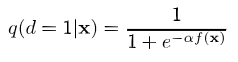

[R. Xia, X. Hu, J. Lu, J. Yang, and C. Zong, “Instance selection and instance weighting for cross-domain sentiment classification via PU learning,” in Proceedings of the Twenty-Third international joint conference on Artificial Intelligence, in IJCAI ’13. Beijing, China: AAAI Press, Aug. 2013, pp. 2176–2182.](https://dl.acm.org/doi/10.5555/2540128.2540441)

## Problem
---

Given a large-size data from a **training** source domain (blue-cross), and a small-size data from a **test** target domain (red-dot), how to apply adapt the source domain data towards the target domain for efficient learning of a target-domain task?

Although this paper also concerns itself with the application of its domain adaptation method on sentiment analysis, we only focus on its domain adaptation exploration.

Moreover, we find that its proposed method based on PU learning is not only applicable on labeled data, but also the unlabeled. Therefore, we will refrain from mentioning this feature of the assumed data, as the original paper does.

## Observations
---
1. Methods for domain adaptation can be classified into two categories:
	1. **labeling adaptation**: learning a new feature representation or a new labeling function for the target domain.
	2. **instance adaptation**: learning the importance of data in the source domain based on instance weighting.
2. PUIW's efficacy gains as the KL divergence grows between the source and target domain distributions.

## Assumptions
---
1. The source and target domain data are **domain mixed**, i.e. partially overlapped in their distributions. This also requires the target and domain data to have the same representation s.t. the distribution space is shared.

## Contributions
---
1. A novel instance weighting method, PU learning for instance weighting (PUIW), that yields an efficient and highly generalizable domain adaptation solution.

Aside from PUIW, PUIS is also proposed for instance selection. However, as the latter is a special case of PUIW, and yields poorer boost to the target tasks in most experiments, we omit it from this survey.

## Pipeline
---
The pipeline of PUIW follows a two-stage process.

First, PU learning is conducted to obtain an **in-target-domain selector** model, which assigns an in-target-domain probability to each data instance in the source domain.

Then, PUIW is conducted to train the target model by a weighted version of maximum likelihood estimation (MWLE), where the weights are derived as the in-target-domain probability assigned earlier.

We describe each stage in details below.

### PU Learning for In-target-domain Selection
Consider the test target domain samples as the positive sample set $$P$$, and the training source domain samples as the unlabeled sample set $$U$$, the objective of our PU learning is to **find the hidden negative samples** in $$U$$.

We accomplish this task via the S-EM algorithm:

In step 1, we randomly select a subset of $$P$$ as the "spies" set $$\tilde{P}$$ and mix them into $$U$$. We then label the remaining $$P$$ as positive and the mixture negative. A naive Bayes binary classifier is trained between the two sets to identify the negative sample set $$N_r$$ with a threshold $$b$$, as a "side product" while attempting to identify the positive spies. Alternatively, we determine $$b$$ by consulting the positive probability assigned to the spy instances.

After step 1, we have the full positive set $$P$$, the classified negative set $$N_r$$, and the remaining unlabeled set $$U_r = U - N_r$$.

In step 2, an in-target-domain selector model is then trained by an expectation maximization algorithm iteratively on $$P, U_r, N_r$$, where the positiveness of $$P$$ instances remains fixed, and the other two sets participate in the EM classification's rescoring.

The selector model then approximates each instance's target domain distribution as

where $$p(d=1\vert \mathbf{x})$$ is the in-target-domain probability.

### PUIW
Before applying instance weighting, we need to **calibrate** the in-target-domain probability assigned to each instance. Since the binary classifier tends to **over-saturate** its classification probabilities, we make them smoother with an arbitrary hyperparameter $$0 < \alpha < 1$$ on its sigmoid form:

Consider the likelihood of a model mapping the feature space $$\mathcal{X}$$ to the label space $$\mathcal{Y}$$ in the target domain, with its parameters as $$\theta$$:

Replacing the real target-domain distribution with its approximation $$q(d=1\vert \mathbf{x})p_s(\mathbf{x})$$, and assuming $$p_s(y\vert x) \approx p_t(y \vert x)$$, the likelihood becomes:

Essentially, our MLE problem in the target domain becomes an MWLE problem in the source domain:

where $$q(d=1\vert \mathbf{x}_n)$$ becomes our sampling weight, and $$N_s$$ is the size of training data. Thus, PUIW trains the target model on the source domain.s

## Extensions
---

### Performance
The experiments are conducted on a sentiment analysis task by applying random selection, PUIS and PUIW on a baseline naive Bayes model. The training source set contains labeled video reviews, and the test target set contains labeled reviews from other domains.

It's observed that the domain adaptation brought by PUIW is necessary in all situations to boost model performance. Moreover, the following behaviors of PUIW are observed:
1. when the training data becomes larger, PUIW becomes more crucial as adding more instances stop benefiting the target model without PUIW, but continues to do so with it.
2. when the KL divergence between source and target domain distributions becomes larger, PUIW shows more efficacy in boosting the target model.

Overall, the boosting effect of PUIW stays stable with the different perturbations of source and target domain data.

