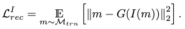
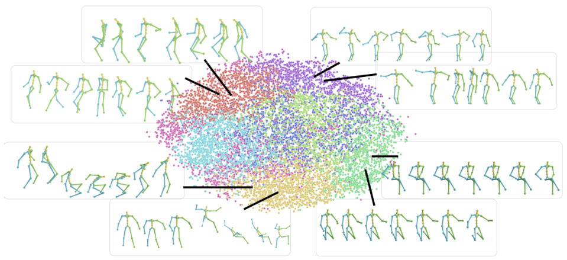
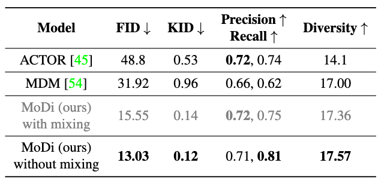

[S. Raab, I. Leibovitch, P. Li, K. Aberman, O. Sorkine-Hornung, and D. Cohen-Or, “MoDi: Unconditional Motion Synthesis from Diverse Data.” arXiv, Dec. 18, 2022. doi: 10.48550/arXiv.2206.08010.](https://arxiv.org/abs/2206.08010)

## Problem
---
Given a **diverse, unstructured and unlabeled** motion dataset, how to generate diverse motions in a **well structured** manner?

By well structured, we mean the generated motions follow a semantically clustered and regularly structured distribution, s.t. most **single-modal** motion synthesis tasks can be performed competently by consulting this distribution.

## Observations
---
1. **StyleGAN** has achieved significant success in image generation, but adapting the method to motion generation needs to fill a large domain gap.
	1. image has a **regular spatial structure**, especially for pixel neighborhood, while motion follows a drastically different structure where joint neighborhood is based on skeletal topology.
	2. image has a **large number of DoFs** in expressing itself, while motion has DoFs as few as its joints.
2. There are two major caveats from the convolutional filters employed in previous motion generation methods:
	1. they employ **1D or 2D filters** over the time or joint axis, which force the joint dimension to be combined into the dimension of channels, adding unnecessary housekeeping complexity to the convolution task.
	2. they use **naive pooling** (copying and averaging) to perform upsampling and downsampling of the spatial features, which does not possess enough approximation capability.
3. Previous works based on graph convolutional networks (GCN) assume a **single kernel** for the skeleton graph, which lacks structural sensitivity.

## Assumptions
---
1. StyleGAN's pipeline can be adapted to construct an performant motion generator.
	1. the style latent space of the motion StyleGAN is well-structured and could act as a **motion manifold** prior to support multiple motion synthesis tasks.
	2. an **inverse encoder** can be learned to project a motion to the style latent space, enabling example-conditioned querying of the motion manifold and thus rectifying **ill-posed** motion synthesis tasks (task with more than one single solutions) with good structural prior knowledge.
2. Regarding observation 2 and 3, the convolutional filter of StyleGAN can be redesigned to
	1. employ **3D in-place filters** over the time and joint axes, allowing a **separate** manipulation of the joint dimension from the channel dimension, while also setting up **different convolutional visibility** to allow **multiple skeleton-aware kernels**.
	2. employ similar **3D convolutional scalers** to allow learnable upsampling and downsampling.
3. Extra objectives such as **foot contact** and **foot velocity consistency** can be added to the generator's training to improve motion quality.
4. The encoder of the motion StyleGAN can map to the $$\mathcal{W}+$$ latent space of the generator to achieve finer style projection.

## Contributions
---
1. A motion generation pipeline, MoDi, based on StyleGAN that achieves superior performance in unconditioned motion generation.
2. A well-structured motion manifold learned as a byproduct of MoDi, which serves as a good motion prior for many motion synthesis tasks.
3. An inverse encoder projecting motions to the motion manifold, extending MoDi's support towards ill-posed motion synthesis tasks.

In essence, this paper is about adapting StyleGAN to the motion synthesis domain. The major contribution lies not in the pipeline, but the convolutional neural architecture modifications made for the adaptation.

These modifications are based on a very arbitrary assumption of the spatial-temporal properties of motions, including skeletal topology and duration. We argue against such arbitrariness as it unnecessarily constrains the motion manifold's representational flexibility. **Motions are not really images.** For instance, **body-part-specific** motions cannot be represented; semantically similar motions with **different lengths** cannot be represented. An interpolation doesn't give justification here, since the model has seen the enough actual data of body-part-specific and length-specific motions!

It's even a bigger issue when it comes to querying the motion manifold, since the queries often have varied space-time granularities. It's intractable to condition the granularity in this manifold, since it means summarizing all possible neural architectures of the generator. We could express the granularity implicitly by synthesizing an example motion from the query, and use the encoder to get the style code. Then the question becomes: why bother generating it again when you can do it right in the first place?

Nevertheless, we deem taking such an arbitrary assumption as reasonable when facing a highly unstructured motion data distribution. However, this might not be the case in most situations.

## Pipeline
---

There are two major components involved in MoDi: a **motion generator** and a **motion encoder**.

The motion generator is based on StyleGAN, with modified convolutional filters accounting for some space-time characteristics of motion. It formulates a latent space (we term it motion manifold throughout the survey) perform unconditional motion synthesis tasks.

The motion encoder follows a reverse pipeline of the synthesis network in the motion generator to inversely map a motion sequence to a location on the motion manifold. It further enables **ill-posed** motion synthesis tasks to query **prior structural knowledge** from the motion manifold to reasonably constrain their solutions.

We discuss each of them in details below.

### Motion Generator
To start with, we represent a motion as a set of **entities**:
1. the **local** joint rotations $$\mathbf{R} \in \mathbb{R}^{T \times J \times K}$$, where
	1. $$T$$ is the number of frames.
	2. $$J$$ is the number of joints.
	3. $$K=4$$ is the number of rotation features in quaternions.
2. the **global** displacements as hip-joint velocities $$\mathbf{V} \in \mathbb{R}^{T \times 3}$$.
3. the **foot contacts** as binary labels, $$\mathbf{F} \in \{0, 1\}^{T \times 3}$$.

We equip $$\mathbf{V}$$ and $$\mathbf{F}$$ with one additional dimension and pad their feature dimension size from 3 to $$K$$ to align them with the dimensionality of $$\mathbf{R}$$:

$$\mathbf{V}, \mathbf{F} \rightarrow \hat{\mathbf{V}} \in \mathbb{R}^{T \times 1 \times K}, \hat{\mathbf{F}} \in \mathbb{R}^{T \times 2 \times K}.$$

Finally, we concatenate them and obtain the full human motion space as

where $$E=J+3$$ is the total number of entities.

We attempt to learn the natural motion space $$\mathcal{M}_{nat}$$, which is a much smaller subspace of $$\mathcal{M}_{full}$$ that only contains plausible human motions.

#### Coarse-to-fine Motion Generation
Borrowing from the idea of StyleGAN (StyleGAN2), we follow a sequence of **convolution+upsampling modules** to evolve a motion sequence in a **coarse-to-fine** manner. Each evolution level $$\ell$$ corresponds to a module, and a style noise is sampled from a latent space $$\mathcal{M}$$ and injected to guide generation.

We approximate $$\mathcal{M}$$ by a transform of a standard normal distribution, where the transform function is approximated by a neural network module termed **mapping network**.

We deem $$\mathcal{M}+$$, the concatenation of sampled style noises from $$\mathcal{M}$$ w.r.t. each sequential module, as approximating $$\mathcal{M}_{nat}$$, thereby formulating our motion manifold.

At each level $$\ell$$, we "see" the motion feature maps as of dimensions $$T_\ell \times E_\ell \times K_\ell$$, where the **entity and feature dimensions are separated explicitly**, helping to simplify the implementation of modulation/demodulation in StyleGAN.

After level $$\ell$$, the coarse motion representation is mapped to a finer representation with dimensions as $$T_{\ell+1} \times E_{\ell+1} \times K_{\ell+1}$$ through convolution and upsampling, where
1. $$T_{\ell+1} = 2T_{\ell}$$.
2. $$E_{\ell+1} = E_{\ell} + E_{\ell+1}^\ast$$, where $$E_{\ell+1}^\ast$$ is the additional joints included in the finer motion's skeleton.
3. $$K_{\ell+1}$$ is arbitrarily decreased.

See the table above for the level details.

Essentially, we always convolve and upsample on the space and time axes of a motion.

The discriminator follows exactly the reverse structure of the generator, but without style noise injections.

To adapt the neural architectures of StyleGAN to motion domain, **skeleton-aware in-place convolutional filters** and **skeleton-aware convolutional scalers** are employed to replace the original convolution and upsampling layers as illustrated above. We explain them in details next.

#### Skeleton-aware In-place Convolutional Filter

To obtain appropriate motion features in level $$\ell$$ w.r.t. the upsampled motion from the previous level and the sampled style noise, We apply a **5D in-place convolutional filter (i.e. 3D convolution)** of dimension $$K_{\ell} \times K_\ell \times E_{\ell} \times E_\ell \times U$$, where $$U$$ is the receptive field size.

The filter, stripped off the channels ($$K_\ell \times K_\ell$$), is visualized in the figure above.

We frame a the skeletal topology as a directed graph, where each joint serves as a node that shares its states with the edge (bone) pointing towards it, as shown with different colors in the figure. Together, a node and an edge form an **entity**, while the root node has an abstract edge connected to it.

To implement the different kernels of each node in assumption 2.1, we dictate that **each entity only "sees" its nearest neighbors** as weights in the filter. Graphically, a horizontal slice denotes the weight selection of an input entity, and the vertical slice is selected by an output entity. It's only when the two entities are neighbors that their common weights participate in the convolution's computation, otherwise the weights are ignored.

Notice that you can also implement this convolutional mechanism as a 3D filter instead of 5D and apply 1D convolutions. However, this 

#### Skeleton-aware Convolutional Scaler

A skeleton-aware convolutional scaler follows the similar design of an in-place convolutional filter, albeit with the additional objective of upsampling/downsampling. Thus, we design its dimensions as $$K_{\ell+1} \times K_\ell \times E_{\ell+1} \times E_\ell \times U$$.

In practice, the 3D convolution is carried out by the following steps:
1. expand the motion representation $$K_\ell \times E_\ell \times T_\ell$$ with one extra dimension of size 1, which serves as our spatial convolution dimension.
2. pad this extra dimension by zeros as $$K_\ell \times (2E_{\ell+1} - 1) \times E_\ell \times K_\ell$$.
3. slide the convolution down the temporal dimension $$T_\ell$$ and the spatial dimension $$2E_{\ell+1}-1$$.
4. The final product is $$K_\ell \times 1 \times E_\ell \times T_\ell$$, where we can reshape and throw away extra dimension of size 1, yielding the new motion of $$K_\ell \times E_\ell \times T_\ell$$.

The figure above illustrates this process with a downsampling convolutional scaler, omitting channels. It should be noted that a similar process can be visualized for the in-place convolution as well.

#### Training
The original objectives in StyleGAN consist of an adversarial loss, a path length loss and an R1 loss. We expand these objectives with two extra foot contact losses unique to the motion synthesis domain.

##### Adversarial Loss

The non-saturating adversarial loss is our major loss in training both the generator and the discriminator.

##### Path Length Loss
The path length loss encourages a fixed-size step in $$\mathcal{W}$$ to result in a non-zero, fixed-magnitude change in the generated motion:

where
1. $$\mathcal{R}$$ is a unit Gaussian space normalized by the number of joints and frames,
2. $$J_w=\frac{\partial G(w)}{\partial w}$$ is the perturbation direction of the generated motion given by the motion manifold Jacobian,
3. $$a$$ is the accumulated mean gradient length.

##### R1 Loss

The R1 loss improves the discriminator's performance by encouraging scoring consistency on real samples.

##### Foot Contact Loss
The **unsupervised** foot contact loss discourages **foot floating** at all time during motion generation:

where $$(\cdot)_F$$ is the contact label extraction of the motion, and $$s(\cdot)$$ is the sigmoid function.

##### Foot Contact Consistency Loss
The **unsupervised** foot contact consistency loss discourages **foot skating** by punishing high foot velocity during foot contact:

where $$FK(\cdot)$$ is the forward kinematic operator, and $$(\cdot)_f$$ denotes the extraction of feet velocity.

Nevertheless, we **further clean foot contact artifacts with inverse kinematics** optimization.

### Motion Encoder
The motion encoder attempts to project a motion sequence into a latent style code on $$\mathcal{W}+$$. It follows a similar structure as the discriminator convolution hierarchies.

#### Training
The major objective of the encoder is a reconstruction task with the previously learned motion generator as its decoder:

The latent variable is $$I(m) \in \mathcal{W}+$$.

We incorporate several auxiliary geometric losses.

##### Foot Contact Loss
Instead of the unsupervised foot contact loss used in training the generator, a **supervised** loss is applied:

where $$BCE$$ is a binary cross entropy function.

##### Root Loss
In experiments, the positions and rotations of the root joint is observed to **converge more slowly** than the other joints. Thus, an additional root loss is added for acceleration:

##### Position Loss
The joint positions are supervised in addition to the joint rotations as pose parameters. It is obtained through forward kinematics on joint rotations as

## Extensions
---

### Motion Synthesis Tasks Consulting the Motion Manifold

We observe that MoDi is able to formulate a very well-structured motion manifold for its generator. The above figure is a visualization of the manifold using K-means with 8 clusters and t-SNE projection to 2D.

The well-behaved (disentangled and semantical) structural information in MoDi's motion manifold implies that it can benefit unconditional motion synthesis tasks with a proper motion prior.

We have tested the following motion synthesis tasks on the motion manifold with satisfying results:
1. motion interpolation.
2. motion editing (directly in latent space, or conditionally using an additional latent code classifier).
3. crowd simulation.

With the inverse projection of the motion encoder, ill-posed tasks with multiple implied solutions could also be constrained by the motion manifold's structure to obtain natural results. We have tested the following tasks with success:
1. motion prediction from prefix motion frames.
2. fusion of two input motions (join as prefix and suffix).
3. motion denoising.
4. spatial motion editing (manually editing few frames of a motion and affect the rest).

These tasks are best visualized [in video](https://www.youtube.com/watch?v=O1sVzwrsNUg&t=19s).

### Performance

In unconditional motion generation, we observe significant performance gains on baseline models in all metrics. We further observe that refraining MoDi from sampling diverse style codes in each level (style mixing) gives more boost to its performance, as **mixing may change the distribution of synthesized motions**.

In ablations, we have also observed that our design of the novel convolutional filters outperform previous ones.

