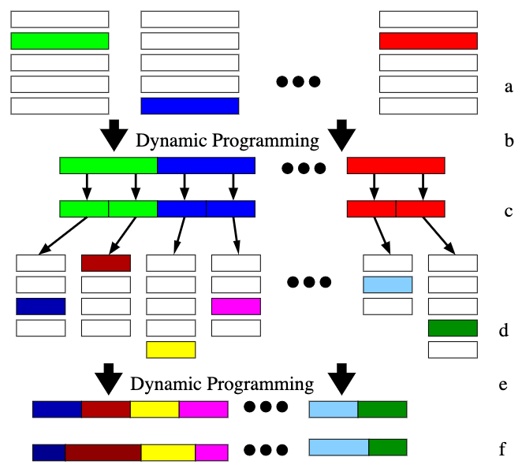
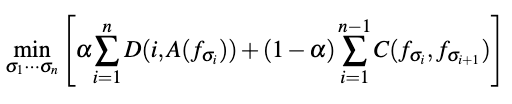
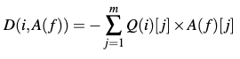
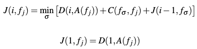
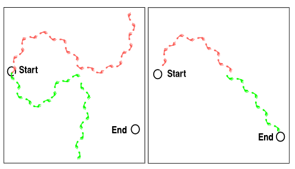

[O. Arikan, D. A. Forsyth, and J. F. O’Brien, “Motion synthesis from annotations,” ACM Trans. Graph., vol. 22, no. 3, pp. 402–408, Jul. 2003, doi: 10.1145/882262.882284.](https://dl.acm.org/doi/10.1145/882262.882284)

## Problem
---
Given an **action-annotated** motion database and a set of annotations, how to produce a motion sequence?

The set of annotations is given as a 2D vector on a fixed-duration of frames, where for each frame:
1. "1" denotes a particular annotation is present from a particular action.
2. "-1" denotes the exclusion of that annotation from a particular action.
3. "0" means we don't care whether this action's annotation should be considered or not.

## Observations
---
1. The following constraints are often applied in motion synthesis based on action annotations:
	1. **annotation constraints**: where the produced motion must match a set of annotations labelled **locally** in its space-time representation.
	2. **length constraint**: the motion must match a fixed length of frames.
	3. **continuity constraints**: the transition should be natural between all cuts of the motion.
2. Additionally, two additional constraints are often required in production scenarios:
	1. **frame constraints**: a particular frame must be passed through at a particular time by the motion.
	2. **position constraints**: the motion must end at a particular position and orientation.
3. **Local** search methods for motion synthesis, especially **motion graphs**, have trouble synthesizing motions which require **global planning**.

## Assumptions
---
1. To annotate the motion database efficiently, we can let the users annotate only a small number of frames, and **spread the labels to the rest by training a binary support vector machine (SVM) for each action**.
2. The given motion synthesis problem can be framed as a **combinatorial optimization** problem, where we choose frames from an **frame-wisely annotated** motion database s.t. the motion is **continuous** and **matches the given annotations**.
3. Instead of a local planning, we can make the optimization **global** by employing **dynamic programming (DP)**.
4. To make the search space in each choice stage of DP tractable, we can
	1. apply **hierarchical optimization** for the motion synthesis, where we start by **globally arranging coarse, big motion blocks** and progress down each big block to **locally arrange finer, smaller motion blocks**, running iterative DPs.
	2. apply **stratified sampling** on the motion database for each block type's arrangement optimization, by **clustering** motions based on similarity and randomly selecting one from each cluster to form the sample population.
5. To provide the measures needed in 3, we assume:
	1. **similarity** of motion blocks can be measured by k-means clustering.
	2. **frame-wise continuity** can be measured by feature vector distance between frames, where the feature vector is obtained with **principle component analysis (PCA)**'s projection to lower, tractable dimensionality for distance computation.

## Contributions
---
An annotation-based motion synthesis framework that allows:
1. action-conditioned motion synthesis.
2. position-conditioned motion synthesis.
3. frame-conditioned motion synthesis.

These conditions can be combined, and can also be specified **locally in space time** of the synthesized motion in a **variable duration**.

## Pipeline
---

There are three major stages in the DPMSA pipeline:
1. an **annotation stage**, where each frame in the motion database is annotated in a semi-supervised manner.
2. an **synthesis stage**, where DP optimization is conducted iteratively to synthesize the target motion from a global, coarse level towards local, fine levels.
3. a **postprocessing stage**, where the synthesized motion is refined for motion continuity and smoothness.

We describe these stages in details below.

### Annotation Stage
In the annotation stage, human users are given the task to label sample motion frames within a **fixed action vocabulary**.

This vocabulary is chosen to reflect the qualitative motion actions as `Run`, `Walk`, `Wave`, `Jump`, `Turn Left`, `Turn Right`, `Catch`, `Reach`, `Carry`, `Backwards`, `Crouch`, `Stand` and `Pick Up`, since we are working on a database of American football motions.

Once a small set of frames are labeled by users, we build an **SVM** for each action, with the **binary classification task** of judging whether a given frame can be annotated by this action or not. The SVMs then work through the rest of the database to finish labeling the unannotated frames.

In each SVM, we use the radial basis function $$\left< f_{1},f_{2}\right>  =e^{-\frac{\vert f_{1}-f_{2} \vert}{\gamma } }$$, where $$f$$ denotes a frame, as our kernel and choose $$\gamma$$ empirically.

It is observed that the user rarely has to correct the auto-annotations after supplying 3-4 variants for a specific action.

### Synthesis Stage
We aim to meet both the **annotation constraint** and the **continuity constraint** for the synthesized motion. We express them in an objective function as

where
1. $$A(f)$$ retrieves the annotation vector for frame $$f$$ in the database, in which 1 means an action is present for this frame, and -1 otherwise.
2. $$D(i, A(f))$$ compares the annotations of the $$i$$-th frame with our desired annotations.

3. $$C(f_i, f_j)$$ computes the continuity by putting frame $$f_j$$ after $$f_i$$.
4. $$\alpha$$ is a hyperparameter controlling the preference of meeting one of the objectives when there is an optimization conflict.

#### Annotation Match
Following the annotation vector's representation $$Q(i)$$ for each frame in the problem definition, we formulate the scoring $$D$$ as

#### Continuity Score
According to assumption 5.2, we measure the frame-wise continuity as

$$C\left( f_{i},f_{j}\right)  =\vert\vert F\left( f_{i+1}\right)  -F\left( f_{j}\right)  \vert\vert,$$

where $$F$$ projects each frame's $$90 \times 3$$ feature vector of joint positions, velocities and accelerations by PCA to a 20-dim feature vector.

The PCA compression allows us to make the storage cost $$\mathcal{O}(T^2)$$ tractable for our DP routine.

#### Global-to-local and Coarse-to-fine DP
We can treat the motion synthesis problem as a combinatorial DP optimization on each frame in the target motion sequence to minimize the objective function. The **cost-to-go** function is

Naively, a huge DP would solve the case. However, the cost of this algorithm is $$\mathcal{O}(nT^2)$$, where $$n$$ is the total frames to be synthesized and $$T$$ is the size of the **active set** of frames to choose from for each "slot". This is intractable even for a small dataset.

We seek to remedy this problem by
1. optimizing the combination of **blocks of frames** instead of single frames, to reduce $$n$$.
2. formulating a sequence of **hierarchical, iterative** DP optimizations, s.t. each subsequent optimization's search space is contained by its parent's optimization result, to reduce $$T$$.

In the spirit of 1, we start by trying to arrange the "coarsest" motion blocks of 32 frames to minimize the objective function.

To implement 2, we then bisect the 32-frame blocks into 16-frame blocks after the first DP. For the optimization of these smaller blocks, we only consider the most similar 16-frame snippets as each block's active set to choose from, thus limiting $$T$$. After the 16-frame DP is done, we proceed to do a similar 8-frame DP.

Although theoretically we could progress ourselves towards the final 1-frame DP, in practice we stop at 8-frame since shorter motions **loses meaningful local context for recognizing an action** and the annotation supplied by users seldom has finer granularity.

There is one more thing to address: we still have to **limit the active set of the initial 32-frame blocks**. Without previous optimization to serve as restriction, we apply **stratified sampling** by employing **k-means** to cluster all available 32-frame blocks in the motion database into 100 clusters. For each block, the active set is formed by randomly selecting one block from each cluster. The same clustering technique is applied for 16-frame blocks and smaller ones to help them define their "most similar snippets".

One optimization cycle concludes after we finish the 8-frame DP. We go back to the start and **direct a new cycle with another random stratified sampling for each 32-frame block**, in hope of arriving at a better synthesis than the best one so far.

#### (Optional) Frame Constraints
It's straightforward to incorporate the optional frame constraints into our DP cycle: for a fixed frame, we simply **prune our active set** at that frame to include only the one block that contains this exact frame at that exact position.

#### (Optional) Position Constraints
Additionally, one could consider satisfying the position constraints in the synthesis stage, which requires the motion to finish with a particular global position and orientation.

It's not very straightforward to incorporate the position constraints directly into the original objective function. The alternative, workaround consideration in position constraints is that even though one motion synthesized by our DP cycle could miss the positional target, a **"cut and splice" of multiple synthesized motions** can lead us to it.

Thus, we keep a **pool of 20 synthesized motions** with best annotation matches and continuity throughout the cycles. We then cut and splice these motions on 8-frame granularity to make the search space tractable, and search through the combinations to find the one with best positional constraints.

If it's impossible to satisfy both positional and annotation constraints by our search, we bias the final result towards one of them by weighting the objective function.

### Postprocessing Stage
In the postprocessing stage, we lift the limitations of motion blocks, and consider enhancing the synthesized motion on a frame-wise granularity.

To start with, we alleviate the discontinuity problem between each consecutive block by **moving the boundary point** in such a pair: if including one more frame at the start of block $$j$$ after block $$i$$ and, consequently, removing one more frame at the end of $$i$$ decreases the continuity score, then we do it.

This postprocessing step is carried out for every block pair in the motion with gradient descent. However, we observe that the DPs have already optimized continuity greatly s.t. this step rarely moves the boundary points for more than 1-2 frames.

Another postprocessing step we conduct is to **perform a motion smoothing** to get rid of offensive small discontinuities.

## Extensions
---
No quantitative metrics are provided by this work to measure performance. However, qualitative judgements can be formed from watching [this video](https://www.youtube.com/watch?v=lHBeu8vuStc).

It should also be noted that this motion synthesis pipeline is **not generative**. Instead, it treats motion synthesis as a combinatorial optimization problem of available motion frames in a database. Thus, it would be impossible to ask the pipeline to produce motions not covered by the database, as limited by the problem definition.

