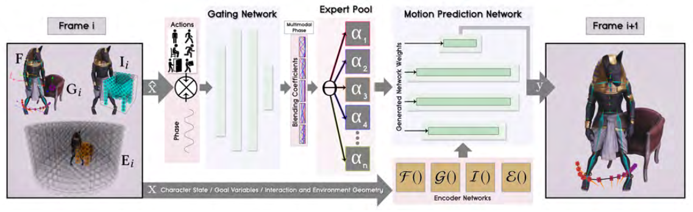
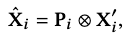
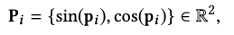
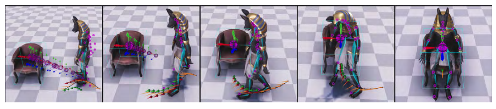
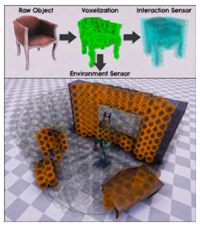
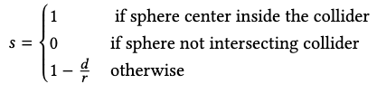
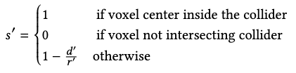
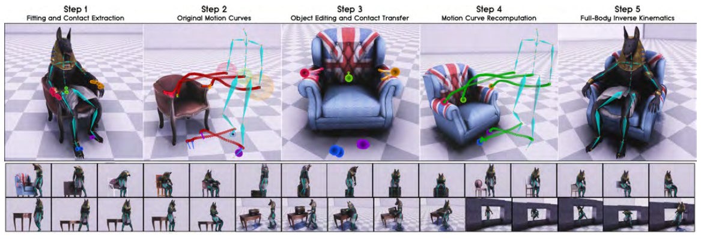
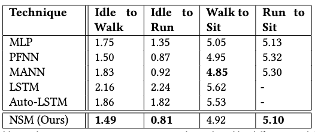
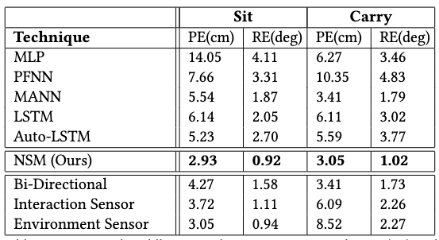

[S. Starke, H. Zhang, T. Komura, and J. Saito, “Neural state machine for character-scene interactions,” ACM Trans. Graph., vol. 38, no. 6, p. 209:1-209:14, Nov. 2019, doi: 10.1145/3355089.3356505.](https://dl.acm.org/doi/10.1145/3355089.3356505)

## Problem
---
Given a high-level **scene-interactive** instruction, or a low-level **locomotion** instruction, how to **forecast** the most probable motions that complete this instruction?

Some example instructions for high-level instructions:
1. sitting on a chair.
2. avoiding obstacles.
3. opening and entering through a door.
4. picking and carrying objects.

## Observations
---
1. A character's motion fidelity is largely related to its environment: precise motion control needs to be enforced with **scene understanding** for many motion tasks.
2. Past works on interactive motion synthesis can be grouped into three categories, each with its own challenge:
	1. **template-based** methods insert a selected motion clip into the scene and edit it, but **do not produce a continuous motion space** that can construct more diverse motions.
	2. **kernel-based** methods interpolate multiple motion clips to synthesize more novel motions, but the nearest neighbor search and preprocessing involved has **poor scalability** as the data size grows.
	3. **exploration-based** methods replay/interpolate motion clips to explore the environment with path finding or reinforcement learning algorithms to **meet predesignated goals**, but these methods still **lack novelty in the synthesized motions**.
3. Many deep learning models have also been proposed for interactive motion synthesis, such as **LSTMs, temporal convolutions and Phase-Functioned Neural Networks (PFNN)**.
4. **LSTMs** often suffer from **converging to average poses** due to ambiguity in the future.
5. **PFNN** and its variants produce **sharp** motions due to the explicit modeling of motion phases.
	1. **Mixture of Experts (MoEs)** have been introduced to improve the scalability of the original, fixed phase function in PFNN: multiple phase functions can now be learned for different actions by training a **Gating network** to interpolate expert weights according to different contexts. The efficacy of this improvement **has been validate on animating dogs**.

## Assumptions
---
1. We assume 5 can be adapted to synthesize motions for **humans** under both low-level locomotion and high-level interaction commands, with the following neural network components:
	1. a set of expert **motion predictors**, which takes in the past frame's pose, trajectory, environment and goal states to predict the next frame's state for motion synthesis.
	2. a **gating network**, which applies cyclic phase controls of the synthesized motion by blending weights of the motion prediction experts, ensuring the state will move forward in time.
2. The goal can be constructed from a **bi-directional control scheme**, where both the final motion inference is made by blending inferences from both **egocentric** and **goal centric** coordinate systems. This can **improve control precision** by regularizing accumulated errors made in only egocentric inference.
3. The scene knowledge in a **3D volumetric representation**, rather than a 2D heightmap, can guide proper character interactions with **concave** scene objects, e.g. passing through a hole in a wall.
4. **Data augmentation** can be applied to motion captures to enrich the learned interactions with a wider range of object geometries.

## Contributions
---
1. **Neural state machine (NSM)**, a **deterministic**, autoregressive motion forecasting framework for synthesizing interactive motions of a human character in a virtual scene, respecting various low-level locomotion and high-level interaction instructions.
2. A novel, **volumetric scene representation** enabling interaction guidance with concave scene objects.
3. An efficient **data augmentation pipeline** to enrich the target object geometries of interactive motions.

## Pipeline
---

Given a high-level or low-level interaction instruction, NSM synthesizes the motion **autoregressively** by predicting the next frame's state in two sequential stages:
1. a **gating network** to adjust the blending weights of motion prediction experts, conditioned by **phase-propelled action instructions**.
2. a **motion predictor** constructed by blended experts to actually predict the next frame's motion.

In the autoregression, 1 depends on a subset of previous-frame's motion state to leverage its blending decisions against the goal. Thus, we will introduce you to 2 first, clarify its inputs and outputs, and then show you the details of 1.

### Motion Prediction
The motion prediction module is composed from a set of experts with the same neural architecture, which is a three-layer MLP. During prediction, a final predictor is blended from experts by a weighted sum of their according parameters in each layer. The weights are produced by the gating network discussed later.

For our final predictor, the inputs $$\mathbf{X}_i$$ are

| Input                       | Symbols                                                                                                                              | Description                                                                                                                                                           | Owner          |
| --------------------------- | ------------------------------------------------------------------------------------------------------------------------------------ | --------------------------------------------------------------------------------------------------------------------------------------------------------------------- | -------------- |
| character pose              | $$\mathbf{j}^{p}_{i-1} \in \mathbb{R}^{3j} ,\  \mathbf{j}^{r}_{i-1} \in \mathbb{R}^{6j} ,\  \mathbf{j}^{v}_{i-1} \in \mathbb{R}^{3j}$$ | joint **positions, rotations and velocities** for $$j=23$$ joints                                                                                                       | $$\mathbf{F}_i$$ |
| past/future root trajectory | $$\mathbf{t}^{p}_{i-1} \in \mathbb{R}^{2t} ,\  \mathbf{t}^{d}_{i-1} \in \mathbb{R}^{2t} ,\  \mathbf{t}^{a}_{i-1} \in \mathbb{R}^{7t}$$ | $$t=13$$ sampled trajectory points in the past/future in a 2-second window: **2D root coordinates, 2D root forward directions, 7D action labels**                       | $$\mathbf{F}_i$$ |
| goal root trajectory        | $$\mathbf{g}^{p}_{i-1} \in \mathbb{R}^{3t} ,\  \mathbf{g}^{d}_{i-1} \in \mathbb{R}^{2t}$$                                              | **goal positions and directions** for $$t=13$$ trajectory points: lives **1 second in the future w.r.t. each root trajectory point**.                                   | $$\mathbf{G}_i$$ |
| goal actions                | $$\mathbf{g}^{a}_{i-1} \in \mathbb{R}^{6t}$$                                                                                           | **goal action labels** on each goal trajectory point: **climb is excluded** from the achievable actions because its start timing is tricky to specify in experiments. | $$\mathbf{G}_i$$ |
| interaction geometry input  | $$\mathbf{I}_{i} \in \mathbb{R}^{512}$$                                                                                                | volumetric representation surrounding the **interaction object**.                                                                                                     | $$\mathbf{I}_i$$ |
| environment geometry input  | $$\mathbf{G}_{i} \in \mathbb{R}^{1408}$$                                                                                               | volumetric representation of the **local environment** surrounding the character.                                                                                     | $$\mathbf{E}_i$$ |

Thus, you cram the predictor with final inputs as $$\mathbf{X}_{i} =\left\{ \mathbf{F}_{i} ,\mathbf{G}_{i} ,\mathbf{I}_{i} ,\mathbf{E}_{i} \right\}$$.

In turn, the predicted outputs $$\mathbf{Y}_i$$ are structured as

| Output                            | Symbols                                                                                                                                                      | Description                                                                                                                                                                                                                                             |
| --------------------------------- | ------------------------------------------------------------------------------------------------------------------------------------------------------------ | ------------------------------------------------------------------------------------------------------------------------------------------------------------------------------------------------------------------------------------------------------- |
| character pose                    | $$\mathbf{j}^{p}_{i} \in \mathbb{R}^{3j} ,\  \mathbf{j}^{r}_{i} \in \mathbb{R}^{6j} ,\  \mathbf{j}^{v}_{i} \in \mathbb{R}^{3j}$$                               | cf. input character pose                                                                                                                                                                                                                                |
| egocentric joint position         | $$\tilde{\mathbf{j} }^{p}_{i} \in \mathbb{R}^{3j}$$                                                                                                            | joint position in the **future** egocentric system 1 second ahead, where the root is referenced from $$\mathbf{t}^p_i, \mathbf{t}^d_i$$ predicted below.                                                                                                  |
| egocentric future root trajectory | $$\mathbf{t}^{p}_{i} \in \mathbb{R}^{2t^{\prime }} ,\  \mathbf{t}^{d}_{i} \in \mathbb{R}^{2t^{\prime }} ,\  \mathbf{t}^{a}_{i} \in \mathbb{R}^{7t^{\prime }}$$ | cf. input root trajectory, but only $$t^\prime=6$$ future trajectory points are predicted here.                                                                                                                                                           |
| goal trajectory                   | $$\dot{\mathbf{g} }^{p}_{i} \in \mathbb{R}^{3t} ,\  \dot{\mathbf{g} }^{d}_{i} \in \mathbb{R}^{2t} ,\  \dot{\mathbf{g} }^{a}_{i} \in \mathbb{R}^{6t}$$          | cf. input goal trajectory, these goal parameters are either **blended with user-updated control signal** in **locomotion**, or replaced by user-updated object selection in high-level **interaction**, to guide the next prediction in autoregression. | 
| contact labels                    | $$\mathbf{c}_{i} \in \mathbb{R}^{5}$$                                                                                                                          | feet, hands and hip contact labels to avoid artifacts through **IK postprocessing**.                                                                                                                                                                    |
| phase update                      | $$\dot{\mathbf{p} } \in \mathbb{R}$$                                                                                                                           | one-dimensional angular phase prediction to propel the phase functions in gating network forward in time for next prediction.                                                                                                                           |

#### Input Encoders
These are simply 4 three-layer MLPs used to encode the input data $$\{\mathbf{F}_{i} ,\  \mathbf{G}_{i} ,\  \mathbf{I}_{i} ,\  \mathbf{E}_{i}\}$$ into vectors of 512, 128, 256 and 512.

### Gating Network
The gating network is in charge of adjusting the blending of experts for the final predictor. For each frame prediction, we formulate its input as

where $$\otimes$$ is the **Kronecker product** to increase the influence of the phase $$\mathbf{P_i}$$ on $$\mathbf{X}_i^\prime$$.

The **2D phase vector** $$\mathbf{P}_i$$ is defined as

where $$0 \leq \mathbf{p}_i \leq 2\pi$$ is estimated from the previous frame by the motion predictor, and used to propel the gating to propagate forward in time.

$$\mathbf{X}_i^\prime$$ is a subset of the input $$\mathbf{X}_i$$ used later in motion prediction. It includes the following entries:
1. action trajectory $$\mathbf{t}_{i-1}^a$$.
2. modified goal trajectory $$\{ \mathbf{g}^{p}_{i-1},\  \delta \cdot \mathbf{g}^{d}_{i-1}, \ \theta \cdot \mathbf{g}^{a}_{i-1} \}$$, where $$\delta$$ is the distance to the goal position and $$\theta$$ is the angle to the goal orientation from the current frame.

The gating network then learns **different action/goal phase functions** to achieve **action-specific dynamic blending** of expert weights, allowing us to produce different motions and refrain from converging to blurred motions, which conventional autoregressive models are prone to because of the lack of phase differentiation.

### Training
The training objective is simply an MSE of the prediction outputs and ground truth data. The motion experts and the gating network are optimized simultaneously.

## Extensions
---

### Additional Motion Synthesis Strategies
Aside from the prediction modules, NSM employs some additional motion synthesis strategies to improve the performance of its predictor. We illustrate some of them below.

#### Bi-Directional Control Scheme

When only predicting motions in the egocentric perspective, the character has difficulty in reaching the goal location and conducting the task. The reason is that **error accumulation** in multiple frames from the egocentric autoregression compromises proper termination motion at the goal location.

The bi-directional control scheme predicts the future trajectory in **both egocentric and goal-centric coordinate systems** as an effort to mitigate the error accumulation from either one of these single-view autoregressive tasks. As illustrated in the above figure, the egocentric prediction is illustrated by the red trajectory and the goal-centric trajectory is green.

The egocentric and goal-centric trajectory predictions are **linearly blended** to produce the final trajectory prediction that updates the next frame as

$$\left( 1-\lambda \right)  \left\{ \mathbf{t}^{p}_{i} ,\mathbf{t}^{d}_{i} \right\}  +\lambda \mathbf{R}_{i} \left\{ \tilde{\mathbf{t} }^{p}_{i} ,\tilde{\mathbf{t} }^{d}_{i} \right\}  ,$$

where $$\mathbf{R}_i$$ transforms the goal-centric trajectory back to the egocentric space, and the blending weight is constructed as $$\lambda=w_i^{d_i^2}$$, s.t.
1. $$w_i$$ is linearly increasing from 0 to 1 along the current to last trajectory sample.
2. $$d_i^2$$ is the squared distance of each trajectory sample to its goal.

The blending then stresses the goal-centric prediction as the target gets closer, while focusing on the egocentric prediction when the target is far.

The predicted **egocentric joint velocities** are also adjusted in a similar manner:

$$\left( 1-\lambda \right)  \mathbf{j}^{v}_{i} +\lambda \left( \mathbf{R}^{\prime }_{i} \cdot \tilde{\mathbf{j} }^{p}_{i} -\mathbf{j}^{p}_{i} \right)  ,$$

where the blending parameter $$\lambda$$ is chosen as the delta time $$\Delta t$$ between two consecutive frames, s.t. the character's velocities are smoothly adjusted to drive its pose towards the adjusted trajectory above.

In other words, we have adjusted the global motion to conform to a "more goal-centric future", and now we should also adjust the local motion (pose velocities) to consider the same future.

#### Volumetric Sensors

There are two kinds of sensors involved in making NSM **scene-aware** for interactive motion synthesis:
1. an **environment sensor** to describe the local environment surrounding the character.
2. an **interaction sensor** to describe the goal interaction object.

##### Environment Sensor
The environment sensor draws a cylindrical volume of radius $$R$$ centered on the character and detects collisions with environmental objects. Upon collision, it samples the object's collider **sparsely with a set of spheres** of radius $$r \ll R$$  and compute each sphere's sensor value as

where $$d$$ is the closest distance between the collider and the sphere center.

Each object's collider is computed from a **voxelization** of raw object model.

##### Interaction Sensor
For the interaction sensor, we compute a **finer volumetric representation for more precise interaction information**.

Specifically, we draw a $$8\times8\times8$$ **goal-centric volume of voxels** that covers the target object. Each sensor element is designed to be a 4D vector, where the first three elements are the relative vector of the body root from the element center, and the last element is computed as

where $$d^\prime$$ is the shortest distance between the center and the collider, and $$r^\prime$$ is the diagonal length of the voxel.

#### Data Augmentation

To increase NSM's motion synthesis coverage, we apply a five-step data augmentation pipeline to the motion capture dataset to obtain more interactive motions with similar interaction objects transformed into different geometries. We also transform the environment objects for more interaction diversity.

The original paper establishes these steps very clearly and we refer you to browse them there. The rough idea is to
1. obtain a static (zero velocity) pose and obtain key contact joints.
2. identify the motion trajectories of these key joints.
3. transform the interaction and environment objects around.
4. recompute the key joint trajectories by blending the transformed trajectory gradually with the original trajectory.
5. apply full-body IK to adjust the full character pose accordingly.

## Performance
---

### Ablations
The ablation studies have successfully confirmed the efficacy of the following strategies:
1. using **Kronecker product** instead of concatenating phase and action/goal features for the gating network.
2. using **bi-directional control scheme** to produce more accurate (goal-driven) interactions.
3. using **interaction sensor** to guide motion synthesis with less artifacts such as penetration.
4. using **environment sensor** to guide motion synthesis with less artifacts such as obstacle avoidance.

### Responsiveness Comparison

NSM has demonstrated quicker responsiveness in three of the four motion transition controls. It also demonstrates **much less foot sliding** than the baseline models.

### Precision Comparison

NSM has superior performance in both positional error and rotational error compared to baselines, often leading with a large margin. It also **produces less penetration and vibrating artifacts** compared to PFNN, mostly due to NSM's ability to selectively blend motions specific to the current interaction task, while PFNN is limited to a fixed phase function that doesn't apply such differentiation.

### Limitations
Several limitations are mentioned, including
1. the system fails to generalize to interactive geometries that are very different than those in the training set.
2. when changing the goal action, the input into the network changes abruptly and causes abrupt movements, e.g. when an object is suddenly activated for interaction. An extra time window can be applied for smoother action transition, but cannot be too long (.25-.5 seconds) or else generates noticeable control latency.
3. the types of interactions are limited to sitting, holding and avoiding obstacles.
4. all motions need phase labelling in NSM. the automatic phase labeling (gating network) it employs works well for cyclic motions, but for general acyclic motions manual phase labelling is required for the entire dataset, which is too much labor.
5. motions can also have multiple cyclic movements with different phases in them, e.g. waving and walking. NSM currently only deals with motions propelled by single phases.

