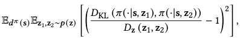
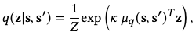

[X. B. Peng, Y. Guo, L. Halper, S. Levine, and S. Fidler, “ASE: Large-Scale Reusable Adversarial Skill Embeddings for Physically Simulated Characters,” ACM Trans. Graph., vol. 41, no. 4, pp. 1–17, Jul. 2022, doi: 10.1145/3528223.3530110.](https://arxiv.org/abs/2205.01906)

## Problem
---
Given a large and diverse dataset of natural motions, how to build a **reusable, physics-based motion controller** for various downstream motion synthesis tasks?

## Observations
---
1. Humans build up a **repertoire of general-purpose motion skills** and adapt them quickly to accomplish new tasks, while conventional reinforcement learning (RL) based control policies are **trained from scratch** for **a single, specific task** in order to generate physics-based human motions.
2. In computer vision and natural language processing, assumptions based on 1 (albeit in different domains) have successfully led to **pre-trained** models that provide powerful priors for a wide range of downstream tasks.
3. In physics-based motion synthesis, **heuristics of natural motions** have often been employed with a similar purpose as 2, to support downstream tasks.
	1. They include but are not limited to
		1. energy efficiency.
		2. lateral symmetry.
		3. stability.
		4. more biologically accurate simulation models.
	2. They are **not broadly applicable to all downstream tasks** and often need handcrafted adjustments.
4. Aside from 3, **data-driven methods** have also been explored to provide priors as **motion tracking**, where the motion controller imitates reference motions by **explicitly imitating reference motions**.
	1. These methods need a **motion planner** to **select appropriate reference motions**, which can become **intractable in large and diverse datasets**.
	2. We can resolve 4.1 with an **implicit** motion planner, but the controller still needs to be **trained from scratch** for each task, while common, general motion skills such as walking are learned over and over again.
5. One way to reuse previously acquired skills for new tasks is to employ a **hierarchical model** consisting of two stages:
	1. a **pre-training stage** where a collection of controllers are trained to specialize in different **low-level** skills.
	2. a **task-training stage** where a **high-level** controller leverages the low-level controllers to perform a specific task.
6. Motion tracking can be employed to build low-level controllers, but they **limit a model's flexibility to develop more general and versatile skills**, since it's difficult to produce motions that are not depicted in the original dataset.

## Assumptions
---
1. We can obtain appropriate low-level motion controllers by optimizing them as **policy models** in an **RL-based adversarial imitation learning** task.
	1. the motion **skills** can be represented as embeddings in a **latent space** to
		1. allow straightforward integration with high-level controllers.
		2. avoid maintaining an explicit motion dataset for downstream tasks.
	2. learning general motion skills can be framed as minimizing the **Jenson-Shannon (JS) divergence** between the marginal policy-induced state-transition and the marginal natural (dataset) state transition distributions.
2. Aside from 1, **unsupervised RL** can formulate intrinsic objectives for these low-level controllers to improve the generated motions' **novelty and diversity**.
	1. maximizing motion diversity can be framed as maximizing **mutual information** between the policy-induced state-transition and latent skill distributions.
3. **Learning recovery strategies** can be proposed as another objective aside 1 and 2 for the low-level motion controllers, improving motion control **robustness** in downstream tasks, where automatic recovery from perturbations is often desired.
	1. Recovery policies can be learned by attempting to recover from poses created by falling the character from random heights and orientations.

## Contributions
---
1. A reusable motion controller, trained on a large and diverse motion dataset, that offers **recovery-robust, performant** motion priors for various downstream physics-based motion synthesis tasks.

## Pipeline
---

The core objective of this work is to build the low-level controller described in observation 5 given a dataset of natural motions. Specifically, we aim to learn **adversarial skill embeddings (ASE)** which serve as the **interface representation** for motion controlling between the low-level controller and high-level controller. Each controller is modeled by a policy.

The entire pipeline is illustrated in the figure above:
1. during **pre-training** stage, the low-level policy aims to maximize the return by **imitating** its action distribution, conditioned by latent skill embeddings, from the natural motion distribution data, 
2. during **task-training** stage, the high-level policy aims to maximize the task-specific return by **generating skill embeddings**, and pushing these embeddings through the low-level policy to produce actions.

We add the following auxiliary objectives to stage 1 besides imitation:

We add an auxiliary **style objective** to stage 2, encouraging actions to be well-contained in the prior natural motion distribution.

### Pre-Training Stage
Given the following entities:
1. a dataset of motion clips $$\mathcal{M}=\{m^i\}$$, where each clip $$m^i = \{\mathbf{s}_t^i\}$$ is represented as a sequence of states.
2. a skill represented by a latent code $$\mathbf{z}$$ sampled from the skill latent space $$\mathcal{Z}$$.

We would like to learn a low-level **skill-conditioned** policy $$\pi(\mathbf{a}\vert\mathbf{s},\mathbf{z})$$ to satisfy these objectives:
1. an **imitation objective**, which encourages the policy's action distribution to approximate the marginal state-transition distribution of $$\mathcal{M}$$.
2. a **skill discovery objective**, which applies unsupervised RL to encourage the diversity of learned skills.
3. a **responsiveness objective**, which encourages a change in skill embeddings to reflect a change of actions.
4. a **robust recovery objective**, which encourages action robustness under perturbations, and is implicitly enforced by challenging the low-level policy to learn recovery actions from fallen states.

Haiya, this is a mouthful of objectives! Hopefully we can clarify the design of each to you by deriving them one by one.

#### Spherical Latent Space
Before we start discussing the objectives, we need to formulate the structure of our latent space since the skill discovery and diversity objectives is dependent on it.

A caveat noticed from existing works is that they often use a standard normal distribution to approximate their latent space. The structure of a standard normal is **unbounded**, i.e. the sampled code can be far from the origin. These faraway codes might produce unnatural motions.

Instead, we formulate our latent space as a **hypersphere** $$\mathcal{Z} \equiv \{\mathbf{z}:\vert\vert \mathbf{z} \vert\vert=1\}$$, where $$p(z)$$ is a **uniform distribution on the surface of this hypersphere**.

To sample $$p(z)$$ is to normalize samples from a standard normal:

This makes our latent space well-bounded.

#### Imitation Objective
This is the main objective of the low-level policy. The idea is to ensure that **the learned skills produce motion state-transitions similarly distributed as the natural state-transitions, instead of matching each particular one in the dataset**. This relaxes the constraint of our learned skills and enable them to produce motions not seen before in the dataset.

According to assumption 1.2, our imitation objective can be minimizing the JS divergence as

$$\min_{\pi } \  D_{\text{JS} }\left( d^{\pi }\left( s,s^{\prime }\right)  \vert \vert d^{\mathcal{M} }\left( s,s^{\prime }\right)  \right),$$

where $$d$$ denotes the marginal distribution induced by different data sources, and $$(s, s^\prime)$$ denotes the state-transition pair.

It's intractable to directly compute this divergence. Instead, we resolve to a **variational approximation** of this objective as

where $$D$$ functions as a discriminator in a **generative adversarial network (GAN)**, and hence the term "adversarial" comes forth in ASE.

#### Skill Discovery Objective
While the imitation objective encourages $$\pi$$ to produce motions that resemble the natural data, it doesn't pay attention to **respect the structure** of the skill space $$\mathcal{Z}$$. This ignorance can lead to poor skill learning such as
1. **loss of straightforward control** in produced state-transitions from manipulating $$z$$ w.r.t. the structure provided by $$\mathcal{Z}$$.
2. **mode-collapse** in the state-transitions produced.

Both of these are not good news for downstream tasks.

The remedy idea is to apply **unsupervised** RL by considering a skill discovery objective based on maximizing the following **mutual information**:

The rationale is that maximizing $$I$$ involves
1. maximizing the state-transition entropy $$\mathcal{H}(s, s^\prime \vert \pi)$$ induced by $$\pi$$, i.e. producing motions as diverse as possible.
2. minimizing the state-transition entropy $$\mathcal{H}(s, s^\prime \vert z, \pi)$$ induced by a particular skill $$z$$, i.e. each distinct skill should produce a distinct motion.

By these two metrics, we encourage the policy to respect both the global and local structures of $$\mathcal{Z}$$ while producing motions.

However, the mutual information in the above form is again intractable to compute. Instead, we manipulate it by exploiting the **symmetry** of mutual information:

We notice that $$\mathcal{H}(z)$$ is not dependent on $$\pi$$ can can thus be discarded.

However, as $$\mathcal{H}(z\vert s, s^\prime, \pi)$$ still involves $$\pi$$, it's still intractable to compute. Instead, we can approximate its variational lower bound:

where $$q(z\vert s, s^\prime)$$ is a variational approximation of $$p(z \vert s, s^\prime, \pi)$$.

In practice, we model $$q$$ as an **encoder** that maps a policy-induced state transition $$(s, s^\prime)$$ to a skill code $$z$$, and cross-entropy between the encoded code and the policy-induced code is leveraged to optimize $$q$$.

#### Responsiveness Objective
A responsive low-level policy should **change its behaviors according to changes in $$z$$**. This enables the character to agilely switch to a new task in a motion sequence, and respond quickly to unexpected perturbations between timeframes.

##### Sequential Context
However, the imitation and skill discovery objectives derived above consider $$z$$ in a **non-sequential context**, where each skill code corresponds to an entire motion episode's state-transitions. This context doesn't encourage responsiveness as there is **no change-of-task guidance for the policy w.r.t. change of skill codes between timestamps**.

To introduce this guidance, we condition $$\pi$$ on a sequence of latents $$Z=\{z_0, \cdots, z_{T-1}\}$$ instead of a single one. We construct this sequence by repeating a latent $$z$$ for several timestamps, then sampling a new latent from $$p(z)$$ and continue repetition.

This encourages the model to learn to transition between different skills.

While the sequential context is indeed beneficial for learning skill transitioning, its construction is rather arbitrary: in the experiment each new latent is repeated for 1-150 timesteps in a 300-timestep long episode. This stochastic sampling ignores the underlying skill-motion length mapping: different skills incurs motions of different lengths. For instance, you need 1 second to leap 1 meter, but might need 3 seconds to crawl the same distance.

During task-training, the high-level policy can produce **jittery motions** because each skill is not **properly timed** by the low-level policy. This is reported in the experiments, where the authors have to **downsample** their query frame rates to force a uniform duration for each skill. They query the high-level policy at 6Hz, while the low-level policy operates at 30 Hz. Each latent skill code produced by the high-level policy is repeated for 5 steps to guide the low-level policy.

Essentially, this is equivalent to limit the high-level policy learning to produce a downsampled motion sequence. The low-level policy compensates for the details in the original-length motion sequence, but could only fill them in one by one on a fixed window of 5 time steps. It's not a very elegant solution for variable-length motion synthesis. We cannot condition a given duration on the entire motion, nor different skill durations on it.

##### Diversity Objective
To further encourage the policy to produce different motions for different skills, a diversity objective is added:

where $$D_\mathbf{z}(\mathbf{z}_1, \mathbf{z}_2)=0.5(1-\mathbf{z}_1^\top \mathbf{z}_2)$$ computes the similarity of two skill codes on our spherical latent space.

By minimizing this objective, we ensure that similar skills produce similar action distributions, while different skills produce different ones. This objective is applied **only during gradient updates** instead of being added to the reward as the imitation and skill discovery objectives.

#### Robust Recovery Objective
According to assumption 3, we would like our low-level policy to robustly produce motions s.t. they can recover from unexpected perturbations, thus avoiding these recovery skills to be relearned in a high-level policy.

This objective is encouraged **implicitly** by **data augmentation**: we synthesize a large variety of fallen states by dropping the character from the air at random heights and orientations, and each character has a .1 probability of being in such a state at the start of an episode during training.

#### Pre-training Objective
Finally, gathering everything up, we have the total pre-training objective as

where $$\gamma^t$$ is the discount rate of long-term rewards, $$\beta$$ and $$w_\text{div}$$ are weight adjustments.

#### Implementation
With the objectives fully drawn, we can start to implement the required components and train them. According to the previous discussion, we need
1. a **low-level policy model** to approximate $$\pi$$.
2. a **discriminator** for the supervised adversarial imitation objective.
3. a **skill encoder** for the unsupervised skill discovery objective.

We describe each of them in details below.

##### Low-level Policy Model

The low-level policy model is approximated by a neural network based on MLP. It takes in a state $$s_t$$, a sampled skill latent code $$z_t$$ and produce an action distribution $$\pi(\mathbf{a} \vert \mathbf{s}, \mathbf{z}) = \mathcal{N}(\mu_\pi(\mathbf{s}, \mathbf{z}), \Sigma_\pi)$$, where the covariance $$\Sigma_\pi$$ is fixed.

##### Discriminator + Encoder

The discriminator and encoder is approximated by a **joint** neural network model since both of their inputs are state-transitions.

The **discriminator** outputs a sigmoid score $$D(s, s^\prime)$$, which is optimized by the following objective:

where the additional term is a gradient penalty to regularize abrupt scoring discrepancy and $$w_\text{gp}$$ is its weight.

The **encoder** outputs the parameter for the variational distribution $$q(\mathbf{z} \vert \mathbf{s}, \mathbf{s}^\prime)$$. Since the latent space distribution $$p(z)$$ is a normal distribution on a hypersphere surface, we design $$q$$ with a similar structure, i.e. the **von Mises-Fisher distribution**:

which is essentially the normal distribution on the surface of a sphere, where we normalize $$\vert\vert \mu_q(s,s^\prime) \vert\vert = 1$$, $$Z$$ is the normalization constant and $$\kappa$$ is a scaling parameter.

We optimize the encoder by maximizing the log-likelihood of samples $$(z, s, s^\prime)$$ collected from the policy appearing in $$q$$:

where $$d^\pi(s, s^\prime \vert z)$$ is the likelihood of observing a state-transition under $$\pi$$ given a skill $$z$$.

##### Training
We apply a **value-based** policy optimization strategy, i.e. the **proximal policy optimization** (PPO) to learn the low-level policy. The advantages are computed using the generalized advantage estimator $$\text{GAE}(\lambda)$$ and the value function is updated using the temporal difference $$\text{TD}(\lambda)$$. We approximate the value function with an MLP structured similarly as the low-level policy model.

The full algorithm is

where
1. Equation 13 is the encoder optimization objective.
2. Equation 14 is the discriminator optimization objective.
3. Equation 15 is the total pre-training objective.

Please refer to the original paper for more details.

### Task-training Stage
During the task-training stage, a high-level policy is learned to manipulate the skill code $$\mathbf{z}$$ in the low-level policy to produce motions that satisfy a task-specific objective.

Given a task-defined goal $$\mathbf{g}$$ and a previous state $$\mathbf{s}$$, the high-level policy $$\omega$$ is defined as

$$\omega(\bar{\mathbf{z}} \vert \mathbf{s}, \mathbf{g}) = \mathcal{N}(\mu_\omega(\mathbf{s}, \mathbf{g}), \Sigma_\omega),$$

where $$\Sigma_\omega$$ is fixed, and the final skill code passed is the normalized $$\mathbf{z} = \frac{\bar{\mathbf{z}}}{\vert \vert \bar{\mathbf{z}} \vert \vert}$$.

#### Motion Prior
Since it's still possible for $$\omega$$ to specify latents that cause unnatural motions, such as **jittery motions caused by drastically changing skill codes**, we accompany the given task reward $$r^G$$ with an additional **style reward** by **reusing the discriminator of low-level policies**, who has already learned to score the naturalness of a motion:

where $$w_G$$ and $$w_S$$ are their individual weights.

Although previous works have trouble with a fixed discriminator since the policy can exploit the its idiosyncrasies, we find the low-level policy $$\pi$$ to be sufficiently constrained in the motions it can produce s.t. this problem doesn't show up during experiments.

#### Training

The high-level policy is gain approximated by an MLP.

At the start of training, we initialize the action distribution of $$\omega$$ at the center of the unnormalized latent space $$\bar{\mathcal{Z}}$$ as  $$\mathcal{N}(0, \Sigma_\omega)$$. This allows the high-level policy to start by sampling all skills uniformly on the low-level sphere.

As training progresses, the mean $$\mu_\omega(\mathbf{s}, \mathbf{g})$$ can be learned to shift away from the origin as needed. We thus model the **specialization** of $$\omega$$ w.r.t. a specific given task, increasing the likelihood of sampling more effective skills.

## Extensions
---
Most of ASE's performance is illustrated clearly in [this video](https://www.youtube.com/watch?v=hmV4v_EnB0E).

The low-level policy is trained on a rather small motion dataset of 187 motion clips, containing 30 minutes of motions accomplishing locomotion and sword/shield wielding. The RL sampling, on the other hand, is bespoke with over 10 billion samples (~10 years of simulation).

During pre-training, the low-level policy is **able to organize different motions into structured skill embeddings**, although the data lacks any kind of annotations. The authors attribute this phenomenon to the application of the skill discovery objective, which encourages different motions to be generated for different skill latents.

### Tasks
The downstream tasks tested are location, reach, speed, steering and strike. Each reward is set up simply with an exponential of a negative mean square error. If you are really particular about these tasks, please see the paper for details.

### Performance

Performance on downstream tasks is measured by the returns gained. It can be seen that a fully equipped ASE is superior than its ablated versions in all tasks, albeit poorer in performance than policies learned from scratch in location and strike,

However, we observe the following caveats for the lead of from-scratch policies:
1. it often exploits **unnatural, energy-sporadic** motions to maximize its returns.
2. it **needs more samples** to win an edge over ASE.

Both of these, and especially 1, are highly undesirable for competitive motion task policies.

It can also be observed that skill discovery objective plays a crucial role in learning reusable low-level policies. On the other hand, the diversity objective has less impact on the policy performance.

For high-level policies, it is shown that the design their action space (i.e. the space of produced skill latents) significantly influence the diversity of generated motions.

For motions produced by a random exploration in the original action space $$\mathcal{A}$$, the character doesn't produce any semantically meaningful motions and falls after a few timesteps.

For motions produced by sampling from a normal distribution in the unnormalized latent space $$\tilde{\mathcal{Z}}$$, positioning the normal in the origin leads to highly diverse motions that travel in different trajectories.

For motions produced by directly sampling in the normalized latent space $$\mathcal{Z}$$, i.e. selecting samples from a local region on the hypersphere, the motions are less diverse than sampling from $$\tilde{\mathcal{Z}}$$.

**A larger action standard deviation leads to higher motion diversity, but hampers learning.** Therefore, extra measures are needed to **decrease the std over time to "commit"** the strategy of exploiting the low-level policy.

### Limitations
Many limitations of ASE have been mentioned, but here are the prominent ones:
1. the training of ASE is still **sample-intensive**, while humans can acquire skills much more efficiently. Therefore, it's a potential direction to replicate more aspects of the skill acquisition process of humans.
2. the low-level policy can still occasionally produce **unnatural** motions such as **jittering, jerks and overly-energetic recoveries**. It's a potential direction to exploit recovery motion data, or incorporate energy-efficient objectives to mitigate the last issue.

Apart from the suggestions in 2, considering a broader local motion context might help mitigate the jittering and jerks, such as by representing motions as multi-frame snippets instead of 2-frame transitions. Of course, the former in a physics-based setting must be designed with extra care.

