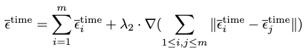

[M. Zhang et al., “MotionDiffuse: Text-Driven Human Motion Generation with Diffusion Model.” arXiv, Aug. 31, 2022. doi: 10.48550/arXiv.2208.15001.](https://arxiv.org/abs/2208.15001)

## Problem
---
Given a set of input texts, how to map them to a motion sequence?

## Observations
---
1. Autoregressive motion generation accumulates errors.
2. HumanML dataset offers vague descriptions of motions for individual body parts.
3. HumanML dataset offers vague descriptions of time-varied motions.

## Assumptions
---
1. Probabilistic mapping from text to motion leads to diversity of generations.
2. Text descriptions can be decomposed into subparts of body-part-independent control signals.
3. Text descriptions can be decomposed into subparts of time-independent control signals.
4. Body-part-independent and time-independent control signals **independently** condition motion generation.

## Pipeline
---

### Basis Model
A **DDPM** is employed as the basis model to map a normal distribution to motion distribution, conditioned by text descriptions.

This model is characterized by a **forward diffusion process** and a **backward denoising process**.

#### Diffusion Process (Forward)
By definition, a diffusion process iteratively diffuses a motion distribution $$q(\mathbf{x}_0)$$ until it becomes a normal distribution:

Here $$\beta_t$$ is a constant hyperparameter scheduling the variance rate. This is a simplification from learned variance schedules.

Instead of iteratively diffusing the motion distribution as illustrated above, the following distribution is **mapped to each diffusion step directly from the motion distribution**:

where

#### Denoising Process (Backward)
By definition, a denoising process eliminates noise from a normal distribution $$p_\theta(\mathbf{x}_T)$$ until it becomes close to the motion distribution, whose approximation is $$p_\theta(\mathbf{x_{0:T}})$$:

In the denoising process, **the eliminated noise term $$\epsilon_\theta(\mathbf{x}_t,t, \text{text})$$ is predicted instead of $$\mathbf{x}_{t-1}$$**.

This noise term is predicted by an optimized neural network, s.t. it approximates $$\epsilon$$ in each diffusion with a minimum MSE. The total loss for the denoising process is therefore:

According to the original setup, we need to compute both $$\mu_\theta$$ and $$\Sigma_\theta$$ from $$\epsilon_\theta$$ in order to perform denoising. The problem is simplified by **only considering $$\mu_\theta$$ and keeping $$\Sigma_\theta=\beta_t$$**:

### Modules
#### Text Encoder
A classical transformer is employed to represent text as embeddings.

The text tokens are passed through several layers of self-attention blocks with residual connections. The first several layers are **initialized with parameter weights from CLIP** and kept frozen.

The embeddings are then passed through an FFN head containing three linear layers and two GELU activations.

#### Linear Self-attention
A **linear efficient self-attention** layer is used to extract **better motion features** during diffusion steps, by **capturing correlation between motion frames**.

##### Why Efficient Attention?

A global feature map $$\mathbf{F}_g$$ is computed instead of pairwise attention weights.

**Time complexity is reduced** from $$O(n^2d)$$ to $$O(d^2_knk)$$, where $$n$$ is the sequence length, $$k$$ the number of heads, and $$d_k$$ the dimension of feature for one head.

**$$\mathbf{F}_g$$ captures global information of the motion**, while classical attention focuses on pairwise relations. The former captures features that are **more semantically meaningful for describing the entire motion**.

#### Linear Cross-attention
A **linear efficient cross-attention** block is used to **correlate motion with text conditions**. The text embeddings are injected as $$\mathbf{X}$$ for the $$\mathbf{K}$$ matrix.

#### Stylization Block
This module is added after each other module in the DDPM to allow **conditioning by diffusion step stamp $$t$$**, s.t. each other module obtains information about the current diffusion process.

The stamping is formulated by adding a **positional embedding** $$\mathbf{e}_t$$ to the text embeddings $$\mathbf{e}_\text{text}$$, forming $$\mathbf{e}$$. Given output $$\mathbf{Y}$$ from another module, it's updated by the stylization block as:

where $$(\cdot)$$ is a Hadamard product, and $$\phi$$, $$\psi$$ are linear projections.

Essentially, this block serves as a **soft activation of extracted features** w.r.t. diffusion step $$t$$. The text feature $$\mathbf{e}_\text{text}$$ is included because we need to consider different activation patterns for different text embeddings.

## Extensions
---
### Body Part-independent Controlling
The **lack of diversity in given text** descriptions **makes accurate body part motion control difficult**.

The expected motion is significantly far away from training distribution, when it comes to **prompts describing accurate body part motions**.

A naive solution is to separate motion generation for different body parts. However, this approach **loses correlation between different parts**. For example, "legs running" and "hands waving" should have similar frequencies for a generated motion.

#### Noise Interpolation Scheme

MotionDiffuse enforces a correlated body part-independent controlling by **interpolating the predicted noise from body parts**.

Given $$n$$ text descriptions $$\{\text{text}_i\}$$ for different body parts $$\{s_i\}$$, we want to compute noise term $$\epsilon^{\text{part}}=\{\epsilon_j^\text{joint}\}, j \in [1,m]$$ s.t. each body part can be controlled independently by a noise.

$$j$$ is a subscript to indicate which actual body partition the joint belongs to, and $$m$$ is the total number of actual body partitions. $$m \leq n$$ since **an actual body partition can have a one-to-many relationship with described body parts**.

Recall that we already have a global denoising direction $$\epsilon_i=\epsilon_\theta(\mathbf{x}_t,t,\text{text}_i)$$, for each body part description. Suppose $$\epsilon_i\in\mathbb{R}^{F \times D}$$, where $$F$$ is the number of frames and $$D$$ the number of joints.

The problem is **how to map $$\epsilon_i$$ to $$\epsilon^{\text{part}}$$**.

An intuitive way is to **filter out the noise of any partition that doesn't belong** to the currently described part:

$$\epsilon^\text{part}=\sum^m_{i=1}\epsilon^\text{part}_i \cdot \mathbf{M}_i.$$

Here $$\mathbf{M} \in \{0,1\}^D$$ is a binary vector that indicates this selection, and $$(\cdot)$$ is the Hadamard product.

The **complete ignoring of partitions leads to combination difficulty**. Therefore, a smoothing term is added to interpolate the global noise:

where $$\nabla$$ is the gradient and $$\lambda_1$$ is a hyperparameter to balance the smoothness.

### Time-varied Controlling
A time-varied controlling scheme is proposed to extend the model's ability for **continuous generation of long-term, different actions**.

Given an array of $$\{\text{text}_{i,j}\}, i \in [1,m]$$ where $$m$$ is the number of intervals, we first **estimate $$\epsilon^\text{time}_i$$ for each interval independently w.r.t. the given durations**. Each noise is then padded with zero to extend to the same total motion length.

An interpolation similar to the body part-independent controlling scheme then follows:

where $$\lambda_2$$ is another hyperparameter to control smoothing.
