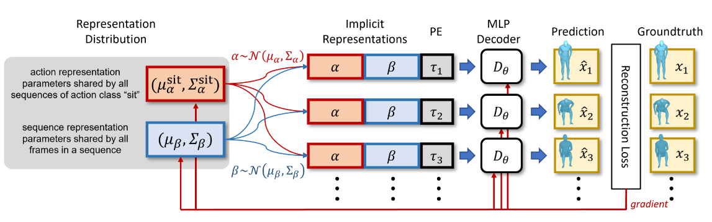
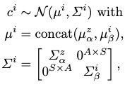
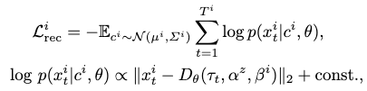
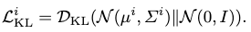
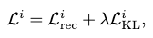
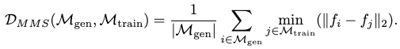

[P. Cervantes, Y. Sekikawa, I. Sato, and K. Shinoda, “Implicit Neural Representations for Variable Length Human Motion Generation.” arXiv, Jul. 15, 2022. doi: 10.48550/arXiv.2203.13694.](https://arxiv.org/abs/2203.13694)

## Problem
---
How to generate a motion sequence w.r.t. a given action class?

## Observations
---
1. Human motions vary in length depending on persons or action.
2. It's not obvious how a **motion autoregressor** can produce variable-length motion, and it also accumulates error.
3. **Transformer VAE** trained with variable-length motions produce pathologically static motions, the reason is unclear.
4. FID and Diversity scores are insensitive to detect simply reproduced motions as poor generation, since they **only compare distribution similarity** between the generation set and the training set.

## Assumptions
---
1. A suitable motion generative model yields **"good" distributions** of motion representations in a latent space.
2. These distributions can be well approximated with a **GMM model**.
3. Definition of **"good"**: the **distance measure** of these representations corresponds to **semantic similarity**, and generation of new motions can be achieved through **interpolations**.
4. Motion representation can be correlated with motion length **explicitly**, e.g. a person sitting slowly should be semantically closer to a person sitting quickly, but further from a person running.

## Contributions
---
1. An action-conditioned **motion generator** based on interpolating the variational implicit neural representations (INR) of motion sequences.
2. A novel metric, **Mean Maximum Similarity (MMS)**, to measure the distinctiveness of generated motions from training data reproductions, i.e. to avoid cheating by reconstruction of existent motions.

## Pipeline
---

### Explicit Decomposition of Motion Representation Codes
A desired motion representation is produced in form of a latent code. To explicitly model the conditions of motion length and action class, the following decomposition is made to subdivide the code into three pieces **for each frame of a motion sample**:
1. An action class code $$\alpha$$, which is shared across frames and across samples of the same class.
2. A sample-wise code $$\beta$$, which is shared across frames among a **single** sample.
3. A timestamp code $$\tau_t$$, which is specified frame-wise in the form of positional embeddings.

### Variational Motion Code Distribution
As each sample is viewed as being realized from a distribution, we need to model a distribution for each sample to **allow the modeling of the joint distribution of all motion representations in the latent space**, as assumption 1 desires.

Following assumption 2, we reparameterize this distribution as a normal distribution. Specifically, we draw one normal distribution for $$\alpha$$ and one for $$\beta$$.

This reparameterization gives us the parameters $$(\mu_\alpha, \Sigma_\alpha)$$ for each action class, and $$(\mu_\beta, \Sigma_\beta)$$ for each sample.

To respect assumption 3 for semantic similarity, we further **regularize** our motion code distributions by formulating the entire code as a normal distribution:

where $$c$$ is the sampled motion code, $$i$$ is the sample index and $$z$$ is the class index.

To make the computation tractable as a motion code is quite lengthy, we **restrict each $$\Sigma$$ to be diagonal for every normal distributions ever defined in the entire model of MotionINR**. This means we **ignore structural correlations** among the different positions within a motion code.

### Encoder-less Training
Since we are modeling a sample-wise implicit representation, there is no need for an encoder as needed in VAEs, where explicit features across samples must be extracted first to summarize the motion code distributions. For MotionINR, only a decoder is sufficient, and the architecture can be chosen to be an overparameterized MLP or Transformer.

The decoder tries to reconstruct the ground-truth motion sequence from its motion code, which is sampled from the sample-wise distribution. Then both the decoder and the motion code distribution is optimized with the resultant reconstruction loss:

i.e. a sum of mean square errors for each frame's reconstruction.

#### Variational Loss as a Further Regularization
To further regularize the joint motion code distribution, s.t. semantic meanings are preserved with distance measures, we enforce a variational loss where a simple and compact representation space is encouraged. This is done by assuming a prior of each INR distribution as a standard normal:

Thus, our total loss becomes:

#### Alternative Optimization
This optimization can be carried out **alternatively**, where we update the motion code distribution by keeping the decoder's parameters fixed, and then vice versa. The alternative ratio (how many optimization steps for each set of parameters) is specified arbitrarily, although in experimentation the authors keep it to be $$1:1$$.

### Motion Generation via Conditional GMM
There is a concern that the conditions of **sequence-length and action class might be entangled** in a motion code distribution. Therefore, the action-conditioned distribution formed from such sample-wise distributions may differ from the standard normal distribution.

To decompose the controlling conditions clearly, we try to fit a conditional GMM to the sequence-wise motion codes sampled 50 times each from their distributions.

We first construct subsets of these motion codes to fall in different action classes $$z$$. To **isolate the motion-length condition from the action class**, we further divide each subset to sub-subsets which only have a sequence length within $$[T, T+\Delta T]$$, where $$\Delta T$$ is chosen s.t. **a arbitrary minimum number of samples exist in each sub-subset**.

We then fit an **independent** GMM to each individual sub-subsets.

Provided with a specific action class and a sequence length, we just need to look up for the appropriate GMM and sample from it to generate the new motion sequence.

## Extensions
---
### Mean Maximum Similarity
As stated in observation 4, by increasing the number of components for our GMMs, we can fit the training distribution better, but also **risk fitting a GMM that only reproduces the motions in the training set**.

To detect such a potential "cheating" from the MotionINR, a metric so-called Mean Maximum Similarity (MMS) is proposed.

The features used by FID are extracted from both the training and generation sets first. MMS is then computed by comparing the **mean feature distance** of all generated motions' **smallest feature distances** towards the training set samples. Formally MMS is expressed as:

For a motion generator that just reproduces the training set motions, MMS should be very low. However, MMS for MotionINR proves to sufficiently high, especially when compared with ground-truth and other VAE generators' baselines.
