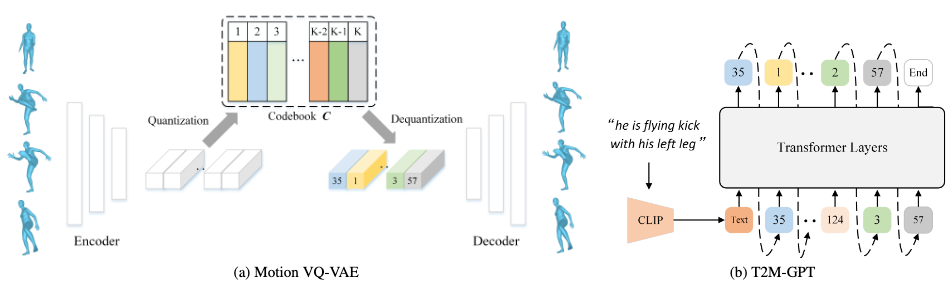
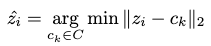
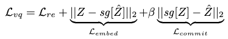
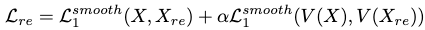
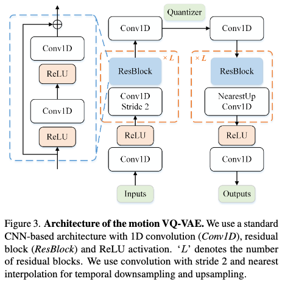
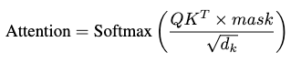
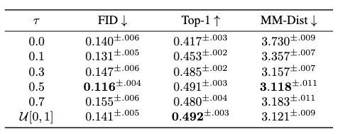
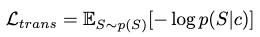
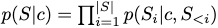
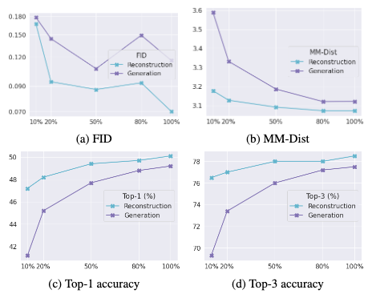

[J. Zhang et al., “T2M-GPT: Generating Human Motion from Textual Descriptions with Discrete Representations.” arXiv, Feb. 28, 2023. doi: 10.48550/arXiv.2301.06052.](https://arxiv.org/abs/2301.06052)

## Problem
---
How to generate a human motion sequence w.r.t. its textual descriptions?

## Observations
---
1. The choice of $$L_1$$ smooth loss has **significant impact** for optimizing the motion reconstruction models used.
2. Enforcing additional reconstruction on motion velocity during VQ-VAE training enhances generation quality.
3. Naive training of VQ-VAE suffers from codebook collapse.

## Assumptions
---
1. Motion sequences can be well represented by discrete code sequences.
2. Larger training data can lead to higher performance of T2M-GPT, i.e. the information contained in current datasets (HumanML3D and KIT-ML) are insufficient.

## Contributions
---
1. A motion generator based on the classic generative model: vector quantization variational autoencoder (VQ-VAE) and generative pretrained transformer (GPT).
2. Superior performance of T2M-GPT **questions the dominance of recent diffusion models** for motion generation.

## Pipeline
---

The model contains two modules:
1. A VQ-VAE to map motion data to their discrete code representations.
2. A T2M-GPT module to map text descriptions to discrete motion codes, which are then reconstructed by VQ-VAE to motion sequences.

### VQ-VAE
A VQ-VAE learns discrete representations for generative models.

Given a motion sequence $$\mathbf{X} = [\mathbf{x}_1, \mathbf{x}_2, \cdots \mathbf{x}_T]$$ where $$\mathbf{x}_i \in \mathbb{R}^d$$ contains the $$d$$ pose parameters for the $$i$$-th frame, the model first maps it to a sequence of latent features $$\mathbf{Z}=[\mathbf{z}_1, \mathbf{z}_2, \cdots, \mathbf{z}_{T/l}]$$ through an **encoder**, where $$l$$ is the downsampling rate of the encoder.

Next, $$\mathbf{Z}$$ is passed through a **quantizer** which maintains a codebook of representative latent features $$C= \{ c_k \}^K_{k=1}$$. We find the most similar features w.r.t. each code in $$\mathbf{Z}$$:

Finally, the quantized code sequence $$\hat{\mathbf{Z}}$$ is passed through a **decoder** to reconstruct the motion sequence. Notice that $$\hat{\mathbf{Z}}$$ serves as our **final representation for a motion sequence**.

#### Training
The original VQ-VAE is trained mainly through three losses:
1. A **reconstruction loss**, which is used to train the **encoder and decoder**.
2. An **embedding loss**, which is used to update the **codebook** since the reconstruction loss doesn't back-propagates to the codebook.
3. A **commitment loss**, which serves as a regularization to encourage the **encoder** to commit to a particular code.

Together, these terms form the total loss:

where $$sg$$ is the stop-gradient operator that keeps back-propagation updates out of its operand during optimization, by fixating the parameters of the operand.

Notice that in the original VQ-VAE paper, the authors found the training result quite insensitive to the hyperparameter $$\beta$$.

The **best codebook is found to have a capacity of 512 codes** in ablation studies, which allows for the lowest FID and highest top-1 score in HumanML3D. This is intriguing since higher capacity actually lowers the performance, which suggests that the codebook can trigger overfitting/mode-collapse of the generative model.

##### Extra Regularization in Reconstruction Loss
By observations 1 and 2, the reconstruction loss is defined by two **$$L_1$$ smooth losses** on the reconstructed static poses and frame-to-frame velocities, w.r.t. the original motion data:

The inclusion of velocity reconstruction is shown to enhance the reconstruction performance.

The balancing hyperparameter $$\alpha$$ is shown to be best set as 0.5, and the model is quite sensitive to this hyperparameter. Setting it to 0 and 1 typically yields poorer performance in FID, but no significant change in top-1 score. However, when coupled with $$L_2$$ loss a higher $$\alpha$$ seems to provide better results.

##### Architecture

Simple 1D convolution blocks are utilized along with residual connections in the VQ-VAE's architecture. Architectures based on transformer are **not investigated** in this research.

##### Codebook Collapse
A naive training of the VQ-VAE suffers from **codebook collapse** (observation 3). There are two common ways to alleviate this issue:
1. Exponential Moving Average (EMA), which makes the codebook evolve exponentially as $$C^t \leftarrow \lambda C^{t-1} + (1-\lambda) C^t$$.
2. Code Reset, which finds inactive codes and reassigns them according to input data.

The best result is obtained by **employing both remedies** when optimizing the quantizer.

### T2M-GPT
A T2M-GPT is used to predict a VQ-VAE codebook index sequence $$S=[s_1, s_2, \cdots, s_{T/l}, End]$$ **autoregressively as a next-token prediction task**, with an additional $$End$$ token to denote the stop of motion generation.

$$S$$, projected back into latent code sequence $$\hat{\mathbf{Z}}$$ by the codebook $$C$$, is then fed to the VQ-VAE decoder to reconstruct the final motion sequence.

T2M-GPT acts **as a head module on top of the CLIP GPT**. It takes in the embeddings produced by CLIP from the text descriptions.

#### Causal Self-attention
The self-attention is computed as the causal self-attention:

where $$mask$$ ensures that future information is not allowed to attend the calculation of current tokens, making the token-prediction task autoregressive during inference.

#### Corrupted Sequence for Training-testing Discrepancy
During training, the $$i-1$$ codebook indices are **always correct**, i.e. proved by the reconstruction optimization from VQ-VAE and always excerpted from ground-truth motion codes. The $$i$$-th index is then predicted with these totally correct conditions.

During testing, however, we **cannot guarantee that the previous conditions are correct**, since they are **all predicted** in an autoregressive manner.

Therefore, to compensate for this discrepancy we employ a data-augmentation strategy by **corrupting the training index sequence** to be $$\tau \times 100\%$$ of the ground-truth sequence. This has proven to be helpful in boosting test performance.

An ablation study of $$\tau$$ is provided for the T2M-GPT's test set performance on HumanML3D dataset:

where an ideal performance is shown to happen under the situation where $$\tau$$ is kept as a constant 0.5 rate.

#### Training
A log-likelihood of generated data distribution is maximized w.r.t. the original motion data distribution:

where

and $$c$$ is the text embedding from CLIP.

## Extensions
---
### Impact of Data Size on T2M-GPT
It is shown that T2M-GPT improves its performance with more training data utilized in the HumanML3D dataset:

However, we observe most of the curves to be exponential rather than linear, which suggests a potentially overly optimistic statement from the authors, which states that even more data would continue to boost the model's performance **significantly**.

