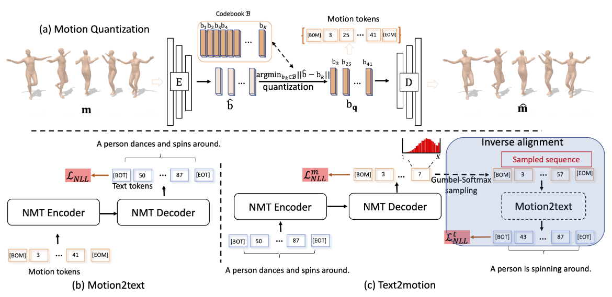
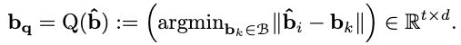
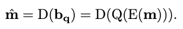
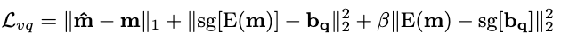
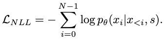
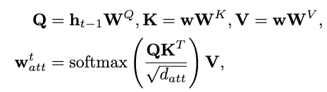
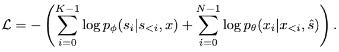

[C. Guo, X. Zuo, S. Wang, and L. Cheng, “TM2T: Stochastic and Tokenized Modeling for the Reciprocal Generation of 3D Human Motions and Texts.” arXiv, Aug. 04, 2022. doi: 10.48550/arXiv.2207.01696.](https://arxiv.org/abs/2207.01696)

## Problem
---
Given a textual description, how to generate the according motion sequence (text2motion) and vice versa (motion2text)?

## Observations
---
1. Existing methods integrating motion2text and text2motion have the following **caveats**:
	1. production of **static pose sequences** when motion lengths are **longer** than 3-4 seconds.
	2. requires **initial pose** and **target motion length**.
	3. uses **deterministic** mapping.
2. motion2text as an **auxiliary task** enhances the performance of the reverse text2motion task for the same model.

## Assumptions
---
1. Lifeless (static) motion synthesis is largely due to **direct use of raw 3D poses** for motion representation:
	1. contains **redundant** information.
	2. fails to capture **local contexts** of underlying motion dynamics.
2. Deterministic motion generation is opposing daily experiences, where multiple distinct motion styles often exist for a given textual description, i.e. there is a **one-to-many** relationship between text and motion (notice how this is different from the **many-to-many** assumption in [HumanMDM](/surveys/2023-9-8-HumanMDM.html)).
3. Conditioning on initial state and target length imposes **strict constraint** that makes motion generation **unfeasible**.
4. text2motion is typically a much **harder** problem than motion2text.
5. text2motion and motion2text can be posed together as a neural machine **translation** (NMT) problem.
6. Motion sequences can be well represented via motion tokens, which avoids the caveats in assumption 1 by capturing **local spatial-temporal contexts**.

## Contributions
---
1. A motion token representation that compactly encodes 3D human motions.
2. An NMT model that achieves good performance in both text2motion and motion2text tasks.

## Pipeline
---

The pipeline of TM2T follows a **preprocessing stage** and a **motion2text** stage, a **text2motion** stage and an **inverse alignment stage**. Arguably, the last two stages belong to the same text2motion model, but we specify them separately here to state the mapping logic clearly. In terms of models, here is the alternative overview:
1. A motion quantization model learns to map raw motions to motion tokens in the **preprocessing stage**.
2. A motion2text model learns to map motions to text descriptions in the **motion2text stage**, utilizing the pretrained quantization model to represent motions.
3. A text2motion model learns to map text descriptions to motions in the **text2motion and inverse alignment stages**. It employs the pretrained motion2text model as guidance to align the semantics of outputs with the original text. It utilizes the pretrained quantization model to represent motions.

### Preprocessing Stage: Motion Quantization
The motion quantization stage of TM2T is very similar to the one conducted by [T2M-GPT](/surveys/2023-9-2-T2M-GPT.html). A motion token is defined as a representation that captures **local spatial-temporal context** of a motion sequence, i.e. a "motion snippet" utilized by the [GuoChuan](/surveys/2023-9-7-GuoChuan.html) model. The idea is that we can **compress** these snippets into **lower-dimensional** latent features that capture the original information via an **autoencoder**.

A series of 1D convolutions are applied along time to compress a motion sequence (pose parameter sequence) of length $$T$$ and dimension $$D$$ via the encoder, and then deconvoluted through the decoder to reconstruct the motion sequence. This process yields latent features $$\hat{\mathbf{b}} \in \mathbb{R}^{t \times d}, t < T, d < D$$.

#### Quantization of Latent Features into Motion Tokens
A discrete quantization is applied to the latent features $$\hat{\mathbf{b}}$$ s.t. we can represent the motions as a **semantic** motion token sequence during inference, where each motion token represents a specific motion context. Moreover, with vector quantization we can straightforwardly **specify explicit \[BOM\] and \[EOM\] tokens as starting and ending motion contexts, thereby implicitly modeling a variable-length motion generation process by next-token prediction**.

The discrete quantization is done by constructing a **codebook** $$B=\{\mathbf{b}\}_{k=1}^k$$ s.t. each latent feature $$\hat{\mathbf{b}}_i$$ is mapped to its **nearest neighbor** in $$B$$, which can be formally formulated as the quantization process $$Q(\cdot)$$:

The entire reconstruction process is then:

where $$E$$ is the encoder process and $$D$$ the decoder process.

#### Training
All the parameters in $$E, Q, D$$ can be trained by a reconstruction loss combined with commitment loss terms that encourage latent alignment with the codebook:

where $$sg$$ is the stop-gradient operator to prevent gradient back propagation to certain modules, and $$\beta$$ is a balancing hyperparameter.

During inferences of all later stages, a motion can be represented by a sequence of discrete codebook indices $$s \in \{  1, \cdots, \vert B \vert \}^t$$, i.e. the **motion tokens**.

The authors uses $$t=\frac{T}{4}$$ in their experiments, i.e. each motion token covers a 4-frame (0.1s) context in a 24-frame-per-second motion sequence. **No ablation study is conducted** for finding optimal context lengths.

### Motion2text Stage
The motion2text model is a **transformer** which performs the **next-token prediction** task. Given a motion token sequence $$s$$, the decoder predicts a probability distribution $$p_\theta(x \vert s)=\prod_i p_\theta(x_i \vert x_{<i}, s)$$ of the next token at each step, finally resulting in a sequence of text tokens $$x \in \{  1, \cdots, \vert V \vert \}^N$$, where $$V$$ is the word vocabulary and $$N$$ the total number of words in this text.

#### Training
The training goal is to **maximize** the log-likelihood of the generated sequence w.r.t. the target sequence:

### Text2motion Stage
For the text2motion task, a similar next-token predictor is proposed. The model of this task can be either transformer-based or GRU-based.

For the GRU-based model, a bi-directional GRU first models the temporal dependency by extracting a sentence feature vector (global context) $$\mathbf{s} \in \mathbb{R}^{d_l}$$ and multiple word feature vectors $$\mathbf{w} \in \mathbb{R}^{N \times d_l}$$, where $$d_l$$ is the embedding dimensionality.

An NMT decoder then takes $$\mathbf{s}$$ and $$\mathbf{w}$$ to predict the probability distribution of the next motion token autoregressively. Since at different timestamps, different word vectors $$\mathbf{w}$$ are needed, an extra attentive mechanism is introduced to the hidden state of the decoder at each timestamp to implicitly model this attentioning process:

where $$\mathbf{h}_{t-1}$$ is the previous hidden state, $$\mathbf{W}$$ the trainable weights of the attention mechanism and $$\mathbf{w}^t_{att}$$ is the attention vector injected at each time step of the GRU. Again, this mechanism is also present in the motion generator module of the [GuoChuan](/surveys/2023-9-7-GuoChuan.html) model.

The motion token is sampled from the predicted distribution $$p_\phi(s_i \vert s_{<i}, x)$$ recursively until $$[EOM]$$ is reached with maximum probability.

### Inverse Alignment Stage
Now that we have the generated motion token sequence, the pretrained motion2text model can be reused to ensure that similar semantics are shared between these two tasks, which leads to **enhanced performance of both tasks** as stated by observation 2 through experiments.

The transformer-based text2motion model is hard to optimize in this process because with the typically needed **full teacher force** in training transformers, each time the **entire history** must be passed through the feedforward process, which makes the computation graph **intractable** for optimization of the text2motion model. Thus, the authors only experimented with the GRU-based model.

The ideal pipeline here is to first pass the motion token sequence through the frozen motion2text model, obtain the generated text, and then compare with the original given text for loss. However, we face the problem of using a quantized discrete motion token sequence: the quantization process is non-differentiable and thereby breaks the back-propagation that is intended to optimize text2motion.

In light of this problem, a **Gumbel-Softmax reparameterization trick** is utilized to "reverse engineer" the original discrete sampling process, such that it's now recorded by the computational graph and allows back propagation. This trick is similar to the reverse engineering of rasterization process in many differentiable renderers.

#### Training
Now that the problem is (relatively) solved, we can derive the following negative log-likelihood loss for training the text2motion model:

The first term is the prediction loss in the text2motion stage, and the second term is the reconstruction loss in the inverse alignment stage.

## Extensions
---
### Model Performance
Both quantitative and qualitative experiments reported that TM2T has achieved superior performance on both the motion2text and text2motion task. This indicates that the two tasks reciprocate each other well.

Remarkably, the motion2text task is boosted to have an advantage of more than $$20\%$$ for the top-1 R precision comparing with baseline models.

Moreover, the inclusion of motion tokens has led to significant boosts of performance in both tasks.

Arguably, the motion2text model doesn't benefit from the reciprocation. This is because its parameters are not updated in the inverse alignment stage. Thus, we should be careful not to attribute its superior performance to anything other than its architecture and utilization of the preprocessed motion tokens.

