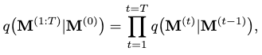
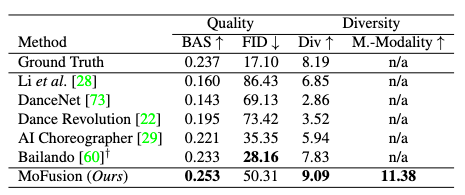

[R. Dabral, M. H. Mughal, V. Golyanik, and C. Theobalt, “MoFusion: A Framework for Denoising-Diffusion-based Motion Synthesis.” arXiv, May 15, 2023. Accessed: Sep. 23, 2023. [Online]. Available: http://arxiv.org/abs/2212.04495](https://arxiv.org/abs/2212.04495)

## Problem
---
Given a piece of dance music audio, how to generate a dance motion sequence (music2motion)?

Given a text description, how to generate a motion sequence (text2motion)?

How can we accomplish some **interactive** motion editing tasks such as seed-conditioned motion synthesis and motion in-betweening?

What's a generic framework that could be utilized to learn each of these tasks separately **without changing the pipeline or architecture**?

## Observations
---
1. Diffusion-based models are well suited for **a wide range** of conditional motion synthesis tasks, including motion generation and interactive motion editing. It can accomplish these tasks **without** changing its pipeline or architecture. This observation is also made by [HumanMDM](/surveys/2023-9-8-HumanMDM.html).
2. Conditional VAE methods for motion synthesis and normalizing flows have to deal with **trade-off** between synthesis quality and richness of the latent space, i.e. diversity.

## Assumptions
---
1. The inclusion of **kinematic losses** can **improve** the performance of **all** motion synthesis tasks under the questions concerned.
2. A **time-varying weighting scheme** of the kinematic losses can be employed to incorporate them into the training pipeline of a diffusion model. This scheme **mitigates** the issue of **over-penalizing the denoised motion in the early stages of the denoising process**.
3. **1D convolutional U-Nets** can model the **temporal** diffusion process well, although they have **only been substantiated as appropriate** with **spatial** diffusion processes in tasks such as image generation.
4. The **large latent space** implicitly modeled in the U-Net avoids tradeoff between synthesis quality and diversity.

For assumption 3, it can be argued that the U-Net convolutions serve a similar purpose of capturing **local spatial-temporal contexts** for the given motion implicitly. This is similar to the motion snippet (vector quantization) technique used in [T2M-GPT](/surveys/2023-9-2-T2M-GPT.html) and [TM2T](/surveys/2023-9-21-TM2T.html). We can view both processes as modeling **local context capturing** during their motion synthesis.

By modeling the local context capturing **explicitly**, the quantization models can assume more control of the motion expressions, which means they have **maximum reusability**. That's why it's often treated as a separate preprocessing step in most of these methods.

By modeling the local context capturing **implicitly**, the U-Net model doesn't yield reusable motion expressions. This implies that the entire motion synthesis process **must happen in one integrated model**, making optimization of this model **much more complicated**, e.g. searching for optimal context scope essentially becomes neural architecture search (NAS), which explodes in complexity. However, **with the entanglement of motion expression and motion synthesis, we arrive at the benefit of generalizability of the model to different tasks.**

Therefore, I'd like to argue that the "general framework" here is not a very "neat" answer to the last question we have asked in the question definition: if your answer to making a general model is simply **throwing all ingredients into a single pot**, then very soon you will find that pot **cooking all flavors into one flat taste**. This is often **not what we wanted**: in most cases, when referring to a general framework, we want **a kitchen instead of a pot, which guarantees to deliver tasty, diverse dishes on an exhaustive menu**. For a kitchen, we should at least have **multiple pots, several stoves, and a full set of cutleries**. See the difference here?

## Contributions
---
1. A general framework model for learning motion synthesis tasks such as music2text, motion2text and interactive motion editing, albeit needing **retraining** for each task.

## Pipeline
---

The entire pipeline of MoFusion is a denoising diffusion process consisting of a forward diffusion process and a backward denoising process.

Given a conditioning signal $$\mathbf{c} \in \mathbb{R}^{k \times d}$$, the goal is to synthesize human motion $$\mathbf{M}^{(0)}$$ as a pose parameter sequence $$\{ \mathbf{m}_1, \cdots, \mathbf{m}_N \}$$.

### Forward Diffusion Process
The forward diffusion process is formulated as a consecutive addition of Gaussian noises to the clean motion at each diffusion step $$t$$, turning it into a normal distribution at the last step $$T$$:

where

and $$\beta_t$$ is a hyperparameter to schedule the diffusion rate, i.e. the variance scheduler.

To make the diffusion process simpler, we can use a reparameterization trick that allows sampling computation at any diffusion step $$t$$ **directly from the clean motion $$\mathbf{M}^{(0)}$$**:

where $$\epsilon$$ is a random noise matrix and $$\bar{\alpha}_t = \prod_{s=0}^t(1-\beta_s)$$.

### Backward Denoising Process
To restore the clean motion from the completed corrupted motion $$\mathbf{M}^{(T)}$$, we need to iteratively denoise it along the time steps until we reach step 0. This denoising process can be formulated as:

We can model the transition probability of $$p(\mathbf{M}^{(t-1)} \vert \mathbf{M}^{(t)} )$$ as a **conditional** probability mapping function $$f_\theta(\mathbf{M}^{(t-1)} \vert \mathbf{M}^{(t)}, t, \mathbf{c})$$. We then approximate $$f_\theta$$ with a neural network, which we call MoFusion.

Specifically, we choose the formulation of $$f_\theta$$ as subtracting a noise $$\epsilon$$ from the $$\mathbf{M}^{(t)}$$ sample.

#### Architecture of MoFusion

A 1D convolutional U-Net architecture is adopted for MoFusion to respect assumption 3.

For each denoising step, we first add the input motion $$\mathbf{M}^{(t)}$$ with the current denoising time step $$t$$ as a positional embedding, and then pass it through the U-Net blocks.

For each U-Net block, after a 1D convolution/deconvolution (ResNet block), a **cross-modal transformer** is utilized to correlate the motion feature with the condition $$\mathbf{c}$$. This transformer only keeps the standard cross-attention part:

where $$W$$ keeps the attentional weights of the cross-attention process. The attention is then computed as:

#### Training
Following assumptions 1, **kinematic losses** are added alongside the denoising loss for each denoise step. The total loss is defined as:

where $$\mathcal{L}_{da}$$ is the data (denoising) loss and $$\mathcal{L}_k$$ is the total kinematic loss.

Following assumption 2, $$\lambda^{(t)}_k$$ as a **time-varying weight** is added to mitigate the problem where in earlier stages the denoised motion is still very noisy, and cannot be heavily penalized by the full kinematic loss because of this prematurity. We simply keep the penalization amount consistent with the **diffusion variance scheduler** by setting $$\lambda^{(t)}_k = \bar{\alpha}_t$$.

Of course, since we are only estimating the noise term $$\epsilon$$, the kinematic losses, which are defined for motions, are evaluated on the restored $$\hat{\mathbf{M}}^{(0)}$$ from $$\epsilon$$ at each time step, where:

Next, we are gonna introduce the three kinematic losses considered by MoFusion.

##### Skeleton Consistency Loss $$\mathcal{L}_s$$
This loss, termed $$\mathcal{L}_s$$, ensures the **bone lengths remain consistent over time** in the synthesized motion. The objective is to **minimize the temporal variance of bone lengths $$l_n$$**:

where $$\bar{l}$$ is the vector of mean bone lengths and $$n$$ is the number of bones.

##### Anatomical Constraint $$\mathcal{L}_a$$
The anatomical constraint **penalizes left/right asymmetry of bone lengths**. This is accomplished by:

$$\mathcal{L}_a = \vert\vert BL(j_1, j_2) - BL(\delta(j_1), \delta(j_2)) \vert\vert,$$

where $$BL(\cdot,\cdot)$$ computes the bone lengths between input joints and $$\delta(\cdot)$$ provides the symmetrically opposite joint of a given joint.

This loss should be minimized.

##### Ground-truth Supervision on Motion Synthesis $$\mathcal{L}_m$$
This loss is simply the LSE with ground-truth, i.e. clean motion $$\mathbf{M}^{(0)}$$:

Summing up all the losses, the final kinematic loss $$\mathcal{L}_k$$ is given as:

$$\mathcal{L}_k = \mathcal{L}_s + \lambda_a \mathcal{L}_a + \lambda_m \mathcal{L}_m,$$

where the blending weights are given by the hyperparameters as $$\lambda$$s.

## Extensions
---
### Performance on Music2motion
The music2motion task of MoFusion represents the audio input as **Mel spectrogram** rather than MDCC features with music specific features such as beats or tempograms used by other music2dance methods. This representation **models the music context extraction exclusively as an implicit process for the U-Net**.

The Beat Alignment Score (BAS) measure the mean distance between each kinematic beat and the music beat for synchronization judgement:

where $$b$$ represents the beat position and $$\sigma$$ is kept to be 3 in all experiments.

The AIST++ dataset is used for experiments, whereby MoFusion shows a better performance on BAS and Diversity scores than the current SOTA, Bailando. It performs poorer than Bailando on the FID. For the first time, we are also able to measure a multi-modality score.

Qualitative results show that other methods such as Bailando and AI-Choreographer produce **repetitive, loopy** dance motions while MoFusion doesn't have this caveat. Although I personally observe a lot of unnatural twitching and foot sliding for MoFusion.

### Performance on Text2motion
HumanML3D is used as the training and evaluation dataset for the text2motion task.

I ask the reader to **take caution here: many SOTA models are NOT included in the following table**, such as [T2M-GPT](/surveys/2023-9-2-T2M-GPT.html) and [MotionDiffuse](/surveys/2023-8-26-MotionDiffuse.html). These models have achieved superior quantitative performance than the baseline models compared against by MoFusion.

Judging by the date of publication, which is **well after** these other SOTAs are published, I express my concerns for this behavior. Especially, the authors are comparing their qualitative results against MotionDiffuse in their user study, but have chosen to **omit this model in the quantitative comparison**. What's the point of this omission here? The explanation is not found in the original paper.

For qualitative comparison, the user study shows a preference of MoFusion to MotionDiffuse and T2M in the survey, however, when compared with the ground-truth, the preference is still low for MoFusion.

### Interactive Motion Editing
There are two kinds of interactive motion editing experimented: **seed-conditioned motion synthesis** and **motion in-betweening**. The former synthesizes future motions given a sequence of initial motion frames. The latter synthesizes in-between motions given a set of fixed keyframes.

Both tasks can be accomplished by **injecting the given frames into the denoising process by replacing the denoised frame at the given time steps**.

