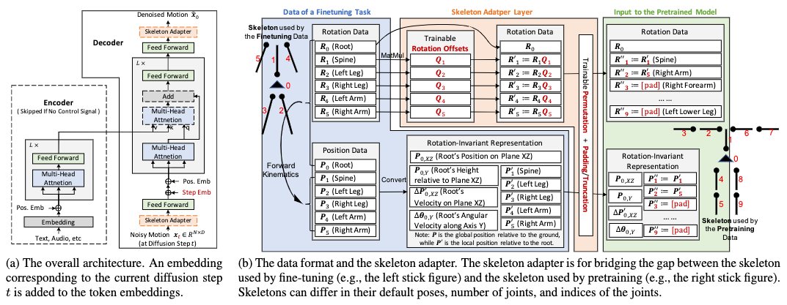
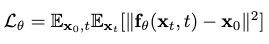
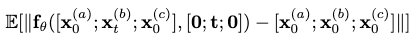
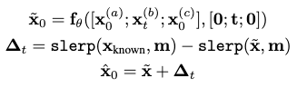
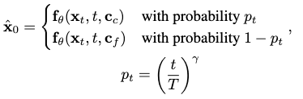

[J. Ma, S. Bai, and C. Zhou, “Pretrained Diffusion Models for Unified Human Motion Synthesis.” arXiv, Dec. 06, 2022. doi: 10.48550/arXiv.2212.02837.](https://arxiv.org/abs/2212.02837)

## Problem
---
How to generate a human motion sequence w.r.t. **mixed** multi-modal control signals, such as music or text?

## Observations
---
1. **Pretraining** is important for **scaling up** diffusion-based motion generation models without overfitting.
2. The challenges of deriving a **generic** motion synthesis model is two-fold:
	1. Diverse motion synthesis tasks not only have control signals of **different modalities**, but also signals of **different granularities**.
	2. Motion datasets are notorious for not following the **same convention for motion representation**, i.e. the **skeleton** is different from set to set.

## Assumptions
---
1. A **diffusion-based model** is an appropriate process for approximating a generic, multi-task motion synthesis model.
2. **Zero-shot learning of a new task** can be achieved by a model learning multiple other correlated tasks, such as learning **mixed-signal** motion generation from learning music2motion and text2motion **separately**.
3. In a diffusion model, a zero-shot learning task can be achieved via an **alternating control** scheme between different signals.
4. A trainable **skeleton adapter** can be learned for **automatic motion retargeting** between motions represented by different skeletons.

## Contributions
---
1. A generic motion synthesis framework, MoFusion, which achieves good performance on text2motion and motion in-betweening tasks.
2. An **alternating control scheme** for enabling motion synthesis tasks conditioned by **multiple control signals with different modalities and granularities**.
3. A **learnable skeleton adapter** to bridge the gap between different motion datasets, which in turn allows for automatic, unified data preprocessing.

**Contribution 1 should be taken with caution as the main author stopped pursuing this research** and the experiments in the preprint are too weakly conducted to be convincing. I mainly introduce a survey for this paper because of its automatic skeleton adapter and, most importantly, the alternating control scheme, which is novel in diffusion-based models.

## Pipeline
---

The basis of the MoFusion model follows the DDPM model for its forward diffusion process and backward denoising process. I will save the trouble of repeating how these processes are modeled, as you can recollect them in the surveys of [MotionDiffuse](/surveys/2023-8-26-MotionDiffuse.html).

Any motion synthesis task given to MoFusion goes through three stages: preprocessing, pretraining and finetuning.

In the preprocessing stage, motion data from multiple datasets (AMASS, LaFAN1, KIT, BABEL, Mixamo, 100STYLE, AIST++, ChoreoMaster) are gathered. As these datasets **model motions with different skeletons**, a learned **skeleton adapter** is employed to map the motion representations to a unified expression via the SMPL-H skeleton model.

In the pretraining stage, either conditioned or unconditioned motion generation task is conducted according to the availability of each dataset's annotations. The control signal can be either text description or music. A **classifier-free guidance** is further devised for conditioned tasks, similar to the one employed by [HumanMDM](/surveys/2023-9-8-HumanMDM.html).

In the finetuning stage, any specific motion synthesis task is learned by finetuning the pretrained MoFusion model. Remarkably different from [HumanMDM](/surveys/2023-9-8-HumanMDM.html) or [MoFusion-MP](/surveys/2023-9-23-MoFusion-MP.html), MoFusion **doesn't require drastic retraining, but only finetuning**. This means **most computational architecture learned in pretraining can be reused, and multiple finetuning tasks can be conducted concurrently by the same model with enough scalability**.

I believe this reusage capability is mostly due to the large scalability of MoFusion parameters thanks to the avoidance of overfitting from pretraining. The model simply has more parameters for modeling different motion synthesis processes.

The same might not be true for the other "generic" motion synthesis models mentioned, although we need experiements to prove this point.

### Preprocessing Stage
MoFusion represents motion via a sequence of pose parameters. Each pose parameter is a $$D$$-dimensional vector composed of the following data:
1. The **joint rotations** as 6D vectors, i.e. concatenation of the first two columns of the $$3\times3$$ rotation matrices:
	1. Root joint rotation in global space.
	2. Other joint rotations relative to their parent joints.
2. The **root joint position** in global space.
3. The **bone lengths** of the skeleton model.
4. The redundant **joint positions** in global space, which are needed by **inverse kinematic** synthesis tasks.

#### Skeleton Adapter
There are three major challenges for automatically adapting the different skeleton animations to the SMPL-H model for data preprocessing:
1. Different skeletons have **different bone lengths**.
2. Different datasets use **different default positions** for their skeletons.
3. Different skeletons have **different number** and **different indices** of joints.

Difference 1 is mitigated by **rescaling the skeletons to the same height**, as the body shapes of different skeletons are similar.

Difference 2 is mitigated by **offsetting each joint rotation with an extra, learned rotation $$\mathbf{Q}_j$$** to compensate for change of default poses. MoFusion "sees" each input joint rotation as $$\mathbf{R}_j\mathbf{Q}_j$$. The original dataset sees each output joint position $$\mathbf{R}^\prime_j$$ from MoFusion as $$\mathbf{R}^\prime_j\mathbf{Q}^{-1}_j$$.

To treat difference 3, we first **group the joints into 6 groups**: left leg, right leg, spine, left arm, right arm and optionally the head. For each group, suppose the unified SMPL-H skeleton has $$n_p$$ joints and a specific dataset's skeleton has $$n_f$$ joints. For each such pair, if $$n_p \neq n_f$$, a matrix $$\mathbf{M}\in \mathbb{R}^{n_p \times n_f}$$ is **learned** to map the joints in the **one-to-many** relationship. Notice that this mapping is **discretely represented** by $$\mathbf{M}$$, i.e. it performs permutation and truncation/padding of the original joint sequence.

Suppose the original pose parameters of each group are arranged in $$\mathbf{P}\in\mathbb{R}^{n_f \times d}$$. MoFusion sees each $$\mathbf{P}$$ as $$\mathbf{M}\mathbf{P}$$, while the dataset sees each output $$\mathbf{P}^\prime \in \mathbb{R}^{n_p \times d}$$ as $$\mathbf{M}^+\mathbf{P}^\prime$$, where $$\mathbf{M}^+$$ is the pseudo inverse of $$\mathbf{M}$$.

Therefore, only the parameters in the last two differences need to be trained. **The training is accomplished together with the backbone model** of MoFusion, where the skeleton adapter serves as an upstream submodule in the computational graph.

### Pretraining Stage
In the pretraining stage, the major objective is to optimize the parameters of a **backbone** model in MoFusion with a generic **motion generation task**.

The backbone models the **iterative denoising process** in a DDPM. It approximates the denoising function $$\hat{\mathbf{x}}_0=f_\theta(\mathbf{x}_t, t, \mathbf{c})$$, with the condition $$\mathbf{c}$$ being one of the following options:
1. $$\emptyset$$ for unconditioned motion generation.
2. text embeddings for text2motion.
3. music representations for music2motion.

#### Classifier-free Guidance
A classifier-free guidance is provided when $$\mathbf{c} \neq \emptyset$$. Each $$\mathbf{c}$$ can be **dropped** with a probability of .5 to make the generation unconditioned during pretraining.

#### Backbone Architecture
The architecture of the backbone follows a **classic transformer**, whereby a motion sequence is treated as $$N$$ tokens, with each token being a $$D$$-dimensional vector of pose parameters. **In other words, no extra motion representation processing is proposed.**

#### Training
The following denoising loss is utilized to optimize MoFusion during pretraining:

### Finetuning Stage
Multiple finetuning tasks are proposed in this stage and are conducted **concurrently** on MoFusion, i.e. without finetuning different copies of the same model.

These tasks can be grouped into two major categories: conditioned motion generation and motion editing.

#### Conditioned Motion Generation Tasks
Two tasks are finetuned: text2motion and music2motion.

Text2motion is carried out on the KIT-ML dataset by minimizing the $$l_1$$ loss rather than the $$l_2$$ loss for the denoising loss.

Music2motion is carried out on AIST++, whereby the control signal is encoded by a feature extractor devised by previous works.

#### Motion Editing (Conditioned Motion In-betweening)
Known frames of the target motion are injected into the denoising process for motion in-betweening.

The finetuning objective is devised as:

where $$\mathbf{x}_0^{(a)}$$ and $$\mathbf{x}_0^{(c)}$$ are the known frames.

The authors reported a noticeable degradation of performance for motion in-betweening without finetuning, whereby the in-painted motions have **discontinuity on their boundaries with the injected frames**, i.e. lacking smooth transitions.

To further mitigate this transition issue, the **delta in-painting** trick is proposed as a **post-processing** process:

where we enforce smoothness by compensating the in-painted motion frames with corrections from the Slerp interpolated frames between the known frames on both of its boundaries.

Even after MoFusion is finetuned for motion in-betweening, this preprocessing is still kept.

## Extensions
---
### Zero-shot Generalization
As assumption 2 suggests, we attempt to accomplish zero-shot learning of three novel tasks for MoFusion.

#### Body Part Modification
This is achieved by injecting known motion frames **partially**, i.e. only with known data on some parts of the pose. This process, like motion in-betweening, can additionally be conditioned by a control signal.

#### Inverse Kinematics
Constraints of certain joint positions are passed to MoFusion in a similar manner as body part modification. However, since the joint positions are fixed instead of joint rotations here, the final result computed from forward kinematics can result in a deviation from the desired constraints because MoFusion regresses for joint rotations **independently** from joint positions.

As such is the case, **extra post-processing** is needed to respect the constraints, which is accomplished by refining the predicted parameters via minimizing the $$l_1$$ loss incurred from the constraints, in a manner of **gradient descent**.

In other words, for the IK task, MoFusion can only provide an **inexact guess** of the FK process.

#### Mixing Control Signals
Two control signals are attempted to be mixed to condition the motion generation of MoFusion: text and music.

We first notice that these signals **describe motion in different granularities, i.e. details**. The text $$\mathbf{c}_c$$ offers coarse granularity description while music $$\mathbf{c}_f$$ offers fine granularity description.

As such is the case, we propose the following **alternating control scheme**:

where $$\gamma$$ is a hyperparameter that controls the rate of probability decay between the denoising steps.

Essentially, the denoising process gradually favors the fine granularity control signal in its iterations, befitting its own coarse-to-fine behavior of probability mapping. A larger $$\gamma$$ accelerates this favoring, while a smaller value discourages it.

