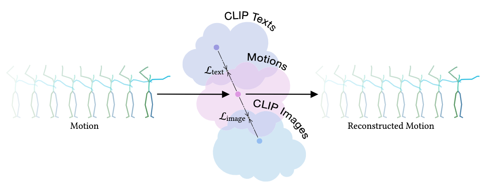
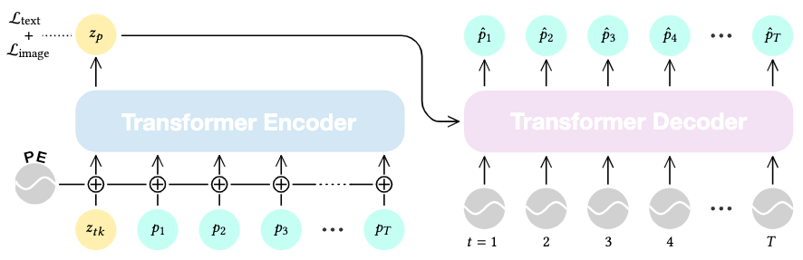
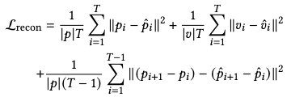
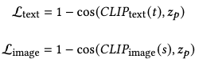
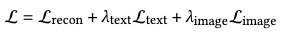
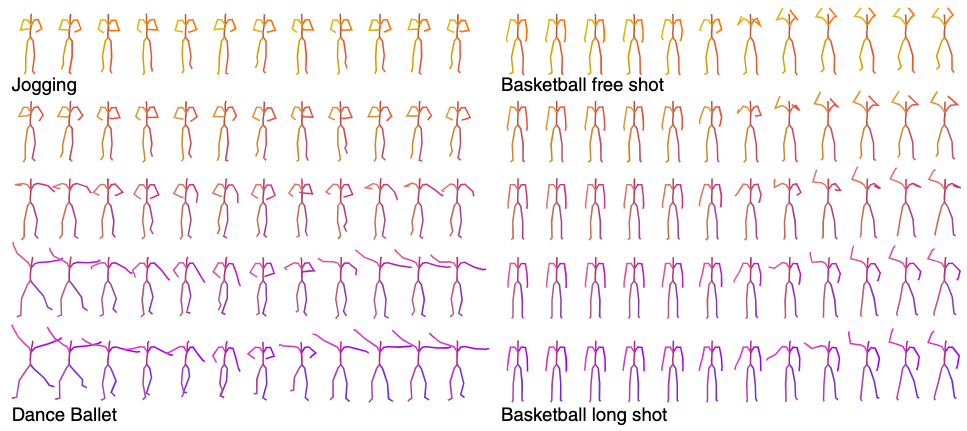
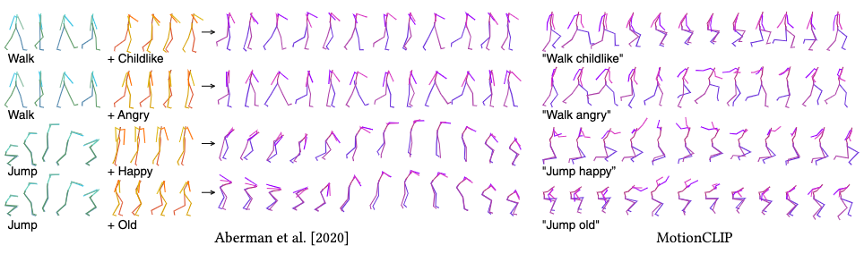
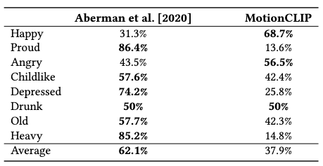
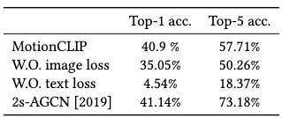

[G. Tevet, B. Gordon, A. Hertz, A. H. Bermano, and D. Cohen-Or, “MotionCLIP: Exposing Human Motion Generation to CLIP Space.” arXiv, Mar. 15, 2022. doi: 10.48550/arXiv.2203.08063.](https://arxiv.org/abs/2203.08063)

## Problem
---
How to map a text description to a motion sequence **deterministically**?

## Observations
---
1. Annotated motion capture datasets **doesn't span enough data** for understanding the **semantics of the motion manifold**.
	1. Natural language annotation is not rich enough.
	2. Captured human motion is not rich enough to cover the full manifold.
2. Motions can be specified using arbitrary natural language through **very abstract scene or intent descriptions**, i.e. by pop-culture references.

## Assumptions
---
1. The **semantic structures** of a latent space in the text-image domain (e.g. CLIP) can be **inherited** by a latent space in the motion domain.
2. This inheritance can **overcome the limitations incurred by out-of-domain knowledge** of this motion latent space:
	1. Alignment with lingual semantics benefits the semantic description of motion, which **boosts performance** of text2motion and motion style transfer tasks that utilizes this motion latent space.
	2. The motion latent space itself is **enriched** with **more semantic knowledge**. As a result, it can demonstrate:
		1. Semantic **smoothness** of the latent space, i.e. semantic interpolation leads to smooth in-between generated motions.
		2. Semantic **disentanglement** of latent motion codes, in which different semantics map to different motion properties **independently**.
		3. Lingual semantic **structures**, e.g. clear mapping between cultural references and the appropriate motions they describe.
4. **Synthetically rendered frames** of motion can be used to **consolidate** the motion latent space's semantic structures by further aligning itself with the **already aligned** semantic structure of the image domain in CLIP.

As a clarification of terms throughout this survey, we define the term "semantic" as equivalent in meaning to "lingual semantic" or "lingual". **It does not refer to semantics in domains other than natural language, such as motion semantics.**

An interesting question to pose here is: can the motion latent space be encoded **probablistically** and still be aligned to the semantic spaces from other domains?

We can accomplish the probabilistic encoding by using the reparameterization trick to represent our motion space. However, the text space and image space in CLIP, for instance, has a deterministic mapping with the motion annotations. As such is the case, we need to fill in the gap by making these two mappings "alignable".

We can proceed in two directions:
1. Obtain deterministic mapping from the motion space by **sampling**, making it congruent with other space mappings.
2. Obtain probablistic mapping from other spaces by **maximum likelihood estimation**, making it congruent with the motion space mapping.

Direction 1 is more straightforward, but might be computationally heavy. Moreover, it models a **one-to-many** relationship between control signals and motions.

Direction 2 can become complex in modeling the MLE process. However, once we have "reverse engineered" a proper probablistic mapping in other spaces, we can model the **many-to-many** relationship between control signals and motions. According to most works' observations, this relationship is more accurate in describing motion generation.

**Another, more trivial question** is: must the motion space be of the same **dimensionality**, i.e. "expressiveness", to align with semantic spaces from other domains?

This question also has an interesting twist: the other semantic spaces might not have the same dimensionalities themselves, if they are encoded by different models!

I fathom the answer to both this question and its twist is yes. There already exist proofs for extending the Wassterstein distance and  f-divergence to comparing probability measures with different dimensionalities. It turns out all you need is a projection of the higher-dim measure into the lower one to "even the playground".

## Contributions
---
1. A motion latent space aligned with the CLIP text latent space and CLIP image latent space, s.t. various **semantically conditioned** motion synthesis tasks can be conducted **deterministically** with good performance.

## Pipeline
---

MotionCLIP employs a **transformer-based autoencoder** to encode its motion latent space with a motion reconstruction task. **Concurrently with the encoding task**, two subtasks of **text space alignment** and **image space alignment** are optimized through the additional definition of two according **alignment losses**.

### Architecture of the Autoencoder

The autoencoding process is modeled by a classic transformer architecture.

A transformer encoder $$E$$ first maps a motion sequence $$p_{1:T}$$ to its latent representation $$z_p$$. This is accomplished by positionally embedding the motion sequence first, and then allocating an additional **learned prefix token** $$z_{tk}$$ to hold the space for $$z_p$$ to be mapped into.

A transformer decoder $$D$$ then takes $$z_p$$ as its key and value. The query is designed to be a vector of plain positional embeddings to hold the space for the reconstructed motion sequence. With this structure the decoder decodes a motion sequence $$\hat{p}_{1:T}$$ from $$z_p$$.

### Training
As there is **one encoding task** and **two alignment tasks**, three losses are proposed together to optimize the autoencoder's parameters.

#### Reconstruction Loss
An $$l_2$$ reconstruction loss is proposed together by explicitly declaring three geometric losses as **joint orientations, joint velocities and vertices locations**:

#### Alignment Losses
Both the text alignment loss and image alignment loss are proposed as cosine similarities between the **motion space code** encoded by MotionCLIP from a motion and the **domain space code** encoded by CLIP from the annotation of that motion:

While the text annotation is readily available, we need to obtain the image annotations of a motion by **rendering image of a random frame** in an **unsupervised** manner.

Would it be better if we can provide this image in a supervised manner so more semantic information can be provided from a motion and aligned with CLIP? This is an interesting question to investigate.

#### Total Loss

The total loss is just a gather-up of the three losses, where $$\lambda$$ are the hyperparameters for blending weights and chosen to be .01 for both alignment losses.

## Extensions
---
We are gonna conduct four experiments to substantiate the two claims in assumption 2: **text2motion** for claim 1; **interpolation, latent-based editing and action recognition** for claim 2 (motion manifold claims).

### Text2motion
The text2motion task is accomplished by passing a text description through the CLIP text encoder and then the MotionCLIP decoder to generate the according motion sequence.

**No quantitive result is provided** for evaluating the text2motion performance. However, qualitative results show that the model is able to generate motions with appropriate **actions, styles, and abstract references** provided from the text description.

It should also be noted that MotionCLIP is not **explicitly trained** for the text2motion task, unlike other motion generators.

### Motion Manifold Applications

#### Interpolation of Latent Motion Codes

We demonstrate assumption 2.2.1, i.e. **semantic smoothness** of the aligned motion space, by qualitatively evaluating the decoded motions sampled from a **linear interpolation** between two semantic texts.

It can be demonstrated that the decoded motions also follow a smooth transition, which means the motion latent space inherits this feature from the semantic spaces.

#### Latent-based Editing

For assumption 2.2.2, i.e. **semantic disentanglement**, we demonstrate by an experiment of **latent space arithmetics**. Qualitative results are obtained from user studies, in which a preference over MotionCLIP is **only occasionally** present over a dedicated motion style transfer model from Aberman et al.

Therefore, this demonstration **exhibits disentanglement, but not a very strong one.**

#### Action Recognition

The **semantic structures** claimed in assumption 2.2.3 is demonstrated via an action recognition experiment. Each motion sequence is predicted to be one of the 60 action labels by softmaxing the cosine similarities, which are obtained from a comparison with the annotated motions in BABEL.

The quantitive result shows that MotionCLIP performs similarly well in top-1 accuracy with a previous SoTA, but not so much in top-5 accuracy.

