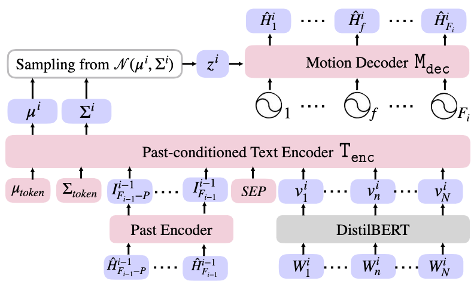
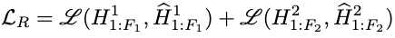
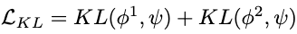
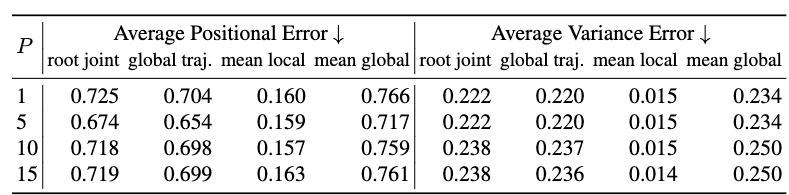

[N. Athanasiou, M. Petrovich, M. J. Black, and G. Varol, “TEACH: Temporal Action Composition for 3D Humans.” arXiv, Sep. 12, 2022. doi: 10.48550/arXiv.2209.04066.](https://arxiv.org/abs/2209.04066)

## Problem
---
Given a sequence of text descriptions for consecutive motions, how to generate a single motion sequence respecting these conditions?

## Observations
---
1. **Non-autoregressive** motion generators incurs **intractable computation** generating a long sequence of motions, since the time complexity of Transformers grows **quadratically**.
2. Long motion sequence composed by independently generated motion snippets **cannot ensure continuity** within the transitions between motions. This is the so-called **temporal smoothness**.
3. Conditioning on the last few frames of previously generated motion snippet, with the help of spherical linear interpolation (slerp), **enhances** temporal smoothness.

## Assumptions
---
1. Human motions are **modular**, i.e. composed of different simultaneous and/or sequential actions over time.
2. Only the **last few frames** of the previous motions correlate with the generation of the next motion snippet.

## Contributions
---
1. A new benchmark for temporal action composition on BABEL dataset.
2. A **hybrid** generative model that iteratively generates text-conditioned motion snippets with smooth transitions.

## Pipeline
---

A sequence of textual descriptions $$S_1, \cdots, S_k$$ is given to TEACH, corresponding to different motions. Each $$S_i$$ consists of words $$W_1^i, \cdots,W_N^i$$.

The objective is to generate a sequence of motion snippets $$\hat{H}^1, \cdots, \hat{H}^k$$, each snippet $$\hat{H}^i$$ containing a sequence of pose parameters $$\hat{H}^i_1, \cdots, \hat{H}^i_{F_i}$$, where $$F_i$$ is the number of total frames for that snippet.

The entire model of TEACH is a variational autoencoder (VAE) consists of an encoder and a decoder:
1. A **past conditioned text encoder** maps the current text $$S_i$$ and the last $$P$$ frames of the previous motion snippet $$\hat{H}^{i-1}$$ to a reparameterized latent space distribution $$\mathcal{N}(\mathbf{\mu}_i, \mathbf{\Sigma}_i)$$.
2. A latent code $$z_i$$ is sampled from this distribution.
3. $$z_i$$, along with its positional embeddings, is fed into a **motion decoder** to reconstruct the generated motion snippet $$\hat{H}^i$$.

Therefore, TEACH generates each motion snippet **non-autoregressively**, but compose the temporal snippet sequence **autoregressively**.

Most of the module architectures are based on Transformers.

### Past-conditioned Text Encoder
A pretrained text model, DistilBERT, is employed to convert the text sequence from $$W_1^i, \cdots,W_N^i$$ to the embedding features $$v_1^i, \cdots, v_N^i$$.

The last $$P$$ frames of the previous motion snippet are passed through an attentional past encoder, from which pose features $$I^{i-1}_{F_{i-1}-P}, \cdots, I^{i-1}_{F_{i-1}}$$ are extracted.

The two feature sequences are concatenated together with a $$SEP$$ token in-between to separate modalities.

Additionally, the distribution tokens $$\mu_{token}$$ and $$\Sigma_{token}$$ are passed alongside the concatenated feature sequence, which allows the encoder transformer to output distribution parameters to their corresponding positions.

For the first motion, we **disable the past condition** since there are no previous motions.

### Motion Decoder
The motion decoder maps the positionally embedded sampled latent code $$z_i$$ non-autoregressively to reconstruct the next motion snippet $$\hat{H}^i$$. By the nature of transformers, this decoder can output motion sequence in **variable lengths**.

### Training
The training consists of **two forward passes** and **one backward pass**.

Given a pair of consecutive motion snippets from the training set, the first forward pass of TEACH generates motion snippet $$\hat{H}^1$$ with the given length $$F_1$$. The second forward pass generates the subsequent motion snippet $$\hat{H}^2$$ with the given length $$F_2$$.

A backward pass then optimizes the model with a reconstruction loss and a KL loss.

#### Reconstruction Loss
The reconstruction loss is the major contributor for the optimization of the VAE:

where $$\mathcal{L}$$ is defined as the smooth L1 loss.s

#### KL Losses
The Kullback-Leibler (KL) losses regularize the two Gaussian distributions $$\phi_1$$ and $$\phi_2$$ generated by the two motion snippets in the latent space to be close to the normal distribution, which enhance the robustness of learned distributions.

These are simply two KL losses:

## Extensions
---
### Baselines
As temporal action composition is a new task, the transitions between motion snippets generated by TEACH are compared to Slerp and geometric transformations. Better performance is observed in TEACH.

### Ablations on Number of Past Frames

It is observed that the number of past frames reach an optimal setting around 5. More past frames lead to higher generation errors (in terms of the metrics used). However, it's dubious that these precision metrics are optimal for judging a generation task.

