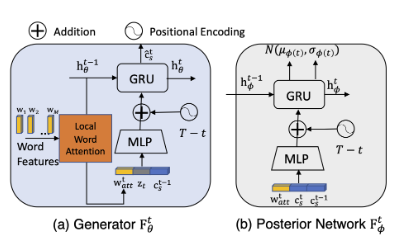

[C. Guo et al., “Generating Diverse and Natural 3D Human Motions From Text,” in Proceedings of the IEEE/CVF Conference on Computer Vision and Pattern Recognition (CVPR), Jun. 2022, pp. 5152–5161.](https://openaccess.thecvf.com/content/CVPR2022/html/Guo_Generating_Diverse_and_Natural_3D_Human_Motions_From_Text_CVPR_2022_paper.html)

## Problem
---
How to generate realistic 3D human motions from text?

## Observations
---
1. A text-based motion generation task has resemblance to text-based video generation, and its reversed task of video captioning.
2. Part-of-speech (POS) tags enhance the accuracy of text description for a motion sequence.

## Assumptions
---
1. Local semantic motion contexts facilitate motion generation.
2. **Fixed-length** (convolutional) motion snippet codes can capture **local semantic motion contexts** and their composite sequence serves as good representation of motions with **appropriate temporal dependency** between poses.
3. Motion generation can be well framed as an **autoregressive task of predicting motion snippets**.
4. **Informing** the motion generator with a **learned prior** distribution instead of a normal distribution enhances motion generation performance.
5. **Attentions** assigned to each word may **vary** in the process of predicting motions from text.
6. It's important to **inform** any **autoregressive** generator of **where we are** and **how far to go** by positional embeddings, i.e. time-to-arrival.

## Contributions
---
1. A motion generator based on VAE capable of generating **diverse** motions from a given text description.
2. A text2length module enabling generation of motions with **variable lengths** according to the complexity of texts.
3. A HumanML3D text-annotated motion capture dataset that's much larger in scale than KIT-ML.

## Pipeline
---

The motion generation pipeline consists of three stages: **preprocessing, training and inference**.

In the preprocessing stage, a **motion autoencoder** (non-variational) is employed to learn proper motion snippet representations for the decoder. The encoder is then discarded in the rest stages.

We argue here that this additional inclusion of encoder is somehow **redundant**: we could easily replace the motion snippet learning process for the decoder with an encoder-less implicit neural representation pipeline, which also offers **more controls over the structure of a motion snippet code**.

In the training stage, five modules are involved: the **snippet code decoder** from preprocessing stage, a **text2motion RNN** $$F_\theta$$ for snippet code generation from a latent prior distribution, a **prior RNN** $$F_\psi$$ for providing this prior distribution, a **posterior RNN** $$F_\phi$$ for training the prior RNN, and a **text encoder** providing sentence features for all these modules except the decoder. The posterior RNN is then discarded in the inference stage.

We argue here that the "real" generator here is the prior RNN, which generates a prior knowledge distribution from text descriptions.

The rationale is that probability mapping is only conducted through this module. After sampling the latent prior distribution, the text2motion module is **deterministically** mapping the sampled code to the final motion snippet codes, which resembles a machine translation process instead of a probability mapping process.

In the inference stage, five modules are involved: the motion decoder from the preprocessing stage, the text2motion module from the training stage, the prior RNN from the training stage, the text encoder from the training stage, and an additional text2length module. The text2length module first estimates the total length for the generated motion, which is then utilized by all the recurrent modules as the stopping condition.

### Preprocessing Stage
We train a snippet code decoder to **dictate** appropriate motion snippet codes to reconstruct a motion sequence during this stage. This dictation will be implicitly enforced on outputs of the generative modules later.

#### Motion Autoencoder
This is the singular pipeline used in this stage. A deterministic autoencoder is utilized to first map a motion sequence to motion snippet codes. A decoder then reconstructs this motion sequence from the snippet codes.

To **avoid foot sliding**, the decoder estimates foot contacts at each frame as an additional output, which are not included in the pose parameters given to the encoder.

The autoencoder is built from convolutional neural networks (CNN) layers. Each CNN has two layers with kernel size of 4 and stride 2. As a result, each snippet code $$\mathbf{c}_s^t$$ has an **8-frame receptive field**, which is about 0.5 seconds for a 20 fps animation. However, **whether this setup is optimal remains unknown** since there is no ablation study supporting the choice of receptive field size. Also, we need to notice that **all snippet codes have fixed lengths** here, which constitutes the **atomic resolution** of a motion sequence.

The argument for using motion snippet codes rather than individual poses is that they capture **temporal semantic information** that's crucial for smooth and faithful motion generation. This advantage is confirmed from the ablation study, where without the **structuring of temporal dependency** from motion snippets, **motion generation begins to deteriorate drastically as time progresses**.

#### Training
Aside from the majorly contributing reconstruction loss, the motion codes are encouraged to be:
1. sparse with a sparsity loss, which discourages noisy and fuzzy expressions.
2. temporally smooth with a smoothness loss, which encourages similar semantics for temporally close codes.

The total loss then becomes:

where $$\mathbf{p}$$ is the pose parameter set and $$\mathbf{c}$$ is the motion snippet code.

### Training Stage
The basic idea is to generate a prior distribution of text-conditioned latent expression of the current motion snippet to be predicted. A sampling from this distribution then realizes a latent code $$\mathbf{z}_t$$, which is fed through another module that maps it to the actually predicted motion snippet code $$\hat{\mathbf{c}}_s^t$$. Conditioned on past predictions, we autoregressively generate snippet codes until the total motion length (given by the training motion sequence) is reached. A reconstruction error against the training motion sequence can then be used to optimize all the predictors used.

#### Text Encoder
To utilize the information provided by the text descriptions, we extract sentence features from them as word embeddings through a text encoder based on bi-directional GRUs.

Moreover, **part-of-speech (POS) tags**, which indicate word categories, are incorporated explicitly into the word embeddings to facilitate attentioning.

Finally, an external dictionary is built to **highlight motion-related words** with four labels: direction, body part, object and action. These labels are also added to the word embeddings.

The text encoder provides two feature sets:
1. a sentence feature $$s$$, which provides **global** contextual information and is used to initialize the hidden states of the temporal VAE modules used later.
2. word features $$w_{1:M}$$, which serves as **partial inputs at each time step** for the autoregressive VAE modules to extract customized local word attentions.

You can see the usage of these feature sets in the structure of temporal VAE explained below.

#### Temporal VAE
##### Learned Motion Prior
Instead of using the conventional normal distribution as our prior distribution for the snippet code predictor to consider, we produce a learned motion prior conditioned by text descriptions and past snippet codes.

An RNN module $$F_\psi$$ produces this prior distribution given text descriptions and past snippet codes as input.

How do we train $$F_\psi$$ to provide appropriate prior distributions? An additional RNN module $$F_\phi$$ is devised to provide a **posterior distribution** that $$F_\psi$$ strives to approximate. $$F_\phi$$ takes the same inputs as $$F_\psi$$, with the exceptional advantage of being informed by the ground-truth future snippet code $$\mathbf{c}_s^t$$.

This is essentially saying that we want the prior network $$F_\psi$$, being informed of past snippet codes and current text descriptions, to **predict** a prior distribution for the subsequent generator $$F_\theta$$ that reveals fathomed information about the current snippet code as much as possible.

The prior distribution is reparameterized to be a multivariate Gaussian.

##### Generator Network
Given the prior latent code $$z_t$$ sampled from learned prior distribution produced by the prior network $$F_\psi$$, a generator $$F_\theta$$ attempts to map $$z_t$$ to the predicted snippet code $$\hat{\mathbf{c}}_s^t$$, conditioned by the past snippet codes and current text descriptions.

In the training stage, $$F_\theta$$ draws the latent code directly from the posterior network $$F_\phi$$ instead to **avoid unnecessary entangling** with the prior distribution prediction process.

##### Architectures
For the prior, posterior and generator networks, we implement them with similar recurrent neural network (RNN) architectures as bi-directional GRUs:

###### Local Word Attention
The sentence features $$s$$ are fed directly as the initial hidden states into the RNN. However, according to assumption 5 the word features might be utilized differently at each time step by the RNN to generate snippet codes.

As such is the case, we devise a local word attention mechanism, in which an additional **local word attention block** is trained to **highlight** different parts of the input sequence with attention weights according to the past contextual information.

This past information can be found in the precious hidden state $$\mathbf{h}_\theta^{t-1}$$ from the GRU. The local word attention can then be computed as:

where $$\mathbf{W}$$ indicates the trainable weights of this block.

The benefit of local word attention is **confirmed in the ablation study**.

###### Time to Arrival Positional Encoding
Based on assumption 6, the "where we are" and "how far to go" questions can be **answered in one shot** by a time-to-arrival positional encoding, which records the timestamp information relative to the end frame instead of the start frame of a motion sequence.

This positional encoding can be formulated as:

which is then informed to the VAE modules.

The benefit of using this positional encoding is confirmed by ablation study, although a comparison with regular positional encoding methods is **not given**, i.e. the ablation only considers the situation where this encoding is not applied.

##### Training
The training objectives are characterized by three losses:
1. A code snippet reconstruction loss.
2. A pose-wise motion sequence reconstruction loss.
3. A KL loss for training the prior network.

Thus, the loss function is as fellows:

Since the task to generate **variable-length** motions, extra tutoring of these modules is given in forms of curriculum learning and scheduled sampling.

###### Curriculum Learning
The curriculum leaning utilized considers complexity as increasing from reconstructing short motion sequences to long ones.

Starting from generating snippet codes of short length $$T_{cur}$$, the model is trained by selected motions whose snippet codes are equal or longer than $$T_{cur}$$. The training data of these motions are cropped at $$T_{cur}$$ to train the VAE. Whenever the validation reconstruction loss starts increasing, we append one more snippet code in the target sequence and enter the next stage by incrementing $$T_{cur}$$. This process is repeated until we have $$T_{cur} = T_{max}$$.

Additionally, **teacher forcing** is realized by making the VAE taking the previously generated snippet code sequence with probability $$1-p_{tf}$$. This means there is a probability of $$1-p_{tf}$$ where **the ground-truth snippet code sequence can serve as the input of VAE**.

### Inference Stage
All the modules are virtually covered in the inference stage. One thing to note here is that the latent codes are no longer sampled from the posterior distribution but from the prior.

Additionally, a text2length module predicts the motion length for the generation process, s.t. this parameter can be automatically set up in the beginning.

#### Text2length Sampling
The text2length module learns a distribution of motion snippet code sequence lengths conditioned by text descriptions. This is framed as a **density prediction task**.

Accordingly, the architecture of pixelCNN is adopted to predict the distribution, which is characterized as a multinomial distribution over **discrete** length indices $$1, 2, \cdots, T_{max}$$. $$T_{max}$$ is arbitrarily set to 50, which are 200 frames, and 10 seconds for a 20 fps animation.

## Extensions
---
### HumanML3D Dataset
HumanML3D is a new text-annotated motion capture dataset that's larger than KIT-ML. It's implemented mostly by gathering up unannotated motion capture datasets and manually labelling them via Amazon Mechanical Turk. A comparison table is given by the authors:

The gatheree datasets are HumanAct12 and AMASS.

