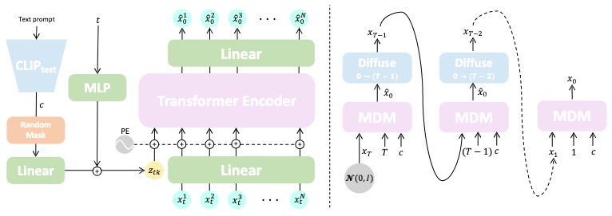
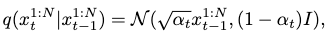
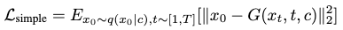
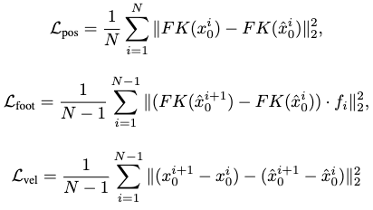
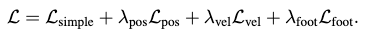
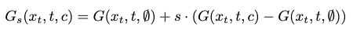
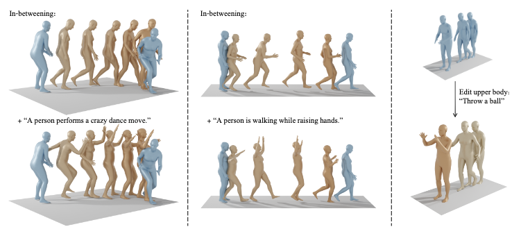

[G. Tevet, S. Raab, B. Gordon, Y. Shafir, D. Cohen-Or, and A. H. Bermano, “Human Motion Diffusion Model.” arXiv, Sep. 29, 2022. doi: 10.48550/arXiv.2209.14916.](https://arxiv.org/abs/2209.14916v1)

## Problem
---
How to generate human motions from generic descriptions such as text, action labels or unconditional prior?

## Observations
---
1. VAE based generation learns a **one-to-one** mapping, or a normal latent distribution, between motion descriptions and motions.
2. Applying **geometric losses** in the diffusion setting improves generation.

## Assumptions
---
1. The generative motion distribution exhibits a **many-to-many** relationship between motion descriptions and motions.
2. **Classifier-free guidance** enables the training of a **generic** motion generator with a **controllable** tradeoff of diversity and fidelity.
3. Classifier-free guidance can tutor the diffusion model well to learn **different** many-to-many relationships together, i.e. the guidance offers **distribution differentiation** tutoring for a single model.
4.  Diffusion models are **free from assuming a target distribution**, and express the many-to-many distribution matching problem well.

I'm **highly doubtful** of the claims in assumptions 3 and 4.

For assumption 3, the model is still mapping **different conditions** to the **same sample**. Without explicitly addressing different data distributions w.r.t. different conditions, a classifier-free guidance can't convey the differentiation of these distributions very well to the diffusion model. In other words, **trash in trash out**.

For assumption 4, the authors didn't provide any benchmark of this "generic" motion generator against other generic motion generators, but only against specialized models focusing on one condition. There is also no evidence that the specialized models can't be adapted easily to be trained straightforwardly by the classifier-free guidance, which may yield higher performance. To say the best, the proof of this model's generalizability of the motion generation problem is weak. **You can't mix up generic guidance with generic modeling, which are two entirely different problems.**

Also, the MDM model is retrained for action2motion and text2motion tasks in the experiments. Therefore, it doesn't support the two tasks at once: instead, for each training it can only conduct unconditional generation or conditional generation restricted to a singular task's singular condition. I would like to argue that this is **not genertic generation** since **the retraining needs to be enforced for each different conditional task**, which is exactly what other specialized models can also do, such as MotionDiffuse.

Therefore, if we stress these assumptions strictly, the experiements of MDM didn't manifest strong proofs. If we relax these assumptions to be case-specific (dataset-specific), then the assumptions are too shallow to be of any real significance. It's best to leave MDM as an adaptable diffusion generator for many tasks, but not a **generic** motion generator for them.

## Contributions
---
1. A classifier-free diffusion-based motion generator that supports unconditional generation, action2motion, text2motion, motion inpainting and semantic motion editing tasks with straightforward retraining.

## Pipeline
---

The goal of MDM is to synthesize a human motion $$x^{1:N}$$ pose parameter sequence given an arbitrary condition $$c$$. The additional unconditional situation can be expressed by setting $$c=\emptyset$$.

The entire MDM model is one diffusion model with a forward diffusion process and a backward denoising process, where the fully noised motion follows a normal distribution.

MDM learns the backward denoising process by **predicting the signal itself** rather than the noise perturbation at each denoising step, which **allows for further regularization** of the gradually cleaned motions brought by **geometric losses** at each step.

### Forward Diffusion Process
The diffusion follows a Markov noising process:

where the starting step is the ground-truth motion sample $$x^{1:N}_0$$, and $$\alpha_t$$ is the hyper-parameterized variance scheduler.

### Reverse Denoising Process
The denoising process is conducted by MDM. The model tries to predict the cleaned signal $$x_0$$ gradually from $$x^T$$, which is a normal distribution.

Thus, we can express the each step's prediction as $$\hat{x}_0=G(x_t, t, c)$$, where $$t$$ is the denoising step and $$c$$ is the condition. Each denoising step tries to clean the signal **completely**. After prediction, $$\hat{x}_0$$ is mapped back to $$x_{t-1}$$ with forward diffusion to continue the next denoising step, until the final, non-diffusible $$\hat{x}_0$$ is predicted at $$t=0$$.

### The MDM Model
MDM is devised to be a transformer-based encoder-only (self-attention-only) model.

At each step, the condition code $$c$$ and the denoising time step $$t$$ are projected to the transformer's dimensions first by separate feed-forward networks, forming a single conditional token $$z_{tk}$$. This token is then concatenated with the linearly projected motion sequence $$x_t^{1:N}$$ from the previous denoising step. After positional embedding, the transformer encoder is fed with this token sequence and outputs a same-length token sequence.

Upon getting the new sequence, we first discard the leading token which corresponds to $$z_{tk}$$. The rest of the sequence is then linearly projected to the predicted clean motion sequence $$\hat{x}_0^{1:N}$$. This finishes one step of our denoising.

I'm unsure about the feed-forward network on $$t$$, which seems redundant. Why not just express $$t$$ as a positional encoding the same length as the dimensions of $$z_{tk}$$, s.t. it could be directly added/concatenated to $$c$$?

#### Training
In each step, the predicted $$\hat{x}_0$$ can be compared against the ground-truth motion sequence $$x_0$$ for a reconstruction error:

There is also doubt here about the legitimacy of applying an L2 loss, while most models shows a smooth L1 loss is more desirable for motion reconstruction.

This can be used to optimize the MDM model's parameters.

##### Additional Geometric Losses
Three additional geometric losses are applied to regularize the generated motion:

which focus on positions, foot contacts and velocities. $$FK(\cdot)$$ denotes the forward kinematic function mapping joint rotations to joint positions in case such rotations are predicted by the MDM instead of positions.

In the foot contact loss, $$f_i$$ is a binary mask indicating **whether the feet touch the ground**. If they do, the velocities should be nullified, which is encouraged by this loss. This loss is only relevant to the feet joints to prevent foot-sliding.

The final loss is then:

Only the foot sliding loss is confirmed to be beneficial, albeit **qualitatively**, in ablation studies, although it sometimes leads to poorer performance. Other geometric losses are **not** experimented with ablation.

##### Classifier-free Guidance
The MDM is trained by classifier-free guidance to enhance its generalizability to various motion generation tasks.

$$G$$ is taught to learn both the conditioned and unconditioned distributions by randomly setting $$c=\emptyset$$ with a $$10\%$$ probability in the training samples, which encourages $$G(x_t, t, \emptyset)$$ to approximate $$p(x_0)$$.

This mechanism is reflected in the random mask block after the CLIP text encoder for $$c$$.

#### Inference
By the construction of a classifier-free guided model, we can control a tradeoff between motion diversity and fidelity with an interpolation between unconditional and conditional distribution mapping:

The rest of the inference is rather straightforward: we just supply the a normal distribution as prior, and condition the sampling process with an appropriate condition code $$c$$.

For action labels, one-hot embeddings can directly be applied as $$c$$. For texts, we can pass it through CLIP first to get the semantic embeddings as $$c$$.

## Extensions
---
### Enabling Motion Inpainting and Editing in Inference

Given a subset of motion sequence poses, we can just overwrite the according parts of $$\hat{x}_0$$ with w.r.t. each given pose during the sampling process.

Moreover, we could enable motion editing during this process, since the condition code $$c$$ can be passed in at any arbitrary denoising step.

We could also fix certain parts of the body by supplying the pose parameters and overwrite them in $$\hat{x}_0$$'s according areas. This achieves body-part specific editing.

The editing conditions are usually supplied as texts. Without conditioning, the task becomes motion inpainting.

