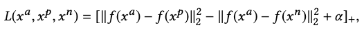

[A. Aristidou, D. Cohen-Or, J. K. Hodgins, Y. Chrysanthou, and A. Shamir, “Deep motifs and motion signatures,” ACM Trans. Graph., vol. 37, no. 6, p. 187:1-187:13, Dec. 2018, doi: 10.1145/3272127.3275038.](https://dl.acm.org/doi/10.1145/3272127.3275038)

## Problem
---
How to obtain a **compact, time-invariant(global)** motion representation that also respects the original **semantic structure and local features** of a motion sequence?

This representation can provide efficient means for motion **matching, clustering, segmenting and indexing**.

## Observations
---
**Motions of similar content** may consist of analogous movements but in **different ordering**.

Previous works for extracting motion features:

| Task                | Motion Representation                                                                                                            | Caveat                                                                                                                         | Remedies                                                                                                   |
| ------------------- | -------------------------------------------------------------------------------------------------------------------------------- | ------------------------------------------------------------------------------------------------------------------------------ | ---------------------------------------------------------------------------------------------------------- |
| Motion Retrieval    | Keyword or **annotation**.                                                                                                       | Require manual labelling; cannot capture temporal evolution and dynamics of human motion.                                      |                                                                                                            |
|                     | **Pose-metrics** (joint positions, velocities etc.) or temporally-aligned (through DTW) motion snippets.                         | Nearest neighbor (NN) search **does not scale well** to large number of poses.                                                 | Optimized indexing structure, dimensionality reduction or graph/tree construction to accelerate NN search. |
|                     | **Body-relational** or Laban Movement Analysis (LMA) features.                                                                   | Can't **numerically** describe local similarity between poses, or global similarity between sequences.                         |                                                                                                            |
|                     | **Smaller set** of features than poses: Angular skeleton, temporal hierarchy of covariance descriptors or points in a Lie group. | Difficult to handle complex and heterogenous motions, or recognize similar motions with **varied periods, duration or speed**. |                                                                                                            |
|                     | **Lower-dimensional** pose features: boolean motion templates, motion volume or autoencoder embeddings.                          | Can only handle **short-time** sequences. Cannot deal with complex and dynamic motions, or motions with extreme reordering.    |                                                                                                            |
| Motion Clustering   | **Hierarchical clusters**, with neighborhood defined by a grid of poses from a **self-organizing map (SOM)**.                    | Computationally expensive.                                                                                                     |                                                                                                            |
| Motion Segmentation | Changes in **simple kinematic features**.                                                                                        | Fails to segment highly dynamic and complex movements.                                                                         | Clustering-extracted keyframes, Mahalanobis distance between a frame and a Gaussian of another frame.      | 
|                     | A **sequence of motion primitives**, extracted from clustering.                                                                  |                                                                                                                                |                                                                                                            |

## Assumptions
---
1. Motion sequences can be broken down into **smaller movements**, and can be characterized by the **distribution** of such movements.
	1. Each smaller movement can be represented with a **motion motif**, which summarizes a set of similar **motion words** (short motion snippets).
		1. Two motion words are **similar** if
			1. They are temporarily close.
			2. After dynamic time warping (DTW) alignment, their weighted joint rotations are close to each other.
		2. Two motion words are **different** if
			1. They are temporarily far.
			2. They are from two different motion sequences.
		3. A feature space respecting the semantic structures of 2 and 3 can be used to cluster motion words. Motion motifs can be defined as the **cluster centroids**.
	2. The distribution of motion motifs is defined as a **motion signature** for each motion sequence.
		1. Motion signature is time-invariant, i.e. a sequence's signature doesn't scale with its duration or movement phases (timing).
		2. Infrequent motion motifs are as important in describing motion characteristics as frequent motion motifs (this leads to TF-IDF post-processing).
		3. Distance between signatures can be well described with Earth Mover's Distance (EMD).

## Contributions
---
A succinct, time-invariant motion representation that sufficiently captures both the structure and features of human motion. It enables
1. distinguishing fine-grained differences between highly similar motions.
2. cleaner clustering of different motion types.
3. contextual similarity search in motion retrieval.
4. contextually constrained motion graph synthesis.

## Pipeline
---

Given a motion capture dataset, we follow these sequential steps:
1. Crop out **motion words**, which are short, fixed-length motion snippets.
2. Map the motion words to a feature space respecting their semantic similarities.
3. Cluster the motion words in the feature space, take each centroid as a **motion motif**.
4. Given a motion sequence, map each of its motion word to the feature space and count the respective motion motifs to form a frequency distribution.
5. The TF-IDF scaled distribution is our final **motion signature**.

We describe some key operations in these steps next.

### Semantic Similarity of Motion Words
Following assumption 1.1.1, we consider two motion words as semantically close if they are temporally close in the same sequence.

The other semantically close scenario is when two words have similar contents in the same sequence. As similar human motions may vary in duration and speed, we first align motion words non-uniformly with DTW, and then compute the similarity with a **weighted joint rotation difference metric** given by Wang and Bodenheimer:

where $$p$$ denotes the global translation of the two frames, and $$q_{i,k}$$ the quaternion rotation of joint $$k$$ in frame $$i$$.

The weights $$w_k$$ are optimized to match human judgement of good and bad transition frames.

### Mapping Motion Words to Feature Space
We would like to map the motion words to a feature space that respects the semantic structure of the original word space.

We approximate the mapping function with a convolutional neural network based on the Inception model. It projects the motion sequence into an embedding of size 736.

We respect the semantic structure with a **triplet loss** as

where $$\alpha$$ is an enforced margin to separate positive and negative pairs.

#### Positive Sample Selection
Two types of positive samples are used.

The first type takes $$z=4$$ motion words that are temporally closest to the anchor $$x^a$$ with no overlap.

The second type takes $$k=5$$ nearest neighbors of the anchor w.r.t. the following time-warped distance:

where $$m$$ is the number of joints, and $$q$$ the complex form of a quaternion.

Alternatively than joint rotation distances, the euclidean distances of joint positions work equally well.

Additionally, the positive samples are augmented with time-warped versions of themselves for robust learning.

#### Negative Sample Selection
The negative samples are from motion words that are temporally far away from the anchor in the same sequence, or they can be from other sequences.

### Clustering for Motion Motifs
We map all the motion words into the feature space, and cluster them there with **k-means**. The centroids are stored as motion motifs.

Later, when a motion word needs to be associated with a motif, we simply assign it to the nearest motif using L2 distance.

### Motion Signatures
Given a motion sequence, we follow step 5 to obtain the motif frequency distribution as its motion signature.

However, because of assumption 1.2.2, we rescale the frequencies with TF-IDF s.t. the importance of each motif is proportional to its local frequency in the sequence and inversely proportional to its global frequency in the dataset.

#### Distance between Signatures
Since the motion signatures are distributions, we compare them with the **Earth Mover's Distance (EMD)**:

where $$P, Q$$ are two motion signatures each with $$m$$ clusters:

and $$d_{i,j}$$ is the ground distance between clusters $$p_i$$ and $$q_i$$.

$$f_{i,j}$$ is the flow that minimizes the overall cost as

## Applications
---

### Motion Classification
**Unsupervised** classification of motion sequences can be framed as clustering motion signatures:
1. Measure signature distance between each sequence and construct a distance matrix.
2. Perform **Multi-dimensional Scaling (MDS)** to map the motion data points into $$n$$-dimensional space.
3. Perform k-means to cluster the motions into different classes.

**Supervised** classification can use motion signatures directly as the input motion features:
1. Train a classifier (e.g. K-Nearest neighbor) w.r.t. motion signatures and annotations.
2. Given a motion of an unknown class, extract its signature and pass it into the classifier for classification.

### Ablations
1. **16 most informative joints** were used instead of all joints.
2. We find that using motion words of **16 frames (.66 seconds in 24Hz) with a 4-frame stride** is most efficient: long enough to cover simple movements, but short enough to promote similarities.
3. **100 clusters** is an appropriate number to describe motion motifs.

### Motion Clustering

Compared to clustering with only DTW-aligned distance, the motion signature distance separates different motion types more clearly.

Fine-grained motion features are also better distinguished with motion signatures than DTW. In the above figure motion signatures separates leader and follower movements of the same dancing motion well. It also separates two fighters during a fight.

### Motion Retrieval

#### Example-based Motion Retrieval
Given an example motion sequence of $$k$$ words, the motion retrieval task is to find similar motions from the database.

We slide a time window of $$k$$ words along each sequence in the database, and retrieve the sub-sequence that's most similar in motion signatures to the example sequence.

The advantage of motion signatures is that **contextual similarity** is considered during retrieval, as shown by the wide spread of colors (darker indicates higher similarity) in the above figure, for querying two sequences 86_07 and 86_08 with three examples. On the other hand, DTW can only detect similarity when the example and subject are **synchronized**, as shown by the sparsity of darker colors.

We can also observe that the motion retrieval is robust to reordering and reversal.

#### Whole Sequence Retrieval

The signature of an entire sequence can also be used to retrieve similar whole sequences from the database. In the experiment we test the performance of this retrieval task by judging if the retrieved sequence is of the same action type. Motion signatures achieve significantly better results than existing methods.

### Temporal Motion Segmentation
To segment a motion sequence into different action classes, we classify each central motion word by classifying the signature of a motion sub-sequence it's centered in. We choose a sliding window of 9 motion words to proceed through the motion words of a sequence in this manner. The classifier is a KNN with $$K=5$$.

It can be observed that motion signatures allow for a better segmentation compared to existing methods.

### Constrained Motion Graph for Motion Synthesis

Finally, we apply motion signature similarity in constraining the possible **Motion Graph transitions** a node can make to propagate its motion to another node.

This is done by pruning the original Motion Graph s.t. transitions with large signature distances from the incoming motion word are discarded. We use a time window of 12 motion words anchored on the transition motion word to conduct the distance measurement.

This constraint allows for motion synthesis respecting contextual consistency. In the above figure, the ground truth (gray) is a salsa dance. The motion signature constrained Motion Graph (blue) successfully transitions the movement into continued salsa, while the unconstrained graph (green) disrespects the motion context and transitions the salsa into an Indian Bollywood dance.

## Limitations
---
1. The embedding network takes a long time (**7 days**) to train. Once new motion data comes in, it's costly to retrain the model to produce good motion signatures for new motions.
2. While building motion motifs, some motion words might be **outliers during clustering** and be under-represented, degrading the accuracy of the finally created motion signatures.
3. There is no **universal signature** for all motion types because its feature space is learned **contrastively**: to compare two motions, they must be encoded w.r.t. the same dataset.

