Digital humans should perform humanlike behaviors. The basic human behavior is motion. What creates motion? Unlike natural language or DNA, the fundamental building blocks of motion are unclear. The lack of a bottom-up approach motivates many motion synthesis works to model lower-level elements of motion. These endeavors have achieved significant progress over the past two decades with the boost of machine learning algorithms. I dedicate my time to cook the most motions with the least ingredients possible. Analogous to the periodic table of atoms, I hypothesize that there exist "atomic motions" that exhibit high data efficiency in modeling motion structures and dynamics. Based on atomic motions, I model motion synthesis as an autonomous structuring-planning-executing process. I will discuss recent trends in motion synthesis, introduce my atomic motions model, and use recent findings from computer graphics and neuroscience to support my approach's validity for further investigation. I will wrap up by outlining challenges and forecasting my future research activities.

## Presentation
---

<iframe src="https://www.youtube.com/embed/kgoXeipx2XU" style="border:0px #ffffff none;" name="video" scrolling="no" frameborder="1" marginheight="0px" marginwidth="0px" height="512px" width="100%" allowfullscreen></iframe>

Slides can be found here: <a href="assets/doc/atomic_motions.pdf" target="_blank">https://wei-parker-guo.github.io/assets/doc/atomic_motions.pdf</a>

## Introduction
---
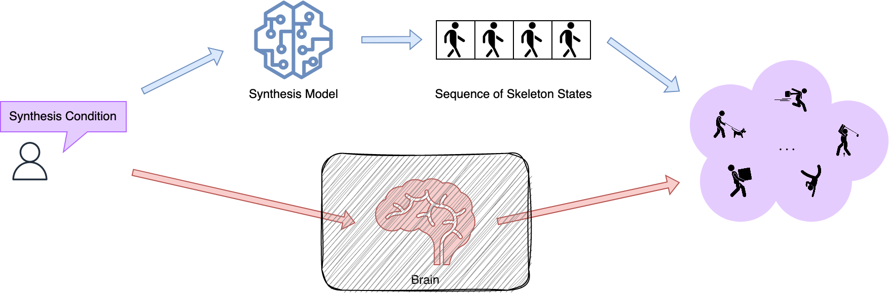

How do we create motion, or perform "motion synthesis"?

We don't fully understand how the human brain generates motion yet. However, we can capture the resulting movements effectively. We represent motion as a human skeleton state sequence, which includes a global transform for overall movement and a hierarchy of joint transforms for localized motion. Using these states to rig a human body model, we create convincing sequences of fluent actions.

This sounds promising. Can we model the generation process of sequential skeleton states to effectively conduct motion synthesis?

Let's consider a naive motion synthesis model first. Suppose all motions have the same duration. We treat each skeleton state along time as an independent variable and form our **skeleton state space**. Our naive model produces a motion sequence by randomly drawing a sample from this space.

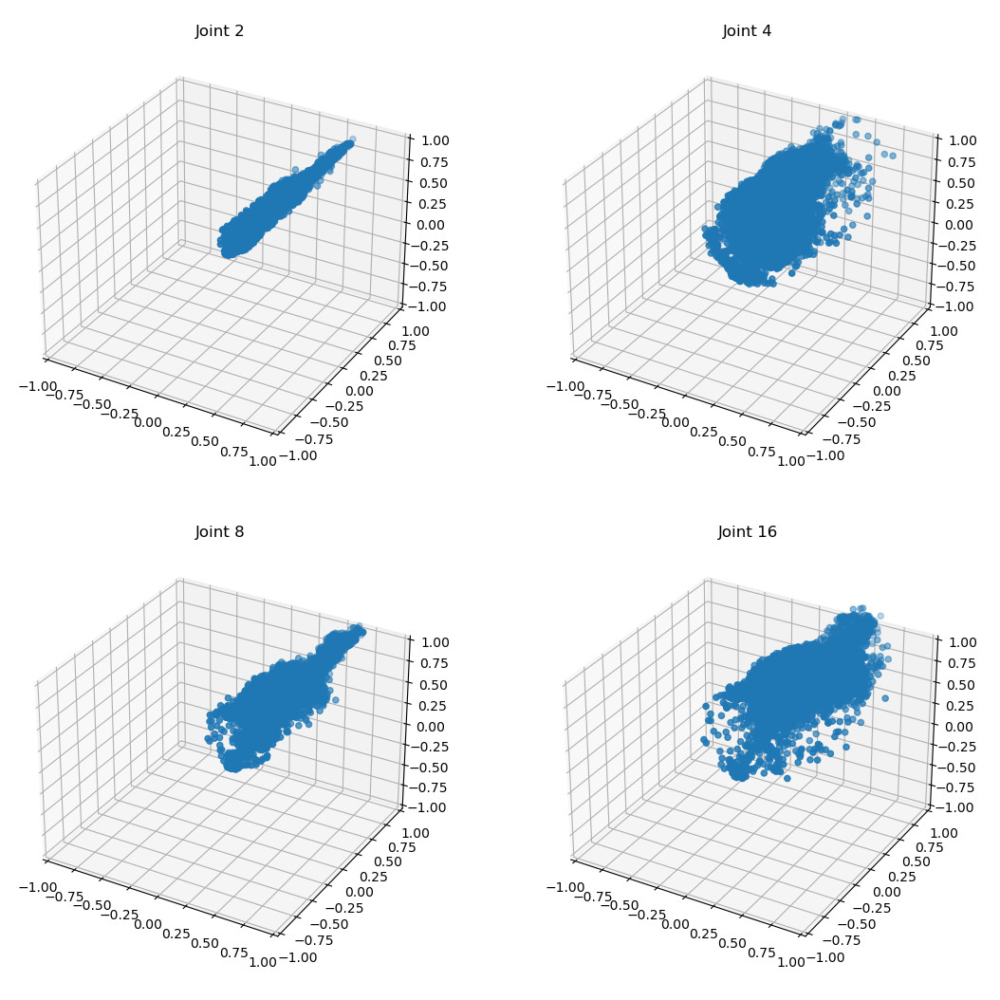{:width="60%"}

The figure above depicts the distribution of plausible positions for four human joints relative to their parent joints. Already, we can see a harsh constraint for each joint's maneuverability. Thus, **the skeleton state space doesn't truly match the realistic range of human motion, which is much smaller**. Using skeleton states directly for motion synthesis would require immense computational efforts to weed out nonsensical results. This problem gets even trickier when we consider variable-length motions.

|                | Genetics    | Natural Language | Architecture | Human Motion |
| -------------- | ----------- | ---------------- | ------------ | ------------ |
| Building Block | Nucleobases | Words            | Bricks       | ?            |

In contrast, other synthesis tasks in genetics, linguistics, and architecture have **efficient building blocks** such as nucleobases, words, and bricks. As long as the construction rules are followed, we always end up in a valid target state by piecing the blocks together. If your ingredients are all edible, then there is no concern to define your product as food.

Therefore, claiming our ability to synthesize DNA or language is well-founded. When it comes to motion, however, we must ask: **synthesize from what?**

I propose that before building more larger and more complex models of recent motion synthesis methods, we must revisit the essential question: **what constitutes the building blocks of motion?**

## Past Hypotheses
---
Many ideas have been formed regarding the building blocks of motion. Let's browse them quickly before we draw our own hypothesis about atomic motions.

<link href="../assets/css/timeline.min.css" rel="stylesheet" />

    

        

            

                

                    <b>370 B.C.</b>
                    
<b>Self-motion</b> is the very idea and essence of the <b>soul</b>. 

                    
                    
- Plato, <i>Phaedrus</i> 245c-e

                

            

            

                

                    <b>2000s</b>
                    
<b>Template</b> search and edit.

                

            

            

                

                    <b>2002</b>
                    
Motion as graph of clips.

                    
                

            

            

                

                    <b>2003</b>
                    
Motion as frame composition.

                    
                

            

            

                

                    <b>2005</b>
                    
Motion as interpolated clips.

                    
                

            

            

                

                    <b>2006</b>
                    
Motion as animated local scenes.

                    
                

            

            

                

                    <b>2010s</b>
                    
Emergence of <b>motion manifolds</b>.

                

            

            

                

                    <b>2011</b>
                    
Motion as path exploration.

                    
                

            

            

                

                    <b>2015</b>
                    
Motion as states on a low-dimensional manifold.

                    
                

            

            

                

                    <b>2017</b>
                    
Motion as a Markov chain of state transitions.

                    
                

            

            

                

                    <b>2020s</b>
                    
<b>Generative</b> manifolds and <b>language</b> models.

                

            

            

                

                    <b>2022</b>
                    
Motion as states on a probabilistic space-time manifold.

                    
                

            

            

                

                    <b>2022</b>
                    
Motion as a nonlinear dynamical system.

                    
                

            

            

                

                    <b>2023</b>
                    
Motion as a language.

                    
                

            

        

    

 

Of course Plato was the among the first ones to say something about this subject. He went all meta-physical about it. In _Phaedrus_, he argued that soul, the self-mover, is accountable for creating motions. Since we can't compute a soul, let's move on to recent works.

### 2000s
Since the 2000s, we've used editable motion **templates** to synthesize motions. These templates can be anything from motion frames, motion clips to local scene animations. The process involves identifying suitable templates for the task, then using an optimization algorithm to compose them into a synthesized motion. For more synthesis diversity, one interpolates the templates with a kernel.

### 2010s
By the 2010s, several new concepts emerged:
1. Modeling motions as **exploration paths in the motion state space** to achieve synthesis objectives. We apply reinforcement learning or path finding algorithms to generate effective paths.
2. Viewing motions as **state transitions in a Markov chain**. Frame-wise or snippet-wise states are predicted by autoregressive time series models, initiating with a particular state to produce the required motion.
3. Representing motions as **high-dimensional motion states residing on a low-dimensional manifold**. This process can be viewed as encoding a template database in a data-efficient manner. Similar template-based procedures query the database for motion synthesis, such as interpolation or optimization.

### 2020s
In the 2020s, motion manifold gained popularity due to its easy integration with deep generative models. We synthesize more diverse motions by sampling **probabilisitic space-time manifolds**, which approximates the distribution of plausible motion states variationally. One thing worth noticing is that with sample-wise implicit neural representations, these variational distributions can have much finer structures.

Simultaneously, large language models sparked fresh ideas in motion synthesis. NLP-inspired models treat motions as **language prompts**. Typically, an autoencoder learns a discrete codebook for the motion "vocabulary", so we can also model the motion language prompt. We fuse the synthesis conditions into a similar sequential structure, and employ a neural machine translator to translate this sequence into motion prompts to create motion.

Another exciting work is done in neuroscience: the **attractor hypothesis** models motion planning as a dynamical system of neural activities. We portray a motion state as a rolling ball on a hilly activity landscape. An attractor is a valley trapping the ball, capable of converging a motion plan to a stable motion state for execution. This model uniquely represents the bigger **planning-commitment-execution** picture of motion synthesis, and is backed by perturbation experiments on mice.

## Top-down or Bottom-up?
---
Recent trends in motion modeling shift from a top-down to a bottom-up approach. Previously, we used motion clips as templates for modification. Now, we extract lower-level features and build motions from them.

This trend mirrors the top-down and bottom-up methods of designing a rocket: tweaking an existing model or building from verified parts. The top-down method risks creating a cycle of tweaks that traps the process in a local optimum loop. In the worst case, it leads to mission failure due to unpredictable consequences from too many tweaks. The bottom-up method, on the other hand, ensures each stage functions correctly by only proceeding when the lower-hierarchical stages are thoroughly tested.

The benefits of adopting a bottom-up method are clear:

1. Avoidance of subpar optimization and conflicts.
2. Generation novelty can be quantified and predetermined.
3. Existing generations are easier to modify when necessary.

Similar benefits apply to a bottom-up approach of motion synthesis.

## Atomic Motions: a New Hypothesis
---
Finally, we are ready to draw a new hypothesis for motion synthesis in the spirit of **"going the extra mile" in bottom-up approaches**.

Most bottom-up approaches today assume that motion is synthesized by arranging some basic building blocks, such as frame-wise motion states, in a **uniform, single-level structure**:
    1. In motion manifolds, this structure is often a hypersphere or a multivariate normal distribution.
    2. In codebook models, the structure is a sequence of codes.

Due to these structures, interactions of different building blocks are roughly described, each block usually has
    1. a simple set of **affinities**, usually nonspecific to each other block.
    2. a simple set of **aversions**, usually nonspecific to each other block.

My **atomic motions hypothesis **postulates:
1. Atomic motions arrange themselves in **distinct, hierarchical structures** to form complex movements.
    1. `lab observation`: MotionCLIP's succeeds in synthesizing out-of-distribution motions by aligning its motion manifold to a language model, due to the introduction of distinct semantic structures.
    2. `field observation`: Dancers compose new dances by combining basic moves dynamically according to the rhythm of new music.
2. Each pair of atomic motions exhibits **unique affinity**.
    1. `lab observation`: Autoregressive models have tendency to predict average motions. RCMTC disambiguates the predicted motion by learning the unique motion state correlations with a mixture of experts.
    2. `field observation`: Punching with a left fist is more likely to be followed by retracting that fist, but it's also completely ok to follow it with a right punch. However, we are more likely to do the first one to maintain balance.
3. Each pair of atomic motions exhibits **unique aversion**.
    1. `lab observation`: ASE includes an additional skill discovery objective to diversify its motion manifold. This objective has achieved significantly higher motion synthesis quality. The need for more diversification suggests that a motion state's correlated states can be further distinguished.
    2. `field observation`: It's feasible for running and walking elements to coexist in one motion, but not so much for swimming and walking.
4. A motion is **dynamically planned** instead of randomly sampled from the motion structure in 1. A motion plan is synthesized by evolving a dynamical system in the motion state space, where the structured atomic motions occupy stable states.
    1. `lab observation`: The attractor hypothesis supports this statement by demonstrating how the executed motion can be drastically changed if one perturbs the planning neural dynamics.
    2. `field observation`: Humans adjust planned movements swiftly when stimuli change abruptly. Much diversity in a locomotion can be attributed to planning instead of execution dynamics, such as obstacle avoidance or goal reaching.

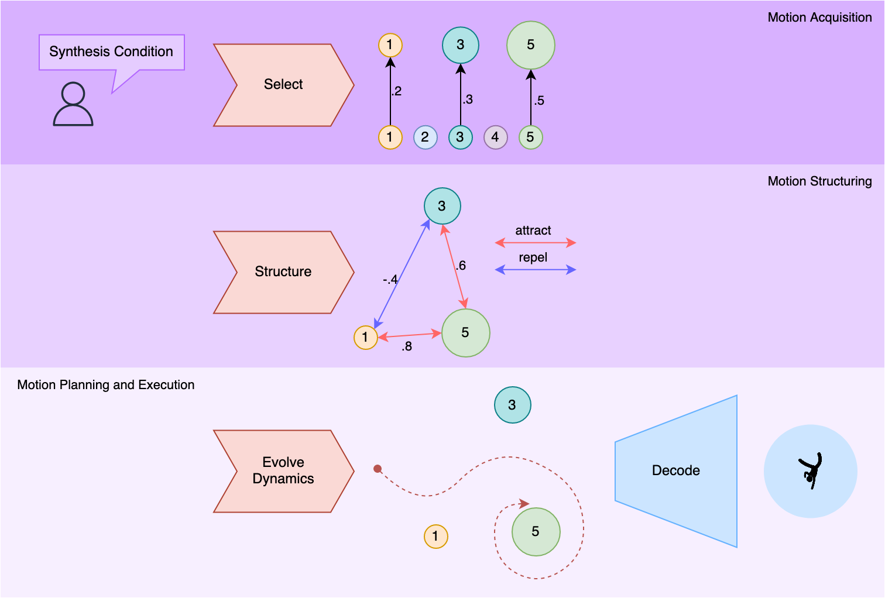{:width="70%"}

With these assumptions, I propose a three-stage bottom-up motion synthesis framework. First, we **select** necessary atomic motions w.r.t. the synthesis conditions via a weighting process. Secondly, we **structure** the selected atomic motions using learned construction rules to establish a plausible motion state space. Lastly, we **evolve** a dynamic system within this space, planning the ultimate motion state for execution. We align this system's stable states with the positions of the atomic motions.

I will detail these stages in the next sections from my current modeling ideas. Keep in mind they are subject to substantial changes in future experiments.

### Extraction of Atomic Motions
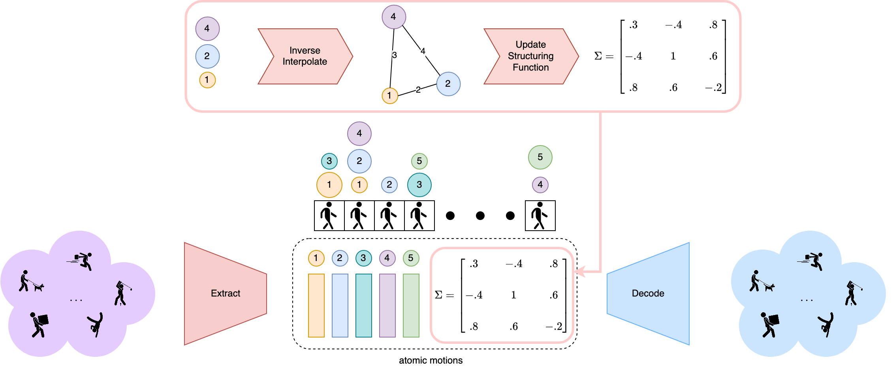

Before we go down the three-stage pipeline, atomic motions must be extracted from motion capture data. We first derive a data-efficient set of atomic motions, where their features and construction rules (affinities and aversions) are properly modeled.

Suppose we have $$N$$ atomic motions $$A_i$$ where $$i=1,2, \cdots, N$$. Each atomic motion consists of
1. a feature vector $$\mu_i$$ of length $$M$$ for each atomic motion, which is extracted from the motion capture snippets as a codebook of a VQ-VAE.
2. an affinity/aversion matrix $$\Sigma$$ for all atomic motions, which is extracted from frequency analysis.

Our goal is to extract $$\mu_i$$'s and $$\Sigma$$ that reconstruct the motion captures accurately, under the constraint of keeping $$N$$ as small as possible.

#### Feature Extraction
We encourage interpolation between the feature vectors $$\mu_i$$ to generate in-distribution motions. This constraint ensures that any arbitrary set of atomic motions has a high probability of producing plausible movements. Therefore, we ensure a plausible motion state space can always be formulated by structuring atomic motions properly.

To do this, we **encode a motion snippet into a weighted sum of the multiple atomic motions' feature vectors**. We also encourage this interpolation to be from simple structures by discouraging using too many atomic motions to form a snippet. The same interpolation kernel is reused for our execution stage, where we need to decode the planned motion state from interpolating multiple atomic motions.

We make an extra assumption: **motion capture snippets are typically well-rehearsed**. Only when this assumption is true can atomic motions represent the stable states of dynamical system in the planning stage, since their planned states are deemed as sufficiently converged. To respect this assumption, we apply another constraint where **one atomic motion's weight significantly dominates others during all interpolations**.

Finally, to keep $$N$$ small, we employ a **vector quantization variational autoencoder (VQ-VAE)** with a small codebook size ($$N\lesssim 256$$) to extract $$\mu_i$$'s. We model additional loss functions for our VQ-VAE to respect the two constraints mentioned above.

We consider the feature space $$\mathbb{R}^M$$ as our motion state space in subsequent sections.

#### Structure Extraction
The structural information is encoded in our extracted affinity/aversion table $$\Sigma$$. It's a symmetric matrix with elements normalized to the range $$[-1, 1]$$, where -1 marks extreme aversion and 1 marks extreme attraction.

Recall that each snippet is now represented as an interpolation of multiple atomic motions' feature vectors. Since we have also encoded the interpolation weights, we can **inverse-interpolate** these weights to get the distances between these atomic motions, according to some spacial interpolation model, such as krigging.

After inverting the interpolation, we now have on our hands a distance table for every pair of atomic motions, where each pair has multiple sampled distances. We can then construct a distance estimator based on these samples to get $$\Sigma$$.

This will be our structure estimator to automatically construct motion structures given a set of atomic motions.

### Selecting and Structuring Stages
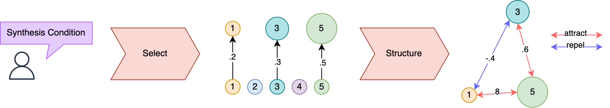

The selecting stage is best illustrated with an example scenario. Suppose we are only considering three atomic motions $$A_1$$, $$A_2$$ and $$A_3$$. Suppose we want to synthesize a 24-frame long motion. According to the average human response time, which is around 180ms, let's allow 8 frames as our basic planning duration. Then we need to form 3 structures sequentially in 24 frames.

We need to select an appropriate number of atomic motions to build our motion structure. As different structures need different motion elements, you might need $$A_1$$ and $$A_2$$ for the first one, $$A_2$$ and $$A_3$$ for the second one, $$A_1$$ and $$A_3$$ for the third one. We assign different weights to each atomic motion and select the top-$$k$$ to construct our motion structure. The weights also stress their influence on the motion planning.

This selection (weighting) function can be approximated by a neural network. It supports multi-modal synthesis conditions, covering synthesis tasks such as

| Task                           | Selection Strategy                                                                                                                     |
| ------------------------------ | -------------------------------------------------------------------------------------------------------------------------------------- |
| unconditioned motion synthesis | Randomly select atomic motions.                                                                                                        |
| text to motion                 | Weight atomic motions conditioned on text prompts.                                                                                     |
| motion inpainting              | Use the atomic motions from given frames directly, perhaps with a small dash of randomly selected new atomic motions to add diversity. |
| motion editing                 | Blend atomic motions from two skeletons.                                                                                               |

Next, we optimize each structure with the structure estimator $$\Sigma$$ from the previous stage. We end up with three distinct structures to compute motion dynamics from, each producing an 8-frame motion.

Also notice that we don't have to rigorously follow the fixed 8-frame scheme stated above. We can simply condition the selector with a duration variable, added as an extra synthesis condition.

### Planning and Execution Stages
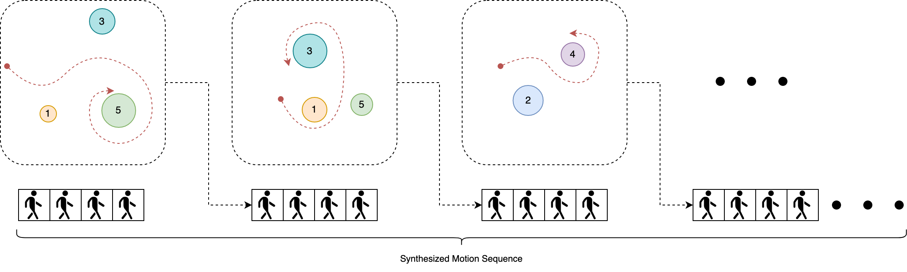

Given the stable motion structure formed in the pervious stage and the allowed planning duration, we need to evolve our motion plan in a dynamical system. Then we interpret the plan and execute that motion.

In the actual motion synthesis, planning is conducted concurrently with execution: when the current motion is being executed, the next motion is being planned.

#### Motion Planning
Consider a discrete-time nonlinear dynamic system:

$$x_{k+1}=\mathcal{D}(x_k, u_k, w_k),$$

where
1. $$x_k$$ is the previous motion state.
2. $$u_k$$ is the control signal from the previous frame, i.e. the synthesis condition.
3. $$w_k$$ is a white disturbance noise to add motion diversity.

Given an initial state $$x_0$$, and an allowed planning duration $$K$$, we would like to obtain the state $$x_{K-1}$$ to plan a motion before execution.

What we do know from the structuring stage are **all the stable states** of this dynamical system, which are simply positions of our atomic motions.

What we don't know is the explicit form of $$\mathcal{D}$$.

It seems to me there are three options to continue:
1. We throw the entire structure and planning duration into an RNN, which approximates $$\mathcal{D}$$.
2. We divide the state space into local regions around each stable state, treat each region as a linear dynamic system $$x_{k+1}=Ax_k+Bu_k+w_k$$, learn the universal state-transition matrix $$A$$ for all atomic motions, and interpolate the regions over their boundaries to form $$\mathcal{D}$$.
3. **Nature takes extremum**: we borrow the model of classical mechanics, such as an Euler-Lagrange system, and cook $$\mathcal{D}$$ according to a motivated Lagrangian satisfying the Euler-Lagrange equation.

These three options are sorted in descending order based on the amount of training data needed. For the sake of data-efficiency, let's choose option 3. We "follow nature's paths", as a manner of speaking. This Lagrangian function needs to be motivated by experimental heuristics, which awaits significant future works.

For now, let's assume after $$K$$ steps, we have evolved our motion plan to a state $$x_{K-1}$$.

#### Motion Execution
We are now ready to execute the plan $$x_{K-1}$$, i.e. decoding it into an actual snippet in our synthesizing motion sequence.

Since we know the state position of our current plan, a simple interpolation of atomic motions according to the distances will do. The interpolation model is the same as the one where we conduct the inverse interpolation.

Finally, we pass the interpolated state to the VQ-VAE's decoder to produce the final motion snippet.

## Implications
---
Here is a table of advantages summarized from the features of my hypothesis model:

| Feature                                                       | Advantage                                                                                                                                                                                  |
| ------------------------------------------------------------- | ------------------------------------------------------------------------------------------------------------------------------------------------------------------------------------------ |
| Synthesizes motion with minimal data.                         | Enables computation-efficient and diverse motion synthesis. Reduces exhaustive sampling needed to learn new motions.                                                                       |
| Models the motion planning process explicitly.                | Increases synthesis responsiveness to control signal changes and facilitates strategy optimization.                                                                                        |
| Adapts to a broad scope of motion synthesis tasks.            | Adjusts to multi-model synthesis conditions with only retraining of the selection model required. Allows fusion of multi-modal control signals without needing a separate training module. |
| Provides flexible space-time editing support.                 | Creates variable-length motions that adhere to specific global motion trajectories using atomic motions.                                                                                   |
| Learns new motions online without retraining the whole model. | Incorporates newly extracted atomic motions into existing ones without requiring full retraining; only finetuning of the selector is needed.                                               |

With atomic motions, I attempt to advance one more step towards understanding how diverse motions are synthesized from small data. This framework is more bottom-up in formulating the a valid human motion state space than existing methods. It allows us to further decompose motion synthesis into structuring, planning and execution, providing a more comprehensive view of the process.

### Implications of Manipulating Motion Structures
Modeling motion's building blocks makes them more perceptible. This learning process naturally leads to advanced motion synthesis tasks. This strategy is analogous to forming proteins from amino acid chains' primary, secondary, tertiary, and quaternary structures. In the framework of atomic motions, the structure complexity can also grow with each level, enabling us to model more complex motions effectively.

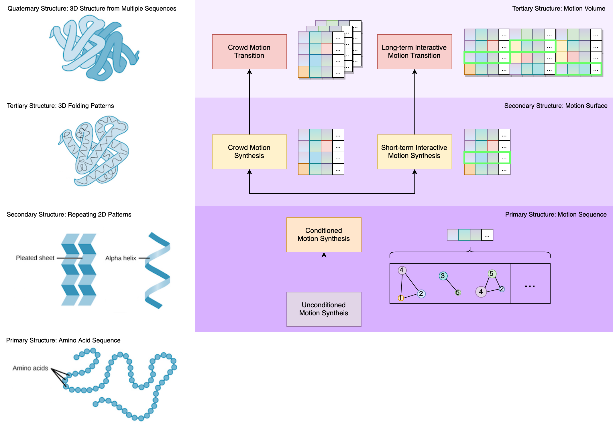{:width="90%"}

#### Crowd Motion Synthesis
In crowd motion synthesis, each individual can be viewed as maintaining a stable structure of atomic motions we have introduced. The task can then be modeled as forming a secondary structure out of these primary motion structures. This process is analogous to how a sequence of amino acids folds itself into a protein.

Crowd motion synthesis involves modeling individuals as stable primary structures of atomic motions, combined to form a **secondary structure**. This resembles how amino acid chains fold into proteins. We can guide this formation process by modeling key features of crowd motion:
1. **Motion Atmosphere**: Different environments trigger diverse crowd movements - peaceful walking in calm streets, running in urgent situations. Similar to the particle statistics in physics, we can formulate distributions of primary motion structures conditioned on different environmental states to infer motion atmosphere.
2. **Motion Propagation**: An individual's new motion often prompts others' reactive motions, causing propagation in the crowd. By examining reactions between primary structures, we can predict secondary structure changes when one individual alters their motion.
3. **Large-scale Crowd Motion**: By reusing the same primary structures, we can simulate large-scale crowd motion efficiently with a small number of primary structures.
4. **Crowd Motion Transition**:there is a natural transition of motion patterns between two adjacent environments. For example, people transit from walking to hugging and greeting across the arrival gate at an airport. We can model a tertiary structure to simulate interactions between different secondary structures from varying environments.

#### Interactive Motion Synthesis
Presence of interactive objects alters a motion's structure, prompting people to avoid obstacles, sit on chairs, or open doors.

Current interactive motion synthesis methods face two main challenges:
1. **Adaptable Planning**: Existing methods struggle to adjust their motion plans for sudden object disappearance or movement. Our framework overcomes this by re-weighting atomic motions, quickly reflecting updated plans when object environment changes.
2. **Novel Interactions**: Currently, extensive data augmentation is necessary to adapt a motion to varying object geometries. Our flexible plans allows for structure exploration through repetitive re-weighting before settling on a specific one, mirroring human's mental rehearsal of different actions prior to execution.

### Implications of Manipulating Planning Dynamics (Feedback Motion Planner)
Similarly, since motion planning is explicitly and dynamically modeled, we can apply further manipulations required by more complex motion synthesis tasks.

In the atomic motions framework, motion control signal is explicitly mapped to affect motion planning dynamics. Thus, the inverse problem of constructing appropriate control signals to generate desired motion plans can also be explicitly modeled.

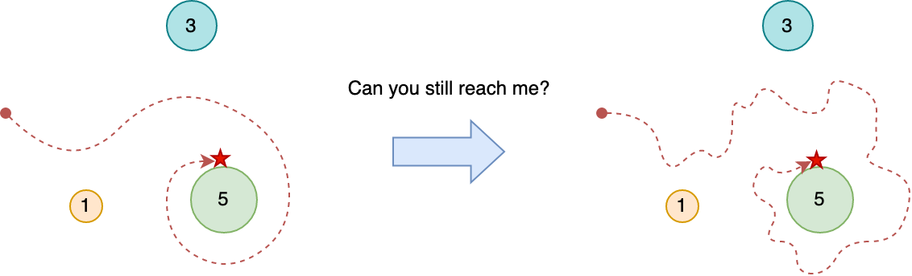{:width="70%"}

This inverse problem appears frequently in the task of **feedback motion control**. This task requires directing a digital human to achieve a specific motion goal while maintaining diversity. We need to inject noise into the synthesized motion and adjust the control signal to offset this noise in future motions, ensuring the goal state is still reached. For example, if we want to synthesize diverse animations of athletes accelerating into running, we must randomize their in-between movements. However, we still need to drive them to a unified running motion when the animation ends.

This problem remains challenging for existing methods because
1. The injection of noise happens in an implicit planning function. We often don't have the model of noiseless planning to exploit the feedback control in the first place.
2. Accurate, per-frame annotation is not available in training data. Most methods learn their motion control function from annotation-motion pairs. If the noised motion state becomes too out-of-distribution, the lack of training creates divergent motion controls in these methods.
3. Multi-modal signals are sometimes fused together to guide motion synthesis, making it intractable to adjust control signals individually. While the fused signal can still be adjusted, the concern in 1 creates lack-of-annotation problems in a much larger scales, since the control space often grows exponentially from fusing multiple modalities.

Thus, there is often a **controllability-diversity tradeoff** in existing motion synthesis methods.

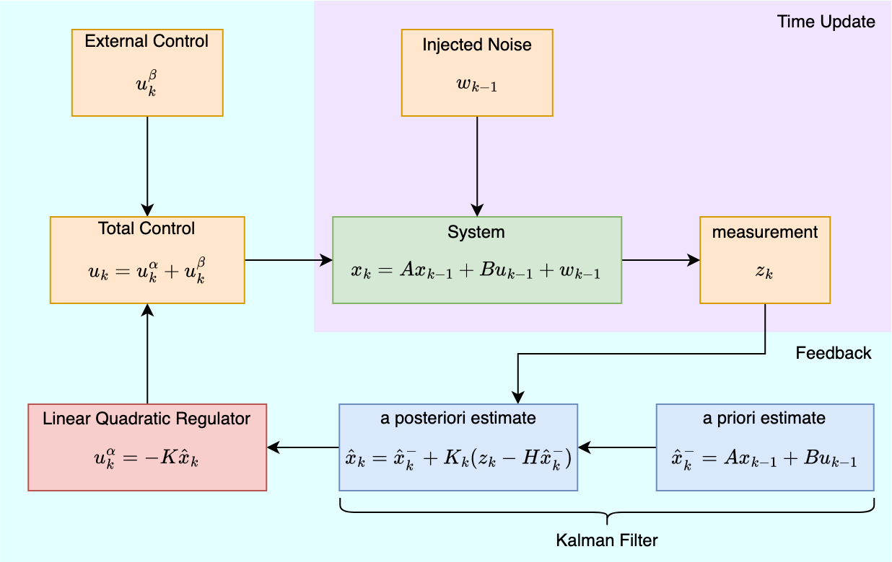{:width="60%"}

As mentioned earlier, the motion planning process is explicitly modeled by our framework as a nonlinear dynamical system $$x_{k+1}=\mathcal{D}(x_k, u_k, w_k)$$.

When aiming for a specific motion state $$x_0$$, we can start with a nearby point and linearize the dynamics as $$x_{k+1}=Ax_k+Bu_k+w_k$$. As long as $$B$$ exhibits controllability towards $$x_0$$, we can inject any $$w_k$$ we want, and use an optimal feedback control loop, such as a linear quadratic regulator plus a Kalman filter, to complete our motion synthesis.

A very interesting observation here is that this feedback planner not only provides us with an optimal control of our motion synthesis, but does so with two perks:
1. The noise compensation can be applied for a motion stream. This means we could synthesize a **stable, infinitely long** running animation without any repetitions!
2. The planner decides its own "recovery time" to the stable motion state. We are only responsible of sampling this planner now and then to execute its current plan. This indicates that we are automatically synthesizing motions of different lengths according to the noise condition, and these motions are always "optimally planned" at the moment of planning.

I think it's a very interesting thing to investigate how we can synthesize long and convincing motions with just a singular primary structure of atomic motions.

### Broader Implications
{:width="60%"}

My atomic motion framework could simplify the nurturing of digital humans. If performant, it might also facilitate autonomous behavior acquisition.

In this framework, non-experts can teach digital humans new behaviors with minimal tutoring, possibly only through verbal instructions. Even without a human tutor, these digital humans can create new motions to complete various tasks with less need for sampling than current reinforcement learners. 

These self-driven digital humans offer a practical tool to enhance virtual environment content. They can be used to explore new or complex virtual environments that would be too expensive for human exploration. For example, a user might instruct our digital human to "learn the quickest way to run through Berlin" and it could generate a detailed motion sequence in response. If we replace the human motion model with a robot's, then this robot can obtain a very rich prior of speed-running through Berlin.

These digital humans also scale up well, as described in the crowd motion synthesis section. Convincing crowd simulation can then be modeled in video games and virtual realities, interactive to different environments. For instance, we could populate an empty street with realistic digital humans minding different businesses, or, in a much sadder case, an empty house with partying digital friends.

## Challenges
---
The challenges of my proposed framework mostly involve its extraction and execution stages.

### Challenge of Data Collection
Our framework relies on a data-driven autoencoder for atomic motion. This makes data collection our first challenge. If some essential motion features are outliers in the current dataset, we might misrepresent them in the atomic motion features. On the other hand, overfitting to nonessential motion features happens if we overemphasize the reconstruction quality of our extractor on this data.

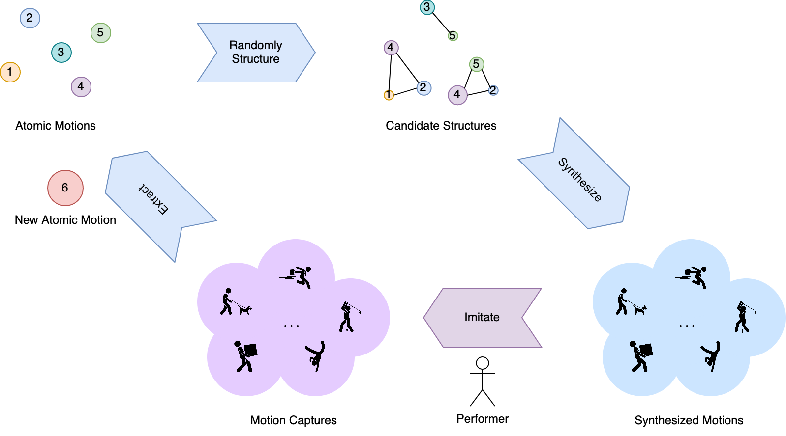{:width="70%"}

Data collection can be enhanced by extending existent motion capture datasets, such as AMASS, with **active sampling** strategies. In one active sampling round, we conduct the following algorithm:
1. Randomly select and formulate structures from previous atomic motions, retaining only un-sampled candidate structures in previous rounds.
2. Synthesize motion sequences from these structures.
3. Request a **human performer** to mimic these motion sequences and capture the response motions.
4. Extract new atomic motions from the latest captures to augment the existing set:
    1. If the features of new atomic motions, $A^\ast_i$'s, from the **previous round** are not significantly novel, we deem the previous round as not learning much novel motions. In this case, we update on $A^\ast_i$'s instead of adding new atomic motions in this round.
    2. Otherwise, we learn new atomic motions, $A^{\ast\ast}_i$'s, and add them to the existing set.

The formulation of this active sampler is nontrivial, especially for step 2 and 4. For step 3, the cost of hiring a human performer can easily become intractable if the sampling budget is not constrained properly.

### Challenge of Information Quantification
Quantifying the necessary information to build representative atomic motions also presents a difficulty. Specifically, determining the required number of atomic motions for optimal motion representation is not straightforward. Currently, we need thorough ablation studies on a dataset to establish this number. This approach costs much human labor and incurs repetitive computation.

Since the information quantification problem in our case is a parameter optimization problem, an alternative approach alludes to **meta learning**. We could assign multiple unsupervised motion synthesis tasks, such as motion inpainting and motion forecast, to our VQ-VAE. We optimize our meta parameters as
1. the number of atomic motions, $N$.
2. the feature size of each atomic motion, $M$.
3. the structural attributes of the affinity/aversion matrix $\Sigma$ for atomic motions, such as its norm and eigenvalues distribution.

We aim to obtain optimal information quantification knowledge by optimizing these model parameters across various tasks. This knowledge in turn guides us to extract atomic motions.

Due to the consideration of various tasks, the meta learning challenge is nontrivial.

### Challenge of Motion Integration
The Atomic Motions framework specifically synthesizes motion for human skeletons. However, body surface and hand motion synthesis require different methods involving mesh deformation. Therefore, we need to confirm if our synthesized motions integrate well with these deformation motions to fully drive a digital human.

By integration, we refer to synthesizing proper **correlations** between body motion and deformation motions. For instance, a dancing person produce different gestures according to different body movements.

The answer is likely no. Atomic motions exist at a low level in the bottom-up view of body motions, differing from deformation motions which match with higher-level body actions. For instance, a fist correlates only with a punch, not all arm thrusting movements (you can also push with an arm thrust). This suggests that correlations target primary atomic motion structures at least. However, the combinatorial nature of the primary structure space makes it tricky to generalize observed correlations faithfully.

I don't see a very viable remedy to this problem yet. Perhaps a good starting point is to figure out how to constrain the space of primary atomic motion structures by co-embedding it with the deformation space.

## Research Forecast
---
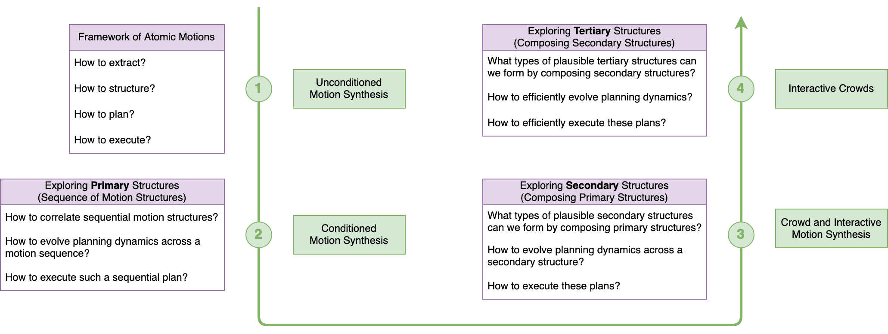

In my future research, I intend to progressively work my way up from my framework of atomic motions. As I expand my investigation to higher-level structures formed by atomic motions, I aim at tackling more complex problems in motion synthesis.

### Stage 1: Framework of Atomic Motions
I'm going to investigate and improve the aforementioned atomic motions framework in this stage. The primary challenge is unconditioned motion synthesis. The task is to generate a random human motion sequence. Current methods struggle to produce human motions that are plausible and diverse **simultaneously**. My model aims to generate such motions while reducing data and computational costs significantly.

### Stage 2: Exploring Primary Structures
The primary structure of atomic motions concerns a sequence of motion structures formed during a sequential planning process. Sequential planning is often seen in conditional motion synthesis problems. For example, in action-to-motion generation, a "run" action label points to a "sprint with left leg -> sprint with right leg" sequence. Therefore, it's not only important to form individual motion structures and plans, but also crucial to constrain a sequence of them with proper correlations.

The primary structure of atomic motions involves formulating a sequence of motion structures. This process is common in conditional motion synthesis, such as action-to-motion generation. For instance, a "run" action label may indicate a sequence: "sprint with left leg -> sprint with right leg". Thus, while forming individual motion structures and plans is vital, it's equally crucial to create them with appropriate correlations.

I consider the following conditioned motion synthesis tasks in this stage:
1. action-to-motion generation.
2. text-to-motion generation.
3. motion inpainting.
4. body-part motion editing.
5. feedback motion control.

For 5, please see the implications section for more details.

### Stage 3: Exploring Secondary Structures
What motions do you end up with if you can compose different primary motion structures? This is the question of interest in stage 3.

We can see that
1. juxtaposing primary structures and animating multiple digital humans with them leads to **crowd motion synthesis**.
2. choosing an optimal primary structure among others leads to **interactive motion synthesis** since we are essentially building a motion policy.

I'd like to start stage 3 by investigating these two secondary structures first. It's also interesting to explore how we can have both 1 and 2 in a crowd of digital humans.

### Stage 4: Interactive Crowds
Consider two crowds of digital humans, driven by the secondary motion structures in stage 3. These two crowds follow different environmental conditions to guide their motions.

In reality, humans don't operate in closed systems. Environmental conditions vary locally, influencing their motion patterns. For instance, people often walk on streets and sit in cafes. As the secondary structures handle interactions and crowd motions, the tertiary structure focuses on the interaction between crowds from different environments. Some example questions are: how to synthesize interactive crowd motions between heterogenous local environments? what happens when two crowds are suddenly exposed to each other?

Efficiency is key when processing vast amounts of motion information. In the atomic motions framework, each digital human must plan and execute motions at least every 8 frames. This equates to a 3Hz update rate for creating 24-frame animations. Maintaining this update rate in real-time is crucial, especially when dealing with tertiary structures involving a behemoth amount of digital humans.

In lack of computational resources, compromises need to be considered for our framework to be usable. For instance, some level-of-detail tricks can be employed. We might update the digital humans near a human user at 3Hz, and gradually lower this rate for those further away.

## References
---

[1] K. Gong et al., “TM2D: Bimodality Driven 3D Dance Generation via Music-Text Integration.” arXiv, Oct. 01, 2023. doi: 10.48550/arXiv.2304.02419.

[2] K. Zhao, Y. Zhang, S. Wang, T. Beeler, and S. Tang, “Synthesizing Diverse Human Motions in 3D Indoor Scenes.” arXiv, Aug. 21, 2023. doi: 10.48550/arXiv.2305.12411.

[3] N. Athanasiou, M. Petrovich, M. J. Black, and G. Varol, “SINC: Spatial Composition of 3D Human Motions for Simultaneous Action Generation.” arXiv, Aug. 19, 2023. doi: 10.48550/arXiv.2304.10417.

[4] X. Cao et al., “A Survey of Learning on Small Data: Generalization, Optimization, and Challenge.” arXiv, Jun. 06, 2023. doi: 10.48550/arXiv.2207.14443.

[5] W. Li, X. Chen, P. Li, O. Sorkine-Hornung, and B. Chen, “Example-based Motion Synthesis via Generative Motion Matching.” arXiv, Jun. 01, 2023. doi: 10.48550/arXiv.2306.00378.

[6] R. Dabral, M. H. Mughal, V. Golyanik, and C. Theobalt, “MoFusion: A Framework for Denoising-Diffusion-based Motion Synthesis.” arXiv, May 15, 2023. Accessed: Sep. 23, 2023. [Online]. Available: http://arxiv.org/abs/2212.04495

[7] J. Lin et al., “Being Comes from Not-being: Open-vocabulary Text-to-Motion Generation with Wordless Training.” arXiv, Mar. 24, 2023. doi: 10.48550/arXiv.2210.15929.

[8] J. Zhang et al., “T2M-GPT: Generating Human Motion from Textual Descriptions with Discrete Representations.” arXiv, Feb. 28, 2023. doi: 10.48550/arXiv.2301.06052.

[9] S. Raab, I. Leibovitch, P. Li, K. Aberman, O. Sorkine-Hornung, and D. Cohen-Or, “MoDi: Unconditional Motion Synthesis from Diverse Data.” arXiv, Dec. 18, 2022. doi: 10.48550/arXiv.2206.08010.

[10] J. Ma, S. Bai, and C. Zhou, “Pretrained Diffusion Models for Unified Human Motion Synthesis.” arXiv, Dec. 06, 2022. doi: 10.48550/arXiv.2212.02837.

[11] C. He, J. Saito, J. Zachary, H. Rushmeier, and Y. Zhou, “NeMF: Neural Motion Fields for Kinematic Animation.” arXiv, Oct. 09, 2022. doi: 10.48550/arXiv.2206.03287.

[12] W. Mao, M. Liu, R. Hartley, and M. Salzmann, “Contact-aware Human Motion Forecasting.” arXiv, Oct. 08, 2022. doi: 10.48550/arXiv.2210.03954.

[13] N. Athanasiou, M. Petrovich, M. J. Black, and G. Varol, “TEACH: Temporal Action Composition for 3D Humans.” arXiv, Sep. 12, 2022. doi: 10.48550/arXiv.2209.04066.

[14] G. Tevet, S. Raab, B. Gordon, Y. Shafir, D. Cohen-Or, and A. H. Bermano, “Human Motion Diffusion Model.” arXiv, Sep. 29, 2022. doi: 10.48550/arXiv.2209.14916.

[15] M. Zhang et al., “MotionDiffuse: Text-Driven Human Motion Generation with Diffusion Model.” arXiv, Aug. 31, 2022. doi: 10.48550/arXiv.2208.15001.

[16] C. Guo, X. Zuo, S. Wang, and L. Cheng, “TM2T: Stochastic and Tokenized Modeling for the Reciprocal Generation of 3D Human Motions and Texts.” arXiv, Aug. 04, 2022. doi: 10.48550/arXiv.2207.01696.

[17] M. Petrovich, M. J. Black, and G. Varol, “TEMOS: Generating diverse human motions from textual descriptions.” arXiv, Jul. 22, 2022. doi: 10.48550/arXiv.2204.14109.

[18] P. Cervantes, Y. Sekikawa, I. Sato, and K. Shinoda, “Implicit Neural Representations for Variable Length Human Motion Generation.” arXiv, Jul. 15, 2022. doi: 10.48550/arXiv.2203.13694.

[19] H. K. Inagaki et al., “Neural Algorithms and Circuits for Motor Planning,” Annu. Rev. Neurosci., vol. 45, no. 1, pp. 249–271, Jul. 2022, doi: 10.1146/annurev-neuro-092021-121730.

[20] X. B. Peng, Y. Guo, L. Halper, S. Levine, and S. Fidler, “ASE: Large-Scale Reusable Adversarial Skill Embeddings for Physically Simulated Characters,” ACM Trans. Graph., vol. 41, no. 4, pp. 1–17, Jul. 2022, doi: 10.1145/3528223.3530110.

[21] X. Tang et al., “Real-time Controllable Motion Transition for Characters,” ACM Trans. Graph., vol. 41, no. 4, pp. 1–10, Jul. 2022, doi: 10.1145/3528223.3530090.

[22] C. Guo et al., “Generating Diverse and Natural 3D Human Motions From Text,” in Proceedings of the IEEE/CVF Conference on Computer Vision and Pattern Recognition (CVPR), Jun. 2022, pp. 5152–5161.

[23] G. Tevet, B. Gordon, A. Hertz, A. H. Bermano, and D. Cohen-Or, “MotionCLIP: Exposing Human Motion Generation to CLIP Space.” arXiv, Mar. 15, 2022. doi: 10.48550/arXiv.2203.08063.

[24] S. Starke, H. Zhang, T. Komura, and J. Saito, “Neural state machine for character-scene interactions,” ACM Trans. Graph., vol. 38, no. 6, p. 209:1-209:14, Nov. 2019, doi: 10.1145/3355089.3356505.

[25] D. Holden, T. Komura, and J. Saito, “Phase-functioned neural networks for character control,” ACM Trans. Graph., vol. 36, no. 4, pp. 1–13, Aug. 2017, doi: 10.1145/3072959.3073663.

[26] D. Holden, J. Saito, T. Komura, and T. Joyce, “Learning motion manifolds with convolutional autoencoders,” in SIGGRAPH Asia 2015 Technical Briefs, Kobe Japan: ACM, Nov. 2015, pp. 1–4. doi: 10.1145/2820903.2820918.

[27] K. Hyun, M. Kim, Y. Hwang, and J. Lee, “Tiling Motion Patches,” IEEE Trans. Visual. Comput. Graphics, vol. 19, no. 11, pp. 1923–1934, Nov. 2013, doi: 10.1109/TVCG.2013.80.

[28] T. Mukai and S. Kuriyama, “Geostatistical motion interpolation,” ACM Trans. Graph., vol. 24, no. 3, pp. 1062–1070, Jul. 2005, doi: 10.1145/1073204.1073313.

[29] O. Arikan, D. A. Forsyth, and J. F. O’Brien, “Motion synthesis from annotations,” ACM Trans. Graph., vol. 22, no. 3, pp. 402–408, Jul. 2003, doi: 10.1145/882262.882284.

[30] L. Kovar, M. Gleicher, and F. Pighin, “Motion graphs,” in Proceedings of the 29th annual conference on Computer graphics and interactive techniques, San Antonio Texas: ACM, Jul. 2002, pp. 473–482. doi: 10.1145/566570.566605.

